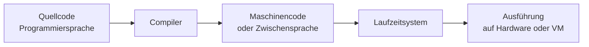
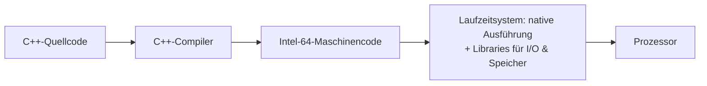
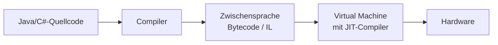
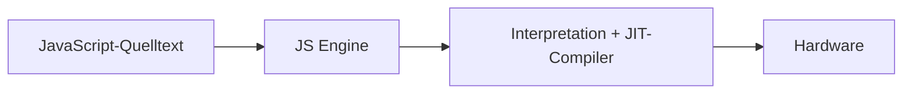
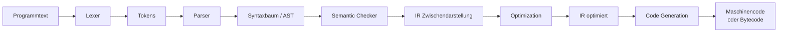
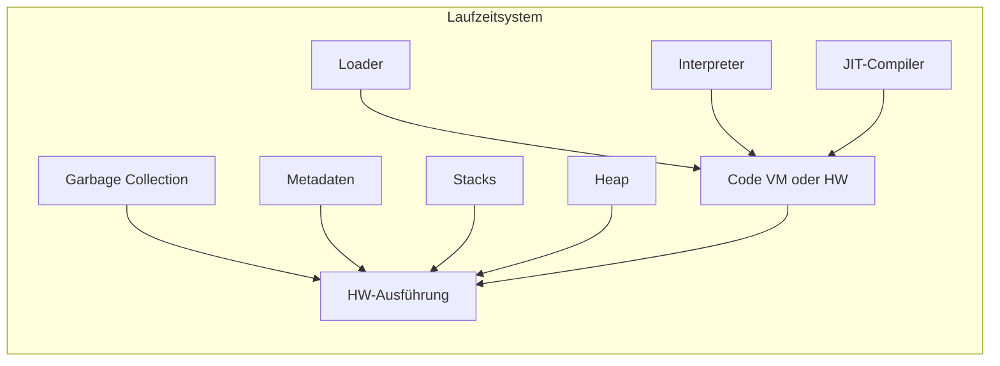
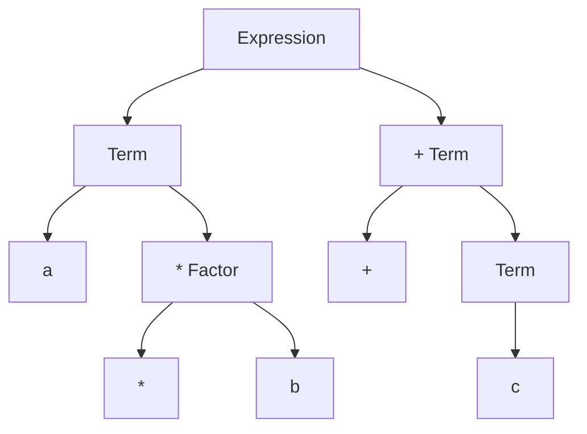

# Compilerbau – Einführung

## Übersicht

* **Thema der Einheit:**
  Grundlagen von Compiler- und Laufzeitsystemen, Überblick über Architektur und Komponenten, formale Syntaxdefinition mit EBNF.
* **Dozent:**
  Thomas Corbat & Olivier Lischer 
* **Lernziele:**

  * Zweck und groben Aufbau von Compilern und Laufzeitsystemen verstehen.
  * Unterschiedliche Architekturen (z.B. C++, Java, C#, JavaScript) einordnen können.
  * Begriffe wie Lexer, Parser, Semantic Checker, Intermediate Representation etc. kennen.
  * Den EBNF-Syntax-Formalismus verstehen und auf kleine Sprachen anwenden können.
  * Syntax, Semantik und Grammatik einer Programmiersprache unterscheiden können.
  * Eindeutigkeit vs. Mehrdeutigkeit einer Grammatik erkennen.

## 1. Einführung / Kontext

In dieser ersten Vorlesung wird der Rahmen des Moduls „Compilerbau“ abgesteckt. Es geht um *Compiler- und Laufzeitsystem-Bau von A bis Z* – von der Sprachspezifikation über Parsing, semantische Analyse und Codegenerierung bis hin zu Laufzeitsystem, Garbage Collection und JIT-Compilation.

Die Einheit liefert:

* einen **Überblick über die Komponenten** eines Compilers und eines Laufzeitsystems,
* erste **Beispiele für Syntaxdefinitionen** mit EBNF,
* sowie Motivation: Warum es lohnt, Compilerbau zu studieren (besseres Verständnis von Sprachen, Kosten von Sprachfeatures, eigene Sprachen entwickeln, Einsatz von Compilertechniken in Tools).

## 2. Zentrale Begriffe und Definitionen

| Begriff                                        | Definition                                                                                                                    |
| ---------------------------------------------- | ----------------------------------------------------------------------------------------------------------------------------- |
| Compiler                                       | Programm, das Quellcode einer Programmiersprache in ausführbaren Maschinencode oder eine Zwischensprache übersetzt.           |
| Laufzeitsystem (Runtime System)                | Software-Schicht, die die Ausführung eines Programms unterstützt (z.B. Laden, Speicherverwaltung, GC, Stacks, Metadaten, VM). |
| Quellcode                                      | Textuelle Darstellung eines Programms in einer höheren Programmiersprache.                                                    |
| Maschinencode                                  | Folge von Instruktionen, die direkt auf einem Prozessor oder einer VM ausgeführt werden.                                      |
| Zwischensprache / Intermediate Language        | Abstrakter Maschinen-/Bytecode, der zwischen Compiler-Frontend und -Backend bzw. VM liegt.                                    |
| Virtual Machine (VM)                           | Abstrakter Rechner, der Bytecode ausführt (oft mit JIT-Compiler kombiniert).                                                  |
| Lexer / Scanner                                | Phase des Compilers, die den Programmtext in Tokens (Terminalsymbole) zerlegt.                                                |
| Token / Terminalsymbole                        | Kleinste bedeutungsvolle Einheiten im Programmtext (z.B. Keywords, Identifier, Operatoren, Literale).                         |
| Parser                                         | Compiler-Komponente, die aus Tokens einen Syntaxbaum gemäss Grammatik aufbaut.                                                |
| Syntaxbaum (Parse Tree / Abstract Syntax Tree) | Baumstruktur, die die syntaktische Struktur des Programms repräsentiert.                                                      |
| Semantic Checker                               | Phase zur Auflösung von Namen und Typen und zur Prüfung semantischer Regeln (z.B. Typkorrektheit, Sichtbarkeit).              |
| Intermediate Representation (IR)               | Interne Zwischendarstellung des Programms, auf der Optimierungen und Codegeneration arbeiten.                                 |
| Optimization                                   | Transformation der IR in eine effizientere Form, ohne die beobachtbare Semantik zu verändern.                                 |
| Code Generation                                | Übersetzung der IR in Maschinencode oder Bytecode.                                                                            |
| Loader                                         | Komponente im Laufzeitsystem, die Code in den Speicher lädt und die Ausführung startet.                                       |
| Interpreter                                    | Führt Code aus, indem Instruktionen gelesen und in Software „emuliert“ werden.                                                |
| Just-In-Time (JIT) Compiler                    | Übersetzt Code-Teile zur Laufzeit in nativen Maschinencode.                                                                   |
| Stack                                          | Speicherbereich für Aktivierungsrahmen von Prozedur-/Methodenaufrufen (Parameter, lokale Variablen, Rücksprungadressen).      |
| Heap                                           | Speicherbereich für dynamisch allozierten Speicher (z.B. Objekte).                                                            |
| Garbage Collection (GC)                        | Automatische Freigabe von nicht mehr erreichbaren Objekten auf dem Heap.                                                      |
| Grammatik                                      | Formale Beschreibung der Struktur einer Sprache, bestehend aus Terminalen, Nichtterminalen, Produktionen und Startsymbol.     |
| Terminalsymbol                                 | Elementarsymbol der Sprache (z.B. konkretes Wort, Zeichen), das in Programmen tatsächlich vorkommt.                           |
| Nicht-Terminalsymbol (NTS)                     | Abstrakte Kategorie (z.B. `Expression`, `Statement`), die in Produktionen verwendet wird.                                     |
| Produktion / Regel                             | Ableitungsregel der Form `NTS = ...`, die beschreibt, wie ein Nichtterminal durch andere Symbole ersetzt werden kann.         |
| Startsymbol                                    | Spezielles Nichtterminal, von dem aus Herleitungen beginnen (z.B. `Program`).                                                 |
| Syntax                                         | Formale Struktur von Programmen („wie der Text aussieht“).                                                                    |
| Semantik                                       | Bedeutung eines Programms („was es bewirkt“).                                                                                 |
| EBNF                                           | Extended Backus-Naur Form – erweiterter Formalismus zur Beschreibung von Syntax (inkl. Wiederholung, Option).                 |
| BNF                                            | Backus-Naur Form – ursprünglicher Syntaxformalismus, ohne optionale und wiederholte Konstrukte; nutzt ε für „leer“.           |
| Ambiguität (Mehrdeutigkeit)                    | Eine Grammatik ist mehrdeutig, wenn es für einen Satz mehrere verschiedene Syntaxbäume gibt.                                  |

## 3. Hauptinhalte

### 3.1 Überblick: Compiler und Laufzeitsysteme

**Grobe Architektur:**



* Der **Compiler** übernimmt die Übersetzung des Programms.
* Das **Laufzeitsystem** kümmert sich um Laden, Speichern, Ausführen, evtl. Interpretation und JIT-Kompilation.

#### Beispiel: Sprach- und Plattform-spezifische Architekturen

**C++ (native Ausführung):**



**Java / C# (VM mit Bytecode):**



**JavaScript (JS-Engine):**



Weitere Varianten (z.B. Jython, PyPy, CPython) kombinieren Compiler und Interpreter auf unterschiedliche Weise (Bytecode + VM, JIT-Compiler etc.).

### 3.2 Aufbau und Phasen eines Compilers

**Typische Phasen:**



* **Lexer (lexikalische Analyse):**

  * Zerlegt den Programmtext in Tokens (Identifier, Keywords, Literale, Operatoren).
* **Parser (syntaktische Analyse):**

  * Prüft, ob die Folge von Tokens zur Grammatik passt.
  * Erzeugt einen Syntaxbaum (oder direkt AST).
* **Semantic Checker (semantische Analyse):**

  * Namen- und Typauflösung, Sichtbarkeit, Überprüfung von semantischen Regeln.
* **Optimization (optional):**

  * IR-Transformationen, z.B. Tote-Code-Elimination, konstante Faltung, Stärke-Reduktion.
* **Code Generation:**

  * Übersetzung der (ggf. optimierten) IR in Maschinencode oder Zwischensprache.

### 3.3 Aufbau eines Laufzeitsystems

**Komponenten laut Vorlesung:**



* **Loader:** Lädt Maschinencode oder Bytecode in den Speicher; startet die Ausführung.
* **Interpreter:** Führt Instruktionen der Zwischensprache einzeln aus.
* **JIT-Compiler:** Übersetzt häufig ausgeführte Teile des Codes zur Laufzeit in nativen Code.
* **Metadaten, Heap & Stacks:** Verwalten Informationen über Klassen/Typen, Objekte und Prozedur-/Methodenaufrufe.
* **Garbage Collection:** Findet und freigibt nicht mehr erreichbare Objekte.

### 3.4 Syntaxdefinition und EBNF

#### Formale Bestandteile einer Grammatik

Eine formale Syntax ist definiert durch:

* Menge der **Terminalsymbole** `T`
* Menge der **Nicht-Terminal-Symbole** `N`
* Menge der **Produktionen** `P`
* **Startsymbol** `S ∈ N`

Die Sprache `L(G)` einer Grammatik `G` ist die Menge aller Folgen von Terminalsymbolen, die vom Startsymbol aus herleitbar sind.

#### EBNF-Grundidee

* Syntax wird durch Produktionen beschrieben, z.B.:

```text
Language = Subject Verb.
Subject = "Anna" | "Paul".
Verb    = "talks" | "listens".
```

* Terminale stehen in Anführungszeichen `""`.
* Nichtterminale sind Namen wie `Expression`, `Term` etc.

**Wichtige EBNF-Konstrukte:**

| Konstrukt            | Bedeutung                      | Beispiel                          | Erlaubte Sätze           |                  |
| -------------------- | ------------------------------ | --------------------------------- | ------------------------ | ---------------- |
| Konkatenation        | Hintereinanderreihung          | `"A" "B"`                         | `"AB"`                   |                  |
| Alternative          | `\|`                           | Entweder das eine oder das andere | `"A" \| "B"`             | `"A"` oder `"B"` |
| Option `[...]`       | Null- oder Einfach-Vorkommen   | `[ "A" ]`                         | leer oder `"A"`          |                  |
| Wiederholung `{...}` | 0, 1 oder viele Wiederholungen | `{ "A" }`                         | leer, `"A"`, `"AA"`, ... |                  |

* `|` bindet **schwächer** als andere Konstrukte.
* Runde Klammern `(...)` erhöhen die Bindungsstärke.

### 3.5 Beispiele: Arithmetische Ausdrücke und Syntaxbäume

#### Arithmetische Ausdrücke mit Präzedenz

Ziel: `*` soll stärker binden als `+`, beide linksassoziativ.

**EBNF-Variante:**

```text
Expression = Term { "+" Term }.
Term       = Factor { "*" Factor }.
Factor     = Variable | "(" Expression ")".
Variable   = "a" | "b" | "c" | "d".
```

* `Factor` kann eine Variable oder ein geklammerter Ausdruck sein.
* Wiederholungen in `Expression` und `Term` sorgen für **Linksassoziativität** von `+` und `*`.

**Visualisierung (Syntaxbaum für `a * b + c`):**



**Alternative Visualisierung (LaTeX-Grammatik):**

$$
\begin{aligned}
\text{Expression} &::= \text{Term} \ \{ "+" \ \text{Term} \} \\
\text{Term}       &::= \text{Factor} \ \{ "*" \ \text{Factor} \} \\
\text{Factor}     &::= \text{Variable} \mid "(" \ \text{Expression} \ ")" \\
\text{Variable}   &::= "a" \mid "b" \mid "c" \mid "d"
\end{aligned}
$$

#### Explizite Klammerung

Beispiel: `(a + b) * (c + d)`

* Durch `Factor = "(" Expression ")"` lässt sich diese Klammerung exakt im Syntaxbaum wiedergeben.
* Klammern können Präzedenzregeln lokal „übersteuern“.

### 3.6 Problematische und mehrdeutige Syntax

#### Option vs. Wiederholung

Beispiel mit Option:

```text
Expression = [ "(" Expression ")" ].
```

* Diese Grammatik lässt entweder *nichts* oder genau *einen* geklammerten Ausdruck zu.
* Im Vergleich zur rekursiven Klammer-Grammatik

```text
Expression = "(" ")" | "(" Expression ")".
```

entsteht eine *andere* Sprache (hier sind z.B. leere Ausdrücke möglich bzw. nur bestimmte Formen erlaubt). Man muss die Option entsprechend anpassen, um die ursprüngliche Sprache der Klammerausdrücke zu treffen.

#### Mehrdeutige Grammatik

Problematische Definition:

```text
Expression = Number | Expression "-" Expression.
Number     = "1" | "2" | "3".
```

Satz: `1 - 2 - 3`

* Möglicher Syntaxbaum 1: `(1 - 2) - 3`
* Möglicher Syntaxbaum 2: `1 - (2 - 3)`

Die Grammatik ist **mehrdeutig**, weil es mehrere gültige Parse-Bäume für denselben Satz gibt. Für Compiler ist das ungeeignet – Praktisch braucht man eine eindeutige Grammatik (z.B. durch Einführung von Ebenen für Präzedenz und Assoziativität, wie bei `Expression`/`Term`/`Factor`).

## 4. Zusammenhänge und Interpretation

* **Compiler und Laufzeitsystem** bilden gemeinsam die Ausführungsumgebung:
  Compiler konstruiert Code; Laufzeitsystem sorgt dafür, dass dieser Code korrekt, effizient und sicher ausgeführt wird.
* **Formale Syntax (EBNF) und Parser:**

  * Die gewählte Grammatik bestimmt, welche Texte als gültige Programme gelten.
  * Eindeutigkeit ist entscheidend, damit Parser und nachfolgende Phasen eine klare Struktur haben.
* **Sprachdesign und Kosten von Sprachfeatures:**

  * Features wie Ausnahmebehandlung, dynamische Typen, Closures oder Generics haben Konsequenzen für Compilerkomplexität und Laufzeitsystem (z.B. Metadaten, GC, JIT-Optimierbarkeit).
* **Compilerbau als Musterbaukasten:**

  * Viele Techniken (z.B. Parsing, Datenflussanalyse, IR-Transformationen) werden auch in Code-Analyse-Tools, Refactoring-Engines, Query-Rewrite-Systemen, Konvertern usw. verwendet.

## 5. Beispiele und Anwendungen

1. **Validierung von Programmen:**
   Mit der EBNF für arithmetische Ausdrücke lässt sich automatisiert prüfen, ob ein Ausdruck syntaktisch korrekt ist (`a + * b` wird z.B. abgelehnt).

2. **AST-Erzeugung:**
   Ein Parser generiert aus `a * b + c` entsprechend der Grammatik einen eindeutigen Syntaxbaum, der später zur Codegeneration oder Interpretation verwendet wird.

3. **Alternative Zielarchitekturen:**

   * Ein Compiler für die Beispielsprache „SmallJ“ kann entweder direkt nativen x64-Code erzeugen oder zunächst eine Zwischensprache „SJ“, die dann auf einer VM ausgeführt wird.
   * Wechsel der **Backend-Zielarchitektur** (z.B. andere Hardware oder andere VM) ist möglich, wenn IR und Frontend stabil bleiben.

4. **Sprachtools:**

   * Syntaxdefinitionen werden genutzt für:

     * Syntax-Highlighting
     * Autovervollständigung
     * Linter / statische Analysen
     * Formatierer (Pretty Printer)

## 6. Zusammenfassung / Takeaways

* Ein **Compiler** transformiert Quellcode in Maschinencode oder Zwischensprache; ein **Laufzeitsystem** führt diesen Code aus und verwaltet Ressourcen.
* Typische Compilerphasen: **Lexer → Parser → Semantic Checker → (Optimization) → Code Generation**.
* Laufzeitsysteme bestehen u.a. aus **Loader, Interpreter, JIT-Compiler, GC, Metadaten, Heap, Stacks**.
* **Syntax** wird mit formalen Grammatiken beschrieben; **EBNF** bietet bequeme Konstrukte für Option und Wiederholung.
* Die Sprache einer Grammatik ist die Menge der Terminalfolgen, die vom Startsymbol herleitbar sind.
* **Eindeutige Grammatik** ist essenziell – Ambiguität (z.B. `1 - 2 - 3`) ist für Compiler ungeeignet.
* Verständnis der Syntax- und Laufzeitkonzepte ist Grundlage, um eigene Sprachen und Werkzeuge zu entwerfen.

## 7. Lernhinweise

* **Vorbereitung und Übung einplanen:**
  Laut Modulbeschreibung ist der Zeitaufwand hoch (2h Vorlesung + ca. 6h Projektarbeit pro Woche + gezielte Prüfungsvorbereitung). Früh anfangen!
* **Aktiv mit EBNF spielen:**

  * Eigene Mini-Sprachen definieren (z.B. für Taschenrechner, Mini-CSV).
  * Beispiele erzeugen und testen, ob die Grammatik das gewünschte Verhalten hat.
* **Syntaxbäume zeichnen:**

  * Für gegebene Ausdrücke (arithmetisch, Klammern, Problemfälle) Syntaxbäume von Hand konstruieren.
* **Architekturen vergleichen:**

  * Aufzeichnen, wie der Weg von C++, Java, C#, JavaScript von Quellcode zur Ausführung verläuft (Compiler, VM, JIT, Interpreter).
* **Projekt im Auge behalten:**

  * Ziel ist ein Compiler und ein Laufzeitsystem für „SmallJ“/„SJ“. Alles, was jetzt zu Syntax und Architektur kommt, wird im Projekt direkt gebraucht.

## 8. Vertiefung / weiterführende Konzepte

Folgende Themen werden in späteren Vorlesungen bzw. zur Vertiefung behandelt:

* **Typ-Systeme** (statisch/dynamisch, generisch, Subtyping)
* **OO-Laufzeitmechanismen** (Method Dispatch, VTables, RTTI)
* **Stack- & Heap-Management** im Detail
* **Dataflow Analysis** und erweiterte Optimierungstechniken
* **Register Allocation** und Instruktionsauswahl
* **Just-In-Time Compilation**-Strategien
* **Garbage-Collector-Varianten** (Mark-Sweep, Generational GC, etc.)
* **Loader-Mechanismen** und dynamische Verlinkung

## 9. Quellen & Literatur (IEEE)

[1] L. Bläser, *Modern Runtime System and Compiler Design*, Independently Published, 2021.

[2] A. V. Aho, M. Lam, R. Sethi, and J. D. Ullman, *Compilers: Principles, Techniques, and Tools*, 2nd ed. Boston, MA, USA: Addison-Wesley, 2006.

[3] N. Wirth, *Grundlagen und Techniken des Compilerbaus*. Bonn, Deutschland: Addison-Wesley, 1996.

[4] N. Wirth, “What can we do about the unnecessary diversity of notation for syntactic definitions?,” *Commun. ACM*, vol. 20, no. 11, pp. 822–823, Nov. 1977.

[5] ISO/IEC 14977, “Extended Backus–Naur form (EBNF),” International Organization for Standardization, 1996.
