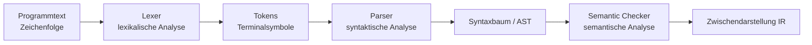
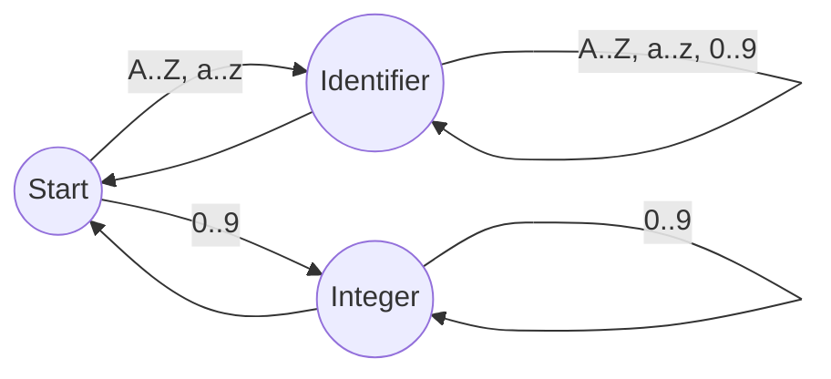
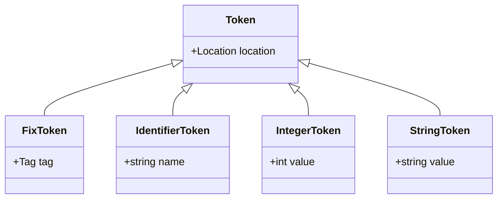
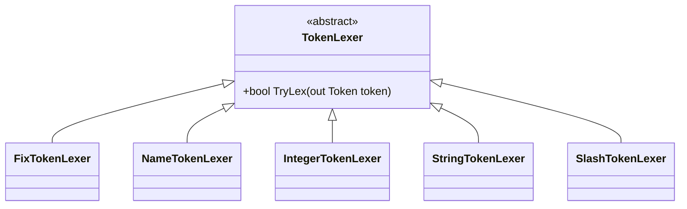

# Compilerbau – Lexikalische Analyse

## Übersicht

* **Thema der Einheit:**
  Lexikalische Analyse (Lexer/Scanner), reguläre Sprachen, endliche Automaten, Lexer-Implementierung und Lexer-Generatoren. 
* **Dozent:**
  Thomas Corbat & Olivier Lischer 
* **Lernziele:**

  * Zweck und Funktionsweise eines Lexers verstehen.
  * Tokens, Lexeme und Tokenklassen unterscheiden können.
  * Reguläre Sprachen von kontextfreien Sprachen abgrenzen.
  * Einen einfachen Lexer (z.B. für SmallJ) selbst implementieren können.
  * Umgang mit Whitespace, Kommentaren und Fehlern im Lexer kennen.
  * Grundidee von Lexer-Generatoren (z.B. ANTLR) verstehen.

---

## 1. Einführung / Kontext

Zu Beginn wird ein klassisches Problem der **Mehrdeutigkeit** wieder aufgegriffen: das *dangling else*.

Beispiel (Seiten 2–3): 

```c
if (x == 0)
    if (y == 0)
        x = 1;
    else
        y = 1;
```

Unklar: Zu welchem `if` gehört das `else`?
→ Mehrdeutigkeit soll in der Grammatik bzw. im Parser vermieden werden.

Danach wird der Fokus der Vorlesung auf das **Compiler-Frontend** gelegt (Diagramm auf Seite 6): Programmtext wird über lexikalische, syntaktische und semantische Analyse in eine Zwischendarstellung überführt. 

In dieser Einheit konzentrieren wir uns speziell auf die erste Stufe: den **Lexer (Scanner)**.

---

## 2. Zentrale Begriffe und Definitionen

| Begriff                    | Definition                                                                                                                            |
| -------------------------- | ------------------------------------------------------------------------------------------------------------------------------------- |
| Lexer / Scanner            | Compilerkomponente, die den Programmtext (Zeichenfolge) in eine Folge von Tokens (Terminalsymbole) zerlegt.                           |
| Token                      | Abstrakte Einheit der Eingabe, z.B. *Identifier*, *Integer*, *Keyword*, *Operator*, *Semikolon*.                                      |
| Lexem                      | Konkrete Zeichenfolge im Quelltext, die zu einem Token gehört (z.B. `"MyClass"` als Lexem des Tokens *Identifier*).                   |
| Keywords                   | Reservierte Wörter der Sprache: `if`, `else`, `while`, `class`, …                                                                     |
| Operatoren / Interpunktion | Symbole wie `+`, `-`, `*`, `&&`, `;`, `(`, `)`, `{`, `}`.                                                                             |
| Identifier                 | Bezeichner für Klassen, Methoden, Variablen etc.                                                                                      |
| Integer-Literal            | Ganzzahlige Zahlendarstellung, z.B. `123`, `0xfe12`.                                                                                  |
| String-Literal             | Zeichenkette in Anführungszeichen, z.B. `"Hello\n"`.                                                                                  |
| Whitespace                 | Leerzeichen, Tabs, Zeilenumbrüche – werden meist vom Lexer übersprungen.                                                              |
| Kommentar                  | Text, der vom Compiler ignoriert wird, z.B. `// ...` oder `/* ... */`.                                                                |
| Reguläre Sprache           | Sprache, die mit endlichem Automaten erkennbar ist und sich in EBNF **ohne Rekursion** formulieren lässt (Definition gemäss Folien).  |
| Kontextfreie Sprache       | Sprache, deren Grammatik von einem Pushdown-Automaten erkannt wird (Parser-Ebene).                                                    |
| Chomsky-Hierarchie         | Einordnung formaler Sprachen: regulär ⊂ kontextfrei ⊂ kontextsensitiv ⊂ Turing-erkennbar (Grafik auf Seite 17).                       |

---

## 3. Hauptinhalte

### 3.1 Compiler-Frontend und Rolle des Lexers

Das *Frontend* des Compilers (Diagramm auf Seite 6) besteht aus: 

* **Lexikalische Analyse (Lexer)**
* **Syntaktische Analyse (Parser)**
* **Semantische Analyse (Semantic Checker)**

**Visualisierung:**



**Aufgaben des Lexers (Seite 10):** 

* Zeichen zu Tokens zusammenfassen

  * z.B. `"1234"` → Token `Integer(1234)`
* Whitespace entfernen (soweit nicht bedeutungstragend)
* Kommentare entfernen
* Positionen (Zeile/Spalte) merken für Fehlermeldungen und Debugging

**Nutzen für den Parser (Seite 11):** 

* Parser arbeitet mit *Symbolen* statt mit Einzelzeichen → Abstraktion
* Lookahead erfolgt auf Tokenebene → Einfachheit
* Lexer benötigt keinen Stack → effizienter

---

### 3.2 Tokens, Lexeme und Tokenklassen

Folien zu Tokens und Lexem (Seiten 12–13): 

Typische Tokenkategorien:

* **Fixe Tokens:**

  * Keywords: `if`, `else`, `while`, `class`, `return`, …
  * Operatoren / Interpunktion: `+`, `-`, `*`, `&&`, `==`, `!=`, `;`, `,`, `(`, `)`, `{`, `}`, …
* **Identifiers:**
  `MyClass`, `readFile`, `name2`
* **Zahlen (Integer):**
  `123`, `0xfe12`, `1.2e-3` (letzteres eher Float – in SmallJ wohl nicht)
* **String-Literale:**
  `"Hello!"`, `"01234"`, `"\n"`
* **Character-Literale:**
  z.B. `'a'`, `'0'` (nicht in SmallJ verwendet)

**Lexem:**
Konkrete Zeichenfolge, die zu einem Token gehört.
Beispiel:

* Lexem `"MyClass"` → Token `Identifier("MyClass")`
* Lexem `"if"` → meist Token `FixToken(tag = IF)` statt `Identifier`.

---

### 3.3 Reguläre Sprachen vs. Kontextfreie Sprachen

Auf den Folien wird betont (Seiten 14–17): 

* Ein Lexer kann **nur reguläre Sprachen** erkennen.
* Regulär = mit **endlichem Automaten** erkennbar.
* In der Vorlesung wird das pragmatisch so gefasst:

  > „Regulär = als EBNF **ohne Rekursion** ausdrückbar.“

**Beispiel: regulär**

```text
Integer = Digit { Digit }.
Digit   = "0" | ... | "9".
```

* Keine Rekursion → regulär.

**Beispiel: nicht regulär (laut Folien)**

```text
Ausdruck = [ "(" Ausdruck ")" ].
```

* Hier wird Rekursion verwendet; formale Sprache ist kontextfrei (Klammerstrukturen).

**Weiteres Beispiel (Seiten 15–16):** 

```text
Integer = Digit [ Integer ].
```

Umformung:

```text
Integer = Digit { Digit }.
```

→ regulär, da rekursive Form hier in eine nicht-rekursive Wiederholung überführbar ist.
Allgemein ist der *Rückschluss* „nicht rekursiv ⇒ regulär“ einfach, die Umformung rekursiver Definitionen kann schwierig sein (Hinweis auf Pumping-Lemma).

**Chomsky-Hierarchie (Seite 17):**

* **Reguläre Sprachen** (endlicher Automat) → Lexer
* **Kontextfreie Sprachen** (Pushdown-Automat) → Parser
* **Kontextsensitive/Turing-erkennbare Sprachen** → theoretische Oberstufen

---

### 3.4 Implementierung eines Lexers: endlicher Automat und Maximum Munch

#### Identifier-Syntax

Auf Seite 19 wird die Syntax für Identifier festgelegt: 

```text
Identifier = Letter { Letter | Digit }.
Letter     = "A" | ... | "Z" | "a" | ... | "z".
Digit      = "0" | ... | "9".
```

→ Erster Buchstabe muss ein Letter sein, danach beliebige Buchstaben und Ziffern.

#### Endlicher Automat (Diagramme auf Seiten 20, 22, 31)

**Visualisierung (Identifier & Integer):**



* **Deterministische Übergänge**:
  Für jedes Zeichen aus der Eingabe und Zustand ist eindeutig, in welchen nächsten Zustand gegangen wird (Bedingung für DFA – Diskussion auf Seite 31). 

#### Maximum-Munch-Prinzip (Seite 21–22)

* Lexer konsumiert **möglichst viele Zeichen** zu einem Token.
* Beispiel: `my1234Name`
  → Ein *Identifier*-Token, **nicht** `Identifier Integer Identifier`.
* Realisiert durch:

  * Weiterlaufen im Automat so lange wie möglich.
  * Token wird erst „emittiert“, wenn kein Übergang mehr möglich ist (z.B. bei `<other>`).

#### Whitespace und Token-Trennung (Seite 23)

* Whitespace wird vom Lexer übersprungen.
* Er kann Tokens trennen, muss es aber nicht:

  * `name 1234` → `Identifier` `Integer`
  * `1234name` → `Integer` `Identifier`
    (hier durch Zeichenklassen getrennt, nicht durch Whitespace)

#### Kommentare (Seite 24)

* Ebenfalls Aufgabe des Lexers:

  * **Blockkommentar:** `/* ... */` – meist **nicht verschachtelbar**, daher regulär.
  * **Zeilenkommentar:** `// ...` bis zum Zeilenende → wie Whitespace behandeln.

---

### 3.5 Token-Modell und Klassenstruktur

Auf Seite 25 ist ein Klassendiagramm für das Token-Modell dargestellt: 

**Klassendiagramm:**



* `Token` ist abstrakt, enthält mindestens eine `Location`.
* **FixToken** repräsentiert Keywords, Operatoren, Interpunktion via `Tag`-Enum (Seite 26). 
* **IdentifierToken**, **IntegerToken**, **StringToken** enthalten zusätzliche Werte.

**Tag-Enum (Seite 26, vereinfacht):**

```csharp
public enum Tag {
    CLASS, ELSE, IF, RETURN, WHILE,
    AND, OR, PLUS, MINUS, SEMICOLON,
    // ...
}
```

Hinweis auf den Folien:
Reservierte Typnamen (`void`, `boolean`, `int`, `string`) und Werte (`null`, `true`, `false`) werden **zunächst als Identifier lexikalisiert** und danach im Lexer/Parser zu speziellen FixTokens oder Schlüsselwörtern „umgebogen“.

#### TokenLexer-Struktur (Seite 29–30)

Jede TokenArt erhält einen eigenen `TokenLexer` (Klassendiagramm Seite 29): 



Der zentrale `Lexer` (Gerüst auf Seite 30): 

* besitzt einen `CharReader`, der *ein Zeichen Lookahead* anbietet,
* erstellt ein Array von `TokenLexer`-Instanzen,
* ruft `SkipBlanks`/`SkipWhitespaces` auf,
* versucht der Reihe nach `TryLex` jedes `TokenLexer` bis einer Erfolg meldet.

Pseudocode (leicht vereinfacht):

```csharp
IEnumerable<Token> Lex(TextReader reader) {
    var source = new CharReader(reader);
    var tokenLexers = new TokenLexer[] {
        new NameTokenLexer(source, diagnostics),
        new IntegerTokenLexer(source, diagnostics),
        new FixTokenLexer(source, diagnostics),
        new SlashTokenLexer(source, diagnostics),
        new StringTokenLexer(source, diagnostics),
    };

    source.Next();          // ersten Char laden
    SkipBlanks(source);     // Whitespace überspringen

    while (!source.End) {
        if (TryLexToken(tokenLexers, out var token))
            yield return token!;
        else
            /* Fehlerbehandlung */;

        SkipBlanks(source);
    }
}
```

---

### 3.6 Typische Einzel-Lexer und Spezialfälle

#### IntegerTokenLexer (Seite 33)

Ablauf:

1. Prüfen, ob das aktuelle Zeichen eine Ziffer ist; sonst `false` zurück.
2. `value = value * 10 + digit` in einer Schleife, bis keine Ziffer mehr folgt.
3. Neues `IntegerToken` mit dem gelesenen Wert erzeugen.

Zu beachten (implizit gefragt auf den Folien):

* Integer-Überlauf prüfen (z.B. über `int.MaxValue` hinaus).
* Negative Zahlen werden meist als `MINUS` + `Integer` gelesen, nicht als ein Token.

#### NameTokenLexer (Identifier & Keywords, Seite 34)

1. Prüfen, ob ein Letter am Anfang steht.
2. In Schleife Letters oder Digits anhängen.
3. Prüfen, ob der gelesene String in der `Keywords`-Tabelle steht:

   * Falls ja: `FixToken` mit passendem `Tag` erzeugen.
   * Sonst: `IdentifierToken`.

Damit werden Keywords und normale Bezeichner mit **derselben Logik** erkannt, anhand einer Lookup-Tabelle unterschieden.

#### Kommentare tilgen (Seite 35–36)

* **Zeilenkommentar** (`//`):
  `SkipLineComment()` liest bis zum Zeilenende (oder EOF).
* **Blockkommentar** (`/* ... */`):
  eigener Skip-Algorithmus, der nach `*/` sucht. Typisch im `SlashTokenLexer` implementiert.
* **Fehlerfälle:**
  Blockkommentar nicht abgeschlossen → Fehlerdiagnose im Lexer.

---

### 3.7 Fehlerbehandlung im Lexer

Folien „Lexer Erweiterungen“ und „Fehlerbehandlung“ (Seiten 36–37): 

**Mögliche Fehlerfälle:**

* Unerwartetes Textende (z.B. mitten im String oder Kommentar).
* Nicht abgeschlossene String-/Kommentar-Literale.
* Zahlen zu gross/zu klein (Über-/Unterlauf, z.B. `int` nur 32 Bit).
* Ungültige Zeichen (z.B. Steuerzeichen, fremde Symbole).

**Strategien:**

* **Panic Mode:** Exception, Compiler bricht ab.
* **Error-Token:** Spezielles Token erzeugen, damit Parser weiterarbeiten kann.
* **Falschkorriguren:** Zeichen einfügen/ersetzen/vertau­schen (aufwendiger, eher in Sprachen mit starker Fehlertoleranz).

Zusätzlich sollten Tokens die **Position** (Zeile, Spalte, Dateiname) speichern, um aussagekräftige Fehlermeldungen auszugeben.

---

### 3.8 Lexer-Generatoren & automatische Lexer-Generierung

#### Tools (Seite 39–41)

Beispiele: lex/flex, ANTLR, JavaCC, Coco/R. 

| Tool     | Eingabe                 | Ausgabe          | Intern                   |
| -------- | ----------------------- | ---------------- | ------------------------ |
| lex/flex | reguläre Ausdrücke      | C/C++-Code       | C/C++                    |
| ANTLR    | EBNF-ähnliche Grammatik | C#, Java, C, …   | Java                     |
| JavaCC   | EBNF                    | Java             | Java                     |
| Coco/R   | EBNF                    | C#, Java, C++, … | jeweils passende Sprache |

**Vorteile:**

* Weniger manuelle Programmierarbeit.
* Weniger Tipp- und Flüchtigkeitsfehler.

**Nachteile:**

* Konfliktmeldungen oft schwer verständlich.
* Struktur der Zwischendarstellung/IR vorgegeben.
* Generierter Code ist häufig umfangreich und schwer lesbar.
* Abhängigkeit vom Tool (Version, Lizenz, Ökosystem).

#### Beispiel: ANTLR 4 Lexerregeln (Seiten 40, 45–46)

Auszug aus `SmallJ.g4`: 

```antlr
grammar SmallJ;

// lexer rules
Identifier : Letter (Letter | Digit)* ;
Integer    : Digit+ ;
String     : '"' (~'"')* '"' ;

Letter     : [A-Za-z] ;
Digit      : [0-9] ;

// Whitespace und Kommentare werden übersprungen
Whitespaces   : [ \t\r\n]+          -> skip ;
LineComment   : '//' .+? ('\n'|EOF) -> skip ;
BlockComment  : '/*' .*? '*/'       -> skip ;
```

Lexer-Regeln beginnen in ANTLR typischerweise mit **Grossbuchstaben**.
Zu Demonstrationszwecken wird ganz am Ende eine temporäre Parserregel `program: EOF;` definiert, damit der Lexer im Kontext getestet werden kann (Seite 47). 

#### Automatische Lexer-Generierung (Seite 48)

Die Folie beschreibt den klassischen Automatisierungsweg: 

1. **RE ⇒ NFA (Thompson-Konstruktion)**

   * Jede Regex-Regel wird als nichtdeterministischer Automat mit ε-Übergängen aufgebaut.
2. **NFA ⇒ DFA (Powerset-Konstruktion)**

   * Möglicherweise exponentielles Wachstum der Zustandszahl.
3. **DFA-Minimierung (z.B. Hopcroft-Algorithmus)**

   * Unerreichbare Zustände entfernen, zusammenlegbare Zustände vereinen.
4. **Table-driven Lexer**

   * Der minimale DFA wird in Tabellenform codiert (Zustand × Eingabezeichen → Folgezustand); der Laufzeit-Lexer ist dann ein simpler Tabellen-Interpreter.

---

## 4. Zusammenhänge und Interpretation

* Der **Lexer** steht zwischen *rohem Text* und *Parser*:
  Er reduziert Komplexität, indem er aus Zeichen eine **strukturierte Folge von Tokens** macht.
* Der Lexer basiert auf **regulären Sprachen** und **endlichen Automaten**, während der Parser auf **kontextfreien Sprachen** und **Pushdown-Automaten** aufbaut (Chomsky-Hierarchie, Seite 17). 
* Durch das **Maximum-Munch-Prinzip** und deterministische Automaten wird die lexikalische Analyse effizient und eindeutig.
* Designentscheidungen im Lexer (z.B. wie Keywords behandelt werden, wie Fehler gemeldet werden) beeinflussen:

  * Lesbarkeit und Qualität der Fehlermeldungen,
  * Robustheit des Compilers,
  * Einfachheit des Parsers.
* Lexer-Generatoren automatisieren den Übergang von formalen Spezifikationen (Regex/EBNF) zu lauffähigem Code – auf Basis der gleichen theoretischen Grundlagen.

---

## 5. Beispiele und Anwendungen

1. **Beispiel-Durchlauf (Seite 7):** 

   Programm:

   ```c
   x = 1 + 3;
   int x;
   ```

   * Lexer: `Identifier("x")`, `ASSIGN`, `Integer(1)`, `PLUS`, `Integer(3)`, `SEMICOLON`, `INT`, `Identifier("x")`, `SEMICOLON`, …
   * Parser: baut Syntaxbäume für Zuweisung und Deklaration.
   * Semantic Checker: prüft z.B., ob `x` deklariert ist, Typen passen usw.

2. **Identifier-Automaton in Aktion:**

   Eingabe: `my1234Name`

   * Startzustand → `m` → `Identifier`-Zustand
   * Bleibt im `Identifier`-Zustand für alle weiteren Buchstaben/Ziffern
   * Bei erstem „nicht Letter/Digit“ wird Token `Identifier("my1234Name")` emittiert.

3. **Kommentare und Whitespace:**

   ```c
   // sum of a and b
   sum = a + b;   /* done */
   ```

   * Lexer entfernt Kommentarzeilen/-blöcke und Whitespace.
   * Parser sieht nur noch: `Identifier(sum)`, `ASSIGN`, `Identifier(a)`, `PLUS`, `Identifier(b)`, `SEMICOLON`.

4. **Fehlerbehandlung – String nicht abgeschlossen:**

   ```c
   print("Hello);
   ```

   * Lexer erreicht Zeilenende/EOF ohne abschliessendes `"`.
   * Erzeugt Fehlerdiagnose + evtl. spezielles Error-Token, damit Parser nicht komplett abbricht.

---

## 6. Zusammenfassung / Takeaways

* Der **Lexer** ist die erste Stufe des Compiler-Frontends:
  Zeichenfolge → Folge von Tokens.
* **Tokens** sind abstrakte Symbole wie Identifier, Keywords, Operatoren, Literale; konkrete Textfragmente heissen **Lexeme**.
* Lexer erkennen **reguläre Sprachen** mit endlichen Automaten; kontextfreie Konstrukte (z.B. verschachtelte Klammern) gehören in den Parser.
* Wichtige Prinzipien:

  * **Maximum Munch**: möglichst lange passende Token bilden.
  * **Whitespace & Kommentare** werden typischerweise ignoriert.
  * **Keywords** werden oft als spezielle Identifier behandelt.
* Eine saubere **Tokenklassen-Hierarchie** (mit Location-Infos) ist entscheidend für gute Fehlermeldungen und Debugging.
* **Fehlerbehandlung** im Lexer (z.B. Error-Token, Panic Mode) bestimmt wesentlich die Robustheit der Compiler-Frontends.
* **Lexer-Generatoren** (lex/flex, ANTLR, …) automatisieren die Erzeugung effizienter Lexer auf Basis regulärer Ausdrücke/EBNF.

---

## 7. Lernhinweise

* Zeichne selbst **endliche Automaten** für einfache Tokenarten (Identifier, Integers, Kommentare).
* Formuliere einfache **reguläre Grammatiken** bzw. Regex für Tokens deiner eigenen Mini-Sprache.
* Implementiere einen einfachen Lexer:

  * Zuerst „von Hand“ (ähnlich dem C#-Gerüst auf den Folien),
  * dann mit einem Tool wie ANTLR (Grammatik-Datei schreiben, Code generieren).
* Experimentiere mit **Fehlerfällen**:

  * Was passiert bei unvollständigen Strings, Kommentaren, zu grossen Zahlen?
* Nutze die Literatur für theoretische Vertiefung (reguläre Sprachen, Pumping-Lemma, Automaten).

---

## 8. Vertiefung / weiterführende Konzepte

* Formale Theorie zu **regulären Sprachen** und **endlichen Automaten** (Pumping-Lemma, Minimierungsalgorithmen).
* Unterschiedliche **Token-Strategien** in realen Sprachen (Unicode-Identifiers, verschiedene Zahlformate, Escapes).
* **Interplay Lexer/Parser**:

  * Wann lohnt sich „mehr Intelligenz“ im Lexer?
  * Wann ist es besser, etwas dem Parser zu überlassen?
* Implementierung **table-driven Lexer** vs. „hardcodierter“ Zustandsautomat.
* Performance-Optimierungen (z.B. gepufferte Eingabe, SIMD, branchless Code).

---

## 9. Quellen & Literatur (IEEE)

- [1] L. Bläser, *Modern Runtime System and Compiler Design*, Independently Published, 2021, Kap. 4. 
- [2] N. Wirth, *Grundlagen und Techniken des Compilerbaus*. Bonn, Deutschland: Addison-Wesley, 1996, Kap. 3. 
- [3] A. V. Aho, M. Lam, R. Sethi, and J. D. Ullman, *Compilers: Principles, Techniques, and Tools*, 2nd ed. Boston, MA, USA: Addison-Wesley, 2006, Kap. 3. 
- [4] T. Corbat and O. Lischer, “Compilerbau – Lexikalische Analyse, Vorlesung 2,” OST Ostschweizer Fachhochschule, Folienskript, 2024. 
- [5] T. Parr, *The Definitive ANTLR 4 Reference*. Raleigh, NC, USA: Pragmatic Bookshelf, 2013.
