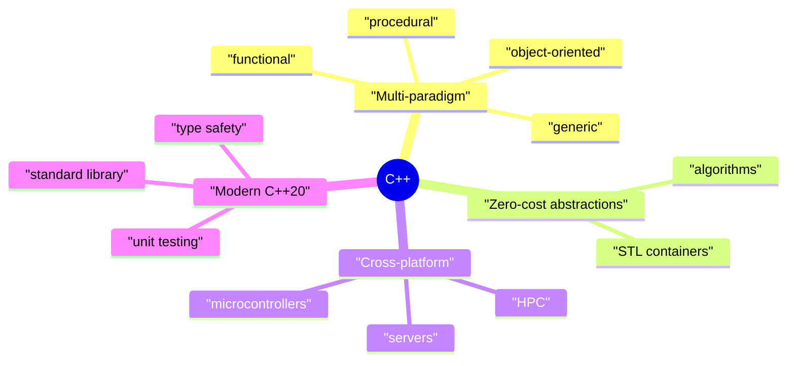
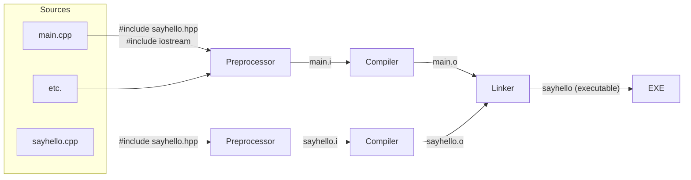
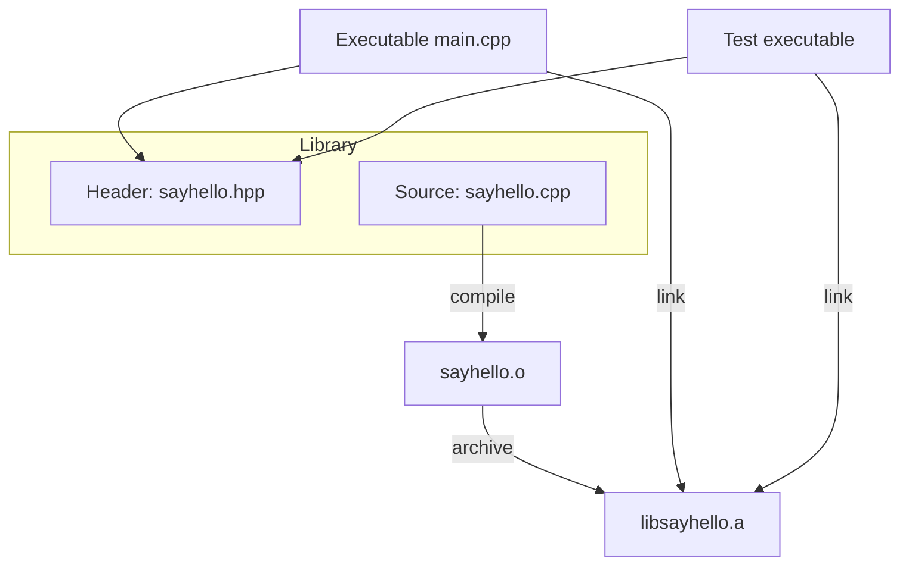
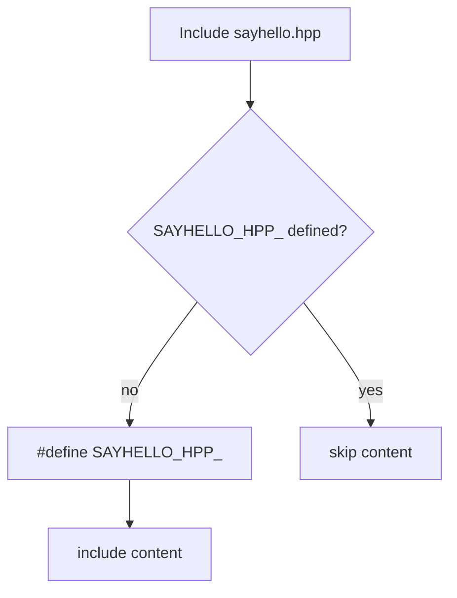
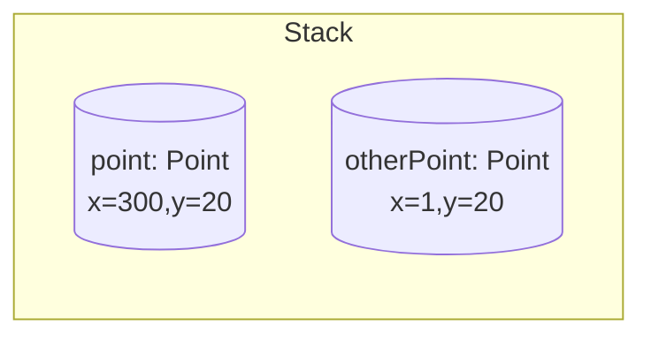
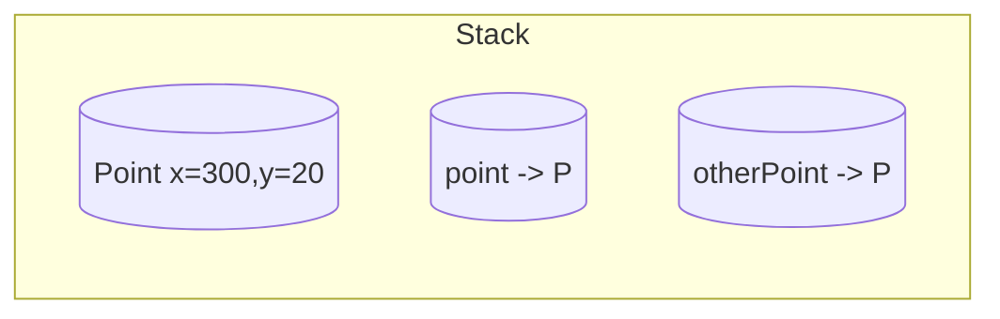
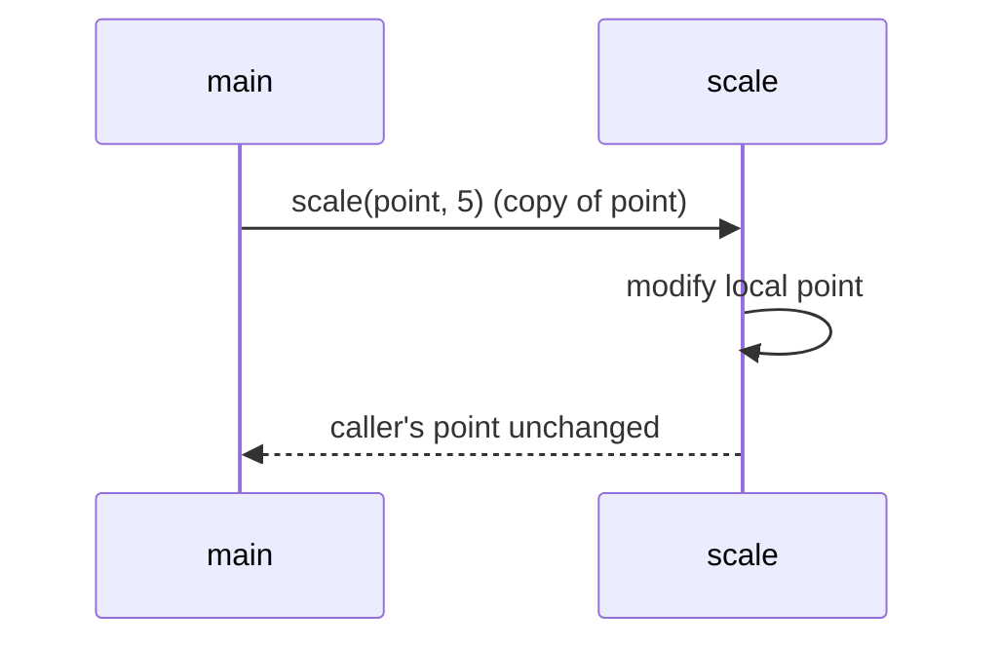

# Modern and Lucid C++ for Professional Programmers – Week 1: Introduction to C++

## Overview

* **Topic of this unit:** Introduction to C++, toolchain, modularization, declarations/definitions, value semantics, C++ vs. Java
* **Lecturers:** Thomas Corbat, Felix Morgner
* **Date:** Week 1
* **Learning objectives:**

  * Understand the motivation for C++ and where it is used
  * Understand the basic structure of a C++ program (`main`, functions, headers, source files)
  * Explain the C++ compilation process (preprocessor, compiler, linker)
  * Set up a project with a library, executable, and unit tests
  * Understand declaration vs. definition and the One Definition Rule (ODR)
  * Explain value vs. reference semantics and their impact on memory (stack/heap)
  * Recognise key differences between C++ and Java (objects, memory, undefined behavior)
  * Use AI tools like Copilot critically and responsibly

---

## 1. Introduction / Context

The course “Modern and Lucid C++ for Professional Programmers” teaches modern, practical C++ programming based on C++20 (with a view towards C++23). C++ is widely used in embedded systems, finance, game engines, and high-performance computing (e.g., CERN, medical technology).

Week 1 lays the groundwork:

* What does a minimal C++ program look like?
* How is C++ translated into machine code?
* How do we structure code into libraries with unit tests?
* How do C++ concepts differ from Java, especially concerning memory and objects?

---

## 2. Key Terms and Definitions

| Term                          | Definition                                                                                                                                                                         |
| ----------------------------- | ---------------------------------------------------------------------------------------------------------------------------------------------------------------------------------- |
| **Translation Unit**          | The result after the preprocessor has been applied to a source file (including all headers brought in via `#include`). This unit is compiled into an object file.                  |
| **Header file (`.hpp`/`.h`)** | File that primarily contains declarations (interfaces) and possibly templates, included into implementation files via `#include`.                                                  |
| **Source file (`.cpp`)**      | File containing implementations (definitions) of functions/classes. Compiled into an object file.                                                                                  |
| **Declaration**               | “There exists something with this name and this type.” Makes a name known to the compiler without providing the full implementation (e.g., function prototype in a header).        |
| **Definition**                | Provides the “actual thing”: memory is allocated or the implementation is given (e.g., a function body in a `.cpp` file).                                                          |
| **One Definition Rule (ODR)** | Each function, variable, or type must have exactly **one** definition in the entire program; multiple declarations are allowed. Violations lead to undefined behavior.             |
| **Undefined Behavior (UB)**   | Behavior for which the C++ standard imposes no requirements – anything can happen, from seemingly correct execution to crashes. Often due to programming errors or ODR violations. |
| **Value semantics**           | Variables *are* values. Copying creates independent objects. Assignment/copying copies content instead of references (unlike Java objects).                                        |
| **Reference (C++)**           | An alias to an existing object. Cannot be null, must be bound at initialization; implemented like a hidden pointer but used syntactically like a “second name”.                    |
| **Static library**            | Library type linked into an executable at link time. In this course, static libraries are used to simplify the toolchain.                                                          |
| **Unit test**                 | Automated test of small, isolated units of functionality. In this module, the Catch2 framework is used.                                                                            |

---

## 3. Main Content

### 3.1 Module & Resources Overview, Tooling

* **Platforms & materials**

  * Main platform: **Moodle**, plus a GitLab repository with code, exercises, and solutions.
  * Per week: lecture slides, exercises (online + PDF), solutions (with exceptions for graded testates and week 1).

* **Exercises & testates**

  * Working in groups of 2–3 students is recommended.
  * Testate 1 and 2 consist of tasks from several weeks, graded “pass/fail” with detailed feedback.
  * Exam admission: pass 2 out of 3 testates.

* **IDE & tools**

  * Any IDE is allowed; recommended: **Visual Studio Code**.
  * Alternatives: CLion, Visual Studio, etc.; Cevelop is not C++20-capable.
  * **Compiler**: modern `g++` or `clang` (e.g., g++ ≥ 14, clang ≥ 18; on Windows via MSYS2/MinGW). PATH must be set up correctly.
  * Online compiler such as Compiler Explorer (godbolt.org) can help verify compiler behavior.
  * **Test framework**: Catch2; you should know the basic workflow.
  * **Boost** libraries may be used later.

* **AI tools**

  * Copilot & similar tools can sabotage learning if they replace your own thinking.
  * They are **not allowed** in the exam.
  * Useful as an “explainer” if no human can help – but only **after** you have tried yourself.

---

### 3.2 Why C++? – Language Properties & Course Goals

* **Standard & platforms**

  * Current standard: **C++20**, C++23 is on the way.
  * C++ runs on almost any platform: from microcontrollers to mainframes.
  * Parts of the C++ standard were co-developed at HSR (now OST).

* **Multi-paradigm language**

  * Not just object-oriented: supports procedural, generic, and functional styles.
  * **Zero-cost abstractions**: abstractions (e.g., templates, STL containers) should compile down without additional runtime cost.

* **High-level abstractions + close to the machine**

  * You can program at a high level (e.g., `std::vector`, `std::algorithm`) but must understand what happens at runtime.
  * Concepts from modern C++ (e.g., RAII, value semantics) are useful for other languages too.

* **Course objective**

  * Focus on **modern C++** (C++11 and later) – no “1990s C++ style”.
  * Effective use of the standard library instead of “hand-written loops everywhere”.
  * Systematic unit testing with Catch2.
  * Application of solid software engineering practices.

**Visualization:**



---

### 3.3 First C++ Program & Typical “Hello World” Issues

* **Minimal C++ program**

```cpp
int main() {
}
```

or with trailing return type:

```cpp
auto main() -> int {
}
```

* `main()` is the **entry point** of the program (similar to `public static void main` in Java).

* C++ has **functions**, not just methods:

  * A function does not have to belong to a class.
  * Functions belonging to a class are called *member functions*, not “methods”.

* The return type appears either before the function name or as trailing return type after `auto`.

* `main` without a `return` implicitly returns `0`.

* **Bad “Hello World” (typical Eclipse template) – issues:**

  * Long, irrelevant comments.
  * `using namespace std;` in the global scope → namespace pollution.
  * Redundant comments like “prints Hello World”.
  * Sometimes global variables / inefficient constructs.

* **Improved “Hello World”:**

```cpp
#include <iostream>

auto main() -> int {
    std::cout << "Hello, World!\n";
}
```

* No unnecessary comments; no `using namespace std;`.
* Short and clear.

---

### 3.4 The C++ Compilation Process

C++ is typically compiled to native machine code; there is no JVM layer in between.

**Three phases:**

1. **Preprocessor**

   * Handles directives like `#include`, `#define`.
   * Replaces `#include` with the **raw text content** of the included header.
   * Result: preprocessed file (`.i`).

2. **Compiler**

   * Translates a translation unit (e.g., `main.i`) into machine code.
   * Result: **object file** (e.g., `main.o`).

3. **Linker**

   * Combines multiple object files and libraries (e.g., the standard library) into

     * an executable, or
     * a (static) library.

**Example project `sayhello`**

* Files:

  * `sayhello.hpp` – declaration of `sayHello`.
  * `sayhello.cpp` – definition of `sayHello`.
  * `main.cpp` – uses `sayHello(std::cout);`.

**Visualization:**



---

### 3.5 Modularization & Unit Testing

* **Goal of modularization**

  * Move functionality into **libraries**.
  * Application code (e.g., `main`) only uses the interface (header).
  * Library functions can be tested independently.

* **Structure of a small library**

```cpp
// sayhello.hpp
#ifndef SAYHELLO_HPP_
#define SAYHELLO_HPP_

#include <iosfwd>

auto sayHello(std::ostream&) -> void;

#endif
```

```cpp
// sayhello.cpp
#include "sayhello.hpp"
#include <ostream>

auto sayHello(std::ostream& os) -> void {
    os << "Hello world!\n";
}
```

```cpp
// main.cpp
#include "sayhello.hpp"
#include <iostream>

auto main() -> int {
    sayHello(std::cout);
}
```

* **Unit tests with Catch2**

```cpp
#include "sayhello.hpp"
#include <catch2/catch_test_macros.hpp>
#include <sstream>

TEST_CASE("SayHello says Hello, world!") {
    std::ostringstream out{};
    sayHello(out);
    REQUIRE(out.str() == "Hello world!\n");
}
```

* The library (static library) is used by both

  * the test executable and
  * the actual application.

**Visualization:**



---

### 3.6 Declarations, Definitions & Include Guards

#### 3.6.1 Declaration vs. Definition

* **Declaration of a function:**

```cpp
auto divide(int dividend, int divisor) -> int;  // declaration
```

* Tells the compiler: there exists a function `divide` with this signature; the implementation follows later.

* **Definition of the same function:**

```cpp
#include <stdexcept>

auto divide(int dividend, int divisor) -> int {
    if (divisor == 0) {
        throw std::invalid_argument{"Divisor must not be 0."};
    }
    return dividend / divisor;
}
```

* Here, the **function body** is given – that’s the definition.

* **Rules:**

  * You may have multiple **declarations** of the same function (e.g., across translation units).
  * You may have only **one definition** in the whole program (per signature) → **ODR**.

#### 3.6.2 One Definition Rule (ODR) & Include Guards

* Problem: the same header might be included multiple times, directly or indirectly.
* If the header contains definitions (e.g., class definitions), this leads to multiple definitions unless protected.

**Include guard:**

```cpp
#ifndef SAYHELLO_HPP_
#define SAYHELLO_HPP_

// content of sayhello.hpp

#endif // SAYHELLO_HPP_
```

* `#ifndef` – only if the symbol is not yet defined will the block be included.
* `#define` – marks the header as “already included”.
* `#endif` – end of the guarded block.

**Diagram of include guard:**



---

### 3.7 C++ is NOT Java – Value Semantics, Stack/Heap, Parameter Passing

#### 3.7.1 Java Objects vs. C++ Values

* In **Java**:

  * Objects (instances of classes) typically live on the **heap**.
  * Variables of class type are **references** (pointer-like); copying a variable copies only the reference.
  * Primitive types (`int`, `float`, `boolean`, …) are value types.

* In **C++**:

  * By default, objects are created **directly** (e.g., on the stack), not automatically via `new`.
  * `Point point{1, 20};` creates a real object, not a reference wrapper.
  * Copying copies the **entire object**, not just a reference.

**Code example Java vs. C++**

Java:

```java
Point point = new Point(1, 20);
Point samePoint = point;
point.x = 300;
System.out.println(samePoint.x); // 300
```

C++:

```cpp
struct Point {
    int x;
    int y;
};

auto main() -> int {
    Point point{1, 20};
    Point otherPoint{point};
    point.x = 300;
    std::cout << otherPoint.x << '\n'; // 1
}
```

* In Java, `point` and `samePoint` share the same object.
* In C++, `point` and `otherPoint` are two **copies**.

#### 3.7.2 Stack vs. Heap – Visualizations

**C++ copy:**

```cpp
Point point{1, 20};
Point otherPoint{point};
point.x = 300;
```



**C++ reference:**

```cpp
Point point{1, 20};
Point& otherPoint{point};
point.x = 300;
```



* References “share” the object; values create copies.

#### 3.7.3 Function Parameters: Copy vs. Reference

**Pass by value (copy)**

```cpp
auto scale(Point point, int factor) -> void {
    point.x *= factor;
    point.y *= factor;
}
```

Call: `scale(p, 5);`

* `scale` receives a **copy** of `p`.
* Changes affect only the copy, not the original.



**Pass by reference (sharing)**

```cpp
auto scale(Point& point, int factor) -> void {
    point.x *= factor;
    point.y *= factor;
}
```

* Here, `scale` works directly on the **original object**, so changes are visible to the caller.

---

## 4. Relationships and Interpretation

* The **compilation process** (preprocessor → compiler → linker) explains why we separate declarations in headers and definitions in `.cpp` files – each translation unit is compiled separately.
* The **One Definition Rule** prevents ambiguity during linking; include guards are the practical tool to enforce it.
* **Modularization** into libraries makes it easier to write reusable code that is used both in production code and in unit tests.
* C++’s **value semantics** fit this structure well: library functions clearly work on values or explicit references, so side effects are intentional.
* The comparison with **Java** shows that similar syntax does **not** mean equal semantics – especially regarding memory management, objects, and error handling. This is a major source of beginner mistakes and undefined behavior.

---

## 5. Examples and Applications

1. **`sayHello` library**

   * Small library that writes a greeting into any `std::ostream`.
   * Used both in `main` (the program) and in Catch2 tests.

2. **`divide` function**

   * Demonstrates:

     * clean function declaration and definition,
     * error handling via exception (`std::invalid_argument` when divisor is 0),
     * the difference between valid and invalid input.

3. **`Point` examples (Java vs. C++)**

   * Show the difference between reference semantics (Java) and value semantics (C++).
   * Supported by stack diagrams to visualise what happens.

4. **Parameter passing in `scale`**

   * `Point` by value → no change observable at the call site.
   * `Point&` by reference → side effects on the caller’s object.
   * Highlights how important the choice of parameter type is.

---

## 6. Summary / Takeaways

* C++ is powerful but complex, with

  * many abstraction mechanisms and
  * direct access to hardware and memory.
* Translation of C++ involves **preprocessor**, **compiler**, and **linker**; understanding this helps you debug build issues.
* **Headers** hold declarations, **source files** hold definitions; together they form compact, testable modules.
* The **One Definition Rule** and **include guards** are essential to avoid link errors and undefined behavior.
* C++ primarily uses **value semantics** – objects are copied by default, not shared; explicit references mark intentional sharing.
* C++ is **not** Java: similar syntax, but different semantics, especially for memory management, objects, and failure modes.
* Modern C++ practice includes automated **unit tests** (here with Catch2) as a first-class part of professional development.

---

## 7. Study Tips

* **Set up your environment early:**

  * Install a compiler, check your PATH, build a simple “Hello World”.
  * Configure your IDE (e.g., VS Code) with C++ extensions and build tasks.

* **Build a small library:**

  * Create your own mini-project with a header, `.cpp`, and test executable.
  * For example, `math_utils.hpp/.cpp` with functions like `add`, `mean`, `clamp`.

* **Practice declarations/definitions consciously:**

  * Declare functions in headers first, then define them in `.cpp` files.
  * Intentionally trigger errors (missing definition, double definition) and read the error messages.

* **Compare C++ and Java explicitly:**

  * Take typical Java patterns (e.g., `new` everywhere) and design “C++ versions” using value semantics.
  * Draw stack/heap diagrams by hand.

* **Use AI wisely:**

  * Try on your own first, then ask AI for alternative solutions or explanations.
  * Do not copy code blindly; always check and understand it.

---

## 8. Extensions / Further Concepts

In the following weeks, the course will cover, among others:

* Values and streams (I/O with `std::cout`, `std::cin`, formatting)
* Sequences and iterators (e.g., `std::vector`, iterator concepts)
* Functions, exceptions, classes, and operator overloading
* Namespaces, enums, and standard containers/algorithms
* Function and class templates
* Heap memory management, dynamic polymorphism
* Initialization concepts and aggregates

A solid understanding of the Week 1 basics is required to build these topics safely and effectively.

---

## 9. References & Literature (IEEE)

- [1] ISO/IEC, *Programming Languages — C++ (ISO/IEC 14882:2020)*, International Organization for Standardization, 2020.
- [2] B. Stroustrup, *The C++ Programming Language*, 4th ed., Addison-Wesley, 2013.
- [3] N. M. Josuttis, *The C++ Standard Library: A Tutorial and Reference*, 2nd ed., Addison-Wesley, 2012.
- [4] Catch2 Developers, “Catch2 Unit Test Framework,” online documentation, accessed: [reader’s current date].
- [5] Lecture slides “Modern and Lucid C++ for Professional Programmers – Week 1 – Introduction to C++”, OST – Ostschweizer Fachhochschule, HS2025.
