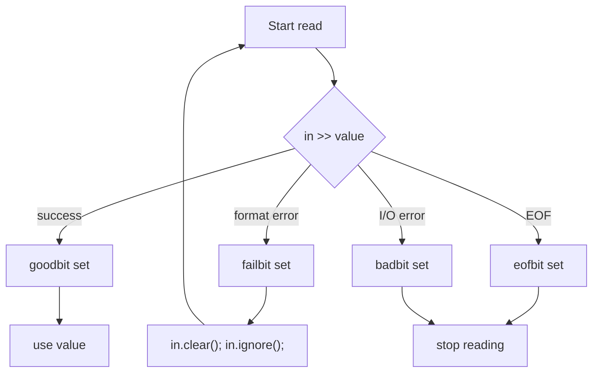

# Modern and Lucid C++ for Professional Programmers – Week 2: Values and Streams

## Overview

* **Topic of this unit:** Values, variables, literals, operators, strings, and streams
* **Lecturers:** Thomas Corbat, Felix Morgner 
* **Learning objectives:**

  * Know how and where to define variables
  * Identify the type and value of literals
  * Use the most important operators and understand conversions
  * Use the basic sequence container `std::string`
  * Read from and write to streams safely
  * Understand the possible states of an `std::istream` and how to recover


## 1. Introduction / Context

Week 2 builds directly on Week 1 (value vs. reference semantics, ODR, modularisation). The focus now is on **values and expressions** in C++, how to store them in **variables**, and how to communicate via **streams** (`std::cin`, `std::cout`, file streams, string streams). 

Correct handling of variables and I/O is essential for:

* avoiding **undefined behavior** (e.g. uninitialized variables, division by zero),
* writing **testable functions** that take values and references explicitly,
* dealing robustly with **user input** and errors.


## 2. Key Terms and Definitions

| Term                              | Definition                                                                                                                                    |
| --------------------------------- | --------------------------------------------------------------------------------------------------------------------------------------------- |
| **Variable definition**           | Introduces a named object with a type and (usually) an initial value, e.g. `int answer{42};`.                                                 |
| **`const` variable**              | Single-assignment variable that must be initialised and cannot be changed afterwards.                                                         |
| **`constexpr`**                   | Marks expressions/variables that must be computable at compile time (compile-time constants; advanced topic here).                            |
| **Scope**                         | Region of the program where a name is visible; typically a block delimited by `{}`. Inner scopes can shadow outer names.                      |
| **Literal**                       | A fixed value written directly in code, e.g. `42`, `'a'`, `"hello"`, `0x1f`, `3.14`.                                                          |
| **Lvalue / rvalue**               | Lvalue: object that has an identity and can appear on the left side of assignment (`x`); rvalue: temporary value (`6 * 7`).                   |
| **Stream**                        | Object providing input or output; e.g. `std::istream` (input), `std::ostream` (output). `std::cin` and `std::cout` are global stream objects. |
| **Stream state bits**             | Flags on streams: `goodbit` (OK), `failbit` (formatting failed), `eofbit` (end of file), `badbit` (serious I/O error).                        |
| **Formatted vs. unformatted I/O** | Formatted I/O uses `>>` and `<<` with type conversions; unformatted uses `get()`, `put()`, etc., working directly on characters.              |


## 3. Main Content

### 3.1 Variable Definitions and `const`

* **General form**

```cpp
<type> <variable-name>{<initial-value>};
```

Examples: 

```cpp
double x;          // uninitialised – bad practice!
int anAnswer{42};  // direct list initialisation
int zero{};        // value-initialised (0)
auto const i = 5;  // type deduced as int, const
```

* **Use `const` whenever possible for non-member variables**

  * Must be initialised, cannot be changed.
  * Makes code safer and easier to reason about.
  * Allows better optimisation and safer parallelism (less shared mutable state). 

```cpp
int const theAnswer{42};
// theAnswer = 15;   // error
// theAnswer++;      // error

double constexpr pi{3.14159}; // compile-time constant
```

* **Where to define variables?**

  * As close as possible to their first use.
  * Avoid the “old C style” of defining all variables at the top of functions.
  * Fewer, shorter scopes → more `const`, fewer mistakes.

**Bad style (reused mutable variable):**

```cpp
auto readAverage() -> int {
    int next;
    int sum = 0;
    int count = 0;
    while (std::cin) {
        next = readInt();
        sum += next;
        count++;
    }
    return sum / count;
}
```

**Better style:**

```cpp
auto readAverage() -> int {
    int sum = 0;
    int count = 0;
    while (std::cin) {
        auto const next = readInt();
        sum += next;
        count++;
    }
    return sum / count;
}
```

* **Global mutable variables are design errors**

```cpp
int sum = 0;   // BAD
int count = 0; // BAD
```

* Difficult to test and dangerous in concurrent programs. Use function-local variables and pass state explicitly. 

* **Scope and name visibility**

  * Variable defined in a block is visible only until the end of the block.
  * C++ allows **shadowing**: redefining a name in an inner scope hides the outer one (legal but often confusing).

```cpp
auto process(int value) -> void {   // #1
    {
        int value;                  // #2, hides #1
        {
            int value;              // #3, hides #2
        }                           // #3 ends
    }                               // #2 ends
}                                   // #1 ends
```

* **Naming**

  * Start variable names with lowercase.
  * Use descriptive names (e.g. `metersPerMile`, not `mpm`).
  * One-letter names are OK in very small scopes (loop indices, etc.). 

* **Types for variables**

  * Built-in numeric types: `short`, `int`, `long`, `long long` (+ unsigned variants), `bool`, `char`, `signed/unsigned char`, `float`, `double`, `long double`, and `void` (special).
  * Standard library types like `std::string` and `std::vector` require `#include`. 


### 3.2 Values, Literals, and Operators

#### 3.2.1 Literal forms

Examples and their meanings (simplified): 

* **Characters**

```cpp
'a'      // char, value 97
'\n'     // newline, value 10
'\x0a'   // newline, hex escape, value 10
```

* **Integers**

```cpp
1        // int
42L      // long
5LL      // long long
1u       // unsigned int
42ul     // unsigned long
5ull     // unsigned long long
020      // octal 20 → decimal 16
0x1f     // hex 1F → decimal 31
0XFULL   // unsigned long long, hex F → decimal 15
int{}    // 0 (not a literal, but value-initialisation)
```

* **Floating point**

```cpp
0.f          // float, 0.0
.33          // double, 0.33
1e9          // double, 1'000'000'000
42.E-12L     // long double, 42 * 10^-12
.3l          // long double, 0.3
```

* **Strings**

```cpp
"hello"           // char const[6], includes terminating '\0'
"\012\n\\"        // char const[4], newline, newline, backslash, '\0'
```

#### 3.2.2 Operators

* **Arithmetic:** `+ - * / %` (binary), `+ - ++ --` (unary)

* **Logical:** `&& || !` and `?:` (ternary)

* **Bitwise:** `& | ^ << >> ~` (plus keyword forms `bitand`, `bitor`, `xor`, `compl`) – use with **unsigned** types. 

* **Example expression**

```cpp
(5 + 10 * 3 - 6 / 2)   // 5 + 30 - 3 = 32
auto x = 3 / 2;        // 1 (integer division)
auto y = x % 2 ? 1 : 0;// 1 (x%2 == 1 → true)
```

* Integer division discards the fractional part (rounds toward zero).
* In boolean context, `0` → `false`, any other value → `true`.

#### 3.2.3 Type conversions & pitfalls

* C++ automatically converts types in expressions, **except** in brace-initialisation:

```cpp
int i{1.0};      // error – narrowing is forbidden with {}
int j = 1.0;     // allowed, but may lose information
```

* Division by **zero** (`x/0`, `x%0`) is **undefined behavior** – never do this. 

* **Assignment**

```cpp
x = 6 * 7;       // x is an lvalue, 6*7 an rvalue
greeting.at(1) = 'H'; // element access yields an lvalue too

a += b;  // a = a + b;
c /= d;  // c = c / d;
x >>= 2; // x = x >> 2;
```

* **Relational operators:** `<`, `>`, `<=`, `>=`, `==`, `!=`
  They yield `true` or `false`.

* Beware of chained comparisons:

```cpp
if (a < b < c) { /* ... */ }
```

This does **not** mean “a<b and b<c”; it compares `a<b` (bool) with `c`.

#### 3.2.4 Floating point numbers

* Use `double` by default (most efficient, default literal type).
* Use `float` only when memory is very tight and reduced precision is acceptable. 
* Special values: `NaN`, `+Inf`, `-Inf`.
* Equality comparison `==` for floats is usually wrong; use relative comparisons in tests, e.g. with Catch2:

```cpp
REQUIRE_THAT(actual,
    Catch::Matchers::WithinRel(expected, delta));
```


### 3.3 Strings and `std::string`

* `std::string` represents a mutable sequence of `char`.

```cpp
#include <string>

std::string name{"Carl"};
```

* String literals like `"ab"` are **not** `std::string` but `char const[3]` (array of chars + `'\0'`).
* `"ab"s` is an `std::string` literal (requires `using namespace std::literals;`). This matters when types are deduced with `auto`. 

**Example:**

```cpp
auto printName(std::string name) -> void {
    using namespace std::literals;
    std::cout << "my name is: "s << name;
}
```

* **Strings are mutable** in C++ (unlike Java `String`).

Several ways to iterate and modify:

```cpp
#include <cctype>   // toupper

auto toUpper(std::string& value) -> void {
    for (int i = 0; i < value.size(); i++) {
        value[i] = std::toupper(value[i]);
    }
}

auto toUpper(std::string& value) -> void {
    for (char& c : value) {
        c = std::toupper(c);
    }
}

auto toUpper(std::string& value) -> void {
    std::transform(std::cbegin(value), std::cend(value),
                   std::begin(value), ::toupper);
}
```

**Using strings with streams:**

```cpp
#include <iostream>
#include <string>

auto askForName(std::ostream& out) -> void {
    out << "What is your name? ";
}

auto inputName(std::istream& in) -> std::string {
    std::string name{};
    in >> name;
    return name;
}

auto sayGreeting(std::ostream& out, std::string name) -> void {
    out << "Hello " << name << ", how are you?\n";
}

auto main() -> int {
    askForName(std::cout);
    sayGreeting(std::cout, inputName(std::cin));
}
```


### 3.4 Streams and I/O

#### 3.4.1 Basic stream concepts

* `std::string` and built-in types are **values** – they can be copied and passed by value.
* Some objects are **not** values and must not be copied, e.g. streams (`std::istream`, `std::ostream`).
  Functions should take them by **reference** and provide side effects (input/output). 

```cpp
auto askForName(std::ostream& out) -> void;
auto readName(std::istream& in) -> std::string;
```

* Predefined global streams:

  * `std::cin` – standard input
  * `std::cout` – standard output
  * They should typically be used only in `main()`; other functions receive streams as parameters.

* **Shift operators**

```cpp
std::cin >> x;                          // read formatted input
std::cout << "value: " << x << '\n';    // write formatted output
```

Multiple values can be chained.

#### 3.4.2 Reading values

* Reading a `std::string`:

```cpp
auto inputName(std::istream& in) -> std::string {
    std::string name{};
    in >> name;    // may leave name empty
    return name;
}
```

* Naive reading of `int`:

```cpp
auto inputAge(std::istream& in) -> int {
    int age{-1};
    if (in >> age) {
        return age;
    }
    return -1;
}
```

* The result of `in >> age` is the stream itself, which converts to `bool`:

  * `true` if the read succeeded,
  * `false` if it failed (format problem, EOF, etc.). 

**Chaining input:**

```cpp
auto readSymbols(std::istream& in) -> std::string {
    char symbol{};
    int count{-1};
    if (in >> symbol >> count) {
        return std::string(count, symbol);
    }
    return "error";
}
```

#### 3.4.3 EOF and terminal behaviour

* When reading all input from the terminal, you must signal **end-of-file**:

  * Ctrl-D (Linux/macOS), Ctrl-Z (Windows), then Enter.
* Example: counting characters until EOF. 

```cpp
auto main() -> int {
    std::size_t count{0};
    char c{};
    while (std::cin >> c) {
        ++count;
    }
    std::cout << count << "\n";
}
```

#### 3.4.4 Robust input and stream states

Better way to robustly read an `int`: use a line buffer and `std::istringstream`:

```cpp
auto inputAge(std::istream& in) -> int {
    std::string line{};
    while (std::getline(in, line)) {
        std::istringstream is{line};
        int age{-1};
        if (is >> age) {
            return age;
        }
    }
    return -1;
}
```

* Streams have state bits:

$$
\text{state} \in \{\text{goodbit}, \text{failbit}, \text{eofbit}, \text{badbit}\}
$$

* Typical workflow:

```cpp
auto inputAge(std::istream& in) -> int {
    while (in.good()) {
        int age{-1};
        if (in >> age) {
            return age;
        }
        in.clear();   // reset failbit (and maybe eofbit)
        in.ignore();  // discard one char
        // alternative: ignore rest of line
        // in.ignore(std::numeric_limits<std::streamsize>::max(), '\n');
    }
    return -1;
}
```

**Stream state flow**



The table on the slides (page 39–40) shows how combinations of bits affect `good()`, `fail()`, `bad()`, `eof()`, and boolean conversion. 

#### 3.4.5 Formatted output

Illustrated example: 

```cpp
#include <iostream>
#include <iomanip>
#include <ios>

auto main() -> int {
    std::cout << 42 << '\t'
              << std::oct << 42 << '\t'
              << std::hex << 42 << '\n';

    std::cout << 42 << '\t'
              << std::dec << 42 << '\n';  // hex is "sticky"

    std::cout << std::setw(10) << 42
              << std::left << std::setw(5) << 43 << "*\n";

    std::cout << std::setw(10) << "hallo" << "*\n";

    double const pi{std::acos(0.5) * 3};
    std::cout << std::setprecision(4) << pi << '\n';
    std::cout << std::scientific << pi << '\n';
    std::cout << std::fixed << pi * 1e6 << '\n';
}
```

* `std::oct`, `std::hex`, `std::dec` change integer base (and are sticky).
* `std::setw`, `std::left` control field width and alignment.
* `std::setprecision`, `std::scientific`, `std::fixed` control floating formatting.

#### 3.4.6 Unformatted I/O

* Uses functions like `get()` and `put()` and works on raw characters.
* Example: transform input to lowercase: 

```cpp
#include <iostream>
#include <cctype>

auto main() -> int {
    char c{};
    while (std::cin.get(c)) {
        std::cout.put(std::tolower(c));
    }
}
```

#### 3.4.7 Choosing the right headers

* `<iosfwd>`: forward declarations for stream types; good for headers when you only declare functions taking streams.
* `<istream>`, `<ostream>`: full definitions and operators; usually used in `.cpp` files.
* `<iostream>`: everything above plus global `std::cin`, `std::cout`, `std::cerr`; typically needed only in the file containing `main()`. 


## 4. Relationships and Interpretation

* **Variables + literals + operators** form expressions; understanding their types and conversions prevents subtle bugs (e.g. narrowing, integer division, UB).
* `std::string` shows how user-defined types behave like values, but with rich functionality.
* **Streams** are non-copyable resources; passing them by reference makes side effects explicit.
* Stream **states** and error handling are crucial for writing robust, user-facing programs instead of “happy-path-only” scripts.
* Many design principles here (avoid global mutable state, prefer `const`, clear interfaces with streams passed in) support modularisation and testing from Week 1.


## 5. Examples and Applications

1. **Average calculator**

   * Uses local variables and `const` for loop input.
   * Demonstrates correct placement of variable definitions.

2. **`toUpper` functions**

   * Show three idioms for traversing `std::string`: indexed loop, range-for, and algorithms.

3. **`askForName` / `inputName` / `sayGreeting`**

   * Illustrate dependency injection of streams (`std::istream&`, `std::ostream&`) for testability.

4. **Robust `inputAge`**

   * Shows how to loop on `std::getline`, use `std::istringstream`, and validate conversion.

5. **Lowercase filter**

   * Small Unix-style filter program using unformatted I/O (`get`, `put`) and `<cctype>` helpers.


## 6. Summary / Takeaways

* Variables hold values and have types; initialise them and use `const` by default.
* Literals come in many forms (chars, integers, floating, strings); know their types and suffixes.
* Operators behave mostly as in Java, but watch out for integer division, implicit conversions, and chained comparisons.
* `std::string` is the basic sequence container for text; it is mutable and integrates well with streams.
* Streams provide I/O; they are non-copyable and should be passed by reference.
* Stream states (`good`, `fail`, `eof`, `bad`) must be checked; robust input requires proper error handling (`clear`, `ignore`, `getline` + parsing).
* Formatting manipulators in `<iomanip>` make it easy to control the textual representation of values.
* Minimal includes (`<iosfwd>`, `<istream>`, `<ostream>`, `<iostream>`) keep compile times down and dependencies clean.


## 7. Study Tips

* **Practice variable definitions:**

  * Rewrite small programs such that all non-member variables are `const` where possible.
  * Move definitions closer to first use.

* **Literals & expressions drill:**

  * For each literal in the slides, write down its type and value.
  * Evaluate simple expressions by hand and then verify with a tiny C++ program.

* **String exercises:**

  * Write your own `toLower`, `trim`, `repeat`, etc., using different loop styles.
  * Experiment with `"..."` vs. `"..."s` and `auto` type deduction.

* **Stream exercises:**

  * Implement functions `readInt`, `readDouble`, `readWord` that handle invalid input robustly.
  * Write small filter programs (e.g. uppercase converter, whitespace remover).

* **Debug I/O issues:**

  * Deliberately feed invalid input and observe how stream state changes and what your program does.


## 8. Extensions / Further Concepts

Later parts of the course will build on these ideas:

* Sequences and iterators (`std::vector`, begin/end, range-based for)
* Exceptions and error handling in combination with streams
* RAII and resource management (files, network sockets)
* Templates and generic algorithms operating on arbitrary sequences
* More advanced I/O (file streams, formatting libraries, localisation)

A solid understanding of Week 2 is essential for correctly using containers, algorithms, and more complex data structures later.


## 9. References & Literature (IEEE)

[1] ISO/IEC, *Programming Languages — C++ (ISO/IEC 14882:2020)*, International Organization for Standardization, 2020.

[2] B. Stroustrup, *The C++ Programming Language*, 4th ed., Addison-Wesley, 2013.

[3] N. M. Josuttis, *The C++ Standard Library: A Tutorial and Reference*, 2nd ed., Addison-Wesley, 2012.

[4] cppreference.com, “Input/output library,” online reference for C++ I/O, accessed: [reader’s current date].

[5] Lecture slides “Modern and Lucid C++ for Professional Programmers – Week 2 – Values and Streams”, OST – Ostschweizer Fachhochschule, HS2025. 
