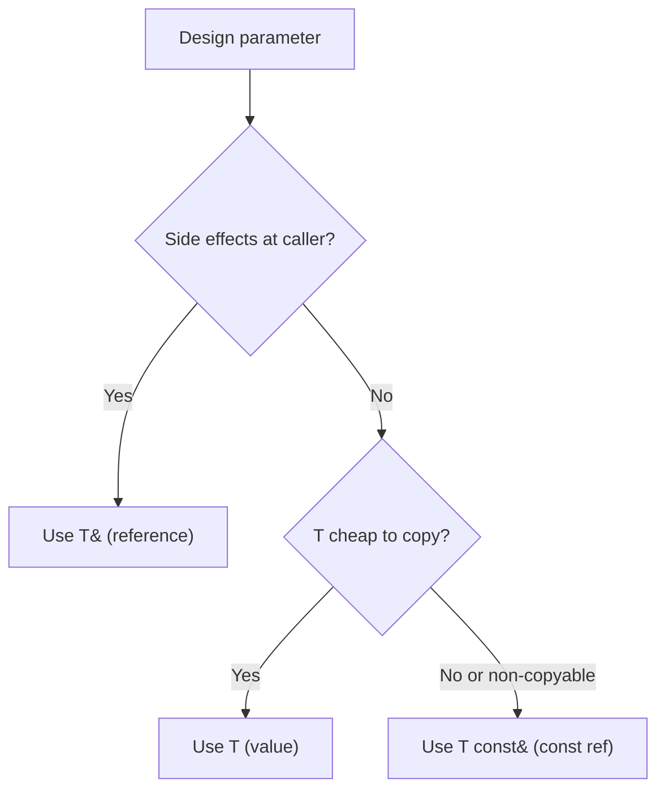

# Modern and Lucid C++ for Professional Programmers – Week 4: Functions and Exceptions

## Overview

* **Topic of this unit:** Functions, parameter/return design, lambdas, error handling strategies, and exceptions 
* **Lecturers:** Thomas Corbat, Felix Morgner 
* **Learning objectives:**

  * Choose appropriate parameter passing styles (value, reference, const reference)
  * Use suitable return types (value vs. reference) and avoid dangling references
  * Use default arguments and function overloading correctly
  * Write lambdas, including captures and init-captures
  * Pass functions and lambdas to higher-order functions (incl. `std::function`)
  * Know 5 ways to react to errors in functions
  * Throw, catch, and test exceptions (with Catch2)
  * Understand `noexcept` and narrow vs. wide contracts


## 1. Introduction / Context

Week 4 focuses on how to design **functions** that are safe, expressive, and easy to use:

* How to pass parameters and return values without surprises.
* How to express small functions inline using **lambdas**, including captured state.
* How to define clear **contracts** for functions (pre/postconditions).
* How to handle **errors** in functions, and when to use **exceptions**.
* How to test exception behavior with Catch2.

The lecture contrasts **good** and **bad** examples of parameter passing and error handling, and closes with a checklist for “good functions.” 


## 2. Key Terms and Definitions

| Term                          | Definition                                                                                                                                            |
| ----------------------------- | ----------------------------------------------------------------------------------------------------------------------------------------------------- |
| **Value parameter**           | Parameter passed by value: the function receives its own copy (`auto f(T x) -> void;`). Changes are local.                                            |
| **Reference parameter**       | Parameter passed by reference (`T&`): the function works on the caller’s object; side effects are visible at the call site.                           |
| **Const reference parameter** | `T const&`: read-only view on the caller’s object; no copies, no side effects (if you respect `const`). Often used for large or non-copyable objects. |
| **Default argument**          | Default value specified in a function declaration for parameters on the right; allows calls with fewer arguments.                                     |
| **Function overloading**      | Multiple functions with the same name but different parameter types/arity; resolved at compile time (ad hoc polymorphism).                            |
| **Lambda**                    | An inline, anonymous function, introduced by `[]` with optional captures and parameters.                                                              |
| **Capture**                   | Mechanism for a lambda to access variables from the surrounding scope, either by value (`[=]`, `[x]`) or by reference (`[&]`, `[&x]`).                |
| **Contract**                  | The set of guarantees of a function: preconditions (what caller must ensure) and postconditions (what callee promises).                               |
| **Narrow contract**           | Function with preconditions; only defined behavior for a subset of argument values.                                                                   |
| **Wide contract**             | Function defined for *all* values its parameter types can take (no preconditions).                                                                    |
| **Error value / error code**  | Special return value indicating failure (e.g. `std::string::npos`, `-1`, or `std::optional<T>` with no value).                                        |
| **Exception**                 | Object thrown via `throw` to signal errors that violate pre/postconditions; can be caught by `try`–`catch`.                                           |
| **`noexcept`**                | Function specifier that promises not to throw; if an exception escapes, the program terminates.                                                       |


## 3. Main Content

### 3.1 Function Parameters: Value, Reference, Const

The same call-site:

```cpp
std::string name{"John"};
f(name);
```

can bind to multiple parameter styles:

```cpp
auto f(std::string s) -> void;           // value
auto f(std::string& s) -> void;          // non-const ref
auto f(std::string const& s) -> void;    // const ref
auto f(std::string const s) -> void;     // const value
```

**Semantics:**

* `std::string s` (value)

  * **Copy** of `name`.
  * Modifications are local; caller is unaffected.
  * Default choice for small or cheap-to-copy types. 

* `std::string& s` (non-const reference)

  * Direct access to caller’s object.
  * Use when you *intend* side effects at call site.
  * **Important:** cannot bind a `const` argument to non-const reference.

* `std::string const& s` (const reference)

  * No modification, no copy (for large types).
  * Use for large objects, non-copyable types, or when you want a read-only view.

* `std::string const s` (const value)

  * Similar to value parameter but protected from modification.
  * Sometimes preferred by style guides to avoid accidentally changing `s`. 

**Rule of thumb (parameters):**

* Default: pass **by value**.
* When you need side effects: pass **by reference**.
* When copying is expensive or impossible, and no side effects: **`T const&`**.

**Visualisation:**




### 3.2 Return Types: Value vs. Reference

#### Value return

```cpp
auto create() -> std::string {
    std::string name{"John"};
    return name; // OK, returns a value
}
```

* Default choice: `auto f() -> T;`
* Caller gets its **own copy** (often optimised via RVO).

Returning `T const` (e.g. `auto f() -> std::string const;`) is discouraged: it only annoys callers (their copy is unnecessarily const). 

#### Reference return

```cpp
auto sayHello(std::ostream& out) -> std::ostream& {
    return out << "Hello";
}
```

* `T&` – modifiable reference: allows chaining (`sayHello(std::cout) << " world\n";`).
* `T const&` – read-only reference: a view on an existing object.

**Never return a reference to a local variable:**

```cpp
auto create() -> std::string& {   // WRONG
    std::string name{"John"};
    return name; // dangling reference → undefined behavior
}
```

Compiler can often detect this. 

**Right or Wrong examples (slides 13–14):** 

* Returning `Connection&` to a local `Connection` (`connection` object) is **wrong** → dangling reference.
* Binding a `LargeDocument const` to `LargeDocument&` parameter is **wrong**: you’d allow modification of a const object.
* Returning `POI const& migros = createPOI(location);` and later `return std::vector{migros};` is **unusual but correct**: the reference extends the temporary’s lifetime until the end of the block; the vector stores a copy.
* Returning `std::string const&` from `max("a", "b")` is **wrong**: the returned reference refers to a temporary created from a literal; that temporary dies at end of the full expression.


### 3.3 Function Overloading and Default Arguments

#### Overloading

Same name, different parameter list:

```cpp
auto incr(int& var) -> void;
auto incr(int& var, unsigned delta) -> void;
```

* Overload resolution happens at **compile time**.
* Return type alone cannot distinguish overloads.
* Beware of ambiguities: e.g. `factorial(10u)` where both `int` and `double` overloads are plausible. 

#### Default arguments

Defined in the **declaration**, from right to left:

```cpp
auto incr(int& var, unsigned delta = 1) -> void;

auto incr(int& var, unsigned delta) -> void {
    var += delta;
}

int counter{0};
incr(counter);    // uses default delta = 1
incr(counter, 5); // explicit delta
```

* Equivalent to having several overloads with fewer parameters.
* The “Right or Wrong” example where a middle parameter has a default but the rightmost has none is **wrong**: defaults must be specified from the **right**. 


### 3.4 Functions as Parameters and `std::function`

You can pass functions to other functions:

```cpp
auto applyAndPrint(double x, auto f(double) -> double) -> void {
    std::cout << "f(" << x << ") = " << f(x) << '\n';
}
```

* This legacy-style function parameter accepts plain functions or lambdas **without capture**.
* A lambda that **captures** (e.g. local variables) cannot bind to a plain function pointer type. 

**Modern approach: `std::function`**

```cpp
#include <functional>

auto applyAndPrint(double x,
                   std::function<auto(double) -> double> f) -> void {
    std::cout << "f(" << x << ") = " << f(x) << '\n';
}

auto main() -> int {
    double factor{3.0};
    auto const multiply = [factor](double value) {
        return factor * value; // uses captured factor
    };
    applyAndPrint(1.5, multiply);
}
```

* `std::function<Return(Params...)>` can wrap:

  * free functions,
  * member function wrappers,
  * lambdas (with or without captures),
  * other callables. 


### 3.5 Lambdas and Captures

#### Basic syntax

```cpp
auto g = [](char c) -> char {
    return std::toupper(c);
};

g('a'); // 'A'
```

* `[]` introduces the lambda.
* `(char c)` – parameter list (can be `auto` for generic lambdas).
* `-> char` – optional trailing return type.
* Body is a normal statement block. 

#### Capturing specific variables

By **value**:

```cpp
int x = 5;
auto l = [x]() mutable {
    std::cout << ++x;   // prints 6, modifies lambda’s copy
};
```

By **reference**:

```cpp
int x = 5;
auto const l = [&x]() {
    std::cout << ++x;   // modifies x outside lambda
};
```

* By value → local copy; default is const unless `mutable`.
* By reference → side effects visible outside; referenced variable must outlive the lambda. 

#### Capture-all

```cpp
int x = 5;
auto l1 = [=]() mutable {
    std::cout << ++x;   // copies all used locals by value
};

int y = 7;
auto l2 = [&]() {
    std::cout << ++x << ", " << ++y;  // references both x and y
};
```

#### Advanced captures

* Capture `this` (in member functions):

```cpp
struct S {
    auto foo() -> void {
        auto square = [this] { member *= 2; };
        square();
    }
private:
    int member{};
};
```

* Init-capture (create new variable in capture):

```cpp
auto squares = [x = 1]() mutable {
    std::cout << (x *= 2);   // 2, 4, 8, ...
};
```

Multiple captures are separated by commas. 


### 3.6 `auto` Return Type and Trailing Return Types

#### Deduced `auto` return

```cpp
auto middle(std::vector<int> const& c) {
    // assume not empty
    return c[c.size() / 2];  // return type deduced as int
}
```

* Works only when the implementation (function body) is visible.
* For **declarations without body**, the compiler can’t deduce the type. The “Right or Wrong” example with `auto maxValue(int f, int s, int t);` is **wrong** for this reason. 

#### Trailing return type (course default)

```cpp
auto middle(std::vector<int> const& c) -> int;
auto middle(std::vector<int> const& c) -> int {
    // assume not empty
    return c[c.size() / 2];
}
```

* Use `auto f(params) -> ReturnType;` consistently (also in lambdas):

```cpp
auto isOdd = [](auto value) -> bool {
    return value % 2;
};
```

This style allows declarations in headers without needing the body for type deduction. 


### 3.7 Evaluation Order of Function Arguments

Statements are sequenced by `;`, but **within a single expression** (like a function call), the order of evaluating arguments is **unspecified**:

```cpp
void sayGreeting(std::ostream& out,
                 std::string name1,
                 std::string name2) {
    out << "Hello " << name1 << ", do you love " << name2 << "?\n";
}

auto main() -> int {
    askForName(std::cout);
    sayGreeting(std::cout,
                inputName(std::cin),
                inputName(std::cin));
}
```

* Whether the first or second `inputName` call happens first is unspecified.
* Don’t write code that depends on a particular evaluation order of arguments. 


### 3.8 Error Handling Strategies in Functions

A function can fail because:

* **Precondition** violated (caller gives bad arguments, e.g. negative index, divisor 0).
* **Postcondition** can’t be satisfied (e.g. cannot open file, missing resources). 

The slides list **five strategies**:

1. **Ignore the error**

   * Assume preconditions are always satisfied; no checks.
   * Most efficient but yields **undefined behavior** if used incorrectly.

   ```cpp
   std::vector v{1, 2, 3, 4, 5};
   v[5] = 7;   // UB, index out of bounds
   ```

2. **Return a default value**

   ```cpp
   auto inputName(std::istream& in) -> std::string {
       std::string name{};
       in >> name;
       return name.size() ? name : "anonymous";
   }

   auto inputNameWithDefault(std::istream& in,
                             std::string const& def = "anonymous")
       -> std::string {
       std::string name{};
       in >> name;
       return name.size() ? name : def;
   }
   ```

   * Simple for the caller, but can hide deeper problems. Better if caller can **choose** the default. 

3. **Return an error value**

   * Only works if there’s a “spare” value outside the normal domain:

     * `std::string::npos`
     * Many POSIX calls return `-1` on error.

   ```cpp
   auto contains(std::string const& s, int number) -> bool {
       auto substring = std::to_string(number);
       return s.find(substring) != std::string::npos;
   }
   ```

   * Burdens the caller with checking the result.

   **`std::optional` as error value (recommended):**

   ```cpp
   #include <optional>

   auto inputName(std::istream& in) -> std::optional<std::string> {
       std::string name{};
       if (in >> name) return name;
       return {};
   }

   auto main() -> int {
       std::optional name = inputName(std::cin);
       if (name) {
           std::cout << "Name: " << *name << '\n';
       }
   }
   ```

   * Encodes “maybe a value” in the type system, forces callers to acknowledge failure. 

4. **Error status as side effect**

   ```cpp
   auto connect(std::string url, bool& error) -> int {
       // set error when something goes wrong
   }
   ```

   * Caller must provide an error variable.
   * Similar pattern used by `std::istream` (state flags: `good()`, `fail()`, etc.).

   ```cpp
   std::string name{};
   in >> name;
   if (in.fail()) {
       // handle error
   }
   ```

5. **Throw an exception**

   ```cpp
   void sayGreeting(std::ostream& out, std::string name) {
       if (name.empty()) {
           throw std::invalid_argument{"Empty name"};
       }
       out << "Hello " << name << ", how are you?\n";
   }
   ```

   * Prevents continuing with invalid logic.
   * Suitable when contracts are violated or postconditions can’t be met and the caller must **not** continue blindly. 


### 3.9 Exceptions: Throwing, Catching, Testing, `noexcept`

#### Throwing

```cpp
throw std::invalid_argument{"Description"};
throw 15;   // syntactically allowed but discouraged
```

* Any copyable type can be thrown, but you should use:

  * Standard exceptions from `<stdexcept>`, or
  * Types derived from `std::exception`. 

#### Catching

```cpp
try {
    throwingCall();
} catch (type const& e) {
    // handle type
} catch (type2 const& e) {
    // handle type2
} catch (...) {
    // handle all other exception types
}
```

* Principle: **throw by value, catch by `const&`**.
* Catch order matters: first matching `catch` wins.
* `catch (...)` must be last.
* Rethrow with plain `throw;`. 

#### Exception hierarchy

The *diagram on page 41* shows the standard exception class hierarchy:

* Base: `std::exception` (provides `what()`).
* Logic errors: `std::logic_error`, `std::invalid_argument`, `std::out_of_range`, `std::length_error`, …
* Runtime errors: `std::runtime_error`, etc. 

#### Narrow contract example

```cpp
auto squareRoot(double x) -> double {
    if (x < 0) {
        throw std::invalid_argument{"square_root imaginary"};
    }
    return std::sqrt(x);
}
```

* Function is defined only for `x >= 0` (narrow contract).
* Exceptions are for **contract violations**, not for normal control flow. 

#### Testing exceptions with Catch2

```cpp
TEST_CASE("square_root of negative value throws") {
    REQUIRE_THROWS(square_root(-1.0));
}

TEST("at on empty vector throws std::out_of_range") {
    std::vector<int> empty_vector{};
    REQUIRE_THROWS_AS(empty_vector.at(0), std::out_of_range);
}

TEST("parseInt of \"one\" throws with message") {
    REQUIRE_THROWS_WITH(parseInt("one"),
                        "parse error – invalid digits in 'one'");
}
```

* `REQUIRE_THROWS` – any exception.
* `REQUIRE_THROWS_AS` – specific type.
* `REQUIRE_THROWS_WITH` – check message content. 

#### Misuse example & `noexcept`

The “Right or Wrong” example:

* Throws exceptions for *correct* control flow (`check` always throws something).
* Throws primitive types and catches by value.
* Uses inverted conditions.

All of that is **bad style**: use exceptions only for error states, not as a control-flow mechanism. 

`noexcept`:

```cpp
auto add(int lhs, int rhs) noexcept -> int {
    return lhs + rhs;
}

auto fail() -> void {
    throw 1;
}

auto lie() noexcept -> void {
    fail(); // if exception escapes, program terminates
}
```

* Declares that a function should not throw.
* If an exception propagates out of a `noexcept` function, the program aborts.


## 4. Relationships and Interpretation

* Choosing **parameter passing** and **return types** correctly prevents dangling references and makes side effects explicit.
* **Lambdas** and `std::function` allow passing behavior around while respecting lifetimes and captures.
* **Function contracts** (pre/postconditions) inform how errors should be handled: silent default, error value, or **exception**.
* The five error handling strategies represent a spectrum from maximum performance (ignore) to maximum safety and clarity (exceptions, `std::optional`).
* **Exceptions**, when used for contract violations only, keep normal code simple while still handling rare error paths robustly.
* `noexcept` and good exception testing improve reliability and allow better optimization.


## 5. Examples and Applications

* Designing a safe `divide` function:

  * Precondition: divisor ≠ 0.
  * Implementation choices: return `std::optional<int>`, throw `std::invalid_argument`, or ignore and risk UB.
* Higher-order functions:

  * Using `std::function` and lambdas with captures (e.g. scaling values by a configurable factor).
* Input functions:

  * `inputName` returning default vs. returning `std::optional<std::string>`.
* Math functions with narrow contracts:

  * `squareRoot`, `logarithm`, etc., which throw on invalid arguments.
* Testing:

  * Catch2 test cases that assert both successful results and correct exceptions.


## 6. Summary / Takeaways

* Prefer **by-value** parameters and returns; use references only when you really mean sharing or a view.
* Don’t return references to local variables; be careful with const references and temporaries.
* Use **default arguments** from right to left and avoid ambiguous overload sets.
* Lambdas with captures are powerful; understand value vs. reference capture and lifetimes.
* Clearly define whether your function has a **wide** or **narrow** contract.
* Know and consciously choose between five error-handling options:

  1. Ignore (UB risk),
  2. Default result,
  3. Error value (`std::optional`, `std::expected` in C++23),
  4. Error status side effect,
  5. Exceptions.
* Use standard exception types and Catch2’s `REQUIRE_THROWS*` macros to test them.
* Mark truly non-throwing functions as `noexcept`; never use exceptions as a regular control-flow tool.


## 7. Study Hints

* Take functions from earlier weeks and:

  * Re-evaluate parameter passing (value vs. ref vs. const ref).
  * Decide if they should throw on invalid input or use `std::optional`.
* Write small utilities:

  * `applyAndPrint` with `std::function`.
  * `transformAll` that takes a vector and a lambda.
* Practice lambdas:

  * Capturing one variable by value vs. by reference.
  * Using init-captures for small stateful generators.
* Write tests with Catch2:

  * Normal cases + exception cases (e.g. `squareRoot`, vector `at`).
* Scan your code for:

  * References to locals being returned,
  * Functions that silently ignore errors,
  * Exceptions used as regular control flow.


## 8. Extensions / Further Concepts

* Member functions and methods with contracts and exception guarantees.
* RAII and exception safety guarantees (basic, strong, no-throw).
* Custom exception types and error hierarchies.
* C++23 `std::expected` for richer error handling.
* Interaction of `noexcept` with move operations and optimization.

These build directly on the function design, contracts, and exception handling techniques from Week 4. 


## 9. References & Literature (IEEE)

[1] ISO/IEC, *Programming Languages — C++ (ISO/IEC 14882:2020)*, International Organization for Standardization, 2020.

[2] B. Stroustrup, *The C++ Programming Language*, 4th ed., Addison-Wesley, 2013.

[3] N. M. Josuttis, *The C++ Standard Library: A Tutorial and Reference*, 2nd ed., Addison-Wesley, 2012.

[4] Catch2 Developers, “Catch2 Unit Test Framework,” online documentation, accessed: [reader’s current date].

[5] Lecture slides “Modern and Lucid C++ for Professional Programmers – Week 4 – Functions and Exceptions”, OST – Ostschweizer Fachhochschule, HS2025. 
