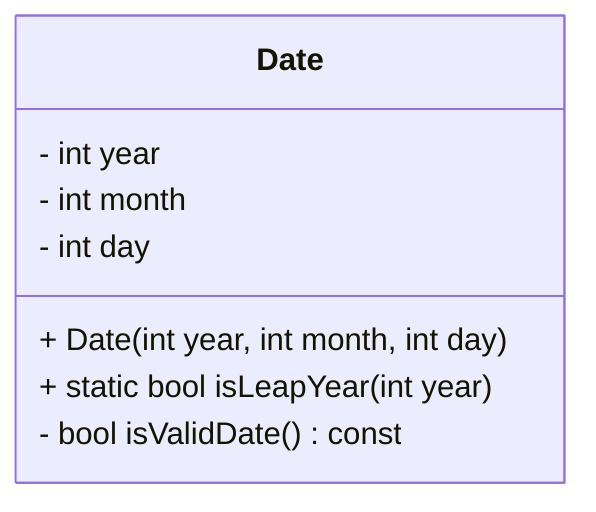
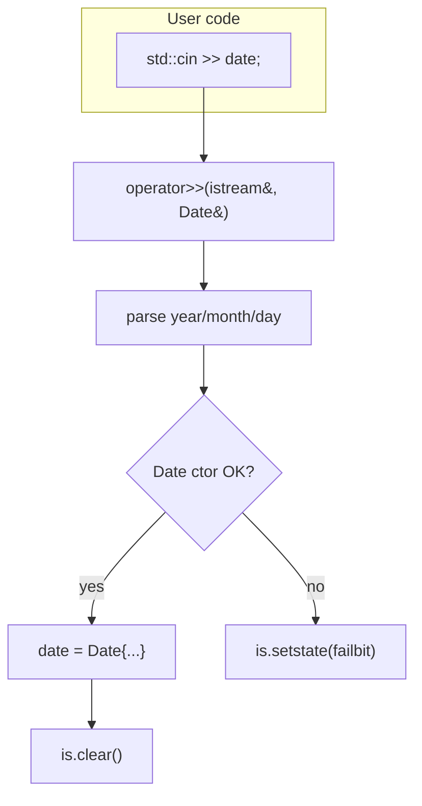

# Modern and Lucid C++ for Professional Programmers – Week 5: Classes and Operators

## Overview

* **Topic of this unit:** Classes, constructors, invariants, basic inheritance, and operator overloading (incl. stream operators) 
* **Lecturers:** Thomas Corbat, Felix Morgner 
* **Learning objectives:**

  * Implement your own value types with classes
  * Know the typical elements of a class (members, constructors, destructor, static members)
  * Separate class declaration (header) and implementation (source) correctly
  * Use access specifiers and class invariants sensibly
  * Use default / copy / move / converting / initializer-list constructors, defaulted & deleted members
  * Understand basic inheritance and visibility of base members
  * Overload comparison operators (including C++20 three-way comparison)
  * Implement `operator<<` and `operator>>` as free functions that cooperate with streams


## 1. Introduction / Context

Week 5 is where you start building **your own types** instead of just combining built-in ones. The lecture focuses on:

* What a **good class** looks like (single responsibility, invariant, small member functions).
* How to structure a class into **header** and **source** files with include guards.
* How to correctly implement **constructors**, including default, copy, move, converting, and initializer-list constructors.
* How to use **inheritance** to relate types.
* How to **overload operators**, especially comparisons and stream I/O, in a way that feels natural for users of your types. 

The running example is a `Date` class that encapsulates a calendar date and enforces “valid date” as its invariant.


## 2. Key Terms and Definitions

| Term                                 | Definition                                                                                                                                                                      |
| ------------------------------------ | ------------------------------------------------------------------------------------------------------------------------------------------------------------------------------- |
| **Class**                            | User-defined type bundling state (member variables) and behavior (member functions). Usually declared in a header file.                                                         |
| **Object / instance**                | A concrete value of a given class type; holds actual member variable values.                                                                                                    |
| **Class invariant**                  | Property that must hold for all properly constructed instances (e.g. `Date` always represents a valid date). Constructors must establish it; member functions must preserve it. |
| **Access specifier**                 | `public`, `protected`, `private`; controls visibility of members. Default: `private` for `class`, `public` for `struct`.                                                        |
| **Member variable (field)**          | Variable inside a class that stores part of the object’s state.                                                                                                                 |
| **Member function**                  | Function declared inside a class; has an implicit `this` pointer to the current object.                                                                                         |
| **Static member function**           | Member function without `this`; associated with the class, not a particular object. Called as `Class::function()`.                                                              |
| **Static data member**               | Variable shared by all instances of a class; defined once in a source file.                                                                                                     |
| **Default constructor**              | Constructor that can be called without arguments; either implicit or explicitly declared.                                                                                       |
| **Copy constructor**                 | Constructor taking `T const&` to create a new object as a copy of another.                                                                                                      |
| **Move constructor**                 | Constructor taking `T&&` to move resources from a temporary/expiring object.                                                                                                    |
| **Converting constructor**           | Constructor callable with a single argument of a different type; should usually be `explicit`.                                                                                  |
| **Initializer-list constructor**     | Constructor taking `std::initializer_list<T>`; used for `{...}` initialization (e.g. `std::vector v{1,2,3};`).                                                                  |
| **NSDMI**                            | Non-static data member initializer – default value for a member directly in the class definition (`int year{9999};`).                                                           |
| **Defaulted function**               | Special member declared with `= default;` to request the compiler-generated implementation.                                                                                     |
| **Deleted function**                 | Function declared with `= delete;` to forbid its use (e.g. deleted copy constructor).                                                                                           |
| **Operator overloading**             | Providing custom implementations for operators (e.g. `==`, `<`, `<<`, `>>`) for user-defined types.                                                                             |
| **Three-way comparison (`<=>`)**     | C++20 “spaceship operator” that returns an ordering category (`std::strong_ordering`, etc.) and gives `<, >, <=, >=` for free.                                                  |
| **Strong / weak / partial ordering** | Different comparison categories describing total order, case-insensitive order, or partially ordered sets (e.g. `double` with `NaN`).                                           |
| **Stream insertion / extraction**    | `operator<<` (output) and `operator>>` (input) for types; must be free functions taking streams by reference.                                                                   |


## 3. Main Content

### 3.1 Anatomy of a Class

A **good class** (slide *“A Good Class”*, page 8) 

* **Does one thing well** → high cohesion; name reflects its responsibility (`Date`, `Recipe`, `Counter`).
* Consists of **short member functions**, no deeply nested control structures.
* Has a **class invariant** (e.g. `Date` is always a valid calendar date).
* Constructors **establish** the invariant; all public members **preserve** it.
* Is easy to use without following a fragile protocol of calls in the right order.

Typical layout (see `Date.hpp` on page 9): 

```cpp
#ifndef DATE_HPP_
#define DATE_HPP_

class Date {
    int year, month, day;               // member variables

public:
    Date(int year, int month, int day); // constructors
    static auto isLeapYear(int year) -> bool;

private:
    auto isValidDate() const -> bool;   // private helper
};

#endif
```

* Header protected by an **include guard** using `#ifndef`, `#define`, `#endif` (page 10) to avoid multiple inclusion and ODR violations. 

**Access specifiers** (page 12):

* `private:` – internal details; default for `class`.
* `protected:` – private to the class and its subclasses.
* `public:` – interface, visible everywhere.

**Class vs. struct** (page 11):

* Only difference: default visibility (`class` = private, `struct` = public). Otherwise identical.

**Visualisation:**




### 3.2 Member Variables and Static Members

Member variables:

* Represent the **state** of the object.
* Should **not be `const`** in most value types, because that prevents copy assignment (slide 13). 
* Should not be used as hidden communication between member function calls; use parameters instead (avoids fragile usage protocols).

Static members (page 34): 

```cpp
class Date {
    static const Date myBirthday;
    static Date favoriteStudentsBirthday;
    static const Date today{2018, 10, 16};
    // ...
};
```

* Defined once in a source file:

```cpp
Date const Date::myBirthday{1964, 12, 24};
Date Date::favoriteStudentsBirthday{1995, 5, 10};
```

* Accessed as `Date::myBirthday` and `Date::favoriteStudentsBirthday`.


### 3.3 Constructors, Destructor, Defaults and Deletions

#### Basic constructor & invariant

Constructors should:

* Initialize all members (prefer initializer lists).
* Establish the **invariant**, or throw an exception if impossible (page 25). 

```cpp
Date::Date(int year, int month, int day)
: year{year}, month{month}, day{day} {
    if (!isValidDate()) {
        throw std::out_of_range{"invalid date"};
    }
}
```

**LaTeX: Date invariant example**

```latex
\[
1 \le \text{month} \le 12
\quad\land\quad
1 \le \text{day} \le \text{daysInMonth(year, month)}
\]
```

#### Special constructors (pages 15–19)

* **Default constructor**: no parameters; provided implicitly if no other ctors are declared. Must put object into a valid default state, often using a default date or NSDMIs. 
* **Copy constructor**: `Date(Date const&)`; usually defaulted by the compiler.
* **Move constructor**: `Date(Date&&)`; moves resources; covered in Advanced C++.
* **Converting constructor**: any constructor that can be called with a single argument of another type; should be marked `explicit` to avoid unwanted implicit conversions (see `Date(int year, int month = 1, int day = 1)` on page 18). 
* **Initializer-list constructor**: `Container(std::initializer_list<Element> elements);` – used for `{...}` syntax; implicit conversion from initializer list is typically desired (page 19).

The image on *page 19* contrasts `std::vector v(5, 10)` (size 5, all elements 10) with `std::vector v{5, 10}` (two elements: 5 and 10).

#### Destructor (page 20)

* Named `~ClassName()`.
* Responsible for releasing resources.
* Usually implicitly generated; you rarely need to write it explicitly if you use RAII correctly.
* **Must not throw.**

#### Default member initializers, defaulted and deleted functions

**NSDMI** (page 27): 

```cpp
class Date {
    int year{9999}, month{12}, day{31};
    // ...
};
```

* Used if not overridden in the initializer list.
* Avoids duplication across constructors that share defaults.

**Defaulted** functions (page 28):

```cpp
class Date {
    int year{9999}, month{12}, day{31};
public:
    Date() = default;              // behave like implicit default ctor
    Date(int year, int month, int day);
};
```

* Applies to default ctor, dtor, copy/move ctor, copy/move assignment.

**Deleted** functions (page 29):

```cpp
class Banknote {
    int value;
public:
    Banknote(Banknote const&) = delete;  // non-copyable
};
```

* Used to explicitly **forbid** certain operations (e.g. copying, default construction).
* Example on page 29 prevents forging banknotes by copying. 

#### Delegating constructors (page 30)

C++ constructors can call other constructors of the **same** or base class:

```cpp
class Date {
public:
    Date(int year, Month month, int day);
    Date(int year, int month, int day);
};

Date::Date(int year, int month, int day)
: Date{year, Month(month), day} {}
```

* Reduces duplication by centralizing initialization logic.


### 3.4 Member Functions, `const` and Static

**Member functions** (page 31):

* Have an implicit `this` pointer.
* Should be marked `const` when they do not modify the observable state.

```cpp
auto Date::isValidDate() const -> bool {
    if (day <= 0) {
        return false;
    }
    switch (month) {
        // ...
    }
}
```

* `this` is a pointer; `this->member` and `member` are equivalent inside the class.
* `const` member functions:

  * Cannot modify data members.
  * Can be called on `const` objects.
  * Can **call other const** member functions but not non-const ones (see “Right or Wrong?” example with `Document::print` on page 32). 

**Static member functions** (page 33):

```cpp
static auto isLeapYear(int year) -> bool;
```

* No `this`, cannot be `const`.
* Implemented without `static` keyword in the definition:

```cpp
auto Date::isLeapYear(int year) -> bool { /* ... */ }
```


### 3.5 Basic Inheritance

Page 21 shows a simple base/derived relationship: 

```cpp
class Base {
private:
    int onlyInBase;
protected:
    int baseAndInSubclasses;
public:
    int everyoneCanFiddleWithMe;
};

class Sub : public Base {
    // sees baseAndInSubclasses and everyoneCanFiddleWithMe
};
```

Key points:

* Base classes specified after the class name: `class Derived : public Base { ... };`
* Multiple inheritance is possible (`: Base1, Base2`).
* A visibility specifier (`public`, `protected`, `private`) for inheritance **limits** the maximum visibility of inherited members.
* Default inheritance visibility:

  * `class Derived : Base` → **private** inheritance.
  * `struct Derived : Base` → **public** inheritance.
* The “Right or Wrong?” example on page 24 shows that `class Car : Vehicle` inherits **privately** from `Vehicle`, so `car.location` is not accessible from outside. Correct would be `class Car : public Vehicle`. 


### 3.6 Operator Overloading Basics

Page 37 summarises **which operators can be overloaded** and the general form: 

```cpp
auto operator op(<parameters>) -> <returntype>;
```

* Use only when the semantics are **natural** and unsurprising.
* Rule of thumb: *“When in doubt, do as the `int`s do.”* (Scott Meyers).

Overloadable operators include arithmetic, comparison, assignment, indexing, call, increment/decrement, and `<<` / `>>`. Non-overloadable: `::`, `.*`, `.`, `?:`, etc.


### 3.7 Comparisons: Equality, Ordering, Spaceship

#### C++20 three-way comparison `<=>` (page 39–40)

For `Date`:

```cpp
#include <compare>

class Date {
    int year, month, day;
public:
    auto operator<=>(Date const& right) const -> std::strong_ordering {
        if (year != right.year) {
            return year <=> right.year;
        }
        if (month != right.month) {
            return month <=> right.month;
        }
        return day <=> right.day;
    }

    auto operator==(Date const& right) const -> bool {
        return (*this <=> right) == std::strong_ordering::equal;
    }
};
```

* Once `<=>` and `==` are defined, the compiler can generate `<, >, <=, >=, !=` automatically.

Or let the compiler generate `<=>` and `==` entirely (page 40): 

```cpp
class Date {
    int year, month, day;
public:
    auto operator<=>(Date const& right) const = default;
};

class Point {
    int x, y;
public:
    auto operator==(Point const& right) const = default;
};
```

**Ordering categories** (pages 44–46):

* `std::strong_ordering` – total order, equal values indistinguishable (e.g. `int`, `Date`).
* `std::weak_ordering` – total order but “equivalent” values might be distinguishable (e.g. case-insensitive string comparison).
* `std::partial_ordering` – some pairs are unordered (e.g. `double` with `NaN`).

#### Pre-C++20 style (pages 41–43)

Equality:

```cpp
auto operator==(Date const& right) const -> bool {
    return year == right.year && month == right.month && day == right.day;
}

auto operator!=(Date const& right) const -> bool {
    return !(*this == right);
}
```

Relational:

```cpp
auto operator<(Date const& right) const -> bool {
    return year < right.year ||
           (year == right.year && (month < right.month ||
           (month == right.month && day < right.day)));
}

auto operator>(Date const& right) const -> bool { return right < *this; }
auto operator>=(Date const& right) const -> bool { return !(*this < right); }
auto operator<=(Date const& right) const -> bool { return !(right < *this); }
```

Or split into member `<` and all other comparison operators as **free** operators (page 43).


### 3.8 Stream Operators and I/O-Friendly Classes

#### Output: `operator<<` (page 47)

* Must be a **free function**, not a member of `Date`.
* Typical pattern: member `print()` + free `operator<<`.

```cpp
class Date {
    int year, month, day;
public:
    auto print(std::ostream& os) const -> void {
        os << year << "/" << month << "/" << day;
    }
};

inline auto operator<<(std::ostream& os, Date const& date) -> std::ostream& {
    date.print(os);
    return os;
}
```

This allows:

```cpp
std::cout << Date::myBirthday;
```

as shown in the example on page 47. 

#### Input: `operator>>` (page 48)

* Also a **free function**, taking `std::istream&` and a **non-const** reference to the object (to modify it).

```cpp
inline auto operator>>(std::istream& is, Date& date) -> std::istream& {
    int year{-1}, month{-1}, day{-1};
    char sep1{}, sep2{};
    is >> year >> sep1 >> month >> sep2 >> day;
    try {
        date = Date{year, month, day}; // may throw if invalid
        is.clear();                    // reset error state if construction succeeded
    } catch (std::out_of_range const&) {
        is.setstate(std::ios::failbit);  // signal input failure
    }
    return is;
}
```

* Reading uses a temporary `Date` constructor; invariants enforced in the constructor.
* If construction fails, the stream’s **failbit** is set to signal bad input.

Example usage (page 48):

```cpp
auto readDate() -> Date {
    Date date{};
    std::cin >> date;
    return date;
}
```

#### SwissGrid example (page 49)

* `SwissGrid::read(std::istream&)` members reads two doubles and constructs a temporary `SwissGrid`.
* On invalid coordinates, the constructor throws; `read` catches and sets `failbit`.
* Free `operator>>` simply calls `coordinate.read(in)`.

This pattern is the recommended way to connect classes with I/O while keeping parsing logic inside the class.

**Visualisation:**




## 4. Relationships and Interpretation

* **Class design** (access specifiers, invariants, short methods) and **constructors** work together to ensure every instance is always valid.
* **NSDMIs**, delegating constructors, and `= default`/`= delete` reduce boilerplate and express allowed operations directly in the type.
* **Inheritance** allows reusing state and behavior, but visibility of base members depends on the inheritance mode (`public` vs. `private`).
* **Operator overloading** integrates your types with the rest of the language:

  * `==`, `<`, `<=>` make them usable in algorithms and associative containers.
  * `<<`, `>>` let your types participate naturally in stream I/O.
* Using **constructors + exceptions** for invariants and **stream states** for I/O errors keeps logic and error handling consistent across your codebase. 


## 5. Examples and Applications

* `Date` as a robust value type:

  * Invariant: always a valid calendar date.
  * Constructors validate and throw on invalid values.
  * Static helper `isLeapYear`.
  * Overloaded comparison operators and stream I/O.

* `Recipe` and `cook()` (page 24):

  * Uses `std::initializer_list<Step>` to easily construct a `Recipe` from `{step1, step2, ...}`.

* `Vehicle` / `Car` (page 24):

  * Demonstrates that `class Car : Vehicle` is private inheritance; correct design uses `public` to expose base interface.

* `Counter` and `Document` examples (page 32):

  * Show correct & incorrect uses of `const` and calling between const/non-const members.

* `Banknote` with deleted copy ctor (page 29):

  * Encodes “no copying” directly in the type for security/semantics.

* `Chair` with defaulted legs (page 35):

  * Showcases constructor with default argument and invariant check (`legs >= 1`).

* `SwissGrid` (page 49):

  * Demonstrates how to implement robust input operators by delegating to a member `read` function and using exceptions + stream state properly.


## 6. Summary / Takeaways

* A **good class** has a single responsibility, a clear invariant, and short, readable member functions.
* Separate **declaration** (header) from **implementation** (source) and protect headers with include guards.
* Constructors must initialize all members and enforce invariants; they may throw if they can’t establish a valid state.
* Use NSDMIs, delegating constructors, and `= default` / `= delete` to express default behavior and forbidden operations clearly.
* Use `const` correctly:

  * Mark read-only members as `const`.
  * Don’t call non-const members from const ones.
* Inheritance is powerful but subtle; be explicit about `public` vs. `private` inheritance.
* Overload operators only with natural semantics; C++20 `<=>` and defaulted comparisons simplify implementing ordering.
* Implement `operator<<` and `operator>>` as **free functions** that call member functions and integrate with stream state correctly.


## 7. Study Hints

* Take a small data concept (e.g. `Time`, `Money`, `Point3D`) and design it as a class:

  * Define an invariant and enforce it in constructors.
  * Add read-only getters and a small set of meaningful operations.
  * Implement `==`, `<=>` (or `<`+`==` pre-C++20), `operator<<`, and maybe `operator>>`.

* Practice with special members:

  * Add NSDMIs and a default constructor.
  * Experiment with `= default` and `= delete` for copy/move operations.

* Take existing structs and refactor:

  * Separate into header/source.
  * Introduce access specifiers and make data private.
  * Add const-correct member functions.

* Implement and test stream operators:

  * Write `operator<<` and `operator>>` for `Date` or `SwissGrid`-like types.
  * Feed invalid input and check that the stream `failbit` is set.

* Revisit Week 4 tests:

  * Add Catch2 tests that verify `operator==`, `<`, and `<=>` behave as expected.
  * Add tests for reading and printing your class.


## 8. Extensions / Further Concepts

Week 5 is the foundation for more advanced topics:

* RAII and resource-managing classes (smart pointers, file handles).
* Full move semantics and custom move constructors/assignment.
* Advanced inheritance patterns (virtual inheritance, diamond problems).
* More operator overloads (arithmetic, indexing, function call).
* User-defined literals and strong typedefs (e.g. `Meters`, `Kilograms`).
* Exception safety guarantees for classes (basic/strong/no-throw).

A solid grasp of class structure, invariants, and operators from this week is essential for building robust, idiomatic C++ code later. 


## 9. References & Literature (IEEE)

[1] ISO/IEC, *Programming Languages — C++ (ISO/IEC 14882:2020)*, International Organization for Standardization, 2020.

[2] B. Stroustrup, *The C++ Programming Language*, 4th ed., Addison-Wesley, 2013.

[3] N. M. Josuttis, *The C++ Standard Library: A Tutorial and Reference*, 2nd ed., Addison-Wesley, 2012.

[4] Lecture slides “Modern and Lucid C++ for Professional Programmers – Week 5 – Classes and Operators”, OST – Ostschweizer Fachhochschule, HS2025. 
