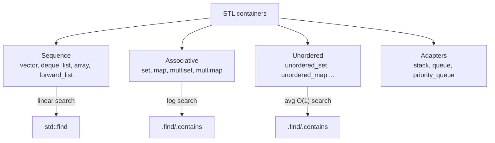
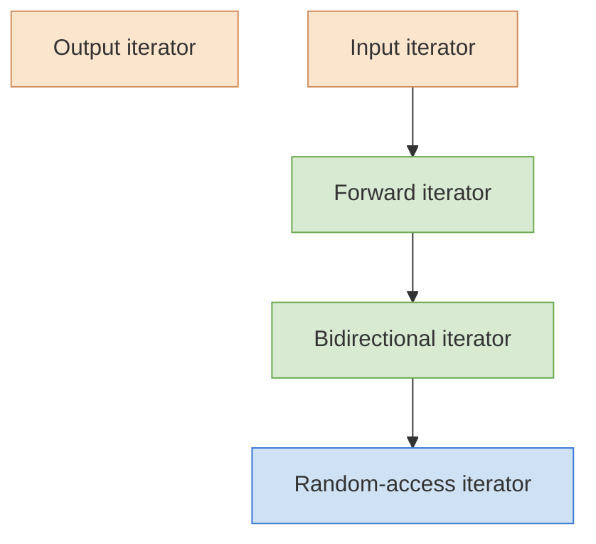

# Modern and Lucid C++ for Professional Programmers – Week 7: STL Containers & Iterators

## Overview

* **Topic of the unit:** STL containers (sequences, associative & hashed containers) and iterator categories 
* **Lecturers:** Thomas Corbat, Felix Morgner 
* **Learning objectives:**

  * Know the properties of the different standard containers
  * Choose a suitable container category for a given task
  * Distinguish iterator categories (input, forward, bidirectional, random access, output)
  * Explain the difference between `const Iterator` and `const_iterator` 


## 1. Introduction / Context

After namespaces and enums (week 6), week 7 focuses on **data structures in the standard library**:

* What container types exist (sequence, associative, hashed)?
* What are their complexity guarantees for key operations?
* How do containers interact with **iterators** and algorithms?
* Which iterator categories exist and which algorithms require which category (e.g. `std::sort`)? 

The goal: pick the **right container** and understand what your iterators can and cannot do.


## 2. Key Terms and Definitions

| Term                                                         | Definition                                                                                                                                                         |
| ------------------------------------------------------------ | ------------------------------------------------------------------------------------------------------------------------------------------------------------------ |
| **Sequence container**                                       | Container whose elements form a sequence in a defined order (typically insertion order), e.g. `std::vector`, `std::deque`, `std::list`, `std::array`.              |
| **(Sorted) associative container**                           | Tree-based containers (`std::set`, `std::map`, `std::multiset`, `std::multimap`) whose elements are stored sorted by key; search in O(log n).                      |
| **Hashed container**                                         | `std::unordered_set`, `std::unordered_map`, etc.; access via hash table, average O(1) `find`, no ordering.                                                         |
| **Container API**                                            | Common core interface: `begin/cbegin`, `end/cend`, `size`, `empty`, `insert`, `erase`, `clear`, plus constructors from count, initializer list, or iterator range. |
| **Adapter**                                                  | Wrapper that restricts operations of an underlying container (e.g. `std::stack`, `std::queue`, `std::priority_queue`).                                             |
| **Input / Forward / Bidirectional / Random-access iterator** | Iterator categories with increasing capabilities: read once → read+write → forward+backward → also jump/index.                                                     |
| **Output iterator**                                          | Write-only iterator (e.g. `std::ostream_iterator`); only `*it = value; ++it;`.                                                                                     |
| **`const_iterator`**                                         | Iterator type whose dereference yields a **const reference**; you cannot modify the element through it.                                                            |
| **`const Iterator`**                                         | A constant variable *of* an iterator type; the iterator itself cannot be changed (`++` forbidden), but the element (if non-const) can.                             |


## 3. Main Content

### 3.1 Container Categories & Common API

**Container families** (slide 8):

* **Sequence containers**

  * Elements in a logical linear order.
  * No intrinsic fast key lookup; search with `std::find` → O(n). 
* **Associative containers (tree-based)**

  * Internally ordered balanced trees (usually red–black trees).
  * Member `.find` and `.contains` (C++20) in O(log n). 
* **Hashed containers**

  * Buckets + hash function.
  * `.find` and `.contains` average O(1), worst-case O(n); no ordering. 

**Common API** (slides 9–11):

* Iteration:

  * `begin()/end()`, `cbegin()/cend()` for loops and algorithms.
* Size:

  * `size()`, `empty()`.
* Modification:

  * `insert`, `erase`, `clear`. 
* Construction:

  * Initializer list: `std::vector<int> v{1, 2, 3};`
  * Count + value: `std::list<int> l(5, 42);`
  * Iterator range: `std::deque<int> q{cbegin(v), cend(v)};` 

**Visualization:**




### 3.2 Sequence Containers & Adapters

#### `std::array` (slide 14)

* Fixed size, known at compile time.
* Stack-allocated, no dynamic growth/shrink.
* Supports full container API (unlike raw C arrays). 

```cpp
#include <array>

std::array values{1, 1, 2, 3, 5, 8};  // CTAD
int obsolete[]{1, 1, 2, 3, 5, 8};     // C-style array – avoid
```

#### `std::vector<T>` & `std::deque<T>` (slides 13, 15)

* **`std::vector<T>`**

  * Dynamic array, contiguous storage, random-access iterators.
  * Efficient `push_back`, good cache behavior.
* **`std::deque<T>`**

  * Sequence of blocks, still random-access iterators.
  * Efficient `push_front` and `pop_front` in addition to `push_back`. 

Both have a special, bit-packed specialization for `bool`.

#### `std::list<T>` (doubly-linked list, slide 16)

* Efficient insertion/removal **anywhere** once you have the iterator.
* Only **bidirectional** iterators; **no** index operator `[]`.
* Some algorithms provided as **member functions**:

  * `list::sort()`, `list::merge()`, etc. – because generic algorithms like `std::sort` require random-access iterators. 

**Wrong median example** (slide 22):

```cpp
auto median(std::list<int>& values) -> int {
    if (values.empty()) {
        throw std::invalid_argument{"empty..."};
    }
    sort(begin(values), end(values));        // WRONG: std::sort requires random access
    return values[values.size() / 2];        // WRONG: no operator[]
}
```

Correct approach for `std::list` would be:

* `values.sort();` (member function), then
* move an iterator to the middle.

#### `std::forward_list<T>` (slide 17)

* Singly-linked list, **forward iterators only**.
* Insertion only *after* a given position (`insert_after`).
* Search/removal awkward → usually avoid; prefer `std::list` or `std::vector` except for special low-level use cases. 

#### Adapters: `std::stack`, `std::queue`, `std::priority_queue` (slides 18–20)

* **`std::stack<T>`**

  * LIFO adapter over `std::deque<T>` (by default).
  * Only `push`, `pop`, `top`, `empty`, `size`; no iteration. 
* **`std::queue<T>`**

  * FIFO adapter over `std::deque` or `std::list`.
  * `push`, `pop`, `front`, `back`.
* **`std::priority_queue<T>`**

  * Heap-based; `top()` always returns the largest (default) element.
  * Internally uses `std::vector` and `std::make_heap`/`push_heap`/`pop_heap`.

Example (slide 21): feeding words `"Fall leaves after leaves fall"` into

* a stack → output reversed (`fall leaves after leaves Fall`),
* a queue → output in original order (`Fall leaves after leaves fall`).


### 3.3 Sorted Associative Containers (Tree-based)

**Overview** (slide 24):

* Unique keys:

  * `std::set<T>`, `std::map<K,V>`
* Non-unique keys:

  * `std::multiset<T>`, `std::multimap<K,V>`

All are ordered according to a comparator (default: `<`). 

#### `std::set<T>` (slides 25–26)

* Sorted set of keys (no duplicates).
* Iteration yields sorted keys.
* Key elements are **const**: you must not modify them via iterators (would break invariants).
* Efficient membership test:

  * `s.find(x)`, `s.count(x)`, C++20: `s.contains(x)`. 

Example: filter vowels (slide 26)

```cpp
std::set const vowels{'a', 'e', 'o', 'u', 'i', 'y'};
char c{};
while (in >> c) {
    if (!vowels.contains(c)) {
        out << c;
    }
}
```

#### `std::map<K,V>` (slides 27–29)

* Sorted associative array mapping keys to values.
* Iterator element type: `std::pair<Key const, Value>`.
* Preferred check from C++20:

```cpp
if (m.contains(key)) { /* ... */ }
```

`operator[]`:

```cpp
std::map<std::string, std::size_t> occurrences{};
++occurrences[str];  // inserts str with value 0 if missing, then increments
```

Example word counting (slide 29):

```cpp
std::istream_iterator<std::string> inputBegin{in}, inputEnd{};
for_each(inputBegin, inputEnd, [&occurrences](auto const& str) {
    ++occurrences[str];
});
```

#### `std::multiset` and `std::multimap` (slides 30–31)

* Allow multiple elements with the same key.
* Iterate over all equal keys via:

  * `auto [first, last] = m.equal_range(key);`
  * or `lower_bound(key)` / `upper_bound(key)`. 

Example `sortedStringList` groups identical strings on the same line by using `upper_bound` to find the end of each equal-key range.

**Right or Wrong?** (slide 32):

* `std::map<double, std::string>` with `NaN` keys → **problematic**:

  * `NaN` makes all comparisons false; tree invariants break.
* `incrementAll(std::set<int>&)` that increments each element by writing through iterators → **wrong**:

  * modifying keys in a set violates ordering; not allowed by the standard.


### 3.4 Hashed Containers: `std::unordered_set` / `std::unordered_map`

**General** (slides 34–36):

* Implement hash tables:

  * average O(1) lookup/insert/erase,
  * no defined iteration order.
* `std::hash<T>` is provided only for built-in types and some library types (`std::string`, etc.).
* Hash functions for user-defined types must be carefully implemented to avoid poor performance or collisions. 

Example `unordered_set` (slide 35):

```cpp
std::unordered_set<char> const vowels{'a', 'e', 'i', 'o', 'u'};
remove_copy_if(in{std::cin}, in{}, out{std::cout},
               [&](char c) { return vowels.contains(c); });
```

Example `unordered_map` (slide 36):

```cpp
std::unordered_map<std::string, int> words{};
std::string s{};
while (std::cin >> s) {
    ++words[s];
}
for (auto const& p : words) {
    std::cout << p.first << " = " << p.second << '\n';
}
```

* Similar to `std::map`, but output order is undefined. 


### 3.5 Iterator Categories

Slides 38–43 define the capabilities of each iterator category. 

**Visualization:**



* **Input iterator**

  * Read-only, single-pass.
  * `*it` yields a value; copies of the iterator must not be reused after advancing.
  * Models `std::istream_iterator`. 

* **Forward iterator**

  * Like input, but:

    * multi-pass (copies remain valid),
    * dereference yields `T&` so you can modify elements.
  * Models `std::forward_list` and many other containers.

* **Bidirectional iterator**

  * Like forward, plus `--it` / `it--`.
  * Used by `std::list`, `std::set`, `std::map`, etc.

* **Random-access iterator**

  * Like bidirectional, plus:

    * arithmetic: `it + n`, `it - n`, `it[n]`,
    * comparisons: `<`, `>`, `<=`, `>=`.
  * Models `std::vector`, `std::deque`, `std::array`. 

* **Output iterator**

  * Write-only: `*it = value; ++it;`.
  * No reading or multi-pass guarantee.
  * Models `std::ostream_iterator`, `std::back_inserter`.

**Why categories matter** (slide 44):

* Some algorithms **require** a certain category:

  * `std::sort` → random-access only.
* Some can do better when more power is available:

  * `std::distance`, `std::advance` can be O(1) for random-access, O(n) for others. 


### 3.6 Iterator Helpers & `const_iterator` vs `const Iterator`

#### `std::distance`, `std::advance`, `std::next`, `std::prev` (slides 45–46)

* `std::distance(first, last)`:

  * Number of steps from `first` to `last`.
  * O(1) for random-access, O(n) in general.
* `std::advance(it, n)`:

  * Mutates `it` to move n steps (negative allowed only for bidirectional).
  * Returns `void`.
* `std::next(it, n)` / `std::prev(it, n)`:

  * Return a moved **copy** of `it` without changing the original. 

Example (slide 46):

* `current` points to some element, `afterNext = std::next(current);`
* Later `std::advance(current, 1);` moves `current`; `afterNext` stays where it was.

#### Manual iterator loops (slide 47)

```cpp
std::vector v{3, 1, 4, 1, 5, 9, 2, 6};
for (auto it = cbegin(v); it != cend(v); ++it) {
    std::cout << *it << " is " << ((*it % 2) ? "odd" : "even") << '\n';
}
```

* Use `cbegin`/`cend` for read-only loops.
* Use `begin`/`end` when you want to modify elements. 

#### `const_iterator` vs `const Iterator` (slide 48)

```cpp
std::vector<int> values{3, 1, 4, 1, 5, 9, 2, 6};

auto const iter1 = values.begin();   // iter1 is const (iterator variable)
++iter1;                             // ERROR – cannot increment const variable

auto iter2 = values.cbegin();        // iter2 is const_iterator
*iter2 = 2;                          // ERROR – cannot change element through const_iterator
```

* `const_iterator` → **element** is read-only, iterator variable is mutable.
* `Iterator const` → iterator variable is constant, element may be mutable.

#### Input iterator pitfall (slide 49)

```cpp
using InIter = std::istreambuf_iterator<char>;

auto last(std::istream& in) -> std::optional<char> {
    InIter current{in}, eof{}, previous{};
    while (current != eof) {
        previous = current++;  // BAD for input iterators
    }
    if (previous != eof) {
        return *previous;
    }
    return {};
}
```

* For input iterators, after incrementing `current`, **copies** like `previous` are not guaranteed to remain valid.
* This can exhibit undefined behavior; a correct solution would need to keep the last character explicitly, not via an old iterator. 


## 4. Relationships and Interpretation

* **Containers** + **iterators** + **algorithms** form the STL triad:

  * Containers hold data,
  * Iterators describe positions/ranges,
  * Algorithms operate on ranges defined by iterators.
* Container **category** influences:

  * Efficiency of `insert`, `erase`, `find`,
  * Whether the container is sorted or not,
  * Memory layout and cache friendliness.
* **Iterator category** determines:

  * Which algorithms can be used (e.g. `std::sort` vs. `list::sort`),
  * How efficient helper functions like `distance`/`advance` can be.
* The `const_iterator` vs `const Iterator` distinction mirrors pointer semantics:

  * `T const*` vs `T* const` – const data vs const pointer.


## 5. Examples and Applications

* **Median computation**:

  * For `std::vector<int>`: `std::sort` + index-based median.
  * For `std::list<int>`: `list::sort` + iterator arithmetic.
* **Word counting**:

  * `std::map<std::string, size_t>` for ordered result.
  * `std::unordered_map<std::string, int>` for faster lookup, unordered output.
* **Filtering vowels**:

  * `std::set<char>` or `std::unordered_set<char>` combined with `remove_copy_if`.
* **Grouping duplicate strings**:

  * `std::multiset<std::string>` and `equal_range` to print duplicates together.
* **Input-iterator exercise**:

  * Using `std::istream_iterator<int>` to read all numbers from input into a `std::vector<int>` via `std::copy` and `std::back_inserter`.


## 6. Summary / Takeaways

* The standard library offers a **rich set of containers** with similar APIs that integrate seamlessly with algorithms. 
* Choose containers based on:

  * **Access pattern** (index vs key),
  * **Ordering needs** (sorted vs hash),
  * **Performance** (O(1)/O(log n)/O(n)).
* Use container **member functions** when they are more appropriate than generic algorithms (e.g. `set::find`, `list::sort`).
* **Iterator categories** are crucial for correctness and performance; know which category your container provides.
* `const_iterator` makes *elements* read-only; `const Iterator` makes the *iterator variable* unmodifiable.
* **Input iterators** are single-pass; after incrementing one, you cannot safely use old copies.


## 7. Study Hints

* Implement small programs solving the same task with different containers:

  * `std::vector` vs `std::list` vs `std::set` vs `std::unordered_set`.
* For each container, answer:

  * What is the big-O for `insert`, `erase`, `find`?
  * Which member functions replace generic algorithms?
* Practice iterator categories:

  * For each container: what iterator type does it provide?
  * Can you `std::sort` it? Can you `std::advance(it, -3)`?
* Start with manual loops and progressively replace them with algorithms:

  * `std::copy`, `std::for_each`, `std::remove_if`, `std::accumulate`, …
* Use `const_iterator` in functions that should not modify the container but still traverse it.


## 8. Extensions / Further Concepts

* C++20 **ranges** (`std::ranges`) for more expressive algorithms and lazy views (filter, transform, take/drop).
* Specialized containers:

  * `std::bitset`, `std::array` for fixed-size, compile-time-friendly structures.
* Custom **hash functions** for `std::unordered_*` with user-defined types.
* **Iterator adapters** and views (transform, filter, zip).
* Relationship between container operations, iterators, and **exception safety** (e.g. reallocation of `std::vector` and invalidated iterators).


## 9. References & Literature (IEEE)

[1] ISO/IEC, *Programming Languages — C++ (ISO/IEC 14882:2020)*, International Organization for Standardization, 2020.

[2] N. M. Josuttis, *The C++ Standard Library: A Tutorial and Reference*, 2nd ed., Addison-Wesley, 2012.

[3] cppreference.com, “Containers” and “Iterators” – online reference for the C++ standard library, accessed: [reader’s current date].

[4] T. Corbat, F. Morgner, *Modern and Lucid C++ for Professional Programmers – Week 7 – STL Containers & Iterators*, OST – Ostschweizer Fachhochschule, HS2025. 
