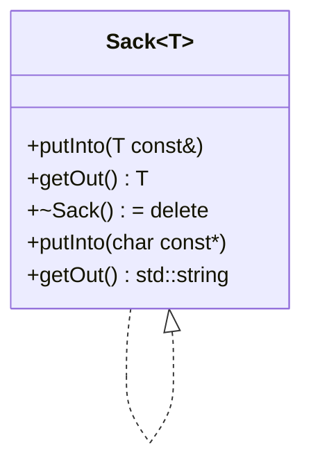
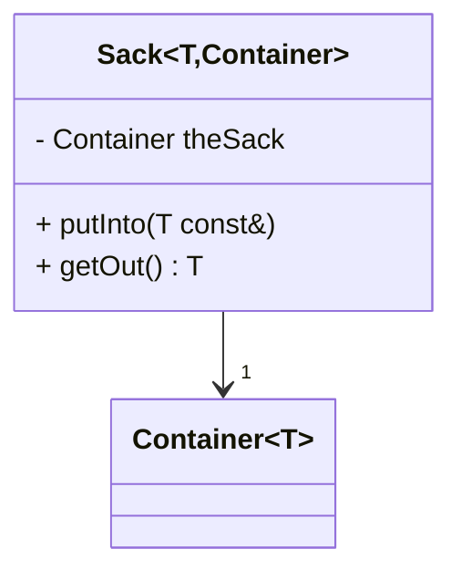

# Modern and Lucid C++ for Professional Programmers – Week 10: Class Templates

## Overview

* **Topic of this unit:** Class templates, dependent names, specialization, adapting standard containers, deduction guides, template-template and non-type parameters 
* **Lecturers:** Thomas Corbat, Felix Morgner 
* **Learning objectives:**

  * Implement generic data types using class templates
  * Understand and handle dependent names inside templates
  * Use class template specializations (partial and explicit) to change behaviour
  * Combine class and function templates to extend functionality
  * Use class template argument deduction and deduction guides
  * Apply template-template parameters and non-type template parameters


## 1. Introduction / Context

After **function templates** (Week 9), Week 10 extends generic programming to **classes**:

* You can parameterise **types** themselves (e.g. `std::vector<T>`).
* Class templates enable **compile-time polymorphism**: one class definition, many instantiations.
* You must deal with:

  * *dependent names* (names that depend on template parameters),
  * tricky name lookup when inheriting from templates,
  * specialisations for certain template arguments.
* The running example is a `Sack<T>` class – a simple container built on top of `std::vector<T>`, gradually extended to support pointers, other containers, deduction, etc. 


## 2. Key Terms and Definitions

| Term                                         | Definition                                                                                                                                          |
| -------------------------------------------- | --------------------------------------------------------------------------------------------------------------------------------------------------- |
| **Class template**                           | A blueprint for a family of classes parameterised by template parameters (usually types), e.g. `template<typename T> class Sack;`.                  |
| **Template parameter**                       | Placeholder used inside a template; can be a type (`typename T`), a non-type value (e.g. `std::size_t N`), or a template itself.                    |
| **Template instantiation**                   | The concrete class produced when a template is used with particular arguments, e.g. `Sack<int>`.                                                    |
| **Dependent name**                           | A name that depends on a template parameter, e.g. `typename SackType::size_type`. The compiler needs help to know whether it names a *type* or not. |
| **Type alias / alias template**              | `using Name = Type;` or `template<typename T> using Alias = Something<T>;` – more readable names and single point of change.                        |
| **Specialization**                           | Replacement of a primary template for some arguments. Partial: still has template parameters; explicit: fully concrete (no template parameters).    |
| **Template-template parameter**              | Template parameter that itself is a template, e.g. `template<typename...> typename Container`.                                                      |
| **Non-type template parameter**              | Template parameter that is a compile-time value, e.g. `std::size_t N` in `std::array<T, N>`.                                                        |
| **Class template argument deduction (CTAD)** | Since C++17, ability of the compiler to deduce template arguments for class templates from constructor arguments.                                   |
| **Deduction guide**                          | A declaration that tells the compiler how to deduce template arguments for a class template from constructor parameter types.                       |
| **Variable template**                        | Template for variables/values, e.g. `template<typename T> constexpr T pi = T(3.14);`.                                                               |


## 3. Main Content

### 3.1 Class Templates: Basics and Syntax

A **class template** is introduced similar to a function template:

```cpp
template <typename T>
class Sack {
    using SackType = std::vector<T>;
    using size_type = typename SackType::size_type;

    SackType theSack{};
public:
    auto empty() const -> bool { return theSack.empty(); }
    auto size()  const -> size_type { return theSack.size(); }

    auto putInto(T const& item) -> void {
        theSack.push_back(item);
    }

    auto getOut() -> T;  // defined out-of-line
};
```

Key points: 

* `T` is a **type parameter**; all uses of `T` become concrete types in each instantiation (`Sack<int>`, `Sack<std::string>`, …).
* `SackType` and `size_type` are **type aliases**; `size_type` uses `typename` because it’s a **dependent type**.
* Member functions can be defined **outside** the class template:

```cpp
template <typename T>
auto Sack<T>::getOut() -> T {
    if (empty()) {
        throw std::logic_error{"Empty Sack"};
    }
    auto index = static_cast<size_type>(std::rand() % size());
    T retval{theSack.at(index)};
    theSack.erase(theSack.begin() + index);
    return retval;
}
```

Rules (slide 18): 

* Class template definitions belong in **headers**.
* Member functions:

  * either defined **inline** in the class,
  * or as **inline** function templates in the same header.
* Static data members *of a class template* may be defined in headers; since C++17 they can be declared `inline` right in the class.

Example static member template:

```cpp
template <typename T>
struct StaticMember {
    inline static int member{sizeof(T)};
};
```


### 3.2 Dependent Names and `typename` / `template`

Inside a class template, many names *depend on template parameters*, e.g.:

```cpp
template <typename T>
class Sack {
    using SackType  = std::vector<T>;
    using size_type = typename SackType::size_type; // note 'typename'
    SackType theSack{};
};
```

* `SackType` depends on `T`, so `SackType::size_type` is a **dependent name**.
* The compiler cannot know whether `SackType::size_type` is a type or a static member variable; we must write `typename` to say it’s a **type**. 

More generic example:

```cpp
template <typename T>
void accessTsMembers() {
    typename T::MemberType m{};    // type
    T::StaticMemberFunction();     // function/variable
    T::StaticMemberVariable;       // variable
}
```

There is also a `template` keyword for dependent names that are themselves templates (not used in detail here).

**Concept for `Sack<T>`** (slide 16): from the usage we can infer:

* `T` must be **copyable** and **assignable** (required by `std::vector<T>` and by `T retval{...}`).
* `T` must be default-constructible if `Sack` ever default-constructs `T` (here it's only stored/copied, which is fine). 

**Rule of thumb:** whenever something looks like `SomeTemplate<T>::something` and you use it as a type, write `typename` in front, or factor it into a `using` alias.


### 3.3 Static Members in Class Templates

`StaticMember<T>` example (slide 19): 

Header:

```cpp
template <typename T>
struct StaticMember {
    inline static int member{sizeof(T)};
};
```

Source files:

```cpp
// setMemberTo42.cpp
#include "staticMember.hpp"

auto setMemberTo42() -> int {
    using MemberType = StaticMember<int>;
    MemberType::member = 42;
    return MemberType::member;
}

// main.cpp
#include "staticMember.hpp"
#include <iostream>

auto setMemberTo42() -> int;

auto main() -> int {
    std::cout << StaticMember<double>::member << '\n';
    std::cout << StaticMember<int>::member    << '\n';
    std::cout << setMemberTo42()              << '\n';
    std::cout << StaticMember<int>::member    << '\n';
}
```

Output (platform dependent `sizeof`):

1. `sizeof(double)` (e.g. `8`) – `StaticMember<double>::member`
2. `sizeof(int)` (e.g. `4`) – default initialisation
3. `42` – after `setMemberTo42()`
4. `42` – same static member seen in `main`

`inline static` ensures there is a single shared `member` per `T` across translation units.


### 3.4 Class Templates and Inheritance: Name Lookup Gotchas

Example (slide 20): 

```cpp
template <typename T>
struct Parent {
    auto foo() const -> int { return 42; }
    static int const bar{43};
};

auto foo() -> int { return 1; }
double const bar{3.14};

template <typename T>
struct Gotchas : Parent<T> {
    auto demo() const -> std::string {
        std::ostringstream result{};
        result << bar          << " bar\n";
        result << this->bar    << " this->bar\n";
        result << Gotchas::bar << " Gotchas::bar\n";
        result << foo()        << " foo()\n";
        result << this->foo()  << " this->foo()\n";
        result << Gotchas::foo() << " Gotchas::foo()\n";
        return result.str();
    }
};
```

Prints:

* `3.14 bar` – unqualified `bar` finds the **global** `bar`.
* `43 this->bar` – `this->bar` finds `Parent<T>::bar`.
* `43 Gotchas::bar` – class scope resolves to `Parent<T>::bar`.
* `1 foo()` – unqualified `foo` finds the **global** `foo`.
* `42 this->foo()` & `42 Gotchas::foo()` – member function from `Parent<T>`.

**Important rule (slide 21):**

> In template classes that inherit, always use `this->` or `Base::` to access inherited members.

Otherwise, due to how **dependent base classes** and name lookup work, the compiler may not find the inherited names when compiling the template definition; they are only considered during instantiation, causing confusing errors.


### 3.5 Template Pitfalls and Specialization

#### Pitfall: Dependent name without `typename`

Right-or-wrong (slide 22):

```cpp
template <typename T>
class Sack {
    using SackType = std::vector<T>;
    using size_type = SackType::size_type;  // WRONG
    SackType theSack{};
};
```

`size_type` is a **dependent type**; must be:

```cpp
using size_type = typename SackType::size_type;
```

#### Pitfall: Using members that don’t exist yet

```cpp
template <typename T>
struct Wrapper {
    T wrapped{};
    auto set(T const& value) -> void {
        wrapped.release();   // OK in template definition
        wrapped = value;
    }
};
Wrapper<int> wrapper{};
```

* This compiles because the template body isn’t checked against `int` until instantiation.
* As soon as you call `wrapper.set(...)`, instantiation fails: `int` has no `release()` member.
* **Unused templates** can contain ill-formed code that only surfaces when they are instantiated. 


### 3.6 Class Template Specialization (Partial & Explicit)

We want to handle **pointers** specially for `Sack<T>` (slide 23):

* `Sack<int*>` should **not** be allowed (raw owning pointers are dangerous).
* `Sack<char const*>` should **store strings** safely (e.g. as `std::string`).

This is done via **partial** and **explicit specialisation** (slide 24):

```cpp
template <typename T>
struct Sack;          // primary template

template <typename T>
struct Sack<T*>;      // partial specialization declaration

template <>
struct Sack<char const*>;  // explicit specialization declaration
```

**1) Partial specialization to forbid `Sack<T*>`** (slide 25):

```cpp
template <typename T>
struct Sack<T*> {
    ~Sack() = delete;   // deleted destructor
};
```

* A type with a deleted destructor cannot be destroyed (except by weird raw `new` tricks).
* That effectively prevents safe creation and usage of `Sack<T*>` for non-`char const*` pointers.

**2) Explicit specialization for `Sack<char const*>`** (slide 26): 

```cpp
template <>
class Sack<char const*> {
    using SackType  = std::vector<std::string>;
    using size_type = SackType::size_type;

    SackType theSack;
public:
    bool empty() const { return theSack.empty(); }
    size_type size() const { return theSack.size(); }

    void putInto(char const* item) {
        theSack.push_back(item);  // implicit conversion to std::string
    }

    std::string getOut() {
        if (empty()) {
            throw std::logic_error{"Empty Sack"};
        }
        std::string result = theSack.back();
        theSack.pop_back();
        return result;
    }
};
```

Notes:

* No `typename` needed here; nothing is dependent on template parameters (there are none).
* The specialisation can behave **completely differently** from the primary template.

**Mermaid: primary vs specialisations**




### 3.7 Adapting Standard Containers with Class Templates

We can adapt standard containers using **inheritance** (slide 27–28).

Example `SafeVector<T>` that prevents out-of-bounds access via `operator[]`:

```cpp
template<typename T>
struct SafeVector : std::vector<T> {
    using container        = std::vector<T>;
    using container::container; // inherit constructors

    using size_type        = typename container::size_type;
    using reference        = typename container::reference;
    using const_reference  = typename container::const_reference;

    reference operator[](size_type index) {
        return this->at(index);   // bounds-checked
    }
    const_reference operator[](size_type index) const {
        return this->at(index);
    }
    // could also override front/back with empty checks
};
```

* `using container::container;` inherits all constructors.
* `this->` or `container::` is needed to access base members in a template.


### 3.8 Extending `Sack<T>`: Constructors and Conversion

Slides 30–38 extend `Sack<T>` with more constructors and helpers: 

We want:

* Construct from iterators: `Sack<int> aSack{begin(values), end(values)};`
* Construct from an initializer-list: `Sack<char> charSack{'a', 'b', 'c'};`
* Construct with count + default value: `Sack<unsigned> aSack(10, 3);`
* Convert `Sack<T>` to `std::vector<T>`.

#### Constructor from iterators

```cpp
template <typename T>
class Sack {
    // ...
public:
    Sack() = default;  // keep default constructor

    template <typename Iter>
    Sack(Iter begin, Iter end)
    : theSack(begin, end) {}
};
```

Note: use **parentheses** with `theSack(begin, end)` to avoid accidentally calling an initializer-list constructor.

#### Initializer-list constructor

```cpp
Sack(std::initializer_list<T> values)
: theSack(values) {}
```

Now:

```cpp
Sack<char> charSack{'a', 'b', 'c'};
```

works, and CTAD can deduce `Sack`’s `T` as `char`. But list-initialisation now **prefers** this constructor, which can break tests relying on the `(n, value)` constructor when using braces:

```cpp
Sack<unsigned> aSack{10, 3};  // uses initializer_list<T> ctor (size 2)
Sack<unsigned> aSack(10, 3);  // uses (size_type, T const&) ctor (size 10)
```

#### Conversion to `std::vector`

Two variants (slide 37):

```cpp
template <typename Elt>
explicit operator std::vector<Elt>() const {
    return std::vector<Elt>(begin(theSack), end(theSack));
}

template <typename Elt = T>
auto asVector() const {
    return std::vector<Elt>(begin(theSack), end(theSack));
}
```

Usage:

```cpp
Sack<unsigned> aSack{1, 2, 3};
auto values       = aSack.asVector();          // std::vector<unsigned>
auto doubleValues = aSack.asVector<double>();  // std::vector<double>
```

**Right or Wrong?** (slide 38):

* `Sack container{};` – **wrong**: `T` cannot be deduced from an empty initializer-list.
* `Sack values{0.0, 0.25, 0.5, 0.75, 1.0};` – **correct**, `T` deduces as `double` via initializer-list.
* `auto asVector() const -> std::vector<T>` (non-template) – **fine**, returns `std::vector<T>` always.


### 3.9 Class Template Argument Deduction & Deduction Guides

Since C++17, the compiler can often deduce template arguments for class templates (CTAD). 

**Box example** (slide 40):

```cpp
template <typename T>
struct Box {
    Box(T content) : content{content} {}
    T content;
};

Box<int> b0{0};  // pre-C++17
Box      b1{1};  // since C++17: deduces Box<int>
```

Equivalent “factory function” idea:

```cpp
template <typename T>
auto make_box(T content) -> Box<T> {
    return Box<T>{content};
}
```

**Synthesised deduction guides**:

* For a constructor `Box(T)`, the compiler synthesises a guide `Box(T) -> Box<T>` automatically.

For `Sack<T>`:

```cpp
template <typename T>
class Sack {
public:
    Sack(std::initializer_list<T> values)
    : theSack(values) {}
};
```

Then:

```cpp
Sack charSack{'a', 'b', 'c'};  // deduces Sack<char>
```

Automatically uses the synthesized guide (slide 41).

#### Iterator constructor and surprising deduction

With the constructor template:

```cpp
template <typename Iter>
Sack(Iter begin, Iter end) : theSack(begin, end) {}
```

Then:

```cpp
std::vector values{3, 1, 4, 1, 5, 9, 2, 6};
Sack aSack{begin(values), end(values)};
```

* CTAD deduces `T` as `std::vector<int>::iterator` (!) because there is no mapping from `Iter` to `T`.
* Result: `Sack<std::vector<int>::iterator>` with wrong size (test shows `2` instead of `8`). 

Changing to **parentheses**:

```cpp
Sack aSack(begin(values), end(values));
```

Now CTAD **fails**, because the compiler has no guide, which is good – it avoids the wrong deduction (slide 43).

#### User-provided deduction guide

We can write our own deduction guide (slide 45):

```cpp
template <typename Iter>
Sack(Iter begin, Iter end)
    -> Sack<typename std::iterator_traits<Iter>::value_type>;
```

Now:

```cpp
Sack aSack(begin(values), end(values));  // deduces Sack<int>
```

**What about `(10, 3u)`?** (slide 46):

* The same deduction guide would try to use `std::iterator_traits<unsigned>`, which **does not exist**.
* This is OK, because the `(size_type, T const&)` constructor:

```cpp
Sack(size_type n, T const& value) : theSack(n, value) {}
```

does **not** need a guide: the compiler can deduce `T` from the second parameter (`3u` → `unsigned`) automatically, and specialization of deduction beats the guide.

**LaTeX view of deduction mapping:**

```latex
\[
\text{Guide:}\quad
\text{Sack}(Iter, Iter) \to \text{Sack}(\text{value\_type of Iter})
\]
```


### 3.10 Varying `Sack`’s Container – Template-Template Parameters

We may want to use a different underlying container than `std::vector`:

```cpp
Sack<unsigned, std::set> aSack{1, 2, 3};
```

So we add a **template-template parameter** (slides 49–52):

```cpp
template <typename T, template<typename...> typename Container = std::vector>
class Sack {
    using SackType  = Container<T>;
    using size_type = typename SackType::size_type;

    SackType theSack{};
    // ...
    auto getOut() -> T {
        throwIfEmpty();
        auto index = static_cast<size_type>(std::rand() % size());
        auto it = std::begin(theSack);
        std::advance(it, index);
        T retval{*it};
        theSack.erase(it);
        return retval;
    }
};
```

Notes: 

* `template<typename...> typename Container` is a **variadic template-template parameter**; it can match `std::vector<T, Alloc>` and `std::set<T, Compare, Alloc>`, etc.
* We use `std::advance` over `begin(theSack)` to support **any** container with at least forward iterators, not just `std::vector`.
* The `= std::vector` default preserves existing `Sack<T>` use.

**Mermaid sketch:**




### 3.11 Non-type Template Parameters & Variable Templates

**Non-type template parameter** (slide 53):

```cpp
template <typename T, std::size_t n>
auto average(std::array<T, n> const& values) {
    auto sumOfValues = std::accumulate(begin(values), end(values), 0);
    return sumOfValues / n;
}
```

or with `auto`:

```cpp
template <typename T, auto n>
auto average(std::array<T, n> const& values) {
    auto sumOfValues = std::accumulate(begin(values), end(values), 0);
    return sumOfValues / n;
}
```

* `n` is a compile-time value, part of the type of `std::array<T, n>`.

**Variable templates** (slide 55):

Before C++14, you needed a **class template** + static member to express type traits; now:

```cpp
template<typename T>
constexpr T pi = T(3.1415926535897932385);

template<typename T>
constexpr bool is_integer = false;
template<>
constexpr bool is_integer<int> = true;
```

Equivalent old-style:

```cpp
template<typename T>
struct numeric_limits {
    static constexpr bool is_integer = false;
};

template<>
struct numeric_limits<int> {
    static constexpr bool is_integer = true;
};
```

Variable templates simplify expressing compile-time constants and type properties.


## 4. Relationships and Interpretation

* **Class templates** generalise function templates: they let you parameterise *types* as well as behaviour.
* **Dependent names** and template inheritance require extra care (`typename`, `this->`) – many strange template errors stem from name lookup rules.
* **Specialization** lets you vary behaviour for specific template arguments:

  * partial specialisation for families (e.g. `Sack<T*>`),
  * explicit specialisation for single types (e.g. `Sack<char const*>`).
* **CTAD + deduction guides** make user code cleaner (`Sack aSack{1,2,3};`), but:

  * synthesised guides don’t always do what you want,
  * custom guides may be necessary, especially with constructor templates.
* **Template-template parameters** and **non-type parameters** allow flexible designs like “`Sack<T, Container>`” or `average` with compile-time size.
* Variable templates provide a concise way to express compile-time constants and traits.


## 5. Examples and Applications

* Implement your own containers:

  * `Sack<T>` for random removal,
  * `SafeVector<T>` that turns `operator[]` into bounds-checked access.
* Provide **specialisations**:

  * For pointer types, e.g. forbid `Sack<T*>` or implement smart-pointer semantics.
  * For certain element types, e.g. `Sack<std::string_view>`.
* Use `Sack<T, Container>` for different storage policies:

  * `Sack<int, std::vector>`
  * `Sack<int, std::list>`
  * `Sack<int, std::set>` (unordered, unique elements with random extraction).
* Implement CTAD-friendly APIs:

  * constructors from `std::initializer_list`,
  * iterator constructors plus proper deduction guides.
* Use non-type parameters for:

  * fixed-size matrices `Matrix<T, Rows, Cols>`,
  * compile-time integer constants (e.g. lengths, moduli).


## 6. Summary / Takeaways

* Class templates add **compile-time parameters to types**, enabling generic containers and utilities. 
* Inside templates, **dependent names** need `typename` (and sometimes `template`) to disambiguate types.
* Template code is only fully checked upon **instantiation**; unused templates may hide errors.
* Specialisation (partial and explicit) lets you change or forbid behaviour for particular template arguments.
* Inheriting from template bases requires explicit qualification (`this->`, `Base::`) for inherited members.
* `Sack<T>` shows how to:

  * add template constructors,
  * use initializer-list constructors,
  * handle surprising CTAD behaviour,
  * define user-provided **deduction guides**.
* Template-template parameters & defaults make `Sack<T, Container>` flexible while keeping backward compatibility.
* Non-type template parameters and variable templates express compile-time values and type properties succinctly.


## 7. Study Hints

* Re-implement `Sack<T>` from scratch:

  * minimal version using `std::vector<T>`,
  * add iterator constructor, initializer-list constructor, `(n, value)` constructor,
  * add explicit specialisations for pointer types.
* Introduce a **buggy dependent name** (missing `typename`) and see the compiler error; then fix it.
* Write a class template `SafeArray<T, N>` with a non-type parameter `N` and bounds-checked indexing.
* Experiment with CTAD:

  * add constructors and watch what `Sack s{...};` deduces as `T`.
  * write custom deduction guides and see how they change behaviour.
* Implement a small container adaptor such as:

  * `SortedVector<T>` to maintain sorted order,
  * `IndexableSet<T>` that wraps `std::set` but offers `operator[]` via `std::advance`.


## 8. Further Topics

* C++20 **concepts** for explicitly constraining class templates (e.g. `Sack` requires `T` to be `CopyConstructible`).
* **Class template specialisation** strategies for performance or safety (e.g. small-buffer optimisations).
* Advanced template metaprogramming:

  * type lists, compile-time computations using non-type parameters.
* **CRTP** (Curiously Recurring Template Pattern) for static polymorphism.
* Combining templates with **ranges**, **iterators**, and concepts for fully generic libraries.


## 9. References & Literature (IEEE)

[1] ISO/IEC, *Programming Languages — C++ (ISO/IEC 14882:2020)*, International Organization for Standardization, 2020.

[2] B. Stroustrup, *The C++ Programming Language*, 4th ed., Addison-Wesley, 2013.

[3] N. M. Josuttis, *The C++ Standard Library: A Tutorial and Reference*, 2nd ed., Addison-Wesley, 2012.

[4] T. Corbat, F. Morgner, *Modern and Lucid C++ for Professional Programmers – Week 10 – Class Templates*, OST – Ostschweizer Fachhochschule, HS2025. 
