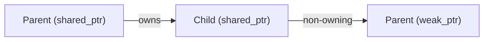

# Modern and Lucid C++ for Professional Programmers – Week 11: Dynamic Heap Memory Management

## Overview

- **Topic of this unit:** Dynamic heap memory management with smart pointers (`std::unique_ptr`, `std::shared_ptr`, `std::weak_ptr`) and recursive object structures
- **Lecturers:** Thomas Corbat, Felix Morgner
- **Learning objectives:**
  - Use heap allocation safely in modern C++
  - Write leak-free recursive data structures
  - Explain and correctly apply the two main smart pointers in the STL (`unique_ptr` vs. `shared_ptr`)
  - Break ownership cycles with `std::weak_ptr`
  - Apply RAII consistently when dealing with resources

## 1. Introduction / Context

Heap memory is needed when:

- **Stack memory is too small** (very large objects, deep recursion).
- You need **object structures / graphs** with dynamic lifetime.
- You return **polymorphic objects** (base pointer/reference to a derived object).

However, raw `new`/`delete` are error-prone:

- Memory leaks
- Dangling pointers
- Double deletes
- No garbage collection to save you

Modern C++ therefore relies on **RAII** and **smart pointers** (`std::unique_ptr`, `std::shared_ptr`, `std::weak_ptr`) instead of manual `new`/`delete`.

## 2. Key Terms and Definitions

| Term                                              | Definition                                                                                                                                   |
| ------------------------------------------------- | -------------------------------------------------------------------------------------------------------------------------------------------- |
| **Heap memory**                                   | Dynamically allocated storage (via `new`, `std::make_unique`, `std::make_shared`, C APIs like `malloc`). Lifetime is independent of scope.   |
| **RAII (Resource Acquisition Is Initialization)** | Idiom: acquire resources in constructors, release them in destructors. Lifetime of a stack object controls the lifetime of its resource.     |
| **Smart pointer**                                 | Object that behaves like a pointer but manages ownership and deletion automatically in its destructor.                                       |
| **`std::unique_ptr<T>`**                          | Non-copyable owning pointer, unique ownership of a single object. Movable. Typically created with `std::make_unique<T>()`.                   |
| **`std::shared_ptr<T>`**                          | Reference-counted smart pointer; multiple owners, last one destroys the object. Created with `std::make_shared<T>()`.                        |
| **`std::weak_ptr<T>`**                            | Non-owning reference to an object managed by `std::shared_ptr`. Does not contribute to reference count; used to break cycles.                |
| **Custom deleter**                                | Callable passed to smart pointer that replaces `delete` or `free` as destruction function.                                                   |
| **Ownership cycle**                               | Object graph in which `shared_ptr`s refer to each other in a cycle; reference count never reaches zero → memory leak.                        |
| **`std::enable_shared_from_this<T>`**             | Base class that lets an object managed by `shared_ptr` acquire `shared_ptr`/`weak_ptr` to itself (`shared_from_this()`, `weak_from_this()`). |

## 3. Main Content

### 3.1 When and How to Use Heap Memory

**When is heap memory used?** (slide 10)

- Stack is limited, especially for:
  - very large objects,
  - deeply recursive structures.

- For **object networks** (trees, graphs) where objects outlive the scope that created them.
- For **polymorphic factories** returning `std::unique_ptr<Base>` or `std::shared_ptr<Base>`: the object type is chosen at runtime.

The figure on _page 10_ shows a tree of `Shape` nodes where the root holds pointers to children in a container, naturally modeled via heap-allocated objects.

**Rule:** _Don’t manage heap yourself if you can avoid it_. Use RAII wrappers and containers (`std::vector`, `std::string`, smart pointers).

### 3.2 RAII and “Don’t Do It Yourself”

RAII wrapper skeleton (slide 11):

```cpp
struct RaiiWrapper {
    RaiiWrapper() {
        // allocate resource
    }
    ~RaiiWrapper() {
        // deallocate resource
    }
};
```

- Constructing `RaiiWrapper` acquires a resource.
- Destroying it (scope exit, `return`, exception) automatically releases it.

**Do NOT do this:** (slide 12)

```cpp
auto ptr = new int{};
std::cout << *ptr << '\n';
delete ptr;
```

- If any early `return` or exception happens between `new` and `delete`, you leak.
- If you accidentally `delete` twice, you get UB.
- There is **no GC**; memory is your responsibility.

Use:

```cpp
auto p = std::make_unique<int>();   // RAII smart pointer
```

or just:

```cpp
int value{};                        // stack variable, best if possible
```

### 3.3 `std::unique_ptr<T>` – Managing Unique Objects

**Purpose** (slide 14):

- Unique ownership of a heap object.
- Cannot be copied (ownership is not shared).
- Can be _moved_ or returned by value from a function.
- Good for:
  - factory functions that return heap objects,
  - RAII wrappers for C pointers (with custom deleter),
  - occasionally, large local objects that shouldn’t be on the stack.

Example factory (slide 13):

```cpp
#include <memory>

auto factory(int i) -> std::unique_ptr<X> {
    return std::make_unique<X>(i);
}
```

**Move-only semantics** (slide 15):

```cpp
auto create(int i) -> std::unique_ptr<int> {
    return std::make_unique<int>(i);
}

auto main() -> int {
    std::cout << std::boolalpha;
    auto pi = create(42);
    std::cout << "*pi = " << *pi << '\n';
    std::cout << "pi.valid? " << static_cast<bool>(pi) << '\n';

    auto pj = std::move(pi);
    std::cout << "*pj = " << *pj << '\n';
    std::cout << "pi.valid? " << static_cast<bool>(pi) << '\n';
}
```

- `pi` initially owns the `int`.
- `pj = std::move(pi);` transfers ownership; `pi` becomes empty (`false` in bool context).

**Guidelines** (slide 18):

- As **member variable**:
  - use when the object is owned by that class and not shared.

- As **local variable**:
  - RAII for temporary resources (files, buffers, etc.).

- `std::unique_ptr<T> const p{new T{}};`
  - cannot transfer ownership; ensures no leaks, but prefer `make_unique` and avoid raw `new`.

- For polymorphic use, prefer `std::shared_ptr<Base>` unless all objects are uniquely owned with a _virtual_ destructor (or no polymorphic delete).

### 3.4 `std::unique_ptr` and C APIs (Custom Deleters)

Many C functions return pointers to be freed with `free()`, not `delete`. Example: `__cxa_demangle` (slide 16):

```cpp
auto demangle(std::string const& name) -> std::string {
    auto cleanup = [](char* ptr) {
        free(ptr);
    };

    std::unique_ptr<char, decltype(cleanup)> toBeFreed{
        __cxxabiv1::__cxa_demangle(name.c_str(), 0, 0, 0),
        cleanup
    };

    std::string result(toBeFreed.get());
    return result;
}
```

- Custom deleter type `decltype(cleanup)` ensures `free` is called on scope exit, even in exceptions.

**Size optimisation** (slide 17):

Storing the deleter _type_ rather than a function pointer avoids extra pointer size:

```cpp
struct free_deleter {
    template<typename T>
    auto operator()(T* p) const -> void {
        free(const_cast<std::remove_const_t<T>*>(p));
    }
};

template<typename T>
using unique_C_ptr = std::unique_ptr<T, free_deleter>;

auto plain_demangle(char const* name) -> std::string {
    unique_C_ptr<char> toBeFreed{
        __cxxabiv1::__cxa_demangle(name, 0, 0, 0)
    };
    std::string result(toBeFreed.get());
    return result;
}
```

- `unique_C_ptr<T>` behaves like `unique_ptr` but always uses `free_deleter`.

### 3.5 `std::shared_ptr<T>` – Sharing Objects

**Motivation** (slides 19–21):

- Needed when multiple owners must share the same object:
  - object networks,
  - shared resources,
  - polymorphic containers or members.

- Works like a Java reference:
  - copyable,
  - underlying object destroyed only when **last** `shared_ptr` is destroyed or reset.

Example (slide 21):

```cpp
struct A {
    A(int a, std::string b, char c);
};

auto createA() -> std::shared_ptr<A> {
    return std::make_shared<A>(5, "hi", 'a');
}

auto main() -> int {
    auto anA   = createA();
    auto sameA = anA;            // second owner
    A copyA{*sameA};             // copies object
    auto another = std::make_shared<A>(copyA);
}
```

The _diagram on page 21_ shows:

- `anA` and `sameA` share the same heap object (`A`) with reference count 2.
- `another` points to a separate heap `A` constructed from `copyA`.

**Base classes & factories** (slide 22):

```cpp
auto os_factory(bool file) -> std::shared_ptr<std::ostream> {
    using namespace std;
    if (file) {
        return make_shared<ofstream>("hello.txt");
    } else {
        return make_shared<ostringstream>();
    }
}
```

- Factory returns `shared_ptr<ostream>` that actually points to `ofstream` or `ostringstream`.
- The caller can treat it as `ostream` and write to it.

**Destructor not necessarily virtual** (slide 25):

- If all heap instances are created through `std::make_shared<Concrete>()` and stored as `std::shared_ptr<Base>`, `shared_ptr` remembers the **concrete destructor**.
- In such a design, `Base`’s destructor does not technically need to be virtual for correct deletion (though virtual is still common and clearer).

### 3.6 Reference Counting and Ownership Cycles

**Reference counting demo** (slide 23):

```cpp
struct Light {
    Light()  { std::cout << "Turn on\n"; }
    ~Light() { std::cout << "Turn off\n"; }
};

auto main() -> int {
    auto light = std::make_shared<Light>();
    auto same  = light;
    auto last  = same;

    light.reset();
    same.reset();
    last.reset();
}
```

- The _figure on page 23_ shows the refcount going 3 → 2 → 1 → 0.
- When count hits 0, destructor runs: “Turn off”.

**Problem: Cycles** (slide 24)

Example `HalfElf`:

```cpp
using HalfElfPtr = std::shared_ptr<struct HalfElf>;
struct HalfElf {
    explicit HalfElf(std::string name) : name{name} {}
    std::string name{};
    std::vector<HalfElfPtr> siblings{};
};
```

```cpp
void middleEarth() {
    auto elrond = std::make_shared<HalfElf>("Elrond");
    auto elros  = std::make_shared<HalfElf>("Elros");
    elrond->siblings.push_back(elros);
    elros->siblings.push_back(elrond);
}
```

The _diagram on page 24_ shows:

- `elrond` and `elros` each have refcount 2:
  - one from the local variable,
  - one from the other’s `siblings` vector.

When `middleEarth` ends, the local `shared_ptr`s are destroyed, but each object still has refcount 1 from the cycle → **memory leak**.

### 3.7 `std::weak_ptr<T>` – Breaking Cycles

To prevent such leaks we use **non-owning links** via `std::weak_ptr`.

Simple parent/child sketch (slide 29–30):

```cpp
struct Person {
    std::shared_ptr<Person> child;
    std::weak_ptr<Person> parent;
};
```

Mermaid diagram:



- The parent **owns** the child via `shared_ptr`.
- Child keeps a `weak_ptr` back to the parent:
  - does not increase refcount,
  - breaks the ownership cycle.

Example flow (_diagram on page 30_):

1. `anakin` and `luke` are created as `shared_ptr<Person>`.
2. `anakin->child = luke;` (count `luke`++).
3. `luke->parent = anakin;` (weak reference, no count change).
4. When `anakin.reset();` is called:
   - refcount of `anakin` becomes 0,
   - `Person` object for Anakin is destroyed.
   - `luke->parent` becomes expired (`lock()` returns empty).

**Access via `weak_ptr`** (slide 31):

```cpp
struct Person {
    std::shared_ptr<Person> child;
    std::weak_ptr<Person> parent;

    auto acquireMoney() const -> void {
        auto locked = parent.lock(); // shared_ptr
        if (locked) {
            begForMoney(*locked);
        } else {
            goToTheBank();
        }
    }
};
```

- `lock()` returns `shared_ptr<T>`:
  - non-empty if pointee still alive,
  - empty if the object has already been destroyed.

### 3.8 Recursive Data Structures with Smart Pointers

The slides’ **Person** exercise (pages 27–33) is a good model: persons know their parents, children, and spouse(s). This naturally leads to cycles:

- spouse1 ↔ spouse2
- parent ↔ child

To implement this:

1. You **cannot** use Persons as direct value members – that would imply infinite recursion:

   ```cpp
   struct Matryoshka { Matryoshka nested; }; // impossible
   ```

   Instead:

   ```cpp
   struct Matryoshka {
       std::shared_ptr<Matryoshka> nested;
   };
   ```

2. Use `shared_ptr` for **owning** relations (e.g. parent → child).
3. Use `weak_ptr` for **back-links** (child → parent, spouse ↔ spouse) to avoid cycles.

**Spawning children from parents** (slide 32):

To let a `Person` create a child that knows its parent, we need a `shared_ptr`/`weak_ptr` to `this`.

Using `std::enable_shared_from_this<Person>`:

```cpp
struct Person : std::enable_shared_from_this<Person> {
    std::shared_ptr<Person> child;
    std::weak_ptr<Person> parent;

    auto spawn() -> std::shared_ptr<Person> {
        child = std::make_shared<Person>();
        child->parent = weak_from_this();
        return child;
    }
};
```

- `enable_shared_from_this` stores an internal `weak_ptr<Person>` for the object.
- `weak_from_this()` (or `shared_from_this()`) uses it to create a `weak_ptr`/`shared_ptr` to `*this`.
- This only works if the object itself is owned by at least one `std::shared_ptr`.

**Multiple children** (slide 33):

```cpp
using PersonPtr = std::shared_ptr<struct Person>;

struct Person {
    // ...
private:
    std::vector<PersonPtr> children;
    std::weak_ptr<Person> mother;
    std::weak_ptr<Person> father;
};
```

- `PersonPtr` alias requires a forward declaration `struct Person;`.
- `children` is a vector of owning `shared_ptr`s.
- `mother` / `father` are `weak_ptr`s back to the parents.

## 4. Relationships and Interpretation

- **RAII** is the foundation: all resource management (including heap memory) should be tied to object lifetime.
- **`std::unique_ptr`** expresses **exclusive ownership**:
  - no accidental copies,
  - move semantics for safe transfer,
  - ideal default choice for heap ownership.

- **`std::shared_ptr`** expresses **shared ownership**:
  - reference counted,
  - more flexible but heavier (atomic refcount → overhead).

- **`std::weak_ptr`** complements `shared_ptr`:
  - breaks cycles,
  - allows “observer” relationships without owning the object.

- Recursive structures (trees, DAGs, graphs) are naturally modeled with **smart pointers**, but you must design **ownership directions** carefully to avoid leaks.

## 5. Examples and Applications

- **Tree / graph nodes**:
  - `std::shared_ptr<Node>` for child pointers,
  - `std::weak_ptr<Node>` for parent pointers or cross-links.

- **Person / family tree**:
  - `children` as vector of `shared_ptr<Person>`,
  - `mother`/`father` as `weak_ptr<Person>`.

- **Polymorphic collections**:
  - `std::vector<std::shared_ptr<Base>>` storing derived objects from `make_shared<Derived>()`.

- **C library interop**:
  - `unique_C_ptr<T>` wrapper with `free_deleter` for memory returned by `malloc`-style functions.

- **Resource handlers**:
  - RAII types for sockets, files, handles, each implemented with a custom deleter inside a `unique_ptr` or as a dedicated class.

## 6. Summary / Takeaways

- Prefer **stack objects** and standard containers (`std::vector`, `std::string`) whenever possible.
- When you need heap objects:
  - use `std::make_unique<T>()` and `std::unique_ptr<T>` for **exclusive ownership**,
  - use `std::make_shared<T>()` and `std::shared_ptr<T>` for **shared ownership**.

- Never manually `new`/`delete` unless you are writing a low-level RAII wrapper.
- For C APIs with custom deallocation, use `unique_ptr` with a **custom deleter**.
- Avoid **ownership cycles** with `shared_ptr`; break them using `std::weak_ptr`.
- Use `std::enable_shared_from_this<T>` when an object needs to obtain a `shared_ptr`/`weak_ptr` to itself.
- Copying/destroying `std::shared_ptr` is slower than raw pointers due to atomic reference counting – don’t overuse it.
- Use `nullptr` instead of `NULL` or `0` for null pointers (see summary slide with `new T{} delete p` vs `nullptr`).

## 7. Study Hints

- Rewrite any existing code that uses raw `new/delete` to use `unique_ptr` or `shared_ptr`.
- Implement a small **family tree** or **tree structure**:
  - use smart pointers for parent/child relations,
  - ensure no leaks by intentionally breaking ownership cycles with `weak_ptr`.

- Write RAII wrappers for:
  - a `FILE*` from `<cstdio>` (using `fclose` as deleter),
  - a dynamically allocated C string (using `free`).

- Experiment with `enable_shared_from_this`:
  - create `spawn()` methods that return `shared_ptr` children.

- Run tests under tools like Valgrind or sanitizers to verify:
  - no memory leaks,
  - no use-after-free.

## 8. Further / Advanced Topics

- Custom **allocators** for containers.
- `std::shared_ptr` aliasing constructor (shared ownership without owning the same control block).
- Weak references in cache implementations.
- Comparison with other languages:
  - GC vs. deterministic destruction (RAII).

- Smart pointers for **non-memory resources** (file descriptors, network sockets, mutexes) combined with `std::unique_lock`, etc.

## 9. References & Literature (IEEE)

[1] ISO/IEC, _Programming Languages — C++ (ISO/IEC 14882:2020)_, International Organization for Standardization, 2020.

[2] B. Stroustrup, _The C++ Programming Language_, 4th ed., Addison-Wesley, 2013.

[3] N. M. Josuttis, _The C++ Standard Library: A Tutorial and Reference_, 2nd ed., Addison-Wesley, 2012.

[4] T. Corbat, F. Morgner, _Modern and Lucid C++ for Professional Programmers – Week 11 – Dynamic Heap Memory Management_, OST – Ostschweizer Fachhochschule, HS2025.
