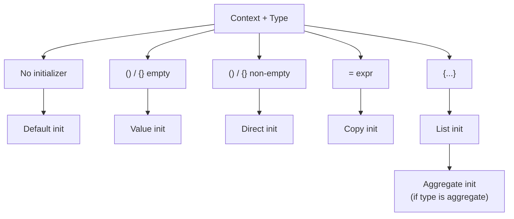
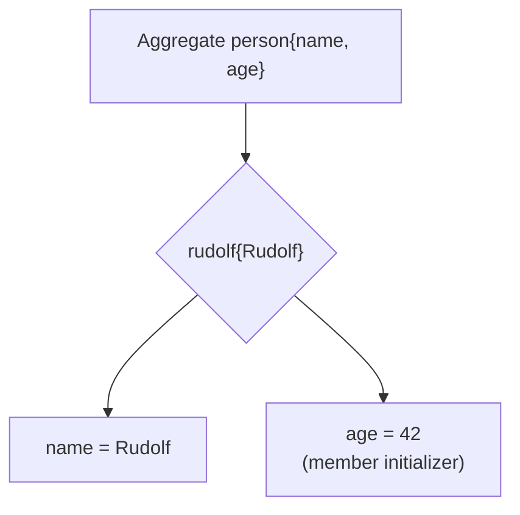

# Modern and Lucid C++ for Professional Programmers – Week 13: Initialization and Aggregates

## Overview

* **Topic of the unit:** Initialization forms in C++ and aggregate types 
* **Lecturers:** Thomas Corbat, Felix Morgner
* **Learning goals:**

  * Recognize and name different kinds of initialization
  * Explain the constraints imposed on aggregate types
  * Implement and use aggregate classes safely 


## 1. Introduction / Context

Initialization in C++ is **surprisingly rich**:

* Many different forms (`=`, `()`, `{}`, nothing)
* Different **kinds of initialization**, depending on context:

  * default, value, direct, copy, list, aggregate
* Subtle differences can mean:

  * **well-defined behaviour**, or
  * **undefined behaviour** (e.g. reading uninitialized variables).

At the same time, C++ has a special category of types — **aggregates** — that can be initialized very compactly, but only if they obey certain structural rules (no user-declared constructors, no private non-static data, no virtual functions, etc.). 


## 2. Key Terms and Definitions

| Term                         | Definition                                                                                                                                                                                        |
| ---------------------------- | ------------------------------------------------------------------------------------------------------------------------------------------------------------------------------------------------- |
| **Default initialization**   | Initialization when no initializer is given (bare declaration). Effect depends on storage duration and type.                                                                                      |
| **Value initialization**     | Initialization with empty `()` or `{}` (e.g. `T{}` or `T()`). For class types, calls default constructor; for scalars, zero-initializes.                                                          |
| **Direct initialization**    | Initialization with non-empty `()` or `{}` (e.g. `T x(42);`, `T x{42};`). Constructor is chosen directly.                                                                                         |
| **Copy initialization**      | Initialization with `=` (e.g. `T x = expr;`). May use copy/move constructor or implicit conversion sequence. Also applies to `return` and `throw`.                                                |
| **List initialization**      | Initialization with non-empty braces `{ ... }`; can be direct (`T x{a,b}`) or copy (`T x = {a,b}`). Prefers `std::initializer_list` constructors.                                                 |
| **Aggregate**                | A “simple” type (class/struct/array) that satisfies strict structural rules: no user-declared constructors, no virtuals, no private/protected non-static data, etc. Arrays are always aggregates. |
| **Aggregate initialization** | Special case of list initialization used for aggregates: each base/member is initialized from the brace list in order.                                                                            |
| **“Most vexing parse”**      | A syntactic ambiguity where something that looks like an object definition with `()` is parsed as a function declaration instead.                                                                 |
| **UB (Undefined Behaviour)** | Program behaviour not defined by the standard; anything can happen (crashes, random output, “working by accident”, etc.).                                                                         |


## 3. Main Content

### 3.1 Kinds of Initialization – Overview

Slides list the main categories: 

* Default initialization
* Value initialization
* Direct initialization
* Copy initialization
* List initialization
* Aggregate initialization

And four **general syntaxes**:

1. *Nothing*: `T x;`
2. Parentheses: `T x(expr-list);`
3. Assignment: `T x = expr;`
4. Braces: `T x{initializer-list};`

Different combinations of **context + syntax + type** give different semantics.

**Visualization (Mermaid):**




### 3.2 Default Initialization

**Definition** (slide 15):

* You **don’t provide an initializer**.
* Effect depends on:

  * static vs local storage,
  * scalar vs class type,
  * member vs non-member. 

Examples (slide 16–19):

```cpp
int global_variable;            // implicitly static

auto di_function() -> void {
    static long local_static;   // static
    long local_variable;        // automatic (local) variable
}

struct di_class {
    di_class() = default;
    char member_variable;       // not in ctor init list
};
```

**Effects**:

* **Static objects** (including globals and `static` locals):

  * first **zero-initialized**, then default-constructed (if class type).
  * Example on slide 17: `int global_variable; std::string global_text;`
    `global_variable` becomes `0`; `global_text` becomes empty string (`""`). 
* **Non-static scalar locals** (e.g. `int`, `double`) are **uninitialized**:

  * Reading them → **UB**.
* **Local class-type objects** are default-constructed.
* **Members not in ctor-init-list** are default-initialized:

  * For scalar members, that means **uninitialized**.
* **Arrays** default-initialize each element.

Example of UB (slide 20):

```cpp
auto print_uninitialized() -> void {
    int my_number;
    std::cout << my_number << '\n';  // undefined behaviour!
}
```

Also:

* If a type **cannot** be default-constructed, default-initializing it is **ill-formed** (compile-time error):

```cpp
struct blob {
    blob(int);
};
blob static_instance;  // error: no blob()
```

**Guideline:** avoid plain default initialization of local scalars; prefer **value initialization** (`int x{};`).


### 3.3 Value Initialization

**Definition** (slide 21):

* Initialization with **empty `()` or `{}`**:

```cpp
#include <string>
#include <vector>

auto vi_function() -> void {
    int number{};              // value-initialized: 0
    std::vector<int> data{};   // default-constructed (empty vector)
    std::string actually_a_function();
}
```

* For class types: calls default constructor.
* For scalars: **zero-initializes**.

`{}` is generally preferred:

* Works in more contexts.
* Avoids “most vexing parse” traps.


### 3.4 Direct Initialization

**Definition** (slide 22):

* Non-empty `()` or `{}` with an expression list.

```cpp
#include <string>

auto diri_function() -> void {
    int number{32};              // direct list initialization
    std::string text("CPl");     // direct init with ()
    word vexing (std::string()); // beware
}
```

* With `()`:

  * Can trigger the **most vexing parse** (next subsection).
* With `{}`:

  * For non-class types → direct list initialization.
  * For class types → interacts with `std::initializer_list` (see list init).


### 3.5 The Most Vexing Parse

The line (slide 23):

```cpp
word vexing (std::string());
```

has **two interpretations**:

1. A variable named `vexing` of type `word`, constructed from a **temporary `std::string`** (`std::string()`).
2. A **function declaration** `word vexing(std::string(*)())` – a function taking a pointer to a function returning `std::string`.

C++ grammar picks the **second** interpretation (function declaration).

Because of this, **always prefer `{}`** for object initialization where ambiguity is possible:

```cpp
word vexing{std::string{}};   // definitely a variable
```


### 3.6 Copy Initialization

**Definition** (slide 24):

* Initialization with `=`:

```cpp
#include <string>

auto string_factory() -> std::string { return ""; }

auto ci_function() -> void {
    std::string in_place = string_factory();  // direct from temporary
    std::string copy     = in_place;          // copy constructor
    std::string converted = "CPl";           // conversion from const char*
}
```

Rules:

* If RHS is a **temporary of same type**, compiler may construct directly into the target (NRVO / copy elision).
* If RHS is an **object of same type**, copy/move constructor is used.
* Otherwise, a suitable **conversion sequence** is looked up (e.g. from `const char*` to `std::string`).
* Copy initialization also applies to:

  * `return expr;`
  * `throw expr;`
  * function parameter passing.


### 3.7 List Initialization

**Definition** (slide 25):

* Non-empty braces `{ ... }`:

```cpp
std::string direct{"CPl"};     // direct list init
std::string copy = {"CPlA"};   // copy list init
```

Selection of constructors is **two-phase**:

1. If there is a viable `std::initializer_list` constructor, it is **preferred**.
2. Otherwise, a non-`initializer_list` constructor is selected via overload resolution. 

#### Pitfall: `std::initializer_list` preference (slide 26)

Example:

```cpp
// vector(size_type count, const T& value, const Allocator& alloc = Allocator());

auto ouch() -> int {
    std::vector<int> data{10, 42};
    return data[5];            // UB
}
```

Intended? Many expect `data` to have 2 elements: `{10, 42}`.

Actual:

* The `std::vector(size_type, const T&)` constructor **does not** take `std::initializer_list`.
* But the standard library also provides an `initializer_list` constructor:

  * `vector(std::initializer_list<T> init, ...)`.
* Because **initializer_list constructors are preferred**, `data` becomes a vector with two elements `{10, 42}` **in practice**.

The slide warns that with different signatures (e.g. if only the `(size, value)` ctor existed) `data{10, 42}` would be interpreted as “10 copies of 42”, making `data[5]` valid but semantically surprising.
In short: always check which constructor is actually called; if you want the `(count, value)` overload, prefer **`( )`**:

```cpp
std::vector<int> data(10, 42);   // 10 elements, all 42
```


### 3.8 Aggregate Types

**Definition** (slide 28):

Aggregates are **simple class types** (or arrays) with strict constraints:

* Can have **public base classes** (no private/protected inheritance).
* Can have member variables and functions.
* Must **not** have virtual member functions.
* Must **not** have **user-declared** or **inherited constructors**.
* Must **not** have protected or private **direct non-static data members**.
* Arrays are always aggregates. 

They are intended for:

* “Simple” data-only types,
* Data Transfer Objects (DTOs),
* Types with **no invariants** that must be constructed in a specific way.

#### Example aggregate (slide 29)

```cpp
struct person {
    std::string name;
    int age{42};

    auto operator<(person const & other) const -> bool {
        return age < other.age;
    }

    auto write(std::ostream & out) const -> void {
        out << name << ": " << age << '\n';
    }
};

auto main() -> int {
    person rudolf{"Rudolf", 32};  // aggregate initialization
    rudolf.write(std::cout);
}
```

This `person` is an aggregate because:

* No user-declared constructors,
* No virtual functions,
* All data members are public,
* No non-public base classes. 

#### Non-aggregate counter-example (slide 30)

```cpp
struct db_entry {};

struct person : private db_entry {
    std::string name;
    int age{42};

    person() = default;  // user-declared constructor

    auto operator<(person const & other) const -> bool {
        return age < other.age;
    }

    virtual auto write(std::ostream & out) const -> void {  // virtual!
        out << name << ": " << age << '\n';
    }
};
```

`person` is **not** an aggregate because:

* It privately inherits `db_entry` (non-public base).
* It has a **user-declared constructor**.
* It has a **virtual** member function.


### 3.9 Aggregate Initialization

**Definition** (slide 31):

* Special case of list initialization.
* If the type is an aggregate:

  * Bases and members are initialized **in order of declaration** from the brace initializers.

Rules:

* If there are **more initializers than bases + members**, the program is **ill-formed**.
* If there are **fewer**:

  * Members with a **member initializer** use that (e.g. `int age{42};`).
  * Remaining members are **value-initialized** (as if with `{}`).

Example from slide 31:

```cpp
person rudolf{"Rudolf"};  // only name is given
// age will be initialized from its member initializer: 42
```

So:

* `rudolf.name == "Rudolf"`
* `rudolf.age == 42`

**Visualization (Mermaid):**




## 4. Relationships and Interpretation

* Initialization form is crucial for **correctness and safety**:

  * Default init can yield **uninitialized data** → UB.
  * Value/list init with `{}` avoids many pitfalls.
* `()` vs `{}`:

  * `()` can trigger the **most vexing parse**.
  * `{}` interacts with `std::initializer_list` constructors.
* Aggregates:

  * Provide **very concise initialization** for simple, POD-like types.
  * Are suitable only when there is **no invariant** that must be enforced by constructors.
  * Aggregate initialization is predictable and ordered: braces → bases/members.

Overall guideline from the **summary slide**: 

* Avoid default initialization where possible.
* Prefer `{}` for initialization.
* Use `()` only when you *intentionally* want to avoid an `initializer_list` constructor.


## 5. Examples and Applications

* Replace

  ```cpp
  int x;           // uninitialized
  std::string s;   // OK, but style-mixed
  ```

  with

  ```cpp
  int x{};           // 0
  std::string s{};   // ""
  ```

* Use aggregates for DTOs:

  ```cpp
  struct Point {
      double x{};
      double y{};
  };

  Point p1{1.0, 2.0};   // aggregate init
  Point p2{3.0};        // x = 3.0, y = 0.0
  ```

* Carefully design classes to **not** be aggregates when invariants matter:

  ```cpp
  struct Temperature {
      double degreesC;

      explicit Temperature(double c) : degreesC{c} {
          // enforce constraints here
      }
  };
  ```

  → has user-defined constructor, therefore not an aggregate (which is good here).

* Distinguish list vs non-list initialization for containers:

  ```cpp
  std::vector<int> v1(10, 42);   // 10 elements, all 42
  std::vector<int> v2{10, 42};   // usually elements {10, 42}
  ```


## 6. Summary / Takeaways

* C++ has **many kinds of initialization**; behaviour depends on syntax, context, and type. 
* **Default initialization**:

  * Can yield uninitialized local scalars → UB if read.
  * Static objects are zero-initialized.
* **Value initialization** with `{}`:

  * Safe way to get zero-initialized scalars and default-constructed objects.
* **Direct and copy initialization**:

  * Use `()` or `=`; be aware of the most vexing parse and copy vs conversion.
* **List initialization** with `{}`:

  * Preferable in most cases; but `initializer_list` constructors can surprise you (e.g., `std::vector`).
* **Aggregates**:

  * Simple, struct-like types with no user-declared constructors, no virtuals, all data accessible.
  * Aggregate initialization assigns members in order; missing members use default/member initializers.
  * Only use aggregates when your type has **no invariant** that requires constructor logic.


## 7. Study Hints

* For a set of small examples:

  * Rewrite all declarations using `{}` and observe differences.
  * Test default vs value initialization (`int a; int b{};`).
* Construct simple aggregates and non-aggregates:

  * Start from a `struct` and add features one by one (private member, constructor, virtual fn) to see when it ceases to be an aggregate.
* For containers:

  * Experiment with `std::vector<int> v(3, 7);` vs `std::vector<int> v{3, 7};`.
* Use compiler warnings and tools (sanitizers) to detect:

  * Reading uninitialized values,
  * UB caused by default initialization.


## 8. Further / Advanced Concepts

* `constexpr` and initialization: constant expressions must be initialized in ways suitable for compile-time evaluation.
* Zero-initialization vs default initialization in more detail (standard phases of initialization).
* Design of **POD** vs **non-POD** types and how it interacts with aggregates.
* How aggregate rules evolve in newer standards (C++17, C++20) with designated initializers and refinements.


## 9. References & Literature (IEEE)

[1] ISO/IEC, *Programming Languages — C++ (ISO/IEC 14882:2020)*, International Organization for Standardization, 2020.

[2] B. Stroustrup, *The C++ Programming Language*, 4th ed., Addison-Wesley, 2013.

[3] N. M. Josuttis, *The C++ Standard Library: A Tutorial and Reference*, 2nd ed., Addison-Wesley, 2012.

[4] T. Corbat, F. Morgner, *Modern and Lucid C++ for Professional Programmers – Week 13 – Initialization and Aggregates*, OST – Ostschweizer Fachhochschule, HS2025. 
