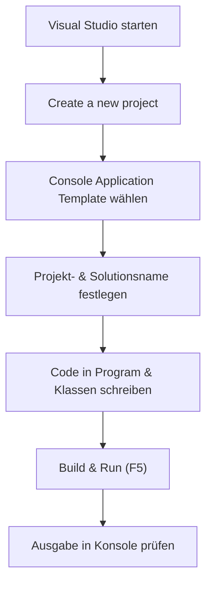
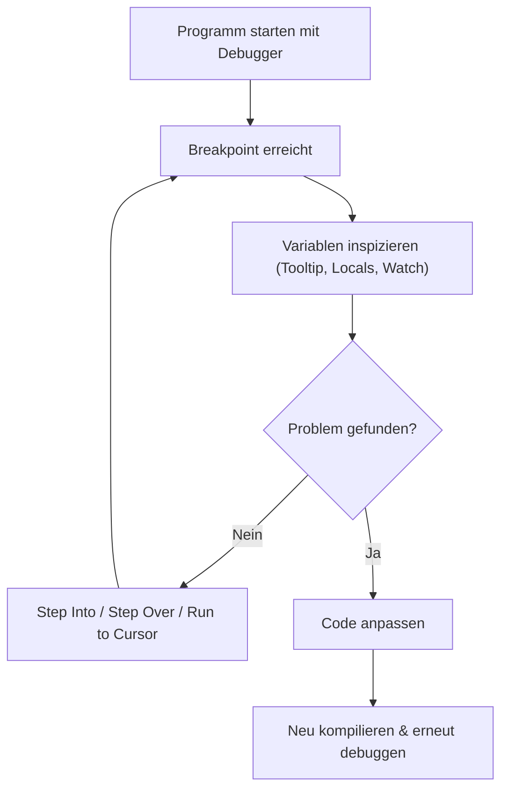
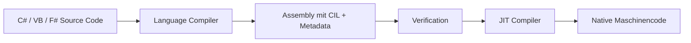
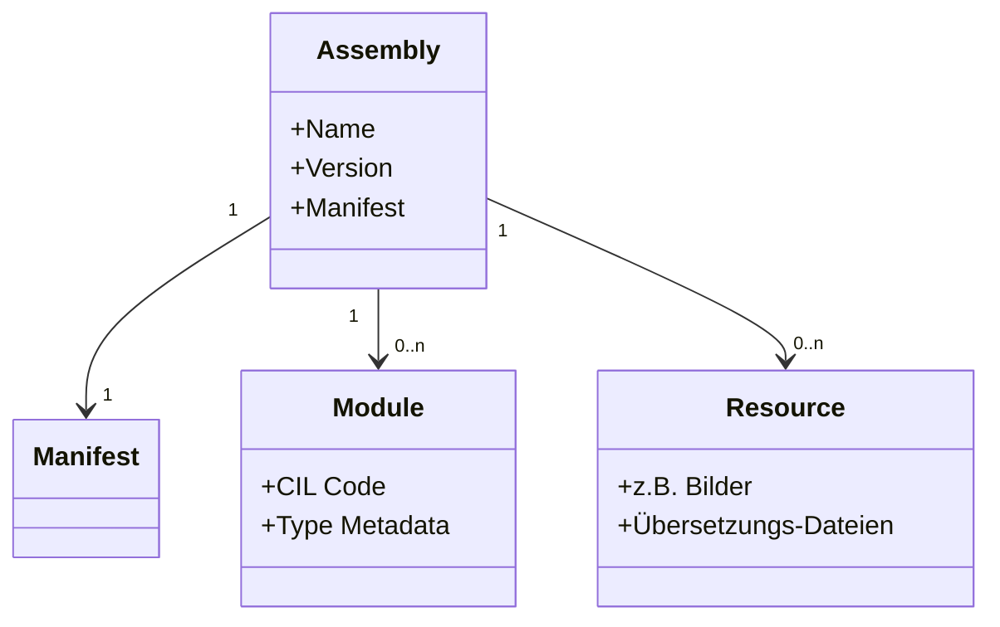

# .NET Grundlagen & Visual Studio – Einführung

## Übersicht

- **Thema der Einheit:**
  Entwicklung mit C# und .NET: Visual Studio, Debugging, CLR/CIL, Assemblies, Common Type System, CLI, Projekte & Referenzen, NuGet
- **Dozent:** Manuel Bauer
- **Lernziele:**
  - Funktionsweise der Visual-Studio-IDE für C#-Entwicklung verstehen
  - C#-Konsolenanwendung (Solution/Project) anlegen, strukturieren und ausführen
  - Grundlagen des Debuggings (Breakpoints, Call Stack, Watches, IntelliTrace) anwenden
  - CLR als Laufzeitsystem von .NET im Überblick kennen
  - CIL und den Ablauf der JIT-Kompilation verstehen
  - Assemblies und deren Aufbau (Manifest, Module, Metadaten, Ressourcen) erklären
  - Common Type System (CTS) mit Reference- und Value Types inkl. Boxing/Unboxing unterscheiden
  - .NET Command Line Interface (CLI) benutzen können (z.B. `dotnet build`, `dotnet run`, `dotnet new`)
  - .NET-Projekte, Referenzen und NuGet-Packages verstehen und einsetzen

## 1. Einführung / Kontext

In dieser Einheit wird gezeigt, wie C#-Programme mit Visual Studio und dem .NET-Ökosystem entwickelt werden. Visual Studio stellt eine leistungsfähige IDE mit Editor, Projektverwaltung und Debugger bereit; .NET liefert das Laufzeitsystem (CLR), das Typsystem (CTS) und umfangreiche Bibliotheken. Zusätzlich ermöglicht das `dotnet`-CLI eine IDE-unabhängige Entwicklung und Verwaltung von Projekten.

## 2. Zentrale Begriffe und Definitionen

| Begriff           | Definition                                                                                                                                                |
| ----------------- | --------------------------------------------------------------------------------------------------------------------------------------------------------- |
| Visual Studio     | Integrierte Entwicklungsumgebung (IDE) von Microsoft für .NET-Sprachen wie C#, VB, F#, C++ etc., mit Editor, Solution Explorer, Debugger, Profiler u.v.m. |
| Solution (.sln)   | Oberste Projektebene in Visual Studio; enthält ein oder mehrere Projekte inkl. deren Einstellungen und Referenzen.                                        |
| Project (.csproj) | Einheit zum Bauen einer Anwendung/Bibliothek; beschreibt Sourcefiles, Referenzen, Output-Typ etc. im XML-Format.                                          |
| C#                | Objektorientierte .NET-Programmiersprache, die nach CIL kompiliert und auf der CLR ausgeführt wird.                                                       |
| .NET              | Plattform mit Laufzeit (CLR), einheitlichem Typensystem (CTS), gemeinsamen Sprachregeln (CLS) und umfangreicher Klassenbibliothek (BCL).                  |
| CLR               | Common Language Runtime; verwaltet Ausführung von .NET-Code (JIT, Garbage Collection, Type Checking, Exceptions, Threads, Debugging).                     |
| CIL / IL / MSIL   | Prozessorunabhängige Zwischensprache (Intermediate Language), die von .NET-Compilern erzeugt und zur Laufzeit via JIT in Maschinencode übersetzt wird.    |
| Assembly          | Selbstbeschreibende Deployment- und Ausführungseinheit in .NET (EXE oder DLL) mit Manifest, CIL-Code, Metadaten und Ressourcen.                           |
| BCL               | Base Class Library – grundlegende .NET-Bibliothek mit Datentypen, Collections, I/O, Networking, GUIs, Datenzugriff, Web usw.                              |
| CTS               | Common Type System – gemeinsames Typensystem für alle .NET-Sprachen, basiert auf `System.Object` und unterscheidet Reference- und Value Types.            |
| Reference Type    | Typ, dessen Instanzen auf dem Heap liegen; Variablen speichern Referenzen (z.B. Klassen).                                                                 |
| Value Type        | Typ, dessen Wert direkt in der Variable (Stack oder Inline) liegt; z.B. `int`, `struct`.                                                                  |
| Boxing            | Automatische Umwandlung eines Value Types in einen Reference Type (z.B. `int` → `object`).                                                                |
| Unboxing          | Explizite Rückkonvertierung eines boxed Reference Types in den ursprünglichen Value Type.                                                                 |
| Breakpoint        | Marke im Code, an der der Debugger die Ausführung anhält, um Zustand zu inspizieren.                                                                      |
| IntelliTrace      | Debugging-Funktion, die Ausführungshistorie (Events, CPU/Mem) aufzeichnet und Rückwärtsnavigation erlaubt.                                                |
| CLI (`dotnet`)    | Kommandozeilenwerkzeug der .NET SDK für Build, Run, Test, Projektverwaltung, NuGet etc.                                                                   |
| NuGet-Package     | Verteilbare .NET-Komponente (`*.nupkg`) mit Assemblies, Metadaten und Abhängigkeiten, verwaltet über NuGet.                                               |

## 3. Hauptinhalte

### 3.1 Visual Studio & C#-Konsolenanwendungen

**Wichtige Punkte**

- Visual Studio verwendet für C#, VB, F#, C++ usw. dieselbe IDE; viele Konzepte ähneln Eclipse für Java.
- Zentrale Bereiche der IDE (Screenshot _Seite 7_): Code-Editor, Solution Explorer, Git-Integration, Quick Launch, Status-/Meldungsleisten.
- Solution-Struktur:
  - Solution (.sln) → enthält 1..n Projekte (.csproj)
  - Jedes Projekt → 1..n C#-Dateien (.cs) + weitere Dateien (Ressourcen usw.)

**Vorgehen: Konsolenanwendung anlegen**

1. Visual Studio starten → „Create a new project“ wählen (_Start Page, Seite 6_).
2. Projekttyp „Console Application“ filtern/auswählen. (_Seite 10_).
3. Projektname, Speicherort und Solutionsname definieren (_Seite 11_).
4. In der generierten `Program.cs`:
   - Namespace, Klassenname und Dateiname sinnvoll umbenennen (z.B. nicht „Program“).

5. Projekt ausführen:
   - Menü „Debug → Start Debugging“ oder F5 / Run-Button. (_Seite 13_).

6. Weitere Klassen hinzufügen: Rechtsklick auf Projekt im Solution Explorer → „Add → Class…“ → Namen (z.B. `Student.cs`) vergeben (_Seiten 14–15_).

**Visualisierung: Erstellen & Ausführen eines Projekts**



### 3.2 Debugging in Visual Studio

**Fehlertypen**

- **Syntaxfehler** – Compilerfehler, verhindern erfolgreichen Build.
- **Laufzeitfehler** – Programm stürzt zur Ausführung ab (z.B. Exceptions).
- **Logische Fehler** – Programm läuft, liefert aber falsche Ergebnisse.

**Debugger-Funktionen**

- Programm überwachen, Objekte/Variablen inspizieren, Ausführungspfad rekonstruieren.
- Breakpoints setzen, bedingt auslösen lassen, Ausführung fortsetzen/modifizieren.

**Breakpoints & Steuern der Ausführung**

- Breakpoint per Klick in den linken Editor-Rand setzen/entfernen (_Seite 21_).
- Bei Erreichen:
  - Gelber Pfeil markiert aktuelle Zeile (_Seite 23_).
  - Werte via Tooltip, Locals- und Watch-Fenster einsehbar (_Seiten 22–23, 29–30_).

- Debugger-Toolbar (_Seite 24_):
  - F11: _Step Into_
  - F10: _Step Over_
  - _Step Out_: Methode bis zum Ende ausführen.
  - F5: Weiter bis zum nächsten Breakpoint; Stop/Restart Debugging.

**Point-and-Click Debugging**

- Im Break-Modus erscheint ein grünes „Run execution to here“-Symbol an der Mausposition (_Seiten 25–27_).
- Klick → Code läuft bis zu dieser Zeile (auch über Methoden-/Schleifengrenzen hinweg).

**Weitere Tools**

- **Call Stack**: Zeigt Aufrufkette (z.B. `Main` → `MilesPerGallon`-Konstruktor, _Seite 28_).
- **Locals / Autos Watch**: Automatisch sichtbare bzw. aktuell genutzte Variablen mit ihren Werten (_Seiten 29–30_).
- **Disassembly**: Anzeige des generierten IL-Codes (_Seite 31_).
- **Conditional Breakpoints / Hit Count**: Breakpoints nur bei erfüllter Bedingung oder ab bestimmter Trefferanzahl auslösen (_Seiten 32–34_).
- **IntelliTrace**: Zeitachse mit Events, CPU-/Speicherauslastung, Memory-Snapshots und Rückwärtsnavigation (_Seiten 35–36_).

**Visualisierung: Debugging-Workflow**



### 3.3 .NET-Architektur & CLR

- .NET besteht aus CLR, CTS, CLS und der Base Class Library (BCL).
- Das Architekturdiagramm auf _Seite 8_ zeigt: verschiedene Sprachen (VB, C++, C#, F#) werden mit Visual Studio/anderen IDEs kompiliert; gemeinsame Basis ist die CLR und BCL, die auf unterschiedlichen Betriebssystemen (Windows, Unix, macOS) laufen.

**CLR-Funktionalität** (_Seite 9_):

- JIT-Compiler (IL → Maschinencode)
- Class Loader
- Garbage Collection / Speicherverwaltung
- Debugging & Exception Handling
- Type Checking und IL Code Verification
- Thread Management
- Zugriff auf Base Class Library

### 3.4 Common Intermediate Language (CIL) & JIT

**Eigenschaften von CIL**

- Synonyme: MSIL, IL.
- Prozessorunabhängige, assemblerähnliche Zwischensprache.
- Sprachunabhängig (C#, VB.NET, F#, …).
- Stack-basierte virtuelle Maschine, nutzt CTS (komplexe Datentypen, Vererbung, Polymorphie).

**Vor- und Nachteile** (_Seite 12_):

- **Vorteile:** Portabilität, Typsicherheit, Sicherheitsprüfungen beim Laden, Möglichkeit zur Plattformoptimierung durch JIT oder Native AOT.
- **Herausforderung:** Zusätzlicher Übersetzungsschritt (Performance-Kosten), die aber durch JIT-Optimierung meist kompensiert werden.

**Compiler-Pipeline (Diagramm _Seite 13 & 16_)**



**Beispiel**

- Einfache C#-Methode `Add(int x, int y)` wird in IL übersetzt (Listing auf _Seite 14_).
- IL integriert auch Boxing (`box System.Int32`) und Aufruf von `System.Console.WriteLine`.

**JIT-Kompilation (Seite 17)**

- Methoden werden erst bei Bedarf in Maschinencode übersetzt („Just in Time“).
- JIT ersetzt IL einer Methode schrittweise durch native Instruktionen; bereits übersetzte Methoden werden wiederverwendet.

### 3.5 Assemblies, Module & Metadaten

**Assembly-Überblick** (_Seiten 19–20_)

- Ergebnis der Kompilation; Einheit für Deployment, Versionierung und Sicherheitsprüfung.
- Typen: EXE (Anwendung) oder DLL (Bibliothek).
- Enthält:
  - **Manifest** (Version, Name, Referenzen, weitere Infos)
  - **Module** mit CIL-Code und Typ-Metadaten
  - **Ressourcen** (Bilder, Lokalisierung usw.)

**Struktur eines Assemblies**



**Metadaten & Anwendungen** (_Seiten 21–22_)

- Metadaten beschreiben Klassen, Methoden, Felder etc., nicht aber die eigentliche Logik.
- Nutzen:
  - CLR: Verifikation, Memory Management, JIT.
  - Tools: Object Browser, IntelliSense, Analyse-Tools, IL Disassembler.
  - Reflection & dynamische Erweiterbarkeit (Plug-ins, dynamischer Typzugriff).

### 3.6 Common Type System, Reference & Value Types, Boxing

**CTS-Grundidee** (_Seite 24_)

- Einheitliches Typsystem über alle .NET-Sprachen:
  - Single-rooted: alle Typen erben von `System.Object`.
  - Zwei Hauptkategorien: Reference Types (Klassen) und Value Types (Structs, Primitive).

- Reflection ermöglicht programmatischen Zugriff auf Typinformationen.

**Polymorphie-Beispiel** (_Seite 25_):

```csharp
public void Polymorphism(System.Object o)
{
    Console.WriteLine(o.ToString());
}

public void Test()
{
    Polymorphism(42);
    Polymorphism("abcd");
    Polymorphism(12.345678901234m);
    Polymorphism(new MyClass());
}
```

Alle Argumente werden als `object` behandelt → Polymorphie auf Basis von `System.Object`.

**Reference vs. Value Types (Seiten 27–31)**

| Eigenschaft     | Reference Type                                                    | Value Type                             |
| --------------- | ----------------------------------------------------------------- | -------------------------------------- |
| Speicherort     | Heap                                                              | Stack / inline                         |
| Variableninhalt | Referenz auf Objekt                                               | Wert selbst                            |
| `null` möglich  | Ja                                                                | Nein                                   |
| Default-Wert    | `null`                                                            | `0`, `false`, `'\0'`, etc.             |
| Zuweisung       | Referenz wird kopiert → zwei Variablen zeigen auf dasselbe Objekt | Wert wird kopiert → unabhängige Kopien |
| Ableitung       | möglich (Klassenhierarchie)                                       | nicht möglich, `sealed` (Structs)      |

- Diagramme auf _Seiten 28–31_ zeigen die Speicheranordnung von `PointRef` (Klasse) vs. `PointVal` (Struct) und das Verhalten bei Zuweisungen.

**Boxing / Unboxing (Seite 33)**

- Beispiel:

```csharp
System.Int32 i1 = 123;        // Value Type
System.Object obj = i1;       // Boxing
System.Int32 i2 = (Int32)obj; // Unboxing
```

- Boxing: `i1` wird kopiert und in einem Objekt auf dem Heap gespeichert; `obj` verweist darauf.
- Unboxing: Cast zurück zu `Int32`; kann Exception werfen, wenn der Typ nicht passt.

### 3.7 .NET Command Line Interface (CLI)

**Struktur** (_Seite 35_)

```text
dotnet <verb> <argument> --<option> <param>
```

- `verb`: Aktion, z.B. `build`, `run`, `new`, `test`, `publish`.
- `argument`: Ziel (Projekt, Solution, Template etc.).
- `option`/`param`: zusätzliche Schalter (z.B. `--output`, `--configuration`).

**Wichtige Verben** (_Seite 36_):

- `new` – neues Projekt oder Datei erstellen.
- `build` – Projekt bauen.
- `run` – Projekt bauen und starten.
- `test` – Tests ausführen.
- `publish` – Anwendung für Deployment veröffentlichen.
- `add` / `remove` – Paket-/Projekt-Referenzen verwalten.
- `nuget` / `tool` – NuGet- bzw. Tool-Handling.
- `sln` – Solution-Dateien anpassen.

### 3.8 Projekte, Referenzen & NuGet

**Projektdateien (.csproj)** (_Seite 39_)

- XML-basiert; von MSBuild und dem `dotnet`-CLI verarbeitet.
- Grobstruktur:
  - `PropertyGroup`: Einstellungen (z.B. `OutputType`, `TargetFramework`).
  - `ItemGroup`: Items wie `Compile`, `Reference`, `PackageReference`, `ProjectReference`.
  - `Target`: definierte Build-Schritte.

**Arten von Referenzen** (_Seiten 40–41_):

- Klassische **Assembly-Referenz**: Pfad auf eine DLL im Dateisystem.
- **SDK-Referenz**: Basisbibliotheken, Pflichtbestandteil.
- **NuGet-Package**: externe Abhängigkeit aus dem NuGet-Ökosystem.
- **Projekt-Referenz**: Verweis auf anderes Projekt in derselben Solution (ermöglicht Debugging & Navigation in den Quellcode).

**csproj-Beispiel (vereinfacht)**:

```xml
<Project Sdk="Microsoft.NET.Sdk">
  <PropertyGroup>
    <OutputType>Exe</OutputType>
    <TargetFramework>net8.0</TargetFramework>
  </PropertyGroup>

  <ItemGroup>
    <Reference Include="SimpleAssembly">
      <HintPath>..\libs\SimpleAssembly.dll</HintPath>
    </Reference>
  </ItemGroup>

  <ItemGroup>
    <PackageReference Include="Microsoft.Extensions.Logging"
                      Version="*.0.0" />
  </ItemGroup>

  <ItemGroup>
    <ProjectReference Include="..\SimpleLib\SimpleLib.csproj" />
  </ItemGroup>
</Project>
```

**Packages & NuGet** (_Seiten 43–47_)

- .NET ist in kleinere NuGet-Packages modularisiert (kein monolithisches Framework).
- Wichtige Standard-Packages:
  - `System.Runtime`, `System.Collections`, `System.Net.Http`, `System.IO.FileSystem`, `System.Linq`, `System.Reflection` etc. (_Seite 44_).

- NuGet-Package (`*.nupkg`):
  - Enthält Assemblies (oft für mehrere Framework-Versionen), Manifest, Versions-Info, Dependencies usw.
  - Intern ZIP-Datei.

- Workflow:
  1. Projekt erstellen (`dotnet new`).
  2. Build (`dotnet build`).
  3. Package erzeugen (`dotnet pack`).
  4. Package publishen (`dotnet nuget push`).
  5. In anderem Projekt mit `dotnet add package` konsumieren. (_Seite 46_).

- Repositories:
  - Lokales Repository (Developer-PC), self-hosted Server, öffentliche Gallery (z.B. `nuget.org`, siehe Screenshots _Seiten 47–48_).

## 4. Zusammenhänge und Interpretation

- Visual Studio & CLI sind zwei verschiedene Zugänge zur gleichen Build-/Run-Infrastruktur (MSBuild, `dotnet`-Tooling) und arbeiten beide mit Projekten und Assemblies.
- Alle .NET-Sprachen kompilieren zu CIL, das von der CLR ausgeführt wird – dadurch werden Sprachmix, gemeinsame Bibliotheken und Tools wie der Debugger für alle Sprachen nutzbar.
- CTS sorgt dafür, dass z.B. Collections, Reflection und Polymorphie unabhängig von der Ursprungssprache funktionieren.
- Assemblies und NuGet ermöglichen modulare Softwareentwicklung mit klar definierten Versionen und Abhängigkeiten.
- Debugging-Funktionen (Breakpoints, IntelliTrace) greifen tief in diese Laufzeitumgebung ein, nutzen Metadaten, Call-Stack-Informationen und IL.

## 5. Beispiele und Anwendungen

1. **Einfache Konsolenapp**
   - Mit Visual Studio neues „Console App“-Projekt erstellen, `Main` so anpassen, dass Benutzerinput gelesen wird (z.B. Rechner, Temperaturkonverter).

2. **Debugging eines Logikfehlers**
   - In einer Schleife Breakpoint + Conditional Breakpoint setzen (z.B. nur bei Schleifenindex `i == 99` stoppen), um einen Fehler im 100. Element einer Liste zu analysieren.

3. **CLI-gesteuerte Bibliothek**
   - Mit `dotnet new classlib` Library erzeugen, per `dotnet add package` externe Abhängigkeit hinzufügen, aus Konsolenprojekt per `ProjectReference` nutzen und alles via `dotnet build/run` steuern.

## 6. Zusammenfassung / Takeaways

- Visual Studio bietet eine mächtige, aber einheitliche Umgebung für alle .NET-Sprachen, inkl. Projektstruktur, Editor und Debugger.
- .NET basiert auf der CLR, die CIL-Code per JIT in effizienten Maschinencode umsetzt und Speicher, Typen, Exceptions und Threads verwaltet.
- Assemblies sind die grundlegenden Einheiten für Deployment, Versionierung und Sicherheit und enthalten CIL, Metadaten und Ressourcen.
- Das CTS trennt Sprachsyntax von Typlogik, unterscheidet Reference- und Value Types und ermöglicht Polymorphie über `System.Object`.
- CLI, Projekt-Dateien und NuGet-Packages bilden zusammen eine flexible, skriptbare Build- und Paketierungsinfrastruktur – unabhängig von einer konkreten IDE.

## 7. Lernhinweise

- In Visual Studio bewusst mit Solution Explorer, Umbenennung von Namespaces/Klassen und Projekt-Einstellungen experimentieren.
- Debugger intensiv nutzen: Breakpoints, Watches, Call Stack, Step Into/Over – gezielt kleine Bugs „suchen gehen“.
- Mit IL-Ansicht und Disassembly spielen, um das Zusammenspiel von C# → CIL → JIT besser zu verstehen.
- Kleine Beispiele schreiben, die Unterschiede von Reference vs. Value Types und Boxing/Unboxing sichtbar machen.
- CLI-Kommandos (`dotnet new/build/run/test/publish`) praktisch üben, z.B. in einem eigenen Ordner mit Git-Repository.
- Eigene kleine NuGet-Pakete lokal erstellen und von einem zweiten Projekt aus einbinden.

## 8. Vertiefung / weiterführende Konzepte

- Native AOT (Ahead-of-Time Compilation) für Startzeit-optimierte .NET-Anwendungen.
- Erweiterte Debugging-Szenarien: Remote Debugging, Multithreading, Performance-Profiling.
- Erweiterte BCL-Bereiche: ASP.NET Core für Web-APIs, Entity Framework Core für Datenzugriff, WPF/WinUI für Desktop-GUIs.
- Reflection, Dynamik und Dependency Injection im Detail.
- Versionsstrategien & Paket-Management in größeren Solutions (SemVer, interne NuGet-Feeds).

## 9. Quellen & Literatur (IEEE)

[1] M. Bauer, “Visual Studio – Einführung,” Foliensammlung, OST – Ostschweizer Fachhochschule, Departement Informatik, Rapperswil, 2025.

[2] M. Bauer, “.NET Grundlagen – Einführung,” Foliensammlung, OST – Ostschweizer Fachhochschule, Departement Informatik, Rapperswil, 2025.

[3] Microsoft Corporation, “.NET documentation,” Online: Microsoft Learn, Zugriff: [2025].

[4] Microsoft Corporation, “Visual Studio documentation,” Online: Microsoft Learn, Zugriff: [2025].

[5] NuGet.org, “NuGet Documentation,” Online: NuGet Project, Zugriff: [2025].
