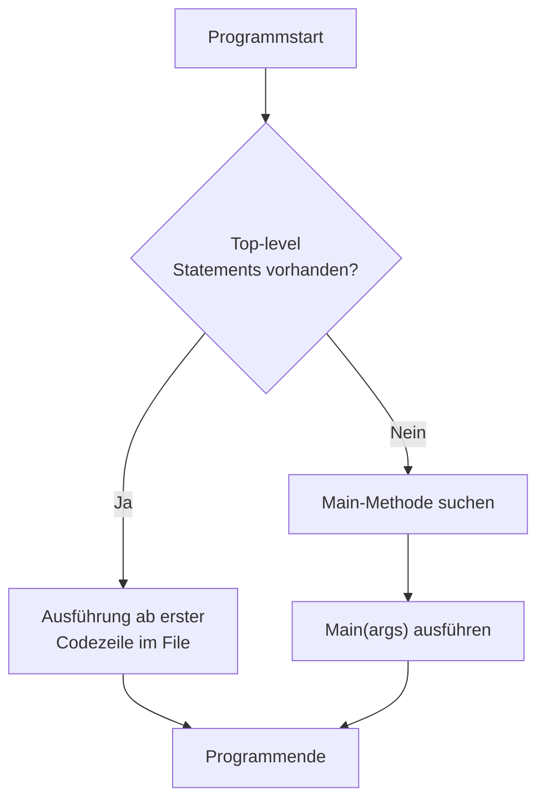
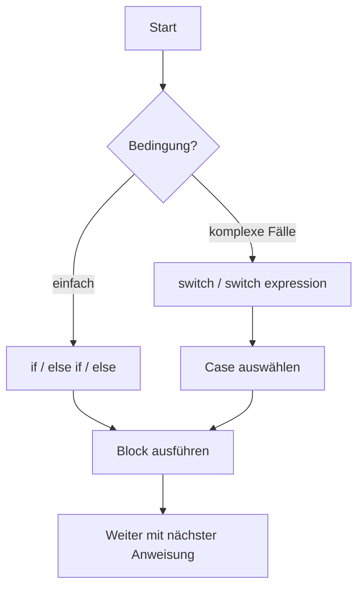

# C# Grundlagen – Einführung

## Übersicht

- **Thema der Einheit:**
  Grundlegende Sprachkonzepte von C#: Syntax, Namenskonventionen, Sichtbarkeit, Namespaces, Main-Methode, Enums, `object`, Strings, Arrays, Primitive Typen, Symbole/Identifier, Statements und Kontrollstrukturen.
- **Dozent:** Manuel Bauer
- **Lernziele: **
  - Unterschiede in der Syntax zwischen Java und C#/.NET benennen
  - Grundbausteine der Syntax (Namespaces, Sichtbarkeitsattribute, Naming Guidelines) korrekt anwenden
  - Basis-Typen wie Strings, Arrays, Enums und Primitive Typen in einfachen Beispielen verwenden
  - Selbststudiums-Themen (v.a. Arrays mehrdimensional, Symbole, Primitivtypen, Statements) so verstehen, dass sie praktisch anwendbar sind

## 1. Einführung / Kontext

C# ist eine moderne, typsichere, objektorientierte Sprache im .NET-Ökosystem. Sie ähnelt in vielen Konzepten Java (Klassen, Vererbung, Interfaces, Exceptions, Threads, Garbage Collection), übernimmt gewisse Elemente aus C++ (Operator Overloading, Pointer in `unsafe` Code) und bringt viele eigene Komfortfunktionen („syntactic sugar“) wie Delegates, Events, foreach, Attribute oder Top-level Statements.

## 2. Zentrale Begriffe und Definitionen

| Begriff                  | Definition                                                                                                                                   |
| ------------------------ | -------------------------------------------------------------------------------------------------------------------------------------------- |
| C#                       | Objektorientierte .NET-Sprache mit strenger Typprüfung, Garbage Collection und reichhaltigen Sprachfeatures (Delegates, Events, LINQ, etc.). |
| Namespace                | Logische Strukturierungseinheit für Typen (Klassen, Interfaces, Enums …), ähnlich Java-Package, aber nicht an Ordner gebunden.               |
| Sichtbarkeitsattribute   | Schlüsselwörter wie `public`, `private`, `protected`, `internal`, die den Zugriff auf Typen und Member regeln.                               |
| Enumerationstyp (`enum`) | Typ mit benannten Konstanten, die standardmässig auf `int` (Int32) basieren; Werte können implizit oder explizit vergeben werden.            |
| `object`                 | Alias für `System.Object`; Basistyp aller Typen (Value und Reference Types).                                                                 |
| `string`                 | Alias für `System.String`; unveränderlicher Referenztyp für Zeichenketten.                                                                   |
| Array                    | Referenztyp, der eine feste Anzahl Elemente eines Typs enthält (eindimensional, mehrdimensional oder „jagged“).                              |
| Primitive Typen          | Werttypen wie `int`, `bool`, `char`, `double`, mit fest definiertem Wertebereich.                                                            |
| Identifier               | Name für Variablen, Typen, Methoden usw.; Unicode, case-sensitive, spezielle Regeln (z.B. `@`-Prefix möglich).                               |
| Main-Methode             | Einstiegspunkt einer Anwendung; `static`, mit unterschiedlichen erlaubten Signaturen (z.B. `static void Main(string[] args)`).               |
| Top-level Statements     | C#-Feature, bei dem Code ohne explizite `Main`-Methode direkt im File als Einstiegspunkt steht.                                              |
| Statement                | Ausführungseinheit des Programms, z.B. Zuweisung, `if`, `switch`, Schleifen (`for`, `foreach`, `while`) oder `return`.                       |

## 3. Hauptinhalte

### 3.1 Syntax, Klassen & Programmstruktur

#### Ähnlichkeit zu Java/C++

- **Wie Java**: einfache Vererbung, Interfaces, Exceptions, Threads, Namespaces (≈ Packages), Garbage Collection, Reflection, dynamisches Laden von Code.
- **Wie C++**: Operator Overloading, Zeigerarithmetik in `unsafe` Code.

**Klassenvergleich (C# vs. Java)** – Beispiel aus Folie:

C#:

```csharp
class A {
    private int _x;
    public A(int x) { _x = x; }
    public virtual void Foo() { /* ... */ }
}

class B : A, I1, I2 {
    const int c = 3;
    private int _y;

    public B(int x, int y) : base(x) {
        _y = y;
    }

    public override void Foo() {
        base.Foo();
        /* ... */
    }

    public int Bar() { /* ... */ }
}
```

Java-Pendant:

```java
class A {
    private int x;
    public A(int x) { this.x = x; }
    public void foo() { /* ... */ }
}

class B extends A implements I1, I2 {
    static final int c = 3;
    private int y;

    public B(int x, int y) {
        super(x);
        this.y = y;
    }

    @Override
    public void foo() {
        super.foo();
        /* ... */
    }

    public int bar() { /* ... */ }
}
```

Wichtige Unterschiede: `virtual`/`override` in C#, `const` vs. `static final`, Namenskonventionen (PascalCase/CamelCase).

#### Naming Guidelines

- **PascalCase** für Namespaces, Klassen, Interfaces, Enums, Delegates, Properties, Events (z.B. `System.Collections.Generic`, `OrderId`, `MouseClick`).
- **CamelCase** für Felder (oft mit `_`-Prefix: `_name`), lokale Variablen und Parameter (`orderId`).

#### Sichtbarkeitsattribute

- `public` – überall sichtbar
- `private` – nur innerhalb des Typs
- `protected` – Typ + abgeleitete Klassen
- `internal` – innerhalb des Assemblies
- `protected internal` – geschützt **oder** im selben Assembly
- `private protected` – geschützt **und** nur im selben Assembly

Standard-Sichtbarkeit unterscheidet sich je nach Typ (z.B. Klassen typischerweise `internal`, Mitglieder `private`, sofern nicht anders angegeben).

#### Namespaces

- Können mehrere Namespaces pro Datei enthalten.
- Namespace-Struktur ist **nicht** an Ordner gebunden.
- Import mit `using`:

  ```csharp
  using System;
  using F = System.Windows.Forms; // Alias
  F.Button b;
  ```

**File-scoped Namespace** – moderne Schreibweise:

```csharp
namespace OstDemo;

class X { }
```

→ spart geschweifte Klammern und Einrückung; nur ein Namespace pro File erlaubt.

**Global Usings**

- `global using Some.Namespace;` in z.B. `GlobalUsings.cs` → für ganzes Projekt gültig.
- Alternativ via `.csproj`:

  ```xml
  <ItemGroup>
    <Using Include="Azure.Core" />
  </ItemGroup>
  ```

**Implicit global usings**

- Über `<ImplicitUsings>enable</ImplicitUsings>` im `.csproj` wird eine vordefinierte Menge an `using`-Direktiven automatisch importiert (z.B. `System`, `System.Collections.Generic`).

#### Main-Methode & Top-level Statements

- Einstiegspunkt jeder ausführbaren Anwendung.
- Gültige Rückgabewerte: `void`, `int`, `Task`, `Task<int>` (Exit-Code bei `int`).
- Parameter: keine oder `string[] args`.

Beispiele:

```csharp
static void Main() { }
static int Main(string[] args) { return 0; }
static async Task Main(string[] args) { /* ... */ }
```

**Argumente**:

- Klassisch über `string[] args`.
- Alternativ: `Environment.GetCommandLineArgs()`.

**Top-level Statements** – Minimalbeispiel:

```csharp
using System;

for (int i = 0; i < args.Length; i++)
{
    ConsoleWriter.Write(args, i);
}

class ConsoleWriter
{
    public static void Write(string[] args, int i)
        => Console.WriteLine($"Arg {i} = {args[i]}");
}
```

Hier erzeugt der Compiler implizit eine `Main`-Methode; Argumente heissen fix `args`.

**Formeln (Beispiel Wertebereich `int`):**
[
-2^{31} \leq \texttt{int} \leq 2^{31} - 1
]

**Visualisierung: Programmstart**



### 3.2 Typen, Primitive Typen, Enums, `object`, Strings & Arrays

#### Primitive Typen

- Werttypen (Structs) mit festem Wertebereich, z.B.:
  - `sbyte`, `byte`, `short`, `ushort`, `int`, `uint`, `long`, `ulong`
  - `float`, `double`, `decimal`
  - `bool` (`true`/`false`), `char` (Unicode-Zeichen)

**Beispiel-Literale:**

```csharp
object number;
number = 17;        // int
number = 9876543210; // long
number = 17L;      // long
number = 17u;      // uint
number = 3.14;     // double
number = 10f;      // float
```

**Ganzzahlen** – Typauswahl nach Suffix (ohne Suffix: kleinster passender Typ aus `int`, `uint`, `long`, `ulong`).
**Gleitkommazahlen** – Suffix `f`/`F` → `float`, `m`/`M` → `decimal`, sonst `double`.

**Lesbarkeit** mit `_`:

```csharp
number = 9_876_543_210; // = 9876543210
number = 0b1110_1011;   // = 0b11101011
```

#### Zeichen & Escape-Sequenzen

- Strings mit `"` … `"`, Chars mit `'` … `'`.
- Escape-Sequenzen wie `\n`, `\t`, `\"`, `\\`, `\u0061`, `\x0061`.

**Verbatim String-Literale** mit `@`:

```csharp
string path = @"C:\sample.txt";
string s = @"file
""C:\sample.txt""";
```

→ Backslash wird nicht mehr als Escape interpretiert, `"` wird verdoppelt.

#### Raw String Literals

Mehrzeilige Strings mit `"""` (oder mehr Quotes):

```csharp
string s1 =
"""
Here's some JSON:
{
  "Name": "Clara",
  "Profession": "Bank clerk"
}
And some special characters:
"" \ \\ ' ''
""";
```

#### Typkompatibilität

Implizite und explizite Konvertierungen: z.B. `short` → `int` erlaubt, `int` → `short` nur mit Cast. Diagramm auf _Folie 64_ zeigt zulässige implizite Konvertierungen; andere erfordern Cast.

$$
\text{Implizit: } \texttt{short} \to \texttt{int} \to \texttt{long}
$$

$$
\text{Explizit (Cast nötig): } \texttt{int} \to \texttt{short}
$$

#### Enumerationstypen (Enums)

- Deklaration:

  ```csharp
  enum Days { Sunday, Monday, Tuesday, Wednesday, Thursday, Friday, Saturday };
  ```

  → Standard-Basis: `int`, Werte beginnen bei 0, danach jeweils +1.

- Explizite Werte:

  ```csharp
  enum Days {
      Sunday = 10, Monday, Tuesday, Wednesday, Thursday, Friday = 9, Saturday
  }
  ```

- Basistyp ändern:

  ```csharp
  enum Days : byte { Sunday, Monday, ... }
  ```

- Parsing:

  ```csharp
  Days d1 = (Days)Enum.Parse(typeof(Days), "Monday");
  bool ok = Enum.TryParse("Monday", out Days day3);
  foreach (string name in Enum.GetNames(typeof(Days)))
      Console.WriteLine(name);
  ```

#### `object` – Basistyp aller Typen

- `object o1; // System.Object o1;`
- Beliebige Typen zuweisbar:

  ```csharp
  o1 = "Test";
  o1 = 123;
  o1 = new Rectangle();
  ```

- Wichtige Methoden: `Equals`, `GetHashCode`, `GetType`, `ToString`, `ReferenceEquals`.

#### Strings

- Referenztyp, alias `System.String`.
- **Unveränderlich** – jede „Änderung“ erzeugt neuen String (intern `String.Concat`-Aufrufe).

**Verkettung & Interpolation:**

```csharp
string s1 = "Hello ";
string s2 = "World";
string s3 = s1 + s2; // "Hello World"

string s4 = $"{DateTime.Now}: {"Hello"}";
string s5 = $"{DateTime.Now}: {(DateTime.Now.Hour < 18 ? "Hello" : "Good Evening")}";
```

**Raw String Literals** siehe oben.

**Vergleich & Interning:**

- `==` und `Equals` vergleichen **Inhalt**.
- Compiler/Runtime internieren String-Literale; Referenzen können daher identisch sein:
  ```csharp
  string s1 = "Test";
  string s2 = "Test";
  string.ReferenceEquals(s1, s2); // True
  string s3 = string.Copy(s1);
  string.ReferenceEquals(s1, s3); // False
  ```

#### Arrays

- Referenztypen, immer auf dem Heap, zero-based.
- Nach Instanziierung sind alle Elemente initialisiert (0, `false`, `null`, …).

**Eindimensionale Arrays**

```csharp
int[] array1 = new int[5];
int[] array2 = new int[] { 1, 3, 5, 7, 9 };
int[] array3 = { 1, 2, 3, 4, 5, 6 };
object[] array4 = new object[5];

int v = array2[4];   // 9
array2[0] = 99;
int len = array2.Length; // 5
```

**Memory-Layout (Folie 48):**

- Bei `int[]` liegen die Werte direkt hintereinander.
- Bei `object[]` liegen Referenzen auf Objekte; diese Objekte liegen separat auf dem Heap.

**Mehrdimensionale Arrays**

- Rechteckige Arrays:

  ```csharp
  int[,] matrix = { { 1, 2, 3 }, { 4, 5, 6 } };
  int value = matrix[0, 2]; // 3
  int len0 = matrix.GetLength(0); // 2
  int len1 = matrix.GetLength(1); // 3
  ```

- Jagged Arrays (Arrays von Arrays):

  ```csharp
  int[][] jagged = new int[2][];
  jagged[0] = new int[] { 1, 2, 3 };
  jagged[1] = new int[1];
  int value2 = jagged[0][2]; // 3
  ```

Diagramm auf _Folie 53_ zeigt das unterschiedliche Memory-Layout von Rechteck- und Jagged-Arrays.

**Vorteile von Blockmatrizen:** weniger Referenzen, schnelleres Allozieren/Garbage Collection; Zugriff wäre theoretisch auch effizient, aber JIT optimiert Boundary-Checks stärker bei eindimensionalen Arrays.

### 3.3 Symbole (Identifier) & Kommentare

#### Identifier

- Unicode, case-sensitive.
- dürfen mit Buchstabe, `_` oder `@` beginnen, danach Buchstaben/Ziffern/`_`.
- `@` ermöglicht Verwendung von Schlüsselwörtern als Identifier: `int @while = 0;`.

Beispiele:

```csharp
int someName = 0;
int sum_of3 = 0;
int _10percent = 0;
int @while = 0;
int \u03c0 = 0; // π
```

#### Kommentare

- `//` für einzeilige Kommentare
- `/* ... */` für mehrzeilige Kommentare
- `///` für XML-Dokumentationskommentare (auf Typen, Methoden, Properties etc.)

### 3.4 Statements & Kontrollstrukturen

#### Einfache Statements

- Leeres Statement: `;`
- Zuweisungen: `x = 3 * y + 1;`
- Methodenaufrufe:

  ```csharp
  string s = "a,b,c";
  string[] parts = s.Split(',');
  s = string.Join(" + ", parts);
  ```

#### `return`

- In `void`-Methoden ohne Wert, sonst mit Wert:

  ```csharp
  public int Max(int a, int b)
  {
      if (a > b) return a;
      return b;
  }
  ```

#### `if` & Pattern Matching

Klassisch:

```csharp
int value = 5;
if (value >= 0 && value < 9) { /* ... */ }
else if (value > 10) { /* ... */ }
else { Console.WriteLine("Invalid: " + value); }
```

Mit Pattern Matching:

```csharp
if (value is >= 0 and < 9) { /* ... */ }
```

→ Ausdrücke werden lesbarer und deklarativer; C# bietet viele Pattern-Varianten.

#### `switch` Statement

- Unterstützt numerische Typen, `char`, `string`, `enum`, inkl. `null`-Case.
- **Kein** automatisches Fall-Through wie in C: jeder Case endet mit `break`, `return`, `throw` oder `goto`. Leere Case-Ketten (Germany/Austria) sind erlaubt und fallen in den nächsten Case mit Code.

```csharp
string ctry = "Germany";
string language;

switch (ctry)
{
    case "England":
    case "USA":
        language = "English";
        break;

    case "Germany":
    case "Austria":
    case "Switzerland":
        language = "German";
        break;

    case null:
        Console.WriteLine("Country null");
        break;

    default:
        Console.WriteLine("Unknown " + ctry);
        break;
}
```

#### `switch` Expression

Kurzform als Ausdruck:

```csharp
string language = ctry switch
{
    "England" or "USA" =>
        "English",
    "Germany" or "Austria" or "Switzerland" =>
        "German",
    null =>
        throw new ArgumentNullException(),
    _ =>
        throw new ArgumentException()
};
```

→ Jeder Fall liefert einen Wert oder wirft eine Exception; `_` ist Default-Fall.

#### Schleifen

**`while` / `do-while`**:

```csharp
int i = 1;
int sum = 0;
while (i <= 3) { sum += i; i++; } // 0–n Durchläufe

do { sum += i; i++; } while (i <= 3); // 1–n Durchläufe
```

**`for`**:

```csharp
int sum = 0;
for (int i = 1; i <= 3; i++)
{
    sum += i;
}
```

**`foreach`**:

```csharp
int[] a = { 3, 17, 4, 8, 2, 29 };
int sum = 0;
foreach (int x in a)
{
    sum += x;
}

string hello = "Hello";
foreach (char ch in hello)
    Console.WriteLine(ch);
```

Auch mit Collections wie `Queue`.

#### Jumps: `break`, `continue`, `goto`

```csharp
for (int i = 0; i < 10; i++)
{
    if (i == 1) { continue; }
    if (i == 3) { goto myLabel; }
    if (i == 5) { break; }
    Console.WriteLine(i);
myLabel: ;
}
// Ausgabe: 0, 2, 4
```

`goto` darf nicht in einen Block hinein oder aus einem `finally`-Block heraus springen. `goto case` erlaubt Sprung zwischen Cases in `switch`.

**Visualisierung: Kontrollfluss bei `if`/`switch`**



## 4. Zusammenhänge und Interpretation

- C# baut auf einem **einheitlichen Typsystem** auf (alle Typen erben von `object`), wodurch Features wie Polymorphie, Reflection und Collections klar definiert sind.
- Sprachfeatures wie Enums, Strings, Arrays und Kontrollstrukturen sind eng mit der CLR-Implementierung (Value vs. Reference Types, Heap/Stack-Layout) verbunden.
- Namespaces, Sichtbarkeitsattribute und Naming Guidelines sorgen für gut strukturierte, wartbare Projekte.
- Statements und Kontrollstrukturen orientieren sich stark an C/Java, bieten aber mit Pattern Matching und `switch` Expressions modernere, ausdrucksstarke Varianten.

## 5. Beispiele und Anwendungen

1. **Einfaches Konsolenprogramm mit Top-level Statements**
   - Lies `args` ein und gib alle Argumente mit Index aus.

2. **Enum einsetzen**
   - Erstelle `enum TrafficLight { Red, Yellow, Green }` und eine Methode, die zu einem Enum-Wert die verbleibende Wartezeit in Sekunden zurückgibt.

3. **String-Interpolation & Raw String Literal**
   - Erzeuge eine JSON-Ausgabe mit interpolierten Werten und vergleiche klassische String-Verkettung mit Interpolation und Raw String Literals.

4. **Arrays & Schleifen**
   - Erzeuge ein eindimensionales Array mit Zahlen, berechne Summe, Minimum und Maximum per `for` und `foreach`.
   - Erzeuge ein rechteckiges `int[,]`-Array und fülle es mit einem Multiplikationstableau.

5. **Kontrollstrukturen**
   - Implementiere eine Methode, die einen Country-Code nimmt und mit `switch expression` auf eine Sprache abbildet (inkl. Fehlerbehandlung bei `null`).

## 6. Zusammenfassung / Takeaways

- C# ist zu einem grossen Teil Java-ähnlich, ergänzt um mächtige Sprachfeatures und eng verzahnt mit .NET.
- Basis-Syntax: Klassen, Namespaces, Sichtbarkeitsattribute und Naming Guidelines bilden das Fundament für gut strukturierten Code.
- Primitive Typen und Literale folgen klaren Regeln (Suffixe, Unterstriche zur Lesbarkeit, Escape-Sequenzen für Zeichen).
- Enums, `object`, Strings und Arrays sind zentrale Bausteine für alltägliche Programmieraufgaben.
- Statements und Kontrollstrukturen (`if`, Pattern Matching, `switch`, Schleifen, Jumps) steuern den Programmfluss – sowohl in klassischer als auch moderner, ausdrucksstarker Form.

## 7. Lernhinweise

- Schreibe kleine Programme, um **jede Sprachkategorie** zu üben:
  - Enums, Strings (inkl. Interpolation & Raw Strings), Arrays (1D/Mehrdimensional).

- Nutze bewusst die **Naming Guidelines** und Sichtbarkeitsattribute – das zahlt sich in grösseren Projekten sofort aus.
- Vergleiche **C# vs. Java** an einfachen Beispielen (Klassendefinition, `Main`, Enums, Arrays).
- Arbeite die Selbststudiums-Folien zu Primitivtypen, Symbole/Identifier und Statements gezielt durch und setze sie in Mini-Übungen um.
- Experimentiere mit `switch` Expressions und Pattern Matching, um ein Gefühl für moderne C#-Syntax zu bekommen.

## 8. Vertiefung / weiterführende Konzepte

- Properties, Indexer, Events und Delegates (Komponentenunterstützung).
- Erweiterte Pattern-Matching-Features (Property-, Tuple-, List-Patterns).
- LINQ, Lambda-Ausdrücke und anonyme Typen auf Basis der hier gelernten Grundtypen.
- `Span<T>`, `ReadOnlySpan<T>` und performanceorientierte Arbeit mit Speicher.
- Asynchrone Programmierung mit `async`/`await` und Tasks.

## 9. Quellen & Literatur (IEEE)

[1] M. Bauer, “C# Grundlagen – Einführung,” Foliensammlung, OST – Ostschweizer Fachhochschule, Departement Informatik, Rapperswil, 2025.

[2] Microsoft Corporation, “C# language reference,” Online: Microsoft Learn, Zugriff: 2025.

[3] Microsoft Corporation, “Programming Guide (C#),” Online: Microsoft Learn, Zugriff: 2025.
