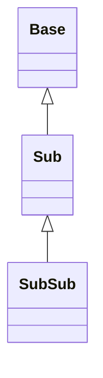
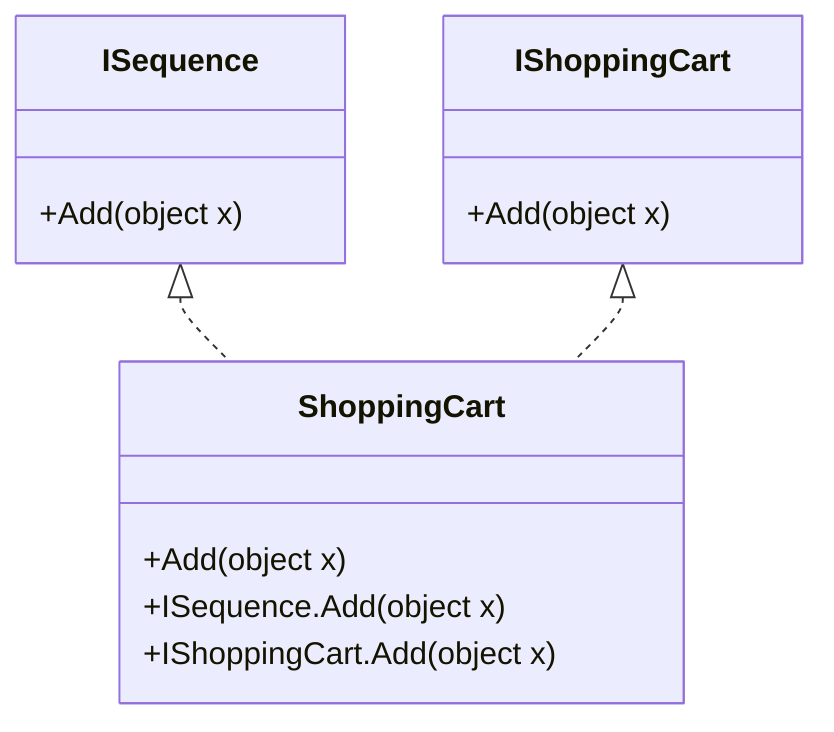

# C# Grundlagen – Vererbung

## Übersicht

- **Thema der Einheit:**
  Vererbung in C#: Klassenhierarchien, Typkompatibilität, `is`/Casts, Overriding vs. Hiding, Dynamic Binding, abstrakte Klassen, Interfaces, Interface-Namenskonflikte, Default Interface Methods, versiegelte Klassen/Members, Fragile Base Class Problem.
- **Dozent:** Manuel Bauer
- **Lernziele:**
  - Vererbungskonzepte von C# verstehen (Klassen, Interfaces, `abstract`, `sealed`)
  - Methoden, Properties und Indexer korrekt überschreiben bzw. überdecken
  - Typprüfungen und Typumwandlungen sicher anwenden (`is`, `as`, Cast)
  - Abstrakte Klassen vs. Interfaces sinnvoll einsetzen
  - Interface-Namenskonflikte erkennen und mit expliziter Implementierung lösen
  - Default Interface Methods verstehen und einsetzen
  - Auswirkungen versiegelter Klassen/Members und des Fragile Base Class Problems einschätzen

## 1. Einführung / Kontext

Vererbung ist das zentrale Mittel, um in C# Typen hierarchisch zu organisieren und Polymorphismus zu ermöglichen. Alle Klassen sind direkt oder indirekt von `System.Object` abgeleitet, können aber genau **eine** Basisklasse und beliebig viele Interfaces haben. Structs spielen in der Vererbung eine Sonderrolle: Sie erben nicht, können aber Interfaces implementieren. Die Vorlesung zeigt, wie dynamischer vs. statischer Typ zusammenhängen, wie überschreibbare Members (`virtual`/`override`) funktionieren, wie `new` Dynamic Binding unterbricht und wie abstrakte Klassen und Interfaces Rollen in einem Design modellieren.

## 2. Zentrale Begriffe und Definitionen

| Begriff                                 | Definition                                                                                                                  |
| --------------------------------------- | --------------------------------------------------------------------------------------------------------------------------- |
| Basisklasse (`Base`)                    | Klasse, von der andere Klassen erben; stellt gemeinsame Funktionalität bereit.                                              |
| Subklasse (`Sub`)                       | Klasse, die von einer Basisklasse ableitet: `class Sub : Base { }`.                                                         |
| Statischer Typ                          | Typ der Variable/Referenz im Quellcode.                                                                                     |
| Dynamischer Typ                         | Konkreter Laufzeittyp des Objekts auf dem Heap.                                                                             |
| `is`-Operator                           | Prüft Typkompatibilität: `obj is T` (bzw. `obj is T x` mit implizitem Cast).                                                |
| Cast `(T)obj`                           | Explizite Typumwandlung; wirft bei Inkompatibilität `InvalidCastException`.                                                 |
| `as`-Operator                           | Typumwandlung mit Ergebnis `null` statt Exception: `obj as T`.                                                              |
| `virtual`                               | Markiert einen Member in der Basisklasse als überschreibbar.                                                                |
| `override`                              | Überschreibt einen `virtual`/`abstract`-Member in der Subklasse.                                                            |
| `new` (Member)                          | Überdeckt (hided) einen Member der Basisklasse und unterbricht Dynamic Binding.                                             |
| Dynamic Binding                         | Auswahl der zur Laufzeit konkretesten `virtual`-Implementierung abhängig vom dynamischen Typ.                               |
| Abstrakte Klasse                        | Klasse mit `abstract`, kann nicht instanziiert werden, enthält ggf. abstrakte Members.                                      |
| Abstrakte Methode/Property              | Member ohne Implementierung; muss in konkreter Subklasse `override`t werden.                                                |
| Interface                               | Vertrag mit Signaturen (Methoden, Properties, Indexer, Events), ohne eigene Instanzen.                                      |
| Default Interface Method                | Interface-Member mit Implementierung (C# 8+).                                                                               |
| Versiegelte Klasse (`sealed`)           | Klasse, von der nicht mehr abgeleitet werden darf.                                                                          |
| Versiegelter Member (`sealed override`) | Überschriebener Member, der in weiteren Subklassen nicht mehr überschrieben werden darf.                                    |
| Fragile Base Class Problem              | Problem, dass Änderungen in der Basisklasse bei Verwendung von Vererbung unerwartete Effekte in Subklassen auslösen können. |

## 3. Hauptinhalte

### 3.1 Überblick Vererbung, Zuweisungen & Typprüfungen

**Basisklasse/Subklasse (Beispiel auf Seite 5)**

```csharp
class Base
{
    int _a;
    public Base() { /* ... */ }
    public void F() { /* ... */ }
}

class Sub : Base
{
    int _b;
    public Sub() { /* ... */ }
    public void G() { /* ... */ }
}
```

**Regeln:**

- Nur **eine** Basisklasse, aber beliebig viele Interfaces.
- Structs:
  - können **nicht** erben,
  - können **nicht** erweitert werden,
  - können Interfaces implementieren.

- Alle Klassen sind direkt oder indirekt von `System.Object` abgeleitet; Structs sind über Boxing mit `System.Object` kompatibel.

**Zuweisungen & Typkompatibilität (Seite 6)**

```csharp
class Base { }
class Sub : Base { }
class SubSub : Sub { }

Base b = new Base();   // statisch: Base, dynamisch: Base
b = new Sub();         // statisch: Base, dynamisch: Sub
b = new SubSub();      // statisch: Base, dynamisch: SubSub

Sub s = new Base();    // Compilerfehler
```

- Zuweisung erlaubt, wenn der **statische Typ** gleich oder eine **Basisklasse** des dynamischen Typs ist.
- Zuweisung verboten, wenn der statische Typ eine **Subklasse** ist oder in keiner Beziehung steht.

**Einfache Vererbungshierarchie**



**Typprüfungen mit `is` (Seite 7)**

```csharp
SubSub a = new SubSub();
if (a is SubSub) { } // true
if (a is Sub)     { } // true
if (a is Base)    { } // true

a = null;
if (a is SubSub) { } // false
```

- `obj is T` liefert:
  - `true`, wenn Typ von `obj` identisch mit `T` oder Subtyp von `T` ist,
  - `false`, wenn `obj` `null` ist oder `obj` eine **Basisklasse** von `T` hat oder in keiner Hierarchie-Beziehung steht.

**Typumwandlungen: Cast vs. `as` (Seiten 8–9)**

```csharp
Base b = new SubSub();
Sub s = (Sub)b;       // Cast, Exception bei Inkompatibilität
SubSub ss1 = b as SubSub; // null bei Inkompatibilität
```

- Cast `(T)obj`:
  - wirft `InvalidCastException` bei falschem Typ.

- `as`:
  - syntactic sugar für `obj is T ? (T)obj : (T)null`,
  - gibt `null` statt Exception zurück,
  - beide: Compilerfehler, wenn klar unzulässig (z.B. `int i = (int)null;`).

**`is` mit implizitem Cast (Seite 10)**

```csharp
Base a = new SubSub();
if (a is SubSub casted)
{
    Console.WriteLine(casted);
}
```

- Wenn der Test erfolgreich ist, steht der gecastete Wert in der neuen Variable `casted` vom Typ `SubSub`.

### 3.2 Methoden & Vererbung – Overriding vs. Hiding

#### Virtual & Override (Seiten 12–15)

```csharp
class Base
{
    public virtual void G() { /* ... */ }
}

class Sub : Base
{
    public override void G() { /* ... */ }
}

class SubSub : Sub
{
    public override void G() { /* ... */ }
}
```

**Regeln:**

- Members sind standardmässig **nicht** `virtual`.
- Eine Methode kann überschrieben werden, wenn:
  - sie in der Basisklasse `virtual`/`abstract` ist,
  - Signatur identisch ist (Anzahl, Typen, `ref`/`out`),
  - gleiche Sichtbarkeit und gleicher Rückgabetyp.

- `virtual` kann nicht mit `static`, `abstract`, `private` oder `override` kombiniert werden.

#### Dynamic Binding (Seite 15)

```csharp
Base b = new SubSub();
b.G(); // ruft SubSub.G()
```

- Aufruf richtet sich nach dem **dynamischen Typ** (SubSub), nicht nach dem statischen (Base), wenn `virtual`.

**Vereinfachtes Regelwerk (Pseudocode auf Seite 18)** – sinngemäss:

1. Starte bei der Methode `M` des statischen Typs.
2. Gehe die Typen von Base → Sub → SubSub durch:
   - Wenn `override M` gefunden, ersetze `m`.
   - Wenn ein nicht-override `M` gefunden wird (`new` oder ohne Keyword), breche ab.

3. Rufe `m` auf.

#### Methoden überdecken mit `new` (Seiten 16–21)

```csharp
class Base
{
    public virtual void H() { }
}

class Sub : Base
{
    public override void H() { }
}

class SubSub : Sub
{
    public new void H() { }   // Hiding
}
```

- `new` signalisiert bewusstes **Überdecken** eines Members.
- Dynamic Binding wird **unterbrochen**: ab dem ersten nicht-`override`-Member wird die Suche gestoppt.

Die Beispiele J/K/L (Seiten 19–21) zeigen, dass je nach statischem Typ (`Base`, `Sub`, `SubSub`) unterschiedliche Methoden aufgerufen werden, obwohl dasselbe Objekt (`new SubSub()`) zugrunde liegt.

**Visualisierung: Auflösung eines Methodenaufrufs**

```mermaid
flowchart TD
  A["Aufruf: b.M()"] --> B[Starte bei statischem Typ Base]
  B --> C{M ist virtual?}
  C -->|Nein| D[verwende Base.M]
  C -->|Ja| E[Gehe durch Sub-Typen]
  E --> F{Typ hat override M?}
  F -->|Ja| G[verwende dieses override]
  F -->|Nein|"H{Typ hat non-override M (new/ohne)?}"
  H -->|Ja| I[verwende non-override M und STOP]
  H -->|Nein| E
```

### 3.3 Abstrakte Klassen

**Beispiel `Sequence` (Seiten 23–26)**

```csharp
abstract class Sequence
{
    public abstract void Add(object x);      // Methode
    public abstract string Name { get; }     // Property
    public abstract object this[int i]       // Indexer
    { get; set; }
    public abstract event EventHandler OnAdd;

    public override string ToString()
        => Name;
}

class List : Sequence
{
    public override void Add(object x) { /* ... */ }
    public override string Name        { get { /* ... */ } }
    public override object this[int i] { get { /* ... */ } set { /* ... */ } }
    public override event EventHandler OnAdd;
}
```

**Regeln:**

- Abstrakte Klassen:
  - können nicht instanziiert werden,
  - können beliebig viele Interfaces implementieren,
  - dürfen nicht `sealed` sein.

- Abstrakte Members:
  - haben keinen Methoden-Body/Anweisungsblock,
  - sind implizit `virtual`,
  - dürfen nicht `static` oder explizit `virtual` sein,
  - können nur in abstrakten Klassen deklariert werden,
  - müssen in _nicht abstrakten_ Subklassen überschrieben werden.

- Bei Properties/Indexern muss die `get`/`set`-Kombination der Override-Implementierung identisch zur Deklaration sein.

### 3.4 Interfaces: Implementierung, Verwendung & Naming Clashes

#### Interfaces definieren & implementieren (Seiten 28–30)

```csharp
interface ISequence
{
    void Add(object x);
    string Name { get; }
    object this[int i] { get; set; }
    event EventHandler OnAdd;
}

class List : ISequence
{
    public void Add(object x) { /* ... */ }
    public string Name        { get { /* ... */ } }
    public object this[int i] { get { /* ... */ } set { /* ... */ } }
    public event EventHandler OnAdd;
}
```

- Members in Interfaces sind implizit `abstract virtual`, ohne Sichtbarkeit (`public` erzwingt der Compiler in der implementierenden Klasse).

**Verwendung (Seite 30):**

```csharp
List list1 = new List();
list1.Add("Hello");

ISequence list2 = new List();
list2.Add("Hello");

list1 = (List)list2;
list1 = list2 as List;

if (list1 is ISequence) { /* ... */ }
```

→ Polymorpher Zugriff über Interface-Typen, Casts wie bei Klassen.

#### Interface Naming Clashes (Seiten 32–36)

Zwei Interfaces können gleiche Membernamen haben:

```csharp
interface ISequence
{
    void Add(object x);
}

interface IShoppingCart
{
    void Add(object x);
}
```

**Szenario 1 – gleiche Bedeutung, gleiche Signatur**

- Eine Implementierung reicht:

```csharp
class ShoppingCart : ISequence, IShoppingCart
{
    public void Add(object x) { /* ... */ }
}
```

**Szenario 2 – unterschiedliche Bedeutung** (Add hat verschiedene Logik)

- **Explizite Implementierung**:

```csharp
class ShoppingCart : ISequence, IShoppingCart
{
    void ISequence.Add(object x)     { /* ... */ }
    void IShoppingCart.Add(object x) { /* ... */ }
}
```

- Aufruf nur über das jeweilige Interface:

```csharp
ISequence     sc1 = new ShoppingCart();
IShoppingCart sc2 = new ShoppingCart();
sc1.Add("Hello"); // ISequence.Add
sc2.Add("Hello"); // IShoppingCart.Add
```

**Szenario 3 – unterschiedl. Logik, aber ein Default-Verhalten**

- Eine öffentliche Methode + eine explizite:

```csharp
class ShoppingCart : ISequence, IShoppingCart
{
    public void Add(object x) { /* Default */ }
    // void ISequence.Add(object x) { /* optional */ }
    void IShoppingCart.Add(object x) { /* ... */ }
}
```

**Szenario 4 – unterschiedl. Rückgabetypen**

- Normal + zwei explizite Varianten:

```csharp
interface IShoppingCart
{
    int Add(object x);
}

class ShoppingCart : ISequence, IShoppingCart
{
    public void Add(object x)       { /* ... */ }
    void ISequence.Add(object x)    { /* ... */ }
    int  IShoppingCart.Add(object x){ /* ... */ }
}
```

**Interface-Konflikt-Lösung (explizite Implementierung)**



### 3.5 Default Interface Methods (Seiten 38–39)

Motivation: Code-Duplikate vermeiden, wenn ein Interface häufig implementiert wird.

```csharp
interface IPerson
{
    string FirstName { get; }
    string LastName  { get; }
    string FullName  => $"{FirstName} {LastName}";
    void Print()     => Console.WriteLine(FullName);
}
```

- Interfaces können nun **Implementierungen** für Methoden, Properties, Indexer, Events und sogar Operatoren enthalten.
- Zugriff häufig nur über Interface-Referenz:

```csharp
Person1 p1 = new();
p1.Print();  // ggf. Compilerfehler, wenn keine eigene Implementierung

IPerson p2 = p1;
p2.Print();  // nutzt Default-Implementierung
```

### 3.6 Versiegelte Klassen & Members

**Versiegelte Klassen (`sealed`) – Seite 41**

```csharp
sealed class Sequence
{
    public void Add(object x) { }
    public string Name       { get { } }
    public object this[int i]{ get { } }
    public event EventHandler OnAdd;
}

// Compilerfehler:
class List : Sequence { }
```

- verhindert Ableitung (wie `final` in Java), z.B. aus Sicherheits- oder Performance-Gründen.

**Versiegelte Members (`sealed override`) – Seite 42–43**

```csharp
abstract class Sequence
{
    public virtual void Add(object x) { }
}

class List : Sequence
{
    public override sealed void Add(object x) { }
}

class MyList : List
{
    // public override void Add(object x) {} // Compilerfehler
}
```

- `sealed` darf nur in Kombination mit `override` verwendet werden.
- Spätere Subklassen können den Member nicht mehr überschreiben, aber mit `new` überdecken:

```csharp
class MyList : List
{
    public new virtual void Add(object x) { }
}
```

### 3.7 Fragile Base Class Problem (Seiten 45–46)

**Java-Beispiel (Seite 45):** Änderung in `LibraryClass` führt dazu, dass `CleanUp()` plötzlich `Delete()` der Subklasse aufruft (Dynamic Binding), obwohl sich nur die Implementierung der Basisklasse geändert hat – potenziell gefährlich.

**C#-Variante (Seite 46):**

- Basisklasse verwendet `virtual` für `CleanUp` und später auch für `Delete`.
- Wird der Client-Code neu kompiliert, warnt der Compiler, dass `MyClass.Delete` entweder `new` oder `override` verwenden muss → Problem wird sichtbar.
- Verhindert, dass unbemerkt gefährliches Verhalten entsteht (sofern neu kompiliert wird).

## 4. Zusammenhänge und Interpretation

- Vererbung ermöglicht **Polymorphismus**: Basisklassen-Referenz → verschiedene konkrete Implementierungen; Dynamic Binding entscheidet zur Laufzeit.
- `virtual`/`override` bilden das Kernmodell für Polymorphismus; `new` durchbricht es bewusst und sollte sparsam verwendet werden, um keine Überraschungen zu erzeugen.
- Abstrakte Klassen und Interfaces modellieren Rollen:
  - Abstrakte Klassen → gemeinsame Implementierungsbasis + Vertrag.
  - Interfaces → reine Verträge, oft mehrere pro Klasse.

- Default Interface Methods bieten eine Art „Mehrfachvererbung“ für Implementierungen – sinnvoll, aber mit Vorsicht zu verwenden (Komplexität, Konflikte).
- Versiegelte Klassen/Members und klare Use-Cases (z.B. Framework-APIs) reduzieren das Fragile Base Class Problem, indem sie unbeabsichtigte Erweiterungen/Overrides verhindern.

## 5. Beispiele und Anwendungen

1. **Formen-Hierarchie**
   - `abstract class Shape` mit `abstract double Area()`.
   - `class Circle : Shape`, `class Rectangle : Shape` überschreiben `Area`.
   - Liste von `Shape` iterieren und Polymorphismus demonstrieren.

2. **Interface-basiertes Logging**
   - `interface ILogger { void Log(string msg); }`.
   - `ConsoleLogger`, `FileLogger` implementieren Interface.
   - Methode, die nur `ILogger` kennt und beliebige Logger nutzt.

3. **Naming Clash: ShoppingCart**
   - `ISequence.Add` vs. `IShoppingCart.Add` mit expliziter Implementierung.
   - Zeigen, dass Aufruf über Klasseninstanz nicht möglich ist – nur via Interface-Cast.

4. **Default Interface Method**
   - `IValidatable` mit `bool IsValid()` als Default, welches Properties via Reflection prüft.
   - Klassen überschreiben `IsValid()` bei Bedarf.

5. **Versiegelte Klasse**
   - `sealed class Money` als Value-Objekt mit Währungslogik.
   - Diskussion: warum man Erweiterung hier ggf. verbieten möchte.

## 6. Zusammenfassung / Takeaways

- C# erlaubt **Einfachvererbung** bei Klassen, aber **Mehrfachvererbung** bei Interfaces. Structs erben nicht, können aber Interfaces implementieren.
- Statischer und dynamischer Typ unterscheiden sich; Polymorphismus basiert auf dem dynamischen Typ und `virtual`/`override`.
- `new` überdeckt Basismethoden und stoppt Dynamic Binding – bewusst und sparsam verwenden.
- Abstrakte Klassen und Interfaces definieren Verträge; abstrakte Members erzwingen Implementierung in Subklassen.
- Interface-Namenskonflikte werden mit expliziter Implementierung gelöst.
- Default Interface Methods ermöglichen geteilte Implementierungen auf Interfaces, ähneln aber teilweise Mehrfachvererbung.
- `sealed` bei Klassen/Members begrenzt Vererbung und kann sowohl Sicherheit als auch Performance verbessern.
- Das Fragile Base Class Problem zeigt, dass Änderungen in Basisklassen sorgfältig geplant werden müssen – Compilerunterstützung in C# reduziert Risiken, ersetzt aber keine API-Disziplin.

## 7. Lernhinweise

- Schreibe kleine Experimente zu Dynamic Binding: `Base b = new SubSub();` und variiere `virtual`, `override`, `new`.
- Übe den Umgang mit `is`, Casts und `as` – auch mit `null` und falschen Typen (Exception vs. `null`).
- Implementiere die `Sequence`/`List`-Beispiele selbst und erweitere sie um eigene Methoden/Events.
- Erstelle Demo-Projekte mit Interface-Konflikten und expliziter Implementierung, um die Syntax wirklich zu verinnerlichen.
- Lies die Selbststudiums-Teile zu versiegelten Klassen/Members und zum Fragile Base Class Problem gründlich und übertrage sie in eigene kleine Codebeispiele.

## 8. Vertiefung / weiterführende Konzepte

- **Records** und Vererbung – Value-based Equality und `with`-Kopien.
- **Generische Basisklassen und Interfaces** (z.B. `IEnumerable<T>`, `IComparable<T>`).
- **Mixins/Ersatz für Mehrfachvererbung** über Interfaces + Default Methods + Delegation.
- **Design Patterns** mit Vererbung vs. Komposition (z.B. Template Method, Strategy).
- API-Design-Guidelines von .NET zu `virtual`, `sealed` und Vererbung generell.

## 9. Quellen & Literatur (IEEE)

[1] M. Bauer, “C# Grundlagen – Vererbung,” Foliensammlung, OST – Ostschweizer Fachhochschule, Departement Informatik, Rapperswil, 2025.

[2] Microsoft Corporation, “Inheritance (C# Programming Guide),” Online: Microsoft Learn, Zugriff: 2025.

[3] Microsoft Corporation, “Interfaces, abstract and sealed classes in C#,” Online: Microsoft Learn, Zugriff: 2025.
