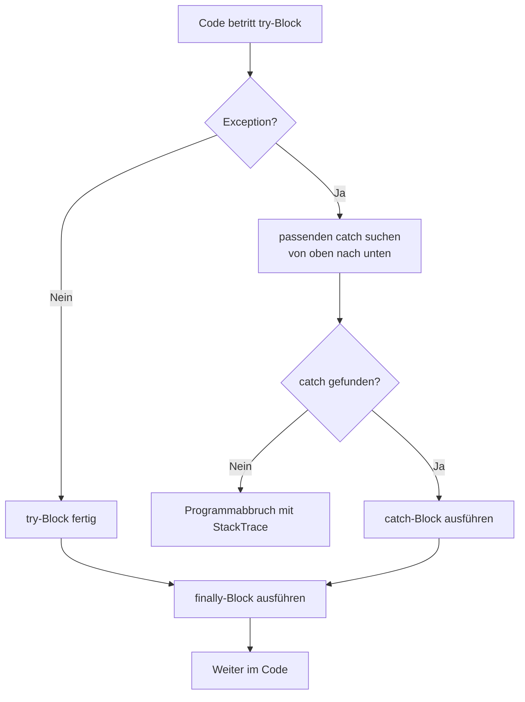
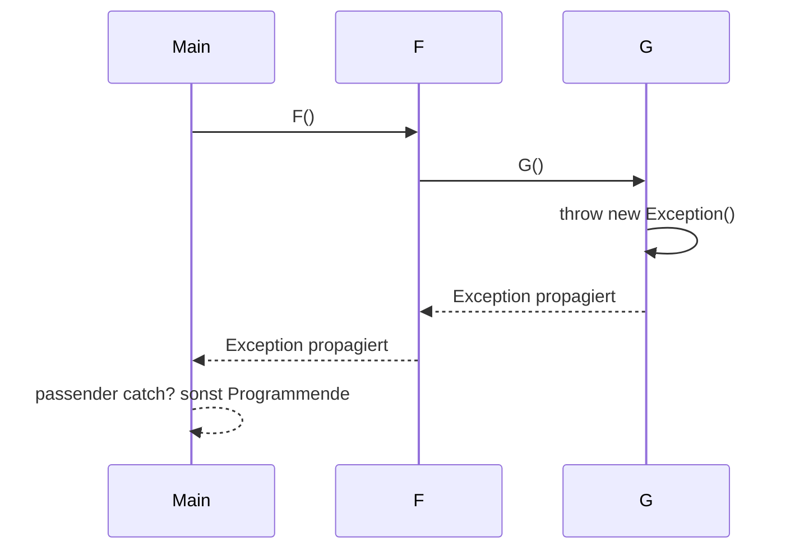

# C# Grundlagen – Exceptions

## Übersicht

- **Thema der Einheit:**
  Exceptions in C#: Fehlerbehandlung zur Laufzeit, Exception-Hierarchie, `try`/`catch`/`finally`, `throw` vs. `throw e`, Exception Filters, Argumentprüfung, Debugging mit First-Chance-Exceptions.
- **Dozent:** Manuel Bauer
- **Lernziele:**
  - Verstehen, wie Exception Handling in .NET umgesetzt ist
  - Exceptions auch in komplexeren Szenarien (z.B. mit Delegates) korrekt behandeln
  - Unterschied zwischen `throw` und `throw e` erklären
  - Exceptions im Debugger analysieren und passende Einstellungen in Visual Studio kennen

## 1. Einführung / Kontext

Exceptions behandeln unerwartete Programmzustände zur Laufzeit – etwa ungültige Argumente, Ressourcenprobleme oder Programmierfehler. Statt Fehlercodes über Rückgabewerte zu schleusen, signalisiert .NET Fehler mittels Exception-Objekten, die durch den Call Stack nach oben „geworfen“ werden, bis ein passender `catch`-Block gefunden wird. Gute Fehlerbehandlung bedeutet: **vorbeugen**, wo möglich (Preconditions prüfen), **konkret beschreiben**, was schiefging, und **aufräumen**, bevor der Fehler nach außen geht.

## 2. Zentrale Begriffe und Definitionen

| Begriff                        | Definition                                                                                                                 |
| ------------------------------ | -------------------------------------------------------------------------------------------------------------------------- |
| Exception                      | Objekt, das einen Fehler- oder Ausnahmezustand zur Laufzeit beschreibt; von `System.Exception` abgeleitet.                 |
| `try`                          | Block, in dem Code ausgeführt wird, der Exceptions werfen kann.                                                            |
| `catch`                        | Block, der Exceptions eines bestimmten Typs (oder aller) behandelt.                                                        |
| `finally`                      | Block, der _immer_ ausgeführt wird (sofern nicht `Environment.FailFast` o.Ä.), egal ob eine Exception auftritt oder nicht. |
| `throw`                        | Anweisung, die eine Exception wirft; entweder neu oder zum Rethrow der aktuellen Exception.                                |
| `System.Exception`             | Basisklasse aller Exceptions mit Infos wie `Message`, `InnerException`, `StackTrace`, `TargetSite`.                        |
| Inner Exception                | Eingebettete Ursache – erlaubt das „Verketten“ von Fehlern.                                                                |
| StackTrace                     | Textdarstellung der Methodenaufrufkette zum Zeitpunkt des Fehlers.                                                         |
| First-Chance Exception         | Ausnahme, bei der der Debugger direkt beim Werfen anhält – noch bevor ein `catch` sie abfängt.                             |
| Exception Filter               | `catch`-Block mit `when`-Klausel, der nur bei erfüllter Bedingung ausgeführt wird.                                         |
| Checked / Unchecked Exceptions | Begriffspaar aus Java; in C# sind Exceptions immer „unchecked“, es gibt keine `throws`-Deklaration.                        |
| ArgumentNullException          | Exception für `null`-Argumente, die nicht `null` sein dürfen.                                                              |
| ArgumentOutOfRangeException    | Exception für Argumente ausserhalb eines erlaubten Wertebereichs.                                                          |

## 3. Hauptinhalte

### 3.1 Grundlagen: `try` / `catch` / `finally` / `throw`

**Best Practices (Folie 3):**

- Exceptions sind _Ausnahmen_: wo möglich Eingaben prüfen und Fehler vorbeugen.
- Exceptions sind Fehlercodes vorzuziehen (klarere Struktur, zentrale Behandlung).
- Möglichst **konkrete** Exceptiontypen und aussagekräftige Messages verwenden.
- Keine detaillierten Stacktraces direkt über Webschnittstellen nach außen geben (Sicherheitsrisiko).
- Bei Exceptions Ressourcen korrekt aufräumen (Streams, Sockets, Transaktionen).

**Grundmuster (Folie 5–6):**

```csharp
FileStream s = null;
try
{
    s = new("Test.txt", FileMode.Open);
    /* ... */
}
catch (FileNotFoundException e)
{
    Console.WriteLine("{0} not found", e.FileName);
}
catch (IOException)
{
    Console.WriteLine("IO exception occurred");
}
catch   // catch (Exception)
{
    Console.WriteLine("Unknown error occurred");
}
finally
{
    if (s != null) s.Close();
}
```

Regeln:

- `catch`-Blöcke werden **sequenziell** geprüft; der erste passende wird ausgeführt.
- Pro Exception wird **höchstens ein** `catch` ausgeführt.
- `catch` ohne Typ → implizit `Exception`.
- `catch` ohne Variablenname → möglich, wenn `e` nicht verwendet wird.
- `finally` wird immer ausgeführt (falls vorhanden).

**Visualisierung: `try`/`catch`/`finally`-Ablauf**



### 3.2 `System.Exception` und wichtige Properties

`System.Exception` stellt das gemeinsame Gerüst aller Exceptions bereit (Folie 7–8):

- **Konstruktoren:**
  - `Exception()`
  - `Exception(string message)`
  - `Exception(string message, Exception innerException)`

- **Wichtige Properties:**
  - `Message`: Fehlermeldung als String
  - `InnerException`: verschachtelte Ausnahme
  - `Source`: Quelle (Assembly/Komponente), die den Fehler verursachte
  - `StackTrace`: Methodenaufrufkette
  - `TargetSite`: Methode, die die Exception ausgelöst hat

- **Methode:**
  - `ToString()`: Kombination aus Typ, Message und StackTrace – typischer Text für Logging.

### 3.3 Exceptions auslösen: implizit und explizit

**Implizit (Folie 9):**

```csharp
int i = 0;
int x1 = 12 / i;       // DivideByZeroException

int[] arr = new int[5];
int x2 = arr[12];      // IndexOutOfRangeException

object o = null;
string x3 = o.ToString(); // NullReferenceException
```

→ Einige Exceptions werden vom CLR/Framework automatisch geworfen.

**Explizit:**

```csharp
throw new Exception("An error occured");
```

oder (besser) mit konkretem Typ, z.B. `ArgumentException`, `InvalidOperationException`, `IOException`, etc.

### 3.4 `throw` vs. `throw e` (Rethrow)

**Folie 10:**

```csharp
try
{
    throw new Exception("Failure");
}
catch (Exception e)
{
    throw e;   // StackTrace beginnt HIER neu
}
```

- `throw e;` startet einen **neuen** StackTrace (die ursprüngliche Stelle geht verloren).

Richtiges Rethrow:

```csharp
try
{
    throw new Exception("Failure");
}
catch (Exception e)
{
    // evtl. Logging etc.
    throw;    // ursprünglicher StackTrace bleibt erhalten
}
```

- `throw;` wirft die _aktuelle_ Exception erneut → Debugging und Logging bleiben aussagekräftig.

### 3.5 Exception-Hierarchie & Suche nach `catch`

**Hierarchie (Folie 11):**

Vereinfachter Ausschnitt:

```text
Exception
 ├─ SystemException
 │   ├─ ArithmeticException
 │   │   ├─ DivideByZeroException
 │   │   └─ OverflowException
 │   ├─ NullReferenceException
 │   ├─ IndexOutOfRangeException
 │   ├─ InvalidCastException
 │   └─ ...
 ├─ ApplicationException
 │   └─ ... eigene Exceptions
 ├─ IOException
 │   ├─ FileNotFoundException
 │   ├─ DirectoryNotFoundException
 │   └─ ...
 └─ ...
```

**Suche nach `catch`-Klausel (Folie 12):**

- Wird eine Exception geworfen, geht die Laufzeitumgebung den Call Stack **rückwärts** durch (`G` → `F` → `Main` im Diagramm).
- In jedem Stackframe wird geprüft, ob ein passender `try`/`catch` existiert.
- Wird keiner gefunden → Programmabbruch und Anzeige von Fehlermeldung + StackTrace.

**Rückwärtssuche im Call Stack**



### 3.6 Exception Filters

Mit Exception Filters lassen sich Bedingungen an `catch`-Blöcke hängen (Folie 13):

```csharp
try
{
    /* ... */
}
catch (Exception e) when (DateTime.Now.Hour < 18)
{
    // Behandlung tagsüber
}
catch (Exception e) when (DateTime.Now.Hour >= 18)
{
    // andere Behandlung abends
}
```

- `when` erwartet einen `bool`-Ausdruck; wenn `false`, wird der `catch` ignoriert und der nächste geprüft.
- Die Exception gilt dabei weiterhin als _nicht gefangen_, d.h. der Stack bleibt unverändert.

### 3.7 C# vs. Java: Checked / Unchecked Exceptions

Folie 14 vergleicht C# mit Java:

- In **C#** gibt es **nur unchecked** Exceptions:
  - Methoden signalisieren Exceptions nicht im Methodenkopf.
  - Aufrufer _können_, müssen aber nicht explizit behandeln.

- In **Java** gibt es checked Exceptions:
  - Methode muss Exceptions per `throws` deklarieren oder behandeln.
  - Aufrufer muss entweder `try`/`catch` nutzen oder selbst `throws` weiterreichen.

Damit ist C# bequemer, aber der Compiler hilft weniger beim Erzwingen robuster Fehlerbehandlung.

### 3.8 Argumente prüfen (`ArgumentNullException`, `ArgumentOutOfRangeException`)

**Beispiel (Folie 15):**

```csharp
string Replicate(string s, int nTimes)
{
    if (s == null)
        throw new ArgumentNullException(nameof(s));

    if (s.Length == 0)
        throw new ArgumentOutOfRangeException(nameof(s));

    if (nTimes <= 1)
        throw new ArgumentOutOfRangeException(nameof(nTimes));

    return new StringBuilder()
        .Insert(0, s, nTimes)
        .ToString();
}
```

- Verwendung von `nameof(parameter)` macht den Code refactoring-sicher, da der Parametername automatisch übernommen wird.
- Passende Exceptiontypen kommunizieren klarer, was schiefgelaufen ist.

### 3.9 Debugging: First-Chance Exceptions in Visual Studio

**Folie 16 zeigt das Fenster _Exception Settings_ in Visual Studio:**

- „Break when thrown“ → Debugger stoppt **direkt** an der Stelle, an der eine Exception geworfen wird, auch wenn später ein `catch` sie behandelt.
- Einstellungen:
  - Menü: `Debug > Windows > Exception Settings`
  - Kategorie „Common Language Runtime Exceptions“ aktivieren, ggf. einzelne Typen an-/abwählen.
  - Reset auf Default-Werte über die Schaltfläche im Fenster.

Das ist besonders hilfreich, wenn Exceptions „zu spät“ sichtbar werden oder mehrfach gefangen/geworfen werden.

## 4. Zusammenhänge und Interpretation

- Exceptions bilden ein einheitliches Fehlerbehandlungskonzept in .NET – alle Fehler laufen über `System.Exception` zusammen.
- Die Hierarchie der Exceptiontypen erlaubt es, **allgemeine** Fehler (z.B. `IOException`) oder **spezifische** Fälle (z.B. `FileNotFoundException`) abzudecken.
- Der Unterschied zwischen `throw` und `throw e` ist entscheidend für gutes Debugging: nur `throw` erhält den ursprünglichen StackTrace.
- Exception Filters (`when`) erlauben saubere Trennung von Fehlerfällen, ohne verschachtelte `if`-Blöcke im `catch`.
- Durch gezielte Argumentprüfung mit passenden Exceptiontypen lassen sich viele Fehler früh und klar erkennen – idealerweise, bevor tief im Call Stack „mysteriöse“ NullReference- oder RangeExceptions auftreten.

## 5. Beispiele und Anwendungen

1. **Robustes Datei-Handling**
   - Öffne eine Datei mit `FileStream` in einem `try`-Block, behandle `FileNotFoundException` und `IOException` separat, und schliesse den Stream im `finally`-Block.

2. **Eigene Business-Exception**
   - Leite `OrderValidationException` von `ApplicationException` oder direkt von `Exception` ab, füge Properties wie `OrderId` hinzu und verwende sie im Service-Layer.

3. **Exception Filter nach Umgebung**
   - In `DEBUG`-Umgebung Fehler anders behandeln als in `RELEASE`, z.B. mit `when (Debugger.IsAttached)`.

4. **Argumentprüfung mit `nameof`**
   - Implementiere mehrere Methoden, die `null` und ungültige Bereiche mit `ArgumentNullException` bzw. `ArgumentOutOfRangeException` behandeln.

5. **First-Chance Debugging**
   - Aktiviere in Visual Studio „Break on all CLR Exceptions“ und beobachte, wo in deinem Code Exceptions tatsächlich geworfen werden, auch wenn sie später abgefangen werden.

## 6. Zusammenfassung / Takeaways

- Exception Handling in C# basiert auf `try`/`catch`/`finally` und einer einheitlichen `System.Exception`-Hierarchie.
- `throw` vs. `throw e`: nur `throw` erhält den ursprünglichen StackTrace beim Rethrow.
- Der Call Stack wird rückwärts nach einem passenden `catch` durchsucht; ohne Treffer endet das Programm mit Fehlermeldung und StackTrace.
- Exception Filters erlauben feingranulare, ausdrucksstarke Fehlerbehandlung.
- C# kennt keine checked Exceptions – Verantwortung für sinnvolle Behandlung liegt beim Entwickler.
- Saubere Argumentprüfung mit passenden Exceptiontypen und `nameof` erhöht Qualität und Verständlichkeit von APIs.
- Debugging-Unterstützung (First-Chance Exceptions) in Visual Studio hilft, Fehlerquellen frühzeitig und präzise zu finden.

## 7. Lernhinweise

- Schreibe kleine Programme, in denen du bewusst Exceptions auslöst (Divide by Zero, Index out of Range, NullReference) und sie mit verschiedenen `catch`-Konstellationen abfängst.
- Experimentiere mit `throw` und `throw e` und vergleiche die StackTraces in der Ausgabe bzw. im Debugger.
- Nutze das Visual-Studio-Fenster „Exception Settings“ und beobachte First-Chance Exceptions bei typischen Fehlern.
- Ersetze überall „magische“ Fehlercodes durch Exceptions mit aussagekräftigen Messages und passenden Typen.

## 8. Vertiefung / weiterführende Konzepte

- Eigene Exception-Hierarchien entwerfen (z.B. Domänen-Exceptions) und konsistent einsetzen.
- `AggregateException` bei paralleler Ausführung (`Task`, PLINQ).
- `OperationCanceledException` und Cancellation-Tokens in asynchroner Programmierung.
- Logging-Konzept für Exceptions (Serilog, NLog, Application Insights etc.).

## 9. Quellen & Literatur (IEEE)

[1] M. Bauer, “C# Grundlagen – Exceptions,” Foliensammlung, OST – Ostschweizer Fachhochschule, Departement Informatik, Rapperswil, 2025.

[2] Microsoft Corporation, “Exceptions and Exception Handling (C# Programming Guide),” Online: Microsoft Learn, Zugriff: 2025.

[3] Microsoft Corporation, “Best Practices for Exceptions,” Online: Microsoft Learn, Zugriff: 2025.
