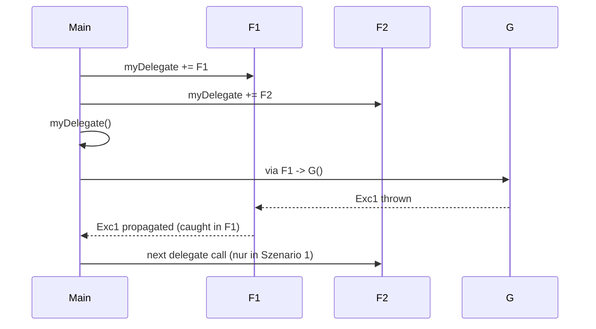

# C# Grundlagen – Delegates & Events

## Übersicht

- **Thema der Einheit:**
  Delegates, Multicast-Delegates, Funktionsparameter, Callbacks, Events, .NET-Event-Pattern, Lambda Expressions, Closures, Exceptions mit Delegates.
- **Dozent:** Manuel Bauer
- **Lernziele:**
  - Delegates deklarieren und anwenden
  - Unterschied zwischen Single- und Multicast-Delegate verstehen
  - Delegates als Funktionsparameter und Callback/Event korrekt einsetzen
  - Lambda Expressions (Syntax, Expression/Statement-Lambdas, Closures) verstehen und als Delegates nutzen
  - Zusammenspiel von Delegates/Events mit Exceptions kennen

## 1. Einführung / Kontext

Delegates sind typsichere Funktionszeiger in C#. Sie ermöglichen es, Methoden als Werte zu behandeln: man kann sie speichern, herumreichen, kombinieren und asynchron oder später ausführen. Das ist die Grundlage für viele moderne Sprachfeatures: Events, Linq, asynchrone APIs, Callback-Mechanismen und Lambda-Ausdrücke.
Events sind im Kern „eingepackte“ Delegates mit spezieller Zugriffssyntax (`+=`/`-=`) und gekapseltem Auslösen; sie bilden die Standardbasis für das Observer-Pattern im .NET-Framework.

## 2. Zentrale Begriffe und Definitionen

| Begriff            | Definition                                                                                                                                                  |
| ------------------ | ----------------------------------------------------------------------------------------------------------------------------------------------------------- |
| Delegate           | Typsicherer Funktionszeiger, Referenztyp, abgeleitet von `System.MulticastDelegate` (indirekt `System.Delegate`). Hält Referenzen auf 0..n Methoden.        |
| Multicast-Delegate | Delegate, der mehrere Methoden in einer Invocation List speichert; beim Aufruf werden alle nacheinander ausgeführt. Jeder Delegate-Typ in C# ist Multicast. |
| Delegate-Typ       | Deklaration eines Delegate-Signaturtyps, z.B. `public delegate void Notifier(string sender);`.                                                              |
| Delegate-Variable  | Variable eines Delegate-Typs, die mit Methodenreferenzen belegt wird.                                                                                       |
| Callback           | Methode, die nicht direkt, sondern über einen Delegate von einer anderen Komponente aufgerufen wird (z.B. bei Timer-Ticks).                                 |
| Event              | Sprachkonstrukt um einen Delegate; kapselt den Delegate und stellt `+=`/`-=` nach aussen bereit. Nur der Typ selbst kann das Event auslösen.                |
| Event Handler      | Delegate-Typ für Events, meist mit Signatur `void Handler(object sender, EventArgs e)`.                                                                     |
| `EventArgs`        | Basisklasse für Event-Daten; spezifische Events definieren Subklassen (z.B. `ClickEventArgs`).                                                              |
| Lambda Expression  | Inline-Schreibweise für anonyme Methoden, z.B. `x => x * x`; wird einem Delegate-Typ zugeordnet.                                                            |
| Expression Lambda  | Lambda mit genau einem Ausdruck, ohne Block `{}`.                                                                                                           |
| Statement Lambda   | Lambda mit Block `{ ... }`, beliebig vielen Statements.                                                                                                     |
| Closure            | Lambda, das auf Variablen aus der äusseren Methode zugreift; diese Variablen werden in einem Hilfsobjekt „gecaptured“.                                      |

## 3. Hauptinhalte

### 3.1 Delegates – Grundlagen & Syntax

**Überblick**

- Typsichere Funktions-Pointer, objektorientiert, vom Compiler geprüft.
- Reference Type, abgeleitet von `System.MulticastDelegate`.
- Speichern intern:
  - Zielobjekt (`target`) – bei Instanzmethoden
  - Methodeninfo (`method`) – welche Methode aufgerufen wird
  - ggf. `prev` für Verkettung bei Multicast.

**Deklaration & Verwendung**

```csharp
// Delegate-Typ
public delegate void Notifier(string sender);

class Examples
{
    public static void Test()
    {
        // Delegate-Variable
        Notifier greetings;

        // Zuweisung einer Methode (Langform)
        greetings = new Notifier(SayHi);

        // Kurzform
        greetings = SayHi;

        // Aufruf
        greetings("John");
    }

    private static void SayHi(string sender)
        => Console.WriteLine("Hello {0}", sender);
}
```

- Jede Methode mit passender Signatur (Rückgabetyp, Parameteranzahl, -typen, `ref`/`out`-Arten) kann zugewiesen werden – z.B. auch `Console.WriteLine`.
- Delegate-Variable kann `null` sein → Aufruf sonst `NullReferenceException`; Standardmuster: `delegateVar?.Invoke(args);`.

**Zuweisungsregeln (syntaktisch) – Folie 11:**

- Langform (C# 1.0): `delegateVar = new DelegateType(obj.Method);`
- Typische Zuweisungen:
  - Instanzmethode: `delegateVar = this.Method;`
  - statische Methode: `delegateVar = MyClass.StaticMethod;`

- Methode darf `virtual`, `override` oder `new` sein, aber nicht `abstract`.

**Delegate-Aufruf**

```csharp
// Syntax
result = delegateVar(args);        // vom Compiler in Invoke umgeschrieben
result = delegateVar.Invoke(args); // explizit
```

Standard-Null-Check seit C# 6:

```csharp
delegateVar?.Invoke(args);
```

### 3.2 Motivation: Delegate vs. Interface

Vergleich auf _Seite 8_:

- **Interface-Lösung**

```csharp
public interface INotifier { void Notify(string sender); }

public class NotifierImpl : INotifier
{
    public void Notify(string sender)
        => Console.WriteLine("Hello {0}", sender);
}

INotifier greetings = new NotifierImpl();
greetings.Notify("John");
```

- **Delegate-Lösung** (ohne Interface):

```csharp
public delegate void Notifier(string sender);

Notifier greetings = SayHi;
greetings("John");
```

Delegates ersparen eine eigene Implementationsklasse, wenn es nur um eine „einmalige“ Funktion geht.

### 3.3 Speicher- & Objektmodell

Die Diagramme auf _Seite 9–10_ zeigen:

- Stack: Variable `greetings`, Instanz `myClass`.
- Heap: Delegate-Objekt mit Feldern `target`, `method`, `prev`.
- Code-Segment: Methoden `SayHi`, `SayCiao`, `SayInstance`.

**Visualisierung**

```mermaid
flowchart LR
  subgraph Stack
    G[Notifier greetings]
    MC[MyClass myClass]
  end

  subgraph Heap
    D[Notifier delegate\n(target, method, prev)]
  end

  subgraph Code
    SH[(SayHi)]
    SC[(SayCiao)]
    SI[(SayInstance)]
  end

  G --> D
  D --> SH
  D --> MC
```

### 3.4 Multicast Delegates

**Grundprinzip**

- Jeder Delegate ist multicast-fähig.
- Invocation List kann mehrere Methoden enthalten.
- Operatoren:
  - `=` → setzt die Liste neu
  - `+=` → fügt Methode hinzu
  - `-=` → entfernt letzte passende Methode

**Beispiel (+=)** – _Seite 18_:

```csharp
public delegate void Notifier(string sender);

Notifier greetings = SayHi;
greetings += SayHi;
greetings += SayCiao;
greetings += SayHi;

greetings("John");
// Aufrufreihenfolge:
// SayHi("John");
// SayHi("John");
// SayCiao("John");
// SayHi("John");
```

**Beispiel (-=)** – _Seite 21_: Entfernen arbeitet von „hinten“ (letzter Eintrag).

```csharp
greetings -= SayHi;
// letzte SayHi-Referenz wird entfernt
```

**Compiler-Output für Aufruf** – _Seite 18_:

```csharp
// user code
greetings("John");

// compiler output
foreach (Delegate d in greetings.GetInvocationList())
{
    ((Notifier)d).Invoke("John");
}
```

**Rückgabewerte bei Multicast** – _Seite 23_:

- Rückgabewert, `out` und `ref` entsprechen dem **letzten** Methodenaufruf in der Invocation List.

```csharp
public delegate int GetIntDelegate();

GetIntDelegate del = Get1;
del += Get2;
del += Get3;

int i = del(); // i == 3 (Ergebnis von Get3)
```

**Linked-List-Modell** – _Seite 15_: intern sind Delegates verkettet (`prev`).

### 3.5 Delegates als Funktionsparameter

**Ziel:** Eine Funktion, die für jedes Element eines Arrays eine Aktion ausführt.

```csharp
public delegate void Action(int i);

public class MyClass
{
    public static void PrintValues(int i)
        => Console.WriteLine("Value {0}", i);

    public void SumValues(int i) { Sum += i; }
    public int Sum { get; private set; }
}

public class FunctionParameterTest
{
    static void ForAll(int[] array, Action action)
    {
        Console.WriteLine("ForAll called...");
        if (action == null) return;

        foreach (int t in array)
            action(t);
    }
}
```

**Tests:**

- Ausgabe aller Werte (statische Methode) – _Seite 27_:

```csharp
int[] array = { 1, 5, 8, 14, 22 };
Action v1 = MyClass.PrintValues;
ForAll(array, v1);
ForAll(array, null);
```

- Summenbildung (Instanzmethode) – _Seite 28_:

```csharp
MyClass c = new();
Action v2 = c.SumValues;
ForAll(array, v2);
Console.WriteLine(" Sum {0}", c.Sum); // 50
ForAll(array, v2);
Console.WriteLine(" Sum {0}", c.Sum); // 100
```

**Datenfluss `ForAll`**

```mermaid
flowchart TD
  A[int[] array] --> B[ForAll]
  C[Action action] --> B
  B --> D[foreach (int t in array)]
  D --> E[action(t)]
```

### 3.6 Callback-Beispiel: Clock

**Szenario:** Uhr mit konfigurierbarem Intervall und Observern, die beim Tick benachrichtigt werden (Subscription/Unsubscription).

#### Variante 1 – mit Interface

```csharp
public interface ITickCallback
{
    void OnTickEvent(int ticks, int interval);
}

public class Clock
{
    private int _ticks;
    private List<ITickCallback> _tickCallbacks = new();

    public void add_OnTickEvent(ITickCallback h)
        => _tickCallbacks.Add(h);

    public void remove_OnTickEvent(ITickCallback h)
        => _tickCallbacks.Remove(h);

    private void Tick(object sender, EventArgs e)
    {
        _ticks++;
        foreach (var t in _tickCallbacks)
            t.OnTickEvent(_ticks, interval);
    }
}

public class ClockObserver : ITickCallback
{
    private string _name;
    public ClockObserver(string name) { _name = name; }

    public void OnTickEvent(int ticks, int i)
        => Console.WriteLine(
            "Observer {0}: Clock mit Interval {2} " +
            "hat zum {1}. Mal getickt.",
            _name, ticks, i);
}
```

**Test:** Observer registrieren/deregistrieren (Seite 33).

#### Variante 2 – mit Delegate

```csharp
public delegate void TickEventHandler(int ticks, int interval);

public class Clock
{
    private int _ticks;
    private TickEventHandler OnTickEvent;

    public void add_OnTickEvent(TickEventHandler h)
        => OnTickEvent += h;

    public void remove_OnTickEvent(TickEventHandler h)
        => OnTickEvent -= h;

    private void Tick(object sender, EventArgs e)
    {
        _ticks++;
        OnTickEvent?.Invoke(_ticks, interval);
    }
}
```

Observer-Objekte übergeben direkt ihre Methoden:

```csharp
c1.add_OnTickEvent(t1.OnTickEvent);
```

→ Weniger Boilerplate als mit Interface, dafür enger an Delegate-Typ gebunden.

### 3.7 Events – Syntactic Sugar für Delegates

Events kapseln Delegates und generieren automatisch die Subscribe-/Unsubscribe-Logik.

**Deklaration:**

```csharp
public delegate void TickEventHandler(int ticks, int interval);

public class Clock
{
    private int _ticks;
    public event TickEventHandler OnTickEvent;

    private void Tick(object sender, EventArgs e)
    {
        _ticks++;
        OnTickEvent?.Invoke(_ticks, interval);
    }
}
```

**Compiler-Output (vereinfacht) – _Seite 37_:**

```csharp
private TickEventHandler OnTickEvent;

public void add_OnTickEvent(TickEventHandler h)
{ OnTickEvent += h; }

public void remove_OnTickEvent(TickEventHandler h)
{ OnTickEvent -= h; }
```

**Benutzung im Client-Code – _Seite 39_:**

```csharp
Clock c1 = new(1000);
ClockObserver t1 = new("O1");

// Anmelden
c1.OnTickEvent += t1.OnTickEvent;

// Abmelden
c1.OnTickEvent -= t1.OnTickEvent;
```

**Standard .NET-Eventpattern** – _Seiten 40–42_

- Delegate-Signatur:

```csharp
public delegate void AnyHandler(object sender, AnyEventArgs e);
```

- `sender`: Event-Quelle (`this` beim Aufruf).
- `AnyEventArgs`: Subklasse von `EventArgs` mit Event-spezifischen Daten.

Vorteil: Neue Felder können der EventArgs-Klasse hinzugefügt werden (z.B. `MousePosition` auf _Seite 42_), ohne die Signatur zu ändern und ohne Client-Code anzupassen.

### 3.8 Lambda Expressions

**Motivation:** ohne Lambda müssen benannte Methoden deklariert werden, selbst wenn sie nur einmal verwendet werden. Zudem können diese Methoden nicht direkt auf lokale Variablen zugreifen – man müsste Felder in der Klasse verwenden.

#### Syntax-Überblick – _Seite 46_

- Expression Lambda:
  [
  (\text{parameters}) \Rightarrow \text{expression}
  ]
- Statement Lambda:
  [
  (\text{parameters}) \Rightarrow { \text{statements}; }
  ]

```csharp
// Expression Lambda
Func<int, bool> fe = i => i % 2 == 0;

// Statement Lambda
Func<int, bool> fs = i =>
{
    int rest = i % 2;
    bool isRestZero = rest == 0;
    return isRestZero;
};
```

#### Parameter & Type Inference – _Seiten 47–48_

- 0..n Parameter möglich:

  ```csharp
  Func<bool> p0  = () => true;
  Func<int, bool> p1 = a => true;
  Func<int, int, bool> p2 = (a, b) => true;
  ```

- Typangaben meist redundant, da sie aus dem Delegate-Typ ableitbar sind:

  ```csharp
  Func<int, int, int, bool> p = (a, b, c) => true;
  ```

- `ref`/`out` sind erlaubt, solange Typkompatibilität gegeben ist.

#### Expression Lambdas – _Seite 49_

```csharp
Func<int, int> e1;
e1 = a => a * a;
e1 = a => Square(a);

Func<int, int, int> e2;
e2 = (a, b) => a * b;

Action<int> e3;
e3 = a => Console.WriteLine(a);
e3 = a => a++;
```

#### Statement Lambdas – _Seite 50_

```csharp
Func<int, int> e1;

e1 = a => { return a * a; };

e1 = a =>
{
    int sum = 0;
    for (int i = 1; i <= a; i++)
        sum += i;
    return sum;
};
```

Empfehlung: Statement-Lambdas kurz halten (2–3 Statements), sonst lieber benannte Methode.

#### Lambdas & Closures – _Seite 51_

Lambdas können auf lokale Variablen zugreifen; der Compiler erzeugt dafür ein Hilfsobjekt („DisplayClass“).

```csharp
public delegate int Adder();

static Adder CreateAdder()
{
    int x = 0;
    return () => ++x;
}

static void Test()
{
    Adder add = CreateAdder();
    Console.WriteLine(add()); // 1
    Console.WriteLine(add()); // 2
}
```

- Variable `x` lebt so lange wie das Delegate-Objekt (Closure).
- Das _diagrammartige Listing_ auf Seite 51 zeigt die generierte DisplayClass mit Feld `int x` und Methode `<CreateAdder>b__0()`.

### 3.9 Exceptions & Delegates

Die letzten Slides binden das Exception-Konzept an Delegates zurück.

- Delegates verhalten sich hinsichtlich Exception-Suche genau wie normale Methodenaufrufe:
  - Wird im Delegate-Body eine Exception geworfen, sucht die Laufzeitumgebung rückwärts nach einem passenden `catch`.
  - Bei Multicast-Delegates werden nach einer nicht abgefangenen Exception keine weiteren Methoden in der Invocation List ausgeführt (siehe Szenario 2 auf _Seite 54_).

**Multicast-Delegate & Exceptions**



## 4. Zusammenhänge und Interpretation

- Delegates sind die **technische Basis** für Events, Callbacks, LINQ und viele Framework-Funktionen.
- Multicast-Delegates ermöglichen flexible Benachrichtigungslisten (Observer) ohne eigene Sammlung zu verwalten – insbesondere in Kombination mit Events.
- Events bringen **Kapselung**: Nur der auslösende Typ darf den Delegate-Inhalt verändern, Aussenstehende verwenden `+=`/`-=`.
- Lambda Expressions sind die ergonomische Frontend-Syntax für Delegates und machen funktionale Programmiermuster im Alltag erst richtig bequem.
- Closures erlauben, Zustand in Lambdas mitzunehmen, ohne extra Klassen zu schreiben – aber der „versteckte“ Zustand sollte bewusst eingesetzt werden.
- Exceptions im Kontext von Delegates verhalten sich wie normale Exceptions – besonders bei Multicast-Delegates ist wichtig zu wissen, dass eine ungefangene Exception die Ausführung der restlichen Listener stoppt.

## 5. Beispiele und Anwendungen

1. **Filterfunktion für Listen**
   - Methode `IEnumerable<T> Filter<T>(IEnumerable<T> source, Func<T, bool> predicate)`.
   - Nutzung: `Filter(list, x => x % 2 == 0);`.

2. **Timer mit Events**
   - Klasse `Clock` mit `public event EventHandler<TickEventArgs> Tick;`.
   - Mehrere Observer registrieren sich und loggen Ticks mit unterschiedlichen Intervallen.

3. **GUI-Eventhandling**
   - Button-Click mit Standard-Signatur `object sender, EventArgs e`.
   - Neue Eigenschaften in `ClickEventArgs` hinzufügen, ohne bestehenden Code zu ändern.

4. **Summieren mit Lambdas**
   - `ForAll`-Methode mit Lambda: `ForAll(array, i => Console.WriteLine(i));` und `ForAll(array, i => sum += i);`.

5. **Closure-basierter Zähler**
   - `Func<int> MakeCounter()` → gibt Lambda zurück, das hochzählt; mehrere Counter-Instanzen mit unabhängigem Zustand.

## 6. Zusammenfassung / Takeaways

- Delegates sind typsichere, objektorientierte Funktionszeiger und in C# immer Multicast-fähig.
- Multicast-Delegates verwalten mehrere Methoden in einer Invocation List; Rückgabewert entspricht dem letzten Aufruf.
- Delegates als Funktionsparameter ermöglichen flexible APIs nach funktionalem Stil (z.B. `ForAll`, `List<T>.ForEach`).
- Events sind nur syntaktischer Zucker über Delegates, bringen aber wichtige Kapselung und das etablierte .NET-Eventpattern (Sender + EventArgs).
- Lambda Expressions (Expression/Statement) sind die Standard-Schreibweise für Delegates im modernen C#; sie unterstützen Closures.
- Exceptions in Delegates folgen der normalen Exception-Logik; bei Multicast-Delegates stoppen sie die Ausführung weiterer Listener, wenn sie nicht abgefangen werden.

## 7. Lernhinweise

- Implementiere selbst:
  - ein kleines `Clock`-Beispiel zuerst mit Interface, dann mit Delegate, dann mit Event.
  - eine `ForAll`-Methode, die verschiedene Delegates/Lambdas akzeptiert.

- Übe Lambda-Syntax: Schreibe zuerst benannte Methoden und ersetze sie schrittweise durch Lambdas (Expression & Statement).
- Analysiere mit dem Debugger die Invocation List eines Multicast-Delegates (`GetInvocationList()` ansehen).
- Spiele mit Closures: Erzeuge mehrere Counter-Lambdas und überprüfe, dass jeder seinen eigenen Zustand hat.
- Probiere aus, wie Exceptions in Multicast-Delegates das Aufrufen der restlichen Methoden beeinflussen.

## 8. Vertiefung / weiterführende Konzepte

- Generische Delegates `Func<>` und `Action<>` als Standard-Bausteine.
- Events mit `EventHandler`/`EventHandler<TEventArgs>` und Weak-Event-Pattern.
- Asynchrone Programmierung mit Delegates und `Task`/`async`/`await`.
- LINQ als durchgängige Anwendung von Delegates & Lambdas.
- Reactive Extensions (Rx) – Ereignisströme als erste Klasse.

## 9. Quellen & Literatur (IEEE)

[1] M. Bauer, “C# Grundlagen – Delegates & Events,” Foliensammlung, OST – Ostschweizer Fachhochschule, Departement Informatik, Rapperswil, 2025.

[2] Microsoft Corporation, “Delegates and Events (C# Programming Guide),” Online: Microsoft Learn, Zugriff: 2025.

[3] Microsoft Corporation, “Lambda expressions (C# reference),” Online: Microsoft Learn, Zugriff: 2025.
