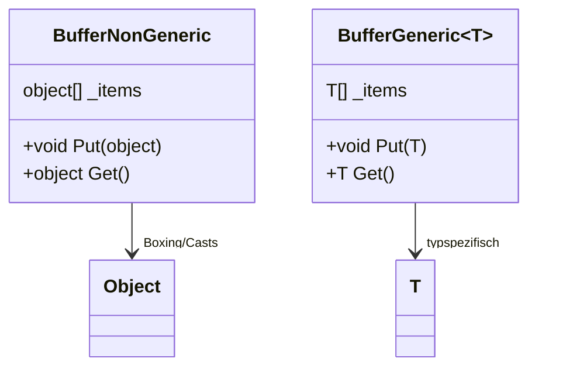

# C# Grundlagen – Generics

## Übersicht

- **Thema der Einheit:**
  Generische Typen und Methoden in C#: Motivation, Syntax, Type Constraints, generische Vererbung, generische Delegates, generische Collections sowie Ko- und Kontravarianz.
- **Dozent:** Manuel Bauer
- **Lernziele:**
  - Generische Konzepte anwenden und eigene generische Typen/Methoden entwickeln
  - Typparameter mit Constraints sinnvoll einschränken
  - Beurteilen, wann generische Konzepte mehrwert bieten (Wiederverwendung, Typsicherheit, Performance)
  - Delegates & Events in generischer Form verwenden (Action/Func/Predicate/EventHandler)
  - Ko- und Kontravarianz von generischen Interfaces/Delegates verstehen und sicher einsetzen

## 1. Einführung / Kontext

Generics ermöglichen typsichere Datenstrukturen und Algorithmen, ohne sich auf einen konkreten Typ festzulegen. Statt alles als `object` zu behandeln (mit Boxing, Casts und ohne Kompilerschutz), werden Platzhaltertypen wie `T`, `TKey`, `TValue` usw. verwendet, die bei der Verwendung konkretisiert werden (z.B. `Buffer<int>`). Dadurch entstehen wiederverwendbare, typsichere und performante APIs – besonders im Bereich der Collections und Delegates.

## 2. Zentrale Begriffe und Definitionen

| Begriff                      | Definition                                                                                                                  |
| ---------------------------- | --------------------------------------------------------------------------------------------------------------------------- |
| Generischer Typparameter `T` | Platzhalter für einen Typ; wird bei der Verwendung konkretisiert (z.B. `T=int`).                                            |
| Generischer Typ              | Klasse, Struct, Interface, Delegate oder Event mit Typparametern, z.B. `Buffer<T>`, `Dictionary<TKey, TValue>`.             |
| Konkretisierung              | Verwendung eines generischen Typs mit konkreten Typargumenten, z.B. `Buffer<int>`, `List<string>`.                          |
| Type Constraint              | Einschränkung eines Typparameters mittels `where`, z.B. `where T : struct` oder `where T : IComparable`.                    |
| Naked Type Constraint        | Constraint der Form `where T : TBase`, der fordert, dass `T` gleich oder von `TBase` abgeleitet ist.                        |
| Kovarianz (`out`)            | Erlaubt, ein „spezialisierteres“ Typargument an eine Variable mit „allgemeinerem“ Typargument zuzuweisen (Output-Richtung). |
| Kontravarianz (`in`)         | Erlaubt, ein „allgemeineres“ Typargument an eine Variable mit „spezialisierterem“ Typargument zuzuweisen (Input-Richtung).  |
| Invariant                    | Weder ko- noch kontravariant – Typargumente müssen exakt übereinstimmen.                                                    |
| Generischer Delegate         | Delegate mit Typparametern, z.B. `Action<T>`, `Func<T1, TResult>`.                                                          |
| Generische Collection        | Collection-Typ mit Typparametern, z.B. `List<T>`, `Dictionary<TKey, TValue>`, `IEnumerable<T>`.                             |

## 3. Hauptinhalte

### 3.1 Motivation & Grundidee von Generics

**Arbeiten ohne Generics (Problem):**

```csharp
public class Buffer
{
    object[] _items;
    public void Put(object item) { /* ... */ }
    public object Get()          { /* ... */ }
}

Buffer buffer = new();
buffer.Put(1);               // Boxing
buffer.Put("Hello");         // heterogen erlaubt
int i = (int)buffer.Get();   // Cast, evtl. InvalidCastException
```

- **Boxing/Unboxing** für Value Types → Performanceverlust.
- **Keine Homogenität:** beliebige Typen landen im selben Buffer; falsche Casts erst zur Laufzeit sichtbar.
- Alternative wäre pro Typ eine eigene Implementation (`IntBuffer`, `LongBuffer`, …) → Redundanz.

**Arbeiten mit Generics (Lösung):**

```csharp
public class Buffer<T>
{
    T[] _items;
    public void Put(T item) { /* ... */ }
    public T Get()          { /* ... */ }
}

Buffer<int> buffer = new();
buffer.Put(1);      // kein Boxing
int i = buffer.Get(); // kein Cast

buffer.Put("Hello"); // Compilerfehler
```

- **Typsicherheit:** Compiler verhindert falsche Typen.
- **Keine Casts / kein Boxing** → bessere Performance (siehe Vergleichsgrafik auf _Seite 9_).
- **Wiederverwendbarkeit:** Ein Typ für viele Einsatzzwecke.

**Mehrere Typparameter** (z.B. Priority Buffer):

```csharp
public class Buffer<TElement, TPriority>
{
    TElement[] _items;
    TPriority[] _priorities;

    public void Put(TElement item, TPriority prio) { /* ... */ }
}
```

Verwendung:

```csharp
Buffer<int, int> b1 = new();
Buffer<string, float> b2 = new();
```

**Namenskonvention:**

- Ein Typparameter: `T`
- Mehrere: `T1`, `T2` oder sprechende Namen wie `TElement`, `TKey`, `TValue`.

**Visualisierung: klassischer vs. generischer Buffer**



### 3.2 Type Constraints – generische Parameter einschränken

Type Constraints bestimmen, welche Typen als Typargument zulässig sind. Die Tabelle auf _Seite 12_ fasst sie zusammen.

| Constraint                | Bedeutung / Implikation                                                                                      |
| ------------------------- | ------------------------------------------------------------------------------------------------------------ |
| `where T : struct`        | `T` muss Value Type sein (inkl. `enum`). Nie `null`, liegt auf Stack/inline.                                 |
| `where T : class`         | `T` muss Reference Type sein (Klassen, Interfaces, Delegates, Arrays). Kann `null` sein.                     |
| `where T : new()`         | `T` braucht parameterlosen `public`-Konstruktor → `new T()` erlaubt. Muss **als letzter** Constraint stehen. |
| `where T : ClassName`     | `T` muss von `ClassName` ableiten → Zugriff auf alle Member von `ClassName`.                                 |
| `where T : InterfaceName` | `T` muss Interface implementieren → Zugriff auf Interface-Members.                                           |
| `where T : TOther`        | `T` identisch zu oder Subtyp von `TOther` (naked type constraint).                                           |

#### Beispiel: IComparable-Constraint

```csharp
class OrderedBuffer<TElement, TPriority>
    where TPriority : IComparable
{
    TElement[] _data;
    TPriority[] _prio;
    int _lastElem;

    public void Put(TElement x, TPriority p)
    {
        int i = _lastElem;
        while (i >= 0 && p.CompareTo(_prio[i]) > 0)
        {
            _data[i + 1] = _data[i];
            _prio[i + 1] = _prio[i];
            i--;
        }
        _data[i + 1] = x;
        _prio[i + 1] = p;
    }
}
```

- Compiler erlaubt nur kompatible Typargumente: `new OrderedBuffer<int,int>()` ok, `OrderedBuffer<int,object>` Fehler, da `object` kein `IComparable` implementiert.

#### `where T : struct`

```csharp
public void Work<T>(T source)
    where T : struct
{
    // if (source == null) ...  // Compilerfehler, T ist nie null
}
```

Nur Value Types zulässig; Aufruf mit `Work(12)` ok, mit `"Hello"` oder `new object()` nicht.

#### `where T : class`

```csharp
public void Work<T>(T source)
    where T : class
{
    if (source == null) return;
}
```

Nur Referenztypen; `Work("Hello")` ok, `Work(12)` nicht. `null` braucht explizites Typargument (`Work<object>(null)`).

#### `where T : new()`

```csharp
public T GetInstance<T>() where T : new()
{
    return new T();
}
```

→ `GetInstance<int>()`, `GetInstance<object>()` sind möglich; Typen ohne parameterlosen `public`-Konstruktor sind ausgeschlossen.

#### Class/Interface Constraints

```csharp
public void FillList<T>(T source)
    where T : List<int>
{
    source.Add(1);
    // ...
}

public void FillList2<T>(T source)
    where T : IList<int>, IEnumerable<int>
{ /* ... */ }
```

Mehrere Interface-Constraints sind kombinierbar, pro Typparameter aber nur **eine** `where`-Klausel.

#### Naked Type Constraint `where T : TBase`

```csharp
public void Work<T, TBase>(T a, TBase b)
    where T : TBase
{
    TBase to1 = a; // ok
    TBase to2 = b; // ok
    // T t2 = b;   // Fehler
}
```

Nützlich z.B. für Extension Methods und zum Kopieren von `List<Sub>` in `List<Base>`.

#### Kombinieren von Constraints

```csharp
class ExamplesCombiningConstraints<T1, T2>
    where T1 : struct
    where T2 : Buffer, IEnumerable<T1>, new()
{
    /* ... */
}
```

`new()` **immer zuletzt** in der `where`-Klausel eines Typs.

### 3.3 Generische Vererbung & Zuweisungen

Generische Klassen können von generischen oder nichtgenerischen Klassen erben.

#### Formen der Vererbung

```csharp
// Basistyp ist normale Klasse
class MyList<T> : List { }

// Basistyp ist generisch, Typparameter weitergereicht
class MyList<T> : List<T> { }

// Konkretisierte generische Basisklasse
class MyIntList : List<int> { }

// Mischform
class MyIntKeyDict<T> : Dictionary<int, T> { }

// Fehler: Typparameter werden NICHT "mitvererbt"
class MyList : List<T> { } // Compilerfehler
```

#### Zuweisung an nichtgenerische Basisklasse

```csharp
class MyList { }
class MyList<T> : MyList { }
class MyDict<TKey,TValue> : MyList { }

MyList l1 = new MyList<int>();
MyList l2 = new MyDict<int,float>();
object o1 = new MyList<int>();
```

Immer möglich, da Typargumente hier keine Rolle spielen (siehe Diagramm auf _Seite 23_).

#### Zuweisung an generische Basisklasse

```csharp
class MyList<T> { }
class MyList2<T> : MyList<T> { }
class MyDict<TKey,TValue> : MyList<TKey> { }

MyList<int> l1 = new MyList2<int>();
MyList<int> l2 = new MyDict<int,float>();

// Fehler
MyList<int> l3 = new MyList<float>();
MyList<object> l4 = new MyList<float>();
```

Hier müssen Typargumente kompatibel sein – keine automatische Varianz (dazu später mehr).

#### Methoden überschreiben

```csharp
class Buffer<T>
{
    public virtual void Put(T x) { }
}

// konkretisierte Basisklasse
class MyIntBuffer : Buffer<int>
{
    public override void Put(int x) { }
}

// generische Subklasse
class MyBuffer<T> : Buffer<T>
{
    public override void Put(T x) { }
}
```

In der konkreten Version ist `T` fest durch `int` ersetzt, in der generischen bleibt `T` erhalten.

### 3.4 Generische Delegates

#### Problem ohne generische Delegates

Das Beispiel aus der Delegates-Vorlesung war auf `int` festgelegt:

```csharp
public delegate void Action(int i);

static void ForAll(int[] array, Action action) { /* ... */ }

ForAll(a1, MyClass.PrintValues);
ForAll(a2, MyClass.PrintValues); // Compilerfehler mit string[]
```

#### Lösung: generische Delegates & Methoden

```csharp
public delegate void Action<T>(T i);

public class MyClass
{
    public static void PrintValues<T>(T i)
        => Console.WriteLine("Value {0}", i);
}

public class FunctionParameterTest
{
    static void ForAll<T>(T[] array, Action<T> a)
    {
        Console.WriteLine("ForAll called...");
        if (a == null) return;

        foreach (T t in array)
            a(t);
    }
}
```

Verwendung: funktioniert nun für `int[]` **und** `string[]`.

#### BCL-Delegates: `Action`, `Func`, `Predicate`, `EventHandler<T>`

- **Action-Delegates** (`System.Action`): Prozeduren mit 0..16 Parametern, Rückgabewert `void`.

  ```csharp
  public delegate void Action();
  public delegate void Action<in T>(T obj);
  public delegate void Action<in T1, in T2>(T1 obj1, T2 obj2);
  // ...
  ```

- **Func-Delegates** (`System.Func`): Funktionen mit 0..16 Input-Parametern, Rückgabewert `TResult`.

  ```csharp
  public delegate TResult Func<out TResult>();
  public delegate TResult Func<in T, out TResult>(T arg);
  ```

- **Predicate**: Spezialfall für `Func<T,bool>`.

  ```csharp
  public delegate bool Predicate<in T>(T obj);
  ```

- **EventHandler**: Standard-Event-Delegates im .NET Framework.

  ```csharp
  public delegate void EventHandler(object sender, EventArgs e);
  public delegate void EventHandler<TEventArgs>(
      object sender, TEventArgs e);
  ```

Diese Standarddelegates decken die meisten Alltagsfälle ab; eigene Delegates sind nur in Spezialfällen nötig.

### 3.5 Weitere Themen: Type Tests, Type Inference & Laufzeitverhalten

#### Typprüfungen / Casts

Mit generischen Typen funktionieren `is`, Casts und `as` analog zu normalen Typen.

```csharp
public class Buffer<T> { }

Buffer<int> buf = new();
object obj = buf;

if (obj is Buffer<int>)
{
    buf = (Buffer<int>)obj;
}

Type t = typeof(Buffer<int>);
Console.WriteLine(t.Name); // Buffer[System.Int32]
```

#### Generic Type Inference

Der Compiler kann Typparameter anhand der Argumente ableiten:

```csharp
public void Print<T>(T t) { /* ... */ }
public T Get<T>() { /* ... */ }

Print<int>(12);
Print(12);           // T wird als int inferiert

int i1 = Get<int>();
int i2 = Get();      // Compilerfehler: T unbestimmt
```

- Typen in **Parameterposition** → häufig inferierbar.
- Typparameter, die nur im Rückgabewert vorkommen, müssen explizit angegeben werden.

#### Laufzeit-Implementierung (Behind the Scenes)

Die Folie auf _Seite 36_ zeigt, wie die CLR generische Typen intern handhabt:

- Bei **Value Types**:
  - Für jedes Typargument wird eine eigene konkrete Type-Instanz generiert, z.B. `Buffer<int>`, `Buffer<float>`.

- Bei **Reference Types**:
  - Es gibt eine gemeinsame Implementation (i.d.R. `Buffer<object>`-ähnlich), die für alle Referenztypen wiederverwendet wird (`Buffer<string>`, `Buffer<Node>` teilen sich denselben Code).

### 3.6 Generische Collections (Überblick)

Die Tabelle auf _Seite 38–39_ listet wichtige generische Collections (`System.Collections.Generic`) samt nichtgenerischen Pendants (`System.Collections`) auf.

**Wichtige generische Typen:**

- `List<T>` – dynamische Liste
- `Dictionary<TKey,TValue>` – Hashtabelle
- `SortedList<TKey,TValue>`, `SortedDictionary<TKey,TValue>` – sortierte Maps
- `LinkedList<T>` – doppelt verkettete Liste
- `Stack<T>`, `Queue<T>` – Stapel bzw. Warteschlange
- Interfaces: `IEnumerable<T>`, `IEnumerator<T>`, `ICollection<T>`, `IList<T>`, `IDictionary<TKey,TValue>`, `IComparable<T>`, `IComparer<T>`

Die Diagramme auf _Seiten 40–41_ zeigen die Beziehungen zwischen Collection-Interfaces und konkreten Collection-Klassen (z.B. `List<T>` implementiert `IList<T>`, `ICollection<T>`, `IEnumerable<T>`).

### 3.7 Ko- und Kontravarianz

#### Motivation

- Ohne Varianz ist z.B. `IBuffer<string>` **nicht** automatisch zuweisbar an `IBuffer<object>`, obwohl `string` zu `object` zuweisbar ist (Compilerfehlerbeispiele auf _Seite 43_).
- Varianz erlaubt genau solche Zuweisungen – unter klaren Regeln.

#### Kovarianz (`out`)

- Typparameter wird nur als **Output** verwendet (Rückgabewert, `get`-Property).
- Regel: Wenn `string` → `object` zuweisbar, dann ist `IBuffer<string>` → `IBuffer<object>` zuweisbar.

```csharp
public interface IBuffer<out T> { }

public class Buffer<T> : IBuffer<T> { }

IBuffer<string> b1 = new Buffer<string>();
IBuffer<object> b2 = b1;   // erlaubt
```

Verwendet `out T` nur an erlaubten Stellen – bei Regelverletzung meckert der Compiler.

#### Kontravarianz (`in`)

- Typparameter wird nur als **Input** verwendet (Methodenparameter).
- Regel: Wenn `string` → `object` zuweisbar, dann ist `IComparer<object>` → `IComparer<string>` zuweisbar.

```csharp
public interface IComparer<in T>
{
    bool Compare(T x, T y);
}

IComparer<object> c1 = new Comparer<object>();
IComparer<string> c2 = c1;  // erlaubt
c2.Compare("a", "b");
```

Aufruf verwendet intern die `Compare(object,object)`-Implementation, aber mit Strings.

#### `in`/`out` im eigenen Interface

```csharp
interface IVariant<out TOut, in TIn>
{
    TOut GetR();          // ok
    void SetA(TIn arg);   // ok
    TOut GetRSetA(TIn a); // ok

    // folgende sind unerlaubt:
    // TIn GetA();
    // void SetR(TOut arg);
}
```

- Varianz ist nur für **Interfaces und Delegates** zulässig und nur für Referenztypen.

#### Varianz bei Delegates

- `Func<out TResult>` ist **kovariant** im Rückgabetyp.

  ```csharp
  Func<string> fstr = GetString;
  Func<object> fobj = fstr; // erlaubt
  ```

- `Action<in T>` ist **kontravariant** im Parameter.

  ```csharp
  Action<object> aobj = SetObject;
  Action<string> astr = aobj; // erlaubt
  ```

Die Tabellen auf _Seiten 51–52_ listen, welche Framework-Interfaces/-Delegates varianzfähig sind (z.B. `IEnumerable<T>` kovariant, `IComparer<T>` kontravariant, `Func<>` beides, `Action<>` kontravariant).

#### Sonderfall: Array-Kovarianz

```csharp
object[] obj = new string[10];
obj[0] = 5;  // Laufzeitfehler
```

- Arrays sind seit .NET 1.0 kovariant, was zu **Laufzeitfehlern** führen kann (hier: `string[]` hinter `object[]`).
- Generische Varianten mit `out`/`in` wären hier sicherer, da ein Interface wie `IBuffer<out T>` in diesem Fall nur _lesenden_ Zugriff erlauben würde.

## 4. Zusammenhänge und Interpretation

- Generics lösen das Spannungsfeld zwischen **Typsicherheit** und **Wiederverwendbarkeit**: generischer Code wird einmal geschrieben und mit vielen Typen verwendet – ohne Casts, ohne Boxing.
- Type Constraints verwandeln „irgend ein T“ in „T mit bestimmten Fähigkeiten“, sodass innerhalb des generischen Codes gezielt auf Methoden/Properties (z.B. `CompareTo`) zugegriffen werden kann.
- Generische Vererbung und generische Delegates (Action/Func/Predicate/EventHandler) sorgen dafür, dass dieselben Konzepte durchgängig typsicher genutzt werden – von Collections bis zu Events.
- Ko- und Kontravarianz erlauben flexible Zuweisungen für Interfaces/Delegates, ohne dabei unsichere Konstrukte wie Array-Kovarianz nachzubauen; sie machen generische APIs „offener“, bleiben aber über `in`/`out` klar eingeschränkt.

## 5. Beispiele und Anwendungen

1. **Generischer Ringpuffer**
   - Implementiere `RingBuffer<T>` mit `Enqueue`, `Dequeue`, `Count`, optional `where T : struct` für eine optimierte Variante.

2. **Prioritätswarteschlange mit Type Constraint**
   - `PriorityQueue<TElement,TPriority>` mit `where TPriority : IComparable<TPriority>`; intern sortierte Liste oder Heap.

3. **Filter-Funktion mit Func/Predicate**
   - Methode `IEnumerable<T> Filter<T>(IEnumerable<T> src, Predicate<T> pred)` und Verwendung mit Lambdas (`x => x > 0`).

4. **Varianterles Interface**
   - Interface `IReadOnlyBuffer<out T>` mit `T Get(int index); int Count { get; }` und Test der Kovarianz-Zuweisung (`IReadOnlyBuffer<string>` → `IReadOnlyBuffer<object>`).

5. **Generische EventArgs**
   - `class ValueChangedEventArgs<T> : EventArgs { public T OldValue; public T NewValue; }`
   - Event `EventHandler<ValueChangedEventArgs<int>> ValueChanged;` in einer Klasse `ObservableInt`.

## 6. Zusammenfassung / Takeaways

- Generics bieten **typsichere**, **performante** und **wiederverwendbare** Datenstrukturen und Algorithmen; Hauptanwendungsfall sind Collections und Delegates.
- Type Constraints (`struct`, `class`, `new()`, Basistyp, Interface, Naked Constraint) steuern, welche Typen einsetzbar sind und welche Members im generischen Code verfügbar sind.
- Generische Vererbung funktioniert analog zur normalen Vererbung; Typargumente müssen bei Zuweisungen kompatibel sein (keine automatische Varianz).
- Die BCL stellt mächtige generische Delegates (`Action`, `Func`, `Predicate`, `EventHandler<T>`) bereit – oft reicht deren Einsatz statt eigener Delegate-Typen.
- Ko- und Kontravarianz mit `out`/`in` machen generische Interfaces/Delegates flexibel, bleiben aber über klare Regeln sicher.
- Arrays sind historisch kovariant, was zu Laufzeitfehlern führen kann; generische variante Interfaces sind die moderne, sichere Alternative.

## 7. Lernhinweise

- Implementiere bestehende, nichtgenerische Beispiele aus früheren Vorlesungen (Buffer, ForAll, Clock, etc.) nochmals generisch.
- Experimentiere mit Type Constraints: Entferne sie und sieh, welche Compilerfehler oder Laufzeitfehler plötzlich möglich sind.
- Nutze konsequent `Action`, `Func`, `Predicate` statt eigener Delegates, wo die Signatur passt – das schärft das Gefühl für diese Typfamilien.
- Spiele mit einfachen Varianz-Beispielen (`IEnumerable<T>`, `IComparer<T>`) und prüfe, welche Zuweisungen erlaubt bzw. verboten sind.

## 8. Vertiefung / weiterführende Konzepte

- Generische Methoden in Verbindung mit LINQ und `IEnumerable<T>`.
- Generic Constraints mit `unmanaged`, `notnull` und `default`-Werten in neueren C#-Versionen.
- Generische Typen in asynchronem Code (`Task<T>`, `ValueTask<T>`).
- Eigenes kleines Collection-Framework (z.B. `ImmutableList<T>`) mit Varianz.

## 9. Quellen & Literatur (IEEE)

[1] M. Bauer, “C# Grundlagen – Generics,” Foliensammlung, OST – Ostschweizer Fachhochschule, Departement Informatik, Rapperswil, 2025.

[2] Microsoft Corporation, “Generics in C#,” Online: Microsoft Learn, Zugriff: 2025.

[3] Microsoft Corporation, “Variance in generic type parameters (C#),” Online: Microsoft Learn, Zugriff: 2025.
