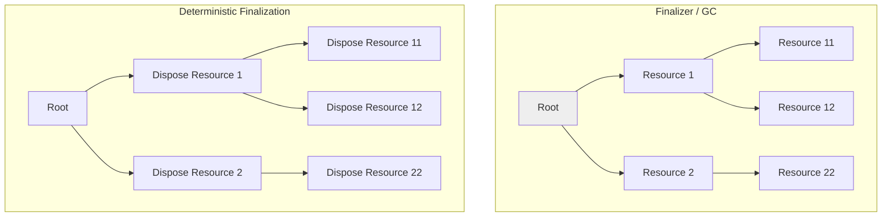

# C# Grundlagen – Deterministic Finalization

## Übersicht

- **Thema der Einheit:**
  Deterministic Finalization in C#: manuelle Freigabe von Ressourcen mit `IDisposable`, `using`-Statement und einfachem Dispose-Pattern.
- **Dozent:** Manuel Bauer
- **Datum:** Rapperswil, 2025
- **Lernziele:**
  - Wissen, wie in C# Ressourcen manuell freigegeben werden können
  - Das `using`-Statement kennen und seinen Zweck verstehen
  - Das (einfache) Dispose-Pattern in typischen Anwendungen einsetzen

## 1. Einführung / Kontext

Die CLR/der Garbage Collector kümmern sich um den Speicher von **managed Objekten** – Entwickler müssen (und können) Speicher nicht explizit freigeben. Für viele Ressourcen reicht das aber nicht: Datei-Handles, Datenbankverbindungen, COM-Objekte oder Pinned Memory liegen ausserhalb der .NET-Verwaltung (**unmanaged Ressourcen**) und müssen explizit aufgeräumt werden.

Deterministic Finalization meint: diese Ressourcen werden **zu einem klar definierten Zeitpunkt** freigegeben, z.B. am Ende eines `using`-Blocks, statt irgendwann zufällig beim nächsten Garbage-Collect. Das Slide-Deck fokussiert ausschliesslich darauf – komplexes Memory-Management und Spezialfälle werden bewusst ausgeblendet.

## 2. Zentrale Begriffe und Definitionen

| Begriff                    | Definition                                                                                                                                                |
| -------------------------- | --------------------------------------------------------------------------------------------------------------------------------------------------------- |
| Managed Objekt             | Objekt, dessen Speicher von der .NET CLR und dem Garbage Collector verwaltet wird. Beispiel: normale C#-Objekte, Strings, Arrays.                         |
| Unmanaged Ressource        | Ressource, die **nicht** vom GC verwaltet wird, z.B. Datei-Handles, Datenbankverbindungen, COM-Objekte, Pinned Memory.                                    |
| Deterministic Finalization | Muster, bei dem Freigabe von Ressourcen explizit und zeitlich kontrolliert erfolgt (z.B. über `Dispose()`/`using`) statt nur über Finalizer/GC.           |
| Finalizer / Destruktor     | Methode `~TypeName()`, die vom GC vor dem tatsächlichen Freigeben eines Objekts aufgerufen wird; Zeitpunkt ist nicht deterministisch.                     |
| `IDisposable`              | Interface mit Methode `void Dispose()`, das einen standardisierten Mechanismus zur Freigabe von unmanaged (und optional managed) Ressourcen bereitstellt. |
| Dispose Pattern            | Standard-Entwurfsmuster in .NET, wie eine Klasse `IDisposable` implementiert und optional Finalizer/Vererbung berücksichtigt.                             |
| `using`-Statement          | Sprachkonstrukt, das sicherstellt, dass `Dispose()` am Ende eines Blocks (oder Scopes) aufgerufen wird – auch bei Exceptions.                             |

## 3. Hauptinhalte

### 3.1 Managed vs. Unmanaged Ressourcen und `IDisposable`

Die Folien unterscheiden klar:

- **Managed Objekte**
  - Speicher komplett durch CLR/GC verwaltet
  - Beispiele: normale Objekte, Collections etc.

- **Unmanaged Objekte/Ressourcen**
  - Nicht durch CLR verwaltet
  - Beispiele laut Folie: File-Handles, pinned Memory, COM-Objekte, Datenbankverbindungen

Für Klassen, die solche Ressourcen halten, ist das Interface `System.IDisposable` vorgesehen:

```csharp
public interface IDisposable
{
/// Performs application-defined tasks associated with
/// freeing, releasing, or resetting unmanaged resources.
void Dispose();
}

```

**Grundidee:**

- Implementiere `IDisposable` wenn deine Klasse **unmanaged Ressourcen** enthält.
- `Dispose()` gibt diese Ressourcen wieder frei (z.B. `Close()`, `ReleaseHandle()`, `Dispose()` der eingebetteten Objekte).

### 3.2 Finalizer vs. Deterministic Finalization

Auf der Grafik auf **Seite 6** sieht man zwei Szenarien:

- **Finalizer / GC-Cleanup („Random Cleanup“)**
  - GC sammelt irgendwann nicht mehr erreichbare Objekte ein.
  - Reihenfolge ist unbestimmt: zuerst können Kind-Ressourcen verschwinden, dann Eltern oder umgekehrt.
  - Dadurch ist es schwierig sicherzustellen, dass Abhängigkeiten sauber in der richtigen Reihenfolge aufgeräumt werden.

- **Deterministic Finalization**
  - Der Code ruft explizit `Dispose()` auf Objekten auf.
  - Die Freigabe folgt der Logik der Anwendung (z.B. innerste Ressource zuerst, dann die darüber liegenden).
  - Typische Kette: Root → Resource1 → Resource11/12 → Resource2 → Resource22.

**Visualisierung (vereinfacht):**



**Fazit:** Finalizer sind Backup-Mechanismus, deterministische Dispose-Aufrufe sind der **primäre** Weg, um Ressourcen sicher zu handhaben.

### 3.3 Einfaches Beispiel mit `IDisposable`

Die Folie zeigt eine naive Implementation:

```csharp
public class DataAccess : IDisposable
{
    private DbConnection _connection;

    public DataAccess()
    { _connection = new SqlConnection(); }

    ~DataAccess() => _connection?.Dispose();

    public void Dispose()
    {
        _connection?.Dispose();
        GC.SuppressFinalize(this);
    }
}

DataAccess dataAccess = new();
/* Do Work */
dataAccess.Dispose();
```

**Gedanke dahinter:**

- Konstruktor öffnet eine Datenbankverbindung.
- `Dispose()` schliesst sie und ruft `GC.SuppressFinalize(this)`, um den Finalizer zu deaktivieren, wenn sauber disposed wurde.
- Finalizer `~DataAccess()` ist eine Art Sicherheitsnetz, falls `Dispose()` vergessen wurde – er ruft ebenfalls `_connection?.Dispose()` auf.

Diese Variante ist zwar schon besser als nichts, lässt aber Aspekte wie Mehrfachaufruf, Vererbung oder getrennte Behandlung von managed/unmanaged Ressourcen noch ausser Acht.

### 3.4 `using`-Statement – syntactic sugar für `Dispose()`

**Klassischer `using`-Block**:

```csharp
using (DataAccess dataAccess = new())
{
    /* ... Arbeit mit der Ressource ... */
}
```

Compiler generiert daraus (vereinfacht):

```csharp
DataAccess dataAccess = new();
try
{
    /* ... */
}
finally
{
    if (dataAccess != null)
    {
        dataAccess.Dispose();
    }
}
```

Damit ist garantiert, dass `Dispose()` **immer** aufgerufen wird – auch wenn im Block eine Exception auftritt.

Die Folie auf **Seite 9** zeigt Varianten:

- **Scope-Variante (ab C# 8):**

  ```csharp
  using DataAccess dataAccess1 = new();
  // am Ende der Methode / des Blocks wird disposed
  ```

- **Async-Variante:**

  ```csharp
  async using DataAccess dataAccess1 = new();
  ```

- **Mehrere Ressourcen:**

  ```csharp
  using (DataAccess dataAccess1 = new())
  using (DataAccess dataAccess2 = new())
  {
      // beide werden am Blockende disposed
  }

  using (DataAccess dataAccess1 = new(),
                 dataAccess2 = new())
  {
  }
  ```

**Merke:** `using` funktioniert mit jedem Typ, der `IDisposable` (bzw. für `async using`: `IAsyncDisposable`) implementiert.

### 3.5 C# Dispose Pattern – Überblick

Die Folien betonen: Das Dispose-Pattern existiert in mehreren Ausprägungen und soll immer sicherstellen:

- Fehlerfreie Ausführung
- **Einmalige** Ausführung (idempotent)
- Vollständiges Aufräumen aller relevanten Ressourcen

Je nach Variante werden zusätzlich berücksichtigt:

- Aufräumen von **managed** Ressourcen (andere IDisposable-Objekte)
- Aufräumen von **unmanaged** Ressourcen (Handles etc.)
- Zusammenspiel von Finalizer und deterministischem `Dispose()`
- Vererbung (Ressourcen in Basisklassen)
- Synchrone vs. asynchrone Ausführung

Die Folie verweist explizit auf die offizielle Dokumentation „Implementing a Dispose method“ für Details.

### 3.6 C# Dispose Pattern (Basic)

Die letzte Folie zeigt eine **Basic-Variante** des Dispose-Patterns für die `DataAccess`-Klasse:

```csharp
public class DataAccess : IDisposable
{
    private DbConnection _connection;
    private bool _disposed;

    public DataAccess()
    { _connection = new SqlConnection(); }

    // Finalizer
    ~DataAccess() => Dispose(false);

    // Öffentliche Dispose-Methode
    public void Dispose()
    {
        Dispose(true);
        GC.SuppressFinalize(this);
    }

    // Geschützte Dispose-Logik
    protected virtual void Dispose(bool disposing)
    {
        if (_disposed) { return; }

        if (disposing)
        {
            // Managed Ressourcen aufräumen
            if (_connection != null)
            { _connection.Dispose(); }
        }

        // Unmanaged Ressourcen aufräumen (falls vorhanden)

        _disposed = true;
    }
}
```

**Wichtige Punkte:**

- **Flag `_disposed`**
  - verhindert mehrfaches Disposen.
  - formal etwa:

    ```latex
    \[
      \text{if } disposed = \text{true} \Rightarrow \text{Dispose tut nichts mehr}
    \]
    ```

- **Finalizer vs. `Dispose(bool disposing)`**
  - Finalizer ruft `Dispose(false)` → **keine** managed Ressourcen verwenden (sie könnten bereits finalisiert worden sein).
  - Öffentliche `Dispose()` ruft `Dispose(true)` → **managed Ressourcen dürfen aufgeräumt** werden (andere `IDisposable`s, Datenbankverbindung etc.).

- **`GC.SuppressFinalize(this)`**
  - signalisiert dem GC, dass Finalizer nicht mehr benötigt wird (Objekt ist schon sauber aufgeräumt).

Damit ist sichergestellt, dass die Aufräumlogik maximal **einmal** läuft und jeweils nur die Ressourcen anfasst, die im entsprechenden Kontext sicher sind.

## 4. Zusammenhänge und Interpretation

- Finalizer sind **nicht-deterministisch**: man weiss nicht, wann der GC ein Objekt einsammelt. Für kritische Ressourcen (Dateien, DB-Connections) ist das zu spät und zu unzuverlässig.
- Deterministic Finalization über `IDisposable` + `using` gibt dem Entwickler Kontrolle: Ressourcen werden **sofort** bei Verlassen des Blocks freigegeben, unabhängig vom GC-Zeitpunkt.
- Das Dispose-Pattern trennt:
  - Aufräumen aus Anwendersicht (`Dispose()` / `using`)
  - Fallback-Aufräumen durch Finalizer
  - Gemeinsame Logik in `Dispose(bool disposing)`

- Das `_disposed`-Flag macht `Dispose()` idempotent – mehrfacher Aufruf ist erlaubt und führt nicht zu Fehlern.
- In grösseren Designs wird das Pattern um Basisklassen-Unterstützung, asynchrone Dispose-Varianten (`IAsyncDisposable`) und spezielle unmanaged Ressourcen erweitert.

## 5. Beispiele und Anwendungen

1. **Dateizugriff mit `using`**

   ```csharp
   using FileStream fs = new("data.txt", FileMode.Open);
   using StreamReader reader = new(fs);

   string content = reader.ReadToEnd();
   ```

   Datei-Handle und Reader werden deterministisch am Ende des Scopes freigegeben.

2. **Datenbankzugriff**

   ```csharp
   using SqlConnection conn = new(connectionString);
   using SqlCommand cmd = new("SELECT ...", conn);

   conn.Open();
   using SqlDataReader r = cmd.ExecuteReader();
   ```

   Verbindungen landen nicht im Connection-Pool als „Leichen“, weil `Dispose()` zuverlässig läuft.

3. **Eigene Ressourcentypen**
   - Klasse `UnmanagedBuffer` mit OS-Handle → Implementiere Basic-Dispose-Pattern und optional einen Finalizer als Sicherheitsnetz.

4. **Mehrere Ressourcen in einem Block**

   ```csharp
   using (var conn = new SqlConnection(cs))
   using (var tx = conn.BeginTransaction())
   {
       // Arbeiten mit conn + tx
   }
   ```

   Räumt beide Ressourcen deterministisch auf, auch bei Exception.

## 6. Zusammenfassung / Takeaways

- Unmanaged Ressourcen (Dateien, DB-Connections, Handles) müssen explizit freigegeben werden – hier kommt `IDisposable` ins Spiel.
- Finalizer allein sind zu unzuverlässig; deterministische Finalisierung über `Dispose()` und `using` ist Standardpraxis in .NET.
- Das Basic-Dispose-Pattern trennt Finalizer-Pfad und normalen Dispose-Pfad (`Dispose(bool disposing)`) und stellt Einmaligkeit über ein `_disposed`-Flag sicher.
- Das `using`-Statement ist syntactic sugar für `try/finally` und stellt sicher, dass `Dispose()` auch bei Exceptions immer aufgerufen wird.

## 7. Lernhinweise

- Übe, eigene Klassen mit unmanaged oder knappen Ressourcen zu schreiben und **konsequent** `IDisposable` + `using` einzusetzen.
- Schreib zunächst eine naive Dispose-Implementation und erweitere sie dann zum vollen Basic-Dispose-Pattern mit `_disposed`-Flag.
- Schau dir im Debugger an, wann Finalizer im Vergleich zu `Dispose()` aufgerufen werden (z.B. mit `Console.WriteLine` im Finalizer).
- Lies die verlinkte Microsoft-Doku zum Dispose-Pattern, um auch weiterführende Aspekte (Vererbung, async Dispose) zu verstehen.

## 8. Vertiefung / weiterführende Konzepte

- `IAsyncDisposable` und `await using` für asynchrone Freigabe (z.B. Streams mit async APIs).
- Safe Handles (`SafeHandle`-Ableitungen) als robustere Alternative zu eigenen Finalizern für OS-Handles.
- Zusammenspiel von Dispose-Pattern und Dependency Injection / Lifetime-Management (z.B. in ASP.NET Core).
- Performance-Aspekte von Finalizern: Objekte mit Finalizer wandern durch eine zusätzliche GC-Phase.

## 9. Quellen & Literatur (IEEE)

[1] M. Bauer, “C# Grundlagen – Deterministic Finalization,” Foliensammlung, OST – Ostschweizer Fachhochschule, Departement Informatik, Rapperswil, 2025.

[2] Microsoft Corporation, “Implementing a Dispose method,” Online: Microsoft Learn, Zugriff: 2025.
