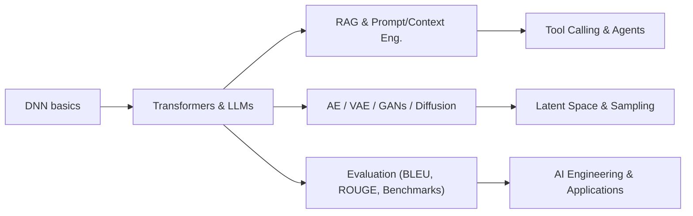
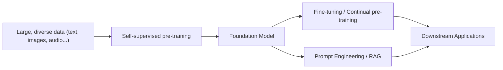
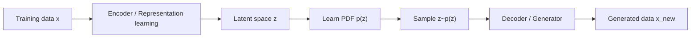

# Generative AI - Week 1: Introduction

## Overview

* **Topic of the session:** Introduction to Generative AI & AI Engineering 
* **Lecturer:** Mitra Purandare
* **Learning objectives:**

  * Understand what Generative AI is and why it is considered a revolutionary technology. 
  * Get an overview of the course structure and the role of an AI engineer. 
  * Distinguish supervised, unsupervised and self-supervised learning.
  * Understand the basics of large language models (LLMs), transformers and RLHF. 
  * Grasp the idea of foundation models and the Hugging Face ecosystem.
  * Be aware of privacy, bias, fairness and regulation in Responsible AI.
  * Get an intuitive understanding of generative models, latent space and sampling.


## 1. Introduction / Context

Artificial intelligence is “turning the world upside down” – from football to cooking shows to everyday tools like Grammarly or chatbots.

At OST, this lecture is part of the **Bachelor Artificial Intelligence** and aims to prepare you to become an **AI engineer**: someone who builds applications around powerful, pre-trained models instead of training everything from scratch. The focus is **hands-on**: using existing models, adapting them, evaluating generated data and building applications around them.


## 2. Key Terms and Definitions

| Term                                   | Definition                                                                                                                                                                                                       |
| -------------------------------------- | ---------------------------------------------------------------------------------------------------------------------------------------------------------------------------------------------------------------- |
| **Artificial Intelligence (AI)**       | Broad field of building systems that perform tasks that typically require human intelligence (perception, language, decision-making, etc.).                                                                      |
| **Generative AI**                      | AI systems that **create new content** (text, images, audio, video, code, music, strategies, etc.) by learning patterns from existing data rather than only classifying or predicting labels.                    |
| **Generative model**                   | A machine learning model that learns a **probability distribution** over data and can sample from it to generate new examples similar to the training set.                                                       |
| **Discriminative model**               | A model that learns to **distinguish** between classes, e.g. “car vs. not-car”, by directly modeling (P(y\mid x)). It outputs labels or probabilities for predefined classes.                                    |
| **Supervised learning (SL)**           | Learning with **labelled data** where each input (x) has a target label (y). Example: binary or multi-class image classification.                                                                                |
| **Unsupervised learning (UL)**         | Learning from **unlabelled data**; goal is to discover structure (e.g. clustering) or lower-dimensional representations without explicit labels.                                                                 |
| **Self-supervised learning (SSL)**     | Uses unlabelled data but derives **pseudo-labels from the data itself** (e.g. predict the next word in a sentence). Bridges supervised and unsupervised learning and solves the labelling bottleneck.            |
| **Language Model (LM)**                | Model that learns the **rules and patterns of language**, converting words to vector representations and predicting the next (or missing) token in a sequence.                                                   |
| **Large Language Model (LLM)**         | Very large language model trained on massive text corpora, typically autoregressive transformers that can perform a wide range of tasks (chat, summarization, translation, coding, etc.). ChatGPT is an example. |
| **RLHF**                               | *Reinforcement Learning with Human Feedback*: human evaluators rank or score model outputs; the model is then fine-tuned to produce high-reward responses.                                                       |
| **Multimodal AI**                      | Models that can process and relate **multiple modalities**, e.g. text + images, or text + audio.                                                                                                                 |
| **Foundation model**                   | Large model trained (typically self-supervised) on **broad and diverse data**, which can be adapted to many downstream tasks. Examples: BERT, DALL·E, GPT-3.                                                     |
| **AI Engineering**                     | The process of **building applications** with readily available models, including tooling, deployment, LLMOps and model-as-a-service.                                                                            |
| **Latent space**                       | A lower-dimensional, **hidden representation** of data that captures abstract features and relationships (e.g. ellipse parameters (a, b) instead of raw pixels).                                                 |
| **Sampling**                           | Drawing random samples from the **learned probability distribution** of a generative model to obtain new data points.                                                                                            |
| **Probability density function (PDF)** | A function that describes how likely different values of a continuous random variable are; generative models aim to approximate the unknown data PDF.                                                            |


## 3. Main Content

### 3.1 Course organisation & AI engineer perspective

**Administrative setup** 

* Lecture & exercises both on Tuesday, flexible 4×45 minutes; no strict lecture/exercise separation.
* Assessment:

  * **GenAI challenge** in the second half of the course (Agentic AI for a company called HWT) – 50% of grade.
  * **Written exam** at the end – 50% (one page of notes allowed).
* Platforms & tools:

  * JupyterHub with GPUs (Nvidia DGX-1, Azure).
  * Technologies: PyTorch, LangChain, Python, Docker, Jupyter, LangGraph. 

**Goal of the course: become an AI engineer**

* Focus on **using pre-trained models** rather than training from scratch.
* Learn:

  * LLMs, diffusion models, RNNs, autoencoders, GANs.
  * Evaluation metrics (BLEU, ROUGE, benchmarks like MMLU).
  * Transfer learning: continual pre-training, fine-tuning, prompt engineering, quantization.
  * AI engineering topics: LLMOps, application engineering, tool-calling, agents.
* Emphasis on **intuition over heavy math** and **hands-on projects**.

**Visualisation (Mermaid): overall course view**




### 3.2 What is Generative AI? – Intuition and applications

**Definition (incl. ChatGPT’s answer)**

* Generative AI can create **new content** – text, images, music, code, designs – by learning patterns from existing data.
* It does more than just classify; it **generates outputs that resemble training examples**.
* Common model families:

  * GANs (Generative Adversarial Networks)
  * VAEs (Variational Autoencoders)
  * Transformers / LLMs

**Typical use cases**

* Text: chatbots, story and lyrics generation, summarising news articles, generating gaming strategies.
* Images: text-to-image (DALL·E, Midjourney), style transfer, upscaling, “your cat as an astronaut”.
* Audio: speech transcription (Whisper), synthetic speech, music generation (e.g. MuseNet).
* Productivity: grammar assistants (Grammarly), code generation, meeting transcription.

**Rise of generative AI**

* Rapid emergence of **chatbots**, **image generation**, **music generation** and general **multimodal systems**.


### 3.3 Generative language models & self-supervised learning

#### Classical supervised learning recap

* Binary and multi-class classification examples:

  * “Car vs. not-car” with labelled images (y \in {0,1}).
  * Fashion-MNIST with 10 clothing categories. 
* Limitations:

  * Requires **labelled data**, which is expensive and time-consuming to create.
  * Example: detailed image segmentation costs several dollars per image.

#### Language models: basics

* A (large) language model:

  * Converts words/tokens into numerical vectors (embeddings).
  * Learns how words, expressions and sentences fit together.
  * Is trained to predict the **next word** (or a missing word) in a sentence.

#### Self-supervised learning (SSL)

* Uses unlabelled text but generates labels from the sequence itself.

* Example target sequences: 

  ```text
  SOS Generative -> target: AI
  SOS Generative AI -> target: is
  SOS Generative AI is -> target: a
  ...
  ```

* Any piece of text becomes **input–target pairs** without human annotation.

* SSL is not the same as “pure” unsupervised learning – it has prediction targets, just not human-labelled ones. 

#### Why is ChatGPT so powerful?

* Trained on **huge amounts of text** from books, websites and other sources.
* Uses **autoregressive transformers** (GPT-3/GPT-4).
* Further trained with **RLHF**:

  * Humans rate possible outputs (e.g. for “What is the capital of Switzerland?”).
  * A reward model learns which answers score higher (e.g. “Bern” > “Is it Bern or Zurich?” > “Sorry, I am hungry”).
  * The LLM is fine-tuned to maximise this reward.


### 3.4 Foundation models & Hugging Face ecosystem

#### AI post-2020: scale & model-as-a-service

* Demand for AI applications increased dramatically.
* Barriers to entry dropped because powerful models are available as services. 
* Consequences:

  * Large foundation models (e.g. GPT-3, DALL·E, BERT) trained on broad data. 
  * Developers focus on **using** these models via APIs or libraries instead of training them from scratch.

#### Foundation models

* Defined as models **pre-trained on large and diverse data**, adaptable to many tasks (downstream fine-tuning or prompting).

#### Hugging Face

* Platform and community for open-source ML, especially transformers and LLMs. 

  * **Models**: text, vision, audio, multimodal.
  * **Datasets**: accessible and easily loadable.
  * **Spaces**: share demos and apps.
  * **Libraries**: `transformers`, `datasets`, `tokenizers`.
* Students can explore models by task, language, license, and read **model cards** (intended use, training data, limitations). 

**Visualisation (Mermaid): foundation model pipeline**




### 3.5 Responsible use of AI

**Privacy & consent**

* Generative models can create synthetic images or data about individuals, raising questions about:

  * Use of personal data **without consent**.
  * Risk of **deepfakes**, misinformation, identity harm.
* Training on private data or scraping sensitive information raises legal and ethical concerns.

**Bias & fairness**

* Training datasets can contain **systematic biases**.
* Generative models may **inherit and amplify** these biases:

  * Stereotypical images in text-to-image models.
  * Biased language outputs (gender, race, profession, etc.).
* We need mitigation strategies and fairness-aware evaluation.

**Regulation for Responsible AI**

* Growing recognition of:

  * **Risks** associated with generative models.
  * Need for **regulatory oversight**, **transparency**, **accountability**.
* Examples mentioned:

  * Swiss AI Act.
  * EU AI Act.
  * Data protection (e.g. GDPR-related resources).


### 3.6 Generative models: probability, latent space, sampling

#### What is a generative model?

* Learns the **rules** governing complex relationships between features (pixels, words, notes, etc.).
* Once trained, we can **sample** from the model to create new data points that *look like* they came from the original dataset:

  * e.g. generating new car images after training on many car photos. 

#### Probabilistic view

Training data are assumed to come from an unknown data distribution (p_{\text{data}}(x)).
The generative model tries to approximate this distribution with (p_\theta(x)) and then samples from it.

**Mathematical sketch (LaTeX):**

$$
\text{Goal: } p_\theta(x) \approx p_{\text{data}}(x)
\quad\Rightarrow\quad x_{\text{new}} \sim p_\theta(x)
$$

Dice example:

* Rolling a (possibly unfair) dice: outcomes follow some unknown distribution.
* The model observes many rolls and learns an approximation (p_\theta); then it can generate new plausible outcomes. 

#### Representation learning & latent space

* Real-world data (digits, faces, music, books) lie in a **high-dimensional, complex space** and follow intricate distributions.
* Representation learning finds **abstract features** to describe each sample.
* Example with ellipses: instead of raw pixels, describe each ellipse by parameters (a, b) (axes).

  * This yields a **lower-dimensional latent space** of pairs ((a,b)).

Key properties of latent space:

* Each point corresponds to some valid (or near-valid) data instance.
* We can manipulate properties in latent space:

  * Make an ellipse into a circle by enforcing (a = b).
  * Change size, orientation, shape smoothly.
* For **images**, latent vectors map to images; for **text**, they map to sequences of tokens.

#### Sampling from latent space

* The generative model learns which regions of latent space are **likely** given the training data.
* To generate:

  1. Sample a latent vector (z) from the learned PDF.
  2. Decode (z) into the original space (image, text, etc.).
* Sampling must include randomness; otherwise the model would always produce the same output.

**Visualisation (Mermaid): generative process**




## 4. Relationships and Interpretation

* **Classical ML vs. Generative ML**:

  * Classical supervised ML (discriminative) predicts labels from inputs.
  * Generative models learn the **data distribution** itself and can create new samples.
* **SSL as the bridge**:

  * Uses unlabelled data but creates prediction targets internally – crucial for training large language models on web-scale text. 
* **Foundation models & AI engineering**:

  * Foundation models are the “engines”; AI engineering is about **wiring them into products**: retrieval, tool calling, UX, evaluation and monitoring.
* **Responsible AI as cross-cutting concern**:

  * No matter how powerful the model, privacy, bias, safety and regulation must be considered throughout the lifecycle.


## 5. Examples and Applications

* **Text**

  * Chatbots (e.g. ChatGPT), email drafting, tutoring systems, automated case notes, AI-driven podcasts for Swiss national votes.
* **Vision & design**

  * Figma-to-HTML conversion, avatar generation to encourage healthy eating, geoguesser-like applications with generative hints. 
* **Audio & music**

  * Music generation models, synthetic speech in custom voice styles.
* **Productivity**

  * Summarising news, improving images, transcribing meetings, grammar & style correction.

These examples illustrate how one **foundation model** can underpin many different applications with relatively small adaptations.


## 6. Summary / Takeaways

* **Generative AI** creates new content by learning from large datasets and sampling from learned probability distributions.
* Modern systems rely heavily on **self-supervised learning** and **transformer-based language models** (LLMs).
* **Foundation models** change the way we build systems: instead of training everything from scratch, we adapt and orchestrate large pre-trained models.
* **AI engineering** is about building robust applications around these models (LLMOps, evaluation, tool-calling, agents).
* Understanding **latent space** and **sampling** provides an intuitive picture of how generative models create realistic but new examples.
* Responsible use is essential: issues of **privacy**, **bias**, **fairness** and **regulation** cannot be ignored.


## 7. Study Tips

* **Connect with prior knowledge**: review your understanding of basic ML (supervised vs unsupervised, neural networks). This will make generative concepts easier. 
* **Play with real systems**:

  * Try chatGPT and other LLMs; observe how prompts change outputs.
  * Experiment with image generators and note how text prompts control style/content.
* **Use Hugging Face**:

  * Browse model cards; run small demos on free Spaces.
  * Look at example code to see typical inference pipelines. 
* **Think in terms of distributions & representations**:

  * When you see a model “generate”, ask: *What distribution is it sampling from? What is its latent space?*
* **Follow the moving target but don’t get overwhelmed**:

  * Models will continue to evolve; focus on core concepts so you can understand and evaluate new models when they appear.


## 8. Further Topics / Next Steps

Later in the course (according to the rough plan) you will touch on:

* DNN basics and transformer architectures.
* Prompt engineering, context management and RAG.
* Evaluation frameworks & benchmarks for generative models.
* Tool calling and agentic AI systems.
* Vision-language models and advanced generative architectures (AE/VAE, GANs, diffusion).

You will also work on a **GenAI challenge** project, applying these concepts in a realistic, agentic AI scenario.


## 9. References & Literature (IEEE style)

*(Some entries are reconstructed from slide links and common sources.)*

[1] A. Vaswani *et al.*, “Attention Is All You Need,” in *Proc. Advances in Neural Information Processing Systems (NeurIPS)*, 2017. 

[2] R. Bommasani *et al.*, “On the Opportunities and Risks of Foundation Models,” arXiv:2108.07258, 2021. 

[3] “Hugging Face – Models, Datasets, Spaces and Docs,” Hugging Face, accessed: 2025. 

[4] “The rise of generative AI and large language models,” Information Is Beautiful / LifeArchitect resources, accessed: 2025.

[5] “Deepfake,” *Wikipedia*, available online, accessed: 2025. 

[6] Swiss Federal Council, “Swiss AI Act – Media Releases and Legal Framework,” accessed: 2025. 

[7] European Commission, “EU AI Act – Legal Framework for Artificial Intelligence,” accessed: 2025. 

[8] S. Ruder, “An overview of self-supervised learning,” blog and tutorial resources, accessed: 2025. (For conceptual background on SSL vs UL.) 

[9] M. Purandare, *Week 1: Introduction – Generative AI*, Lecture Slides, OST – Ostschweizer Fachhochschule, 16 Sep. 2025. 

