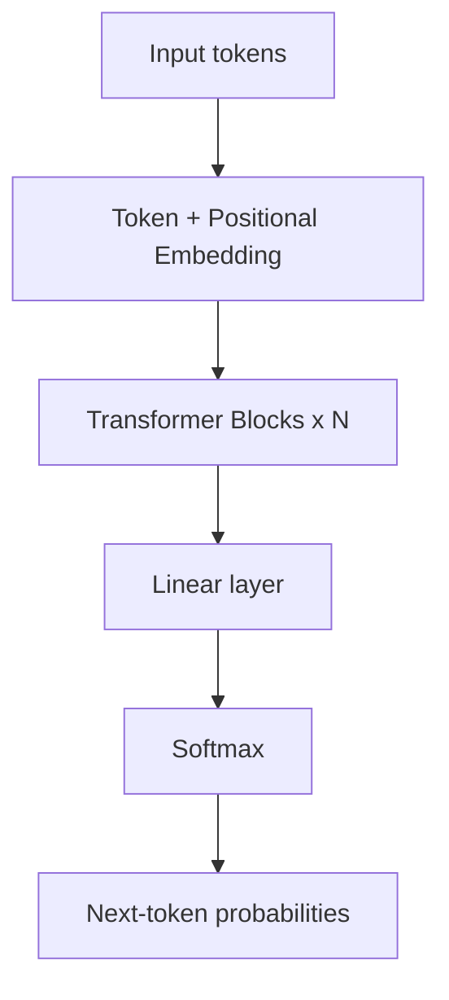
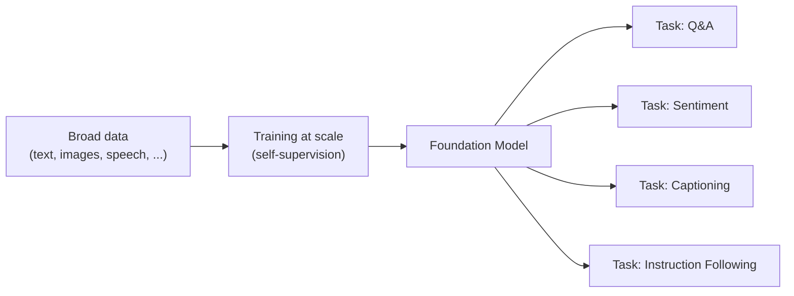
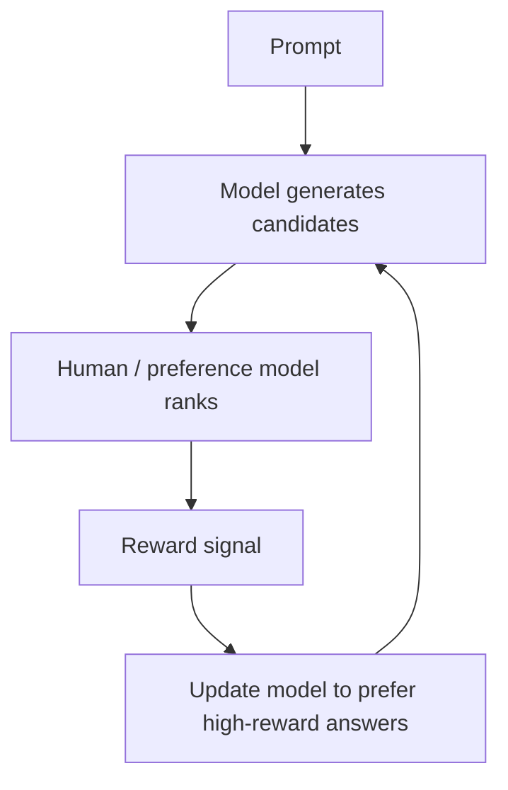
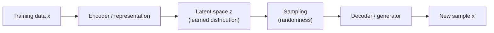

# Generative AI Week 1: Introduction — Generative AI

## Overview

- **Topic of the unit:** Course kickoff + What is Generative AI? + Why AI Engineering matters + First key concepts (self-supervision, RLHF, latent space, sampling)
- **Instructor:** Mitra Purandare
- **Learning goals (what you should be able to explain after Week 1):**
  - What “Generative AI” means and what it can create (text, images, audio, code, …).
  - What the course focuses on (leveraging existing models vs. building from scratch).
  - What “AI Engineering” is and why it became important after ~2020 (scale + foundation models).
  - The difference between **supervised**, **unsupervised**, and **self-supervised** learning.
  - Why LLMs (e.g., ChatGPT) are powerful (autoregression, transformers, RLHF).
  - Core generative-model intuition: **data distributions**, **latent space**, **sampling**.
  - First awareness of responsible AI issues (privacy, bias, regulation, hallucinations).

## 1. Introduction / Context

The slides start with the message that **AI is already changing everyday life** (examples shown include altered/AI-generated images and familiar consumer tools). The motivating question is essentially:

- AI is here — **but who shapes it, and how?**
- The course positions students to help shape it: **“The future needs you!”**

## 2. Administrative (Course Organization)

**Rules & regulations (key points):**

- **Lecture day:** Tuesday
- **Exercises:** also Tuesday
- **Format:** no strict separation between lecture/exercises (mixed format)
- **Timing:** flexible blocks (≈ 45×4 minutes), depends on content; not “4 lectures (2+2)”
- **Grading (50/50):**
  - **GenAI challenge** in the second half (**50%**), described as _Agentic AI_ for a company called **HWT**
  - **Written exam** at the end (**50%**), **1-page notes allowed**

- **Platform / compute:** JupyterHub with GPUs (DGX-1 from Nvidia) + Microsoft Azure
- **Tech stack mentioned:** PyTorch, LangChain, Python, Docker, Jupyter, LangGraph
- **Support:** assistant = instructor (“myself”)

**Course platform:** Moodle link is provided in slides.

## 3. What is Generative AI?

### 3.1 Core definition (practical)

Generative AI is framed as AI that **creates new content** (not just classifying or detecting). Examples listed:

- Create **text**
- Create **images**
- Create **lyrics**
- Compose **music**
- Create **gaming strategies**

A slide also includes a typical definition (via “Let us ask ChatGPT”): generative AI learns patterns from data and produces new outputs resembling training examples, often using **GANs, VAEs, Transformers**.

### 3.2 “Rise of Generative AI” (examples of systems)

The lecture gives a snapshot of popular tools and modalities:

- Chatbots: ChatGPT
- Image generation/transformation: DALL·E, Midjourney
- Deepfakes
- Speech: Whisper
- Writing assistants: Grammarly
- Music: MuseNet
- Typical tasks: summarization, text-to-image, image enhancement, style/subject injection (“your cat dressed as an astronaut”), meeting transcription, synthetic speech in your voice style

## 4. What will we learn? (Course map)

The course is organized into four pillars: **Models, Evaluation, Transfer learning, AI Engineering**.

### 4.1 Models (what kinds appear later)

- LLMs
- Diffusion models
- RNNs
- Autoencoders / VAEs
- GANs

### 4.2 Evaluation

- BLEU score
- ROUGE
- Benchmarks like MMLU

### 4.3 Transfer learning (adaptation skills)

- Continual pre-training
- Fine-tuning
- Prompt engineering
- Quantization

### 4.4 AI Engineering (building with models)

- LLMOps
- Application engineering around models

### 4.5 Hands-on philosophy

Emphasis is explicitly **not** on training giant models from scratch, and **not** on heavy math. Instead:

- Use **pre-trained models**
- Adapt them to your needs
- Generate new data with them
- Evaluate output quality
- Discuss ethical/social issues
- Engineer applications around an “ever-exploding” model ecosystem

**Rough plan (topics list):** latent space, DNN basics, transformers, LLMs, prompt/context engineering, RAG, evaluation, tool calling, agents, fine-tuning, vision LMs, AE/VAE, GANs, diffusion.

**Course “spice” (guest talks / projects):** examples include Figma→HTML, LLM-based game, Geoguesser, AI-driven podcasts on Swiss votes, AI tutor, case note generation, avatar generation for healthy eating.

## 5. AI Engineering and Foundation Models

### 5.1 Why “AI Engineering” is booming (post-2020 framing)

Key idea: **scale changed the game**.

- Demand for AI applications increased
- Barrier to entry decreased (you can build on existing models)
- AI engineering is described as a fast-growing discipline: building apps with readily available models
- Training LLMs needs data/compute/talent → leads to “model-as-a-service” and leverage

### 5.2 “Attention is all you need” (Transformer milestone)

A slide references the 2017 transformer paper and shows the standard transformer block diagram.
Interpretation: Transformers are a key enabling architecture behind modern LLMs.

**Visual (simplified transformer stack):**



### 5.3 Multimodal systems

Multimodal AI combines multiple data types (example given: text + images).

### 5.4 Foundation models (definition and implication)

A “foundation model” is described as a model **pre-trained on broad, diverse data/tasks** and later adapted to many downstream tasks.

**Visual (conceptual pipeline):**



### 5.5 “Moving target” mindset

SOTA models change fast. The course deliberately emphasizes **fundamentals + evaluation + navigation skills**, so you can:

- navigate the “dense jungle” of models,
- evaluate what fits your need,
- build applications around them.

## 6. Learning paradigms refresher (SL vs UL vs SSL)

### 6.1 Supervised Learning (SL)

The slides ask: “What is supervised learning? What are the 4 important elements? What is a major bottleneck?”
From the examples, SL is presented as:

- You have **inputs** (e.g., images)
- You have **labels** (human-provided targets)
- You train a **discriminative model** to predict labels (e.g., car vs not-car)
- You evaluate and iterate

**Example: binary classification (“car or not a car?”):**

- Need labeled images (car=1, not-car=0)
- Model learns features (wheels, wings, etc.) to separate classes

**Example: multi-class classification (Fashion-MNIST):**

- 10 clothing classes
- Train model so the correct class has high probability and others low

### 6.2 Unsupervised Learning (UL)

Slides prompt: “What is unsupervised learning? What methods have you seen so far?”
Key distinction emphasized later: UL does **not require labels at all**, and often aims at structure discovery (e.g., clustering).

### 6.3 Self-supervised Learning (SSL) (crucial for language models)

The lecture motivates SSL with: **labeled data is expensive**.
Language modeling reframes the problem so that labels come “for free” from the data itself:

- Train the model to **predict the next word/token**
- Any text sequence can generate (input, target) pairs automatically

**Token prediction sketch (from slides):**
Input: “SOS Generative AI is a …” → Target: next token
Repeated over massive unlabeled text corpora.

**Important clarification:** SSL ≠ UL (they are often confused). Slides state that since ~2019 they are treated as different: SSL uses automatically constructed labels; UL doesn’t use labels.

## 7. LLMs and RLHF (why ChatGPT feels “helpful”)

### 7.1 Why ChatGPT is powerful (as presented)

- Trained on huge amounts of text (books, websites, etc.)
- Autoregressive (predicts next token)
- Uses deep neural networks
- Uses (Generative Pre-trained) transformer models
- “InstructGPT: RLHF”
- Further trained with human feedback via reinforcement learning

### 7.2 RLHF intuition (ranking responses)

Slides show a toy ranking table: given a prompt like “Is it Bern or Zurich?”, different answers get different scores; helpful, correct answers score high, unhelpful ones score 0.

**Conceptual RLHF loop:**



## 8. Hugging Face ecosystem (tooling for engineers)

The slides introduce Hugging Face as a platform/community for open-source ML (especially transformers/LLMs), offering:

- Pretrained models (NLP, vision, audio, multimodal)
- Datasets
- APIs/libraries for integration
- Spaces (demos/apps)
- Collections
- Inference Providers

Key libraries named:

- `transformers`, `datasets`, `tokenizers`

They also highlight:

- Model hub (model cards: intended use, training data, limitations, example inference)
- Dataset hub and loading via `load_dataset("squad")`
- Learning resources (HF course, docs, spaces)

## 9. Responsible use of AI (first risks)

### 9.1 Privacy & consent

- Synthetic images from small sets of personal photos raise consent issues
- Deepfake risk and potential harm
- Question raised: using private data for training?

### 9.2 Bias & fairness

- Training data contains biases
- Models can inherit/amplify them
- Example risk: stereotypical/discriminatory generated images
- Need mitigation and ethical use

### 9.3 Regulation & accountability

Slides mention the need for oversight and list regulatory references (Swiss AI Act initiative/links, EU AI Act, GDPR).

### 9.4 Hallucinations & responsibility

A section title flags hallucinations as an issue requiring responsibility (introduced here, likely covered deeper later).

## 10. Generative models (the math intuition without heavy math)

### 10.1 What is a generative model?

A generative model:

- learns the **rules/relationships** between features (pixels, words, notes, …),
- so we can **sample** to create new realistic data not seen before.

### 10.2 Distribution view

Training data points are samples from an **unknown underlying distribution**. Generative models aim to learn an approximation of this distribution and then **sample** from it.

**Dice example (discrete):**

- An “unfair dice” has an unknown probability distribution.
- The model tries to learn that distribution to predict/produce likely outcomes.

### 10.3 Representation learning and latent space

Real-world data is high-dimensional and complex (images, faces, books, music). The slides introduce **latent space** as:

- a hidden, compressed representation
- where relationships are easier to model/manipulate

Ellipse example:

- Describe an ellipse via abstract features (e.g., axes `a` and `b`)
- In latent space, manipulating `(a,b)` changes the decoded image (ellipse → circle if `a=b`, widen/shrink, etc.)

**ASCII sketch (latent control idea):**

```
Latent vector z = (a, b)
  a=b  -> circle
  a>b  -> wide ellipse
  a<b  -> tall ellipse
Decode(z) -> image
```

### 10.4 Sampling (why outputs should vary)

Generative models must not be deterministic “copy machines.” They include randomness:

- Learn which regions of latent space are more likely
- Sample random values according to the learned PDF
- Decode back to data space

**End-to-end pipeline (as a mental model):**



## 11. Takeaways (Week 1)

- Generative AI is about **creating** new content by learning patterns from data.
- The course trains you to become an **AI engineer**: build real applications using powerful pre-trained/foundation models.
- Modern GenAI is driven by **scale**, **transformers**, and adaptation techniques (prompting, fine-tuning, etc.).
- **Self-supervised learning** explains how LLMs train on massive unlabeled text (labels are created from the text itself).
- **RLHF** is a key step that nudges LLMs toward more helpful, human-aligned responses.
- Generative modeling revolves around **learning distributions**, using **latent spaces**, and producing variety via **sampling**.
- Responsible AI concerns (privacy, bias, regulation, hallucinations) are part of the engineering reality.

## 12. Study hints (how to learn this week effectively)

- Be able to explain, in your own words:
  - SL vs UL vs SSL (and why SSL is not “just UL”).
  - What “latent space” means and why it’s useful.
  - Why sampling is essential for generation.
  - What RLHF is doing (ranking/optimizing for higher reward responses).

- Skim Hugging Face model cards once: get used to reading **intended use**, **limitations**, and **licenses**.

## 13. Sources & Literature (IEEE-style)

[1] A. Vaswani _et al._, “Attention Is All You Need,” in _Proc. NeurIPS_, 2017.

[2] R. Bommasani _et al._, “On the Opportunities and Risks of Foundation Models,” _arXiv preprint arXiv:2108.07258_, 2021.

[3] L. Ouyang _et al._, “Training language models to follow instructions with human feedback,” _arXiv preprint arXiv:2203.02155_, 2022.

[4] D. P. Kingma and M. Welling, “Auto-Encoding Variational Bayes,” _arXiv preprint arXiv:1312.6114_, 2013.

[5] I. Goodfellow _et al._, “Generative Adversarial Nets,” in _Proc. NeurIPS_, 2014.
