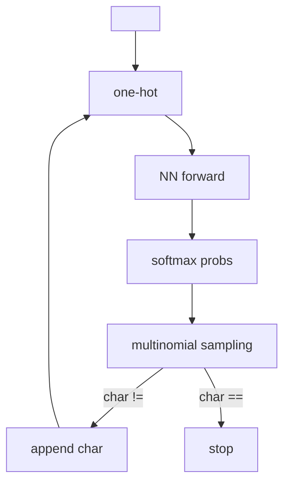

# Generative AI Week 2: Deep Learning Revision

## Overview

- **Topic of the unit:** Revision of neural-network fundamentals (with PyTorch), improving the Week-1 name generator, and introducing CNNs + evaluation for image classification
- **Instructor:** Mitra Purandare
- **Learning goals (from slides):**
  - Revise neural networks in PyTorch: neurons, MLPs, activation functions, loss functions, parameters
  - Understand training (gradient descent, mini-batches, learning rate, train/val/test split)
  - Hands-on: export models, load them, call from a simple UI
  - Understand “in-the-wild” difficulties + augmentation to improve robustness

## 1. Introduction / Context

Week 2 builds directly on Week 1’s **SwissNameGen** (a character-level bigram model using explicit counts) and asks:
**Can we improve the generator by replacing the explicit probability table with a neural network?**

The agenda spans: improving the name generator, modeling the PDF with NNs, training, name generation, NN elements not used, what images are, why not to use MLPs for images, convolution/CNNs, and evaluation.

## 2. Central Terms and Definitions

| Term                                   | Definition (as used in Week 2)                                                                               |
| -------------------------------------- | ------------------------------------------------------------------------------------------------------------ |
| **N-gram**                             | A sequence model using context of length _N-1_ characters/tokens (e.g., bigram uses 1 previous char).        |
| **PDF (probability density function)** | Here used informally as “probability distribution” over next characters / latent features learned from data. |
| **One-hot vector**                     | Encoding of a categorical value as a vector with a single 1 at the category index.                           |
| **Logits**                             | Raw (unnormalized) model outputs before softmax.                                                             |
| **Softmax**                            | Converts logits into a probability distribution over classes.                                                |
| **Cross-entropy / NLL**                | Loss for classification: negative log probability of the true class.                                         |
| **Epoch**                              | One full pass through the training dataset.                                                                  |
| **SGD / Batch GD / Mini-batch GD**     | Different gradient-descent update regimes depending on how much data contributes to each update.             |
| **Convolution**                        | Sliding a filter over an image, multiply+sum locally to produce feature maps.                                |
| **Stride / Padding**                   | Stride = step size of filter movement; padding = add border pixels to control output size.                   |
| **Precision / Recall / F1**            | Metrics beyond accuracy; F1 is harmonic mean of precision and recall.                                        |

## 3. Main Content

### 3.1 Improving the Swiss Name Generator: N-grams and limits

**N-grams refresher (examples from slides):**

- **Bigrams:** `<S>M`, `Mi`, `it`, `tr`, `ra`, `a<E>`
- **Trigrams:** `<S>Mi`, `Mit`, `itr`, `tra`, `ra<E>`
- **4-grams:** `<S>Mit`, `Mitr`, `itra`, `tra<E>`

**Week-1 approach:** a character-level bigram model using **counts → normalized probabilities** (each row sums to 1).

**Autoregressive generation loop:** sample the next char from the learned distribution, feed it back until `<E>`.

**Why the “bigger context” table doesn’t scale (limitations slide):**

- Context length 1 ⇒ probability matrix size **53×53**
- Context length 2 ⇒ matrix size **(53·53)×53**
- Longer context ⇒ exploding table size + sparsity
- Conclusion: not scalable / tractable / practical

### 3.2 Modeling the PDF with a Neural Network (replacing the table)

Goal: have a NN output the **next-character probability distribution** instead of looking it up in a count table.

**Key steps:**

1. **Encode characters**: characters can’t be fed directly → map with `stoi/itos` then **one-hot encode**.
2. **Simple DNN idea**: one-hot input → outputs counts/logits for each possible next character, representing likelihood.
3. **Parameter growth reminder**: for 53 characters, a simple linear layer already has **53×53 weights** (+ biases).

**Neuron view (slide diagram):**

- Linear combination + bias: (w_1 x_1 + w_2 x_2 + b)
- Add activation (f(\cdot)) to introduce non-linearity.

**Visualization (NN as next-char PDF approximator):**

### 3.3 Training the Neural Network (PyTorch perspective)

**Loss function:** Negative Log Likelihood (NLL), “aka cross entropy”.

Softmax converts logits (c) to probabilities (p). Then loss is:

$$
\mathcal{L} = -\log(p_k)
$$

where (k) is the true class/next character.

**Training concept (slides):**

- **Forward pass:** predict logits, compute loss
- **Backward pass:** compute gradients of loss w.r.t. parameters
- **Update:** gradient descent step (w \leftarrow w - \alpha \nabla_w \mathcal{L})

**SGD vs batch vs mini-batch (shown explicitly):**

- SGD updates per sample
- Batch GD updates using all (N) samples
- Mini-batch GD updates using batch size (m)

**Epoch + learning rate + autograd:**

- Epoch = one full data pass
- Learning rate controls step size
- PyTorch autograd tracks tensor ops and applies chain rule.

**Training loop “boilerplate” includes:** reset gradients (`zero_grad`), forward, loss, `backward()`, `step()`.

**Hyperparameters list (slides):**

- learning rate, #epochs, batch strategy + batch size
- architecture (#layers, #neurons), activations
- regularization (L1/L2, lambda)

### 3.4 Ultimate task: Name generation with the trained NN

After training, the NN is used in an **autoregressive** generation loop:

- start token `<S>`
- one-hot → model → logits → softmax → sample next char
- stop when `<E>` is sampled

**Visualization (generation loop):**

### 3.5 NN elements you “did not use” yet: activations & other losses

**Activation functions shown:** ReLU and sigmoid, plus mentions of leaky ReLU and tanh.

- ReLU: ($\mathrm{ReLU}(z)=\max(0,z)$)
- Sigmoid: ($\sigma(x)=\frac{1}{1+e^{-x}}$)

**Other loss functions (overview slide):**

- Mean Squared Error
- Binary cross entropy
- (Categorical) cross entropy for multi-class

### 3.6 What are images (as tensors)?

Slides define image representation:

- Image size ($H \times W$) ⇒ ($H\cdot W$) pixels
- Color images: **3 channels (RGB)**
- Grayscale: **1 channel**
- Pixel values often **0..255** (`uint8`)

**MNIST specifics:**

- 28×28 images
- 784 pixels
- grayscale
- values 0..255

### 3.7 How not to handle images: Why MLPs are poor for vision

Slides ask “Are MLPs good for images?” and answer:

- Spatial structure is ignored when flattening
- Images are large ⇒ too many parameters
- Not parameter efficient
- Prone to overfitting
- Not translation invariant

### 3.8 Convolution and CNN basics

**Convolution idea (slide walkthrough):**

1. Multiply filter and image patch element-wise
2. Sum results
3. Slide across image (left→right, top→bottom) to create a new array (feature map)

**Padding and stride:**

- Stride controls step size
- Padding can preserve size (e.g., output matches input when stride=1)

**Convolution layer:** a collection of filters; filter weights are learned; filters become feature detectors (edges, color combinations, etc.).

**Output-size formula (exercise slide):**

$$
\text{Output size}=\frac{\text{Input size}-\text{Kernel size}}{\text{Stride}}+1
$$

(as stated on the slide).

### 3.9 Evaluation for classifiers

Metrics listed: **Accuracy, Precision, Recall, F1 score**.

Slides motivate false positives vs false negatives with a medical diagnosis example.

**Formulas (from slides):**

- Precision: ($P=\frac{TP}{TP+FP}$)
- Recall: ($R=\frac{TP}{TP+FN}$)
- F1: ($F1=\frac{2PR}{P+R}$) (harmonic mean)

## 4. Connections and Interpretation

- **Week 1 → Week 2 bridge:** bigram counts implement a simple discrete “PDF”; Week 2 replaces the explicit table with a **learnable function approximator** (NN) that can generalize better and later scale.
- **Same generative pattern across modalities:**
  - Names: sample next character from a learned distribution
  - Images/classification: learn feature hierarchies; convolution is the core inductive bias for spatial data.

## 5. Examples and Applications (from the slides)

- **Build two NN variants** of the Swiss name generator.
- **Build a CNN digit classifier** (MNIST).
- **Build a small “write-on-screen” app** to recognize digits “in the wild,” and learn about robustness + augmentation.

## 6. Summary / Takeaways

- N-gram tables become infeasible as context grows; NNs offer a scalable alternative.
- Training loop essentials: logits → softmax → cross-entropy, forward/backward, gradient descent, learning rate, batches.
- Images require respecting spatial structure; MLPs are inefficient for that, CNNs are built for it.
- Evaluation needs more than accuracy; precision/recall/F1 capture different error costs.

## 7. Learning Hints

- Be able to derive/explain:
  - Why context length explodes table size in n-grams
  - Why one-hot + linear layer resembles the bigram matrix idea
  - Cross-entropy as “negative log probability of the true class”
  - What stride/padding do to output shapes
  - When you care more about precision vs recall (and why F1 is useful)

## 8. Deepening / Further Concepts (next logical steps)

- Replace one-hot with **embeddings** (parameter efficiency + generalization)
- Use deeper MLPs / regularization systematically (L1/L2)
- For vision: stacking conv + pooling layers, then classifier head
- Data augmentation for robustness (especially for “in the wild” handwriting)

## 9. Sources & Literature (IEEE)

[1] I. Goodfellow, Y. Bengio, and A. Courville, _Deep Learning_. Cambridge, MA, USA: MIT Press, 2016.

[2] A. C. Ng, “CS229 Lecture Notes: Machine Learning,” Stanford Univ., 2019.

[3] V. Dumoulin and F. Visin, “A Guide to Convolution Arithmetic for Deep Learning,” _arXiv preprint arXiv:1603.07285_, 2016.
