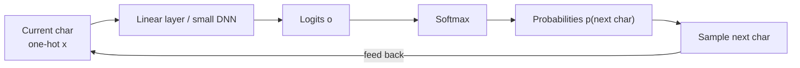
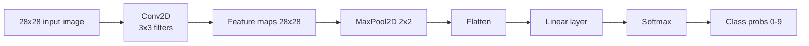

# Generative AI - # Week 2: Deep Learning Revision

## Overview

* **Topic of the unit:** Deep Learning Revision – from N-gram name generator to neural networks and CNNs 
* **Lecturer:** Mitra Purandare
* **Learning goals:**

  * Revisit the first-name generator and understand its limitations as an N-gram model.
  * Learn how to use **neural networks** in PyTorch to model probability distributions.
  * Understand **training of NNs**: loss, backprop, gradient descent, mini-batches, epochs, learning rate. 
  * Build name generators with NNs and an image classifier for digits (MNIST) with **CNNs**.
  * Understand key NN elements: activation functions, loss functions, regularisation. 
  * Learn basics of **image representation**, **convolutions**, and **evaluation metrics** (accuracy, precision, recall, F1). 


## 1. Introduction / Context

Week 1 introduced **generative models**, latent space, sampling and a simple character-level **bigram** model that generates Swiss first names from counts. In Week 2, we ask:

> *Can we improve our first name generator?*

We move from **count-based N-grams** to **neural networks** that learn the probability distribution of the next character. Then we extend these ideas to **images**, constructing a digit classifier for MNIST, and finish with **evaluation metrics** and **regularisation**. 


## 2. Key Terms and Definitions

| Term                         | Definition                                                                                                                    |
| ---------------------------- | ----------------------------------------------------------------------------------------------------------------------------- |
| **N-gram**                   | Sequence of (N) consecutive tokens (characters or words) used to model local context, e.g. bi-grams, tri-grams.               |
| **Neuron**                   | Basic unit in a neural network computing ($y = f(\sum_i w_i x_i + b)$), where (f) is a non-linear **activation function**.    |
| **Activation function**      | Non-linear function applied to neuron output, e.g. ReLU, Sigmoid, Tanh. Adds non-linearity so NNs can model complex patterns. |
| **DNN / MLP**                | Deep Neural Network / Multi-Layer Perceptron – several fully connected layers stacked to form a deeper model.                 |
| **One-hot encoding**         | Vector representation with 1 at the index of a category and 0 elsewhere, e.g. for 4 chars: `a→1000, b→0100, c→0010, d→0001`.  |
| **Logits**                   | Raw, unnormalised outputs of a NN before applying softmax.                                                                    |
| **Softmax**                  | Function that converts logits to class probabilities: ($p_k = \frac{e^{o_k}}{\sum_{j=1}^m e^{o_j}}$).                         |
| **Cross-entropy loss**       | Negative log-likelihood of the true class; for class $(k): (L = -\log p_k)$ . Used for classification.                        |
| **Gradient descent**         | Optimisation algorithm that updates parameters in direction of negative gradient of loss.                                     |
| **Epoch**                    | One full pass over the entire training data.                                                                                  |
| **Batch / mini-batch / SGD** | Training variants using all samples, subsets, or single samples for each gradient update.                                     |
| **Hyperparameters**          | Config values not learned from data (learning rate, batch size, number of layers/neurons, regularisation strength, etc.).     |
| **Convolution**              | Operation sliding a small **filter/kernel** over an image and computing local weighted sums to detect patterns.               |
| **Feature map**              | Output of a convolution filter over the input image.                                                                          |
| **Stride**                   | Step size of the convolution filter while sliding over the input.                                                             |
| **Padding**                  | Adding borders around the input so the output size is controlled (e.g. “same” size).                                          |
| **Pooling**                  | Downsampling (e.g. MaxPool2D) that reduces spatial size and keeps strongest activations.                                      |
| **Accuracy**                 | ($(TP + TN)/n$), proportion of correct predictions.                                                                           |
| **Precision**                | ($TP / (TP+FP)$), how many predicted positives are truly positive.                                                            |
| **Recall**                   | ($TP / (TP+FN)$), how many true positives are found.                                                                          |
| **F1 score**                 | Harmonic mean of precision and recall: ($F_1 = \frac{2PR}{P+R}$).                                                             |
| **L1/L2 regularisation**     | Penalties added to loss to discourage large weights (L2: squared weights; L1: absolute values). Helps reduce overfitting.     |


## 3. Main Contents

### 3.1 Recap: N-grams and the first Swiss name generator

**N-grams**:

* Example using name *Mitra*:

  * Bi-grams: `<S>M`, `Mi`, `it`, `tr`, `ra`, `a<E>`
  * Tri-grams: `<S>Mi`, `Mit`, `itr`, `tra`, `ra<E>`
  * 4-grams: `<S>Mit`, `Mitr`, `itra`, `tra<E>` 

**SwissNameGen v1 (bigram counts)**:

* Implemented a **character-level bigram model** using **counts only**.
* Estimated a matrix of probabilities ($P(\text{next char} \mid \text{current char})$) by **normalising counts** (rows sum to 1). 
* Sampling:

  * Start with `<S>`.
  * Sample the next character from the row corresponding to the current character.
  * Feed result back (autoregressive) until `<E>` is generated.

**Limitations** (context length = 1):

* Context is only the **previous single character**.
* To increase context length, matrix grows rapidly:

  * For 53 characters and context length 1: ($53 \times 53$) table.
  * For context length 2: ($(53 \cdot 53) \times 53$), very sparse and large. 
* Not scalable or practical → motivates **neural networks**.


### 3.2 Using neural networks to model the PDF

Goal: let a **NN** model the PDF ($P(\text{next char} \mid \text{current char})$).

Steps: 

1. Represent current character as **one-hot vector**.
2. Feed this vector into a **simple DNN** (linear layer) to produce logits ($\mathbf{o}\in\mathbb{R}^{num\ chars}$).
3. Apply **softmax** to get probabilities for each possible next character.
4. Use these probabilities to **sample** the next character.

Diagram (simplified):



**Parameter count**

* With 53 characters, a single linear layer from 53 inputs to 53 outputs has:

  * Weights: ($53 \times 53$).
  * Biases: ($53$).
* Parameters grow quickly, especially if we add hidden layers (but still more flexible than giant N-gram tables). 


### 3.3 Training the neural network

#### Loss: negative log likelihood / cross-entropy

* Convert logits ($\mathbf{o}$) to probabilities ($\mathbf{p}$) by **softmax**:
  $$p_k = \frac{e^{o_k}}{\sum_{j=1}^m e^{o_j}},\quad m = \text{number of characters}$$
* For true class (k), loss:
  $$L = -\log p_k$$
  
* In PyTorch: simply use `torch.nn.CrossEntropyLoss`. 

#### Training steps

1. **Forward pass**

   * Input: character one-hot vector.
   * NN outputs logits ($\mathbf{o}$).
   * Compute loss using cross-entropy.
2. **Backward pass (backpropagation)**

   * Compute gradients ($\partial L / \partial w$) and ($\partial L / \partial b$) for every weight and bias.
3. **Parameter update**

   * Using gradient descent:
     $$w^{(t+1)} = w^{(t)} - \alpha \frac{\partial L}{\partial w}$$
   * ($\alpha$) = learning rate. 

PyTorch provides **automatic differentiation**, tracking tensor operations, computing gradients, and applying the chain rule automatically. 

#### SGD, batch, and mini-batch

* **SGD** (stochastic): update using a single sample at a time.
* **Batch gradient descent**: compute gradient using **all** (N) samples in dataset.
* **Mini-batch**: compute gradient on subset of size (m).
  Mini-batch often balances speed and stability. 

#### Training loop (boilerplate)

Core pattern from the training loop on slide (page with code): 

```python
for epoch in range(num_epochs):
    for x_batch, y_batch in batches:
        optimizer.zero_grad()          # 1. reset gradients
        outputs = model(x_batch)       # 2. forward pass
        loss = criterion(outputs, y_batch)  # 3. compute loss
        loss.backward()                # 4. backprop
        optimizer.step()               # 5. update params
```

#### Hyperparameters

Important hyperparameters (need to be chosen/tuned): 

* Learning rate, number of epochs, batch size.
* Optimiser type: SGD vs mini-batch.
* Network architecture:

  * Number of layers.
  * Neurons per layer.
  * Activation functions.
* Regularisation:

  * L1/L2 strength ($\lambda$).


### 3.4 Ultimate task: generating names with the trained NN

After training, we can **generate names** similarly to the bigram model, but using the NN for probabilities. 

Pseudo-code (based on the generation slide):

```python
out = []
ix = stoi["<S>"]
while True:
    start = fun.one_hot(torch.tensor([ix]), num_classes=num_chars).float()
    logits = model(start)                     # forward pass
    probabilities = torch.softmax(logits, dim=1)
    ix = torch.multinomial(probabilities[0], num_samples=1, replacement=True, generator=g).item()
    if ix == stoi["<E>"]:
        break
    out.append(itos[ix])
print("".join(out))
```

The model thus **learns a more flexible PDF** than simple count-based bigrams and can generalise better.


### 3.5 Additional NN components (not fully used in the simple model)

#### Activation functions

From the activation slide (ReLU, LeakyReLU, Sigmoid, Tanh): 

* **ReLU**: ( \text{ReLU}(x) = \max(0, x) )
* **Leaky ReLU**: like ReLU but with small slope for negative inputs.
* **Sigmoid**:
  $$\sigma(x) = \frac{1}{1 + e^{-x}}$$
* **Tanh**:
  $$\tanh(x) = \frac{e^x - e^{-x}}{e^x + e^{-x}}$$

They add non-linearity; choice affects training dynamics.

#### More loss functions

From the “More Loss functions” slide: 

* **Mean Squared Error (MSE)**:
  $$L = \frac{1}{N}\sum_{i=1}^N (y_i - \hat y_i)^2$$
* **Binary cross-entropy**:
  $$L = -\frac{1}{N}\sum_{i=1}^N \big( y_i \log p_i + (1-y_i)\log(1-p_i)\big)$$
* **Categorical cross-entropy** (multi-class):
  $$L = -\frac{1}{N}\sum_{i=1}^N \sum_{j=1}^C y_{ij}\log p_{ij}$$
  

Loss choice depends on task: regression vs binary classification vs multi-class.

#### Regularisation (slide at the end)

* **L2**:
  
  $$L_{\text{total}} = L_{\text{original}} + \lambda\sum_j w_j^2$$
  
* **L1**:

  $$L_{\text{total}} = L_{\text{original}} + \lambda\sum_j |w_j|$$

* Helps prevent overfitting by discouraging large weights. 


### 3.6 Images and the MNIST dataset

#### What are images?

* Image of size (H \times W) has (H\cdot W) pixels.
* Grey-scale: 1 channel; colour: 3 channels (RGB).
* Typical pixel values: 0–255 (`uint8`). 

#### Handwriting recognition and MNIST

* Task: recognise digits 0–9 from images of **handwritten digits**.
* **MNIST** dataset:

  * 28×28 grey-scale images ⇒ 784 pixels.
  * Values 0–255.
* The slide with the MNIST grid on page 40 shows many 28×28 digit images; another slide zooms into a “3” with its 28×28 pixel value matrix. 

Expected classifier output:

* A probability for each digit class (0–9), often via softmax over 10 logits. 


### 3.7 How **not** to handle images: MLPs on flattened pixels

First naive solution: **flatten** the 28×28 pixel matrix into a 784-dimensional vector and feed it to an MLP. The diagram on page 44 shows this pipeline from flattened image to fully connected layers and softmax output. 

Problems with MLPs for images: 

* **Spatial structure ignored** – neighbouring pixels treated no differently than far away pixels.
* Many parameters → **not parameter efficient** for large images.
* High risk of **overfitting**.
* Not **translation invariant**: moving a digit slightly changes many input values, but network does not naturally exploit that.

This motivates **convolutional neural networks (CNNs)**.


### 3.8 Convolutions and CNNs

#### Convolution operation

From the “What is convolution?” slide: a 3×3 filter is applied to a 3×3 region of a grey-scale image:

1. Multiply image values and filter values **element-wise**.
2. Sum the results → single output value.
3. Slide filter over image (left-to-right, top-to-bottom) to get a new array (**feature map**). 

The example shows how applying a filter yields values like 1.5, 0, 0.5, –1.2 after summation.

#### Padding and stride

* **Stride**: step size of the filter:

  * Stride 1 → move by 1 pixel at a time (dense coverage).
  * Stride 2 → downsampling while convolving.
* **Padding**: adding border values (often zeros) so that:

  * e.g. “same” padding keeps output size equal to input size for stride 1.
    Slide 50 visualises stride 1 vs stride 2 and padding. 

For a 1D intuition, the **output size** is:
[
\text{Output size} = \frac{\text{Input size} - \text{Kernel size}}{\text{stride}} + 1
]

#### Convolutional layers

* A convolutional layer has a **collection of filters**; each learns to detect features such as edges or patterns.
* Filter values are **learned weights** via backprop.
* Applying (F) filters yields (F) feature maps. 

#### Example architecture: 1 filter vs multiple filters

From the diagrams on pages 53–55: 

* Input: 28×28, 1 channel.
* `Conv2D` with:

  * Kernel 3×3, stride 1, padding such that output remains 28×28.
  * With 1 filter → 1 feature map of size 28×28.
  * With 4 filters → 4 feature maps of size 28×28.
* `MaxPool2D` with kernel 2×2:

  * Each 2×2 block → max element.
  * Output feature maps of size 14×14.
* Flatten + `Linear` layer to classify into 10 digits.

**CNN parameter efficiency**

* A 3×3 filter has only 9 weights per input channel (plus bias), reused across the entire image.
* Compared to fully connected layer from 784 inputs to 100 neurons (78,400 weights), CNNs are much more parameter efficient and respect spatial structure.

#### Exercise example (slide 56)

You’re asked: for a 28×28 input, `Conv2D` with 10 filters of size 3×3, stride 3, then `MaxPool2D` 2×2: calculate output sizes using:
[
\text{Out} = \frac{\text{In} - \text{Kernel}}{\text{Stride}} + 1
]
(You can practice this as homework.)

**Visualisation (Mermaid): CNN pipeline**



### 3.9 Evaluating the classifier

Slides 58–62 cover evaluation metrics with a confusion matrix and corona diagnosis example. 

#### Confusion matrix terms

* **TP (True Positive)**: sick person correctly predicted as sick.
* **TN (True Negative)**: healthy person correctly predicted as healthy.
* **FP (False Positive)**: healthy person predicted as sick.
* **FN (False Negative)**: sick person predicted as healthy.

#### Metrics

For binary classification (extendable to multi-class):

* **Accuracy**
  $$\text{Accuracy} = \frac{TP + TN}{n}$$
* **Precision**
  $$P = \frac{TP}{TP + FP}$$
* **Recall**
  $$R = \frac{TP}{TP + FN}$$
* **F1 score**
  $$F_1 = \frac{2PR}{P+R}$$
* F1 is high only if **both** precision and recall are high.

These metrics help evaluate trade-offs between catching all positives (high recall) and avoiding false alarms (high precision).


## 4. Relationships and Interpretation

* **From N-grams to NNs**

  * N-grams explicitly store probabilities in tables; scaling context length explodes table size and sparsity.
  * NNs **compress** this information into weights, enabling richer context modelling without huge explicit tables.

* **From vectors to images**

  * Treating images as flat vectors ignores spatial structure.
  * CNNs use **local receptive fields** and **weight sharing**, capturing local patterns (edges, corners) and achieving translation invariance.

* **Training and generalisation**

  * Proper choice of **loss**, **optimiser**, **hyperparameters**, and **regularisation** controls how well the model fits training data vs generalises to new data.

* **Evaluation metrics**

  * Accuracy alone can be misleading; e.g. in imbalanced datasets, F1 better reflects performance by balancing precision and recall.


## 5. Examples and Applications

* **SwissNameGen (v1 & v2)**:

  * v1: bigram counts only.
  * v2: DNN modelling the PDF of next character, using one-hot encoding and softmax.

* **Digit recognition on MNIST**:

  * Input: 28×28 grey-scale digits.
  * Model: CNN (Conv2D + MaxPool + Linear).
  * Output: probabilities for digits 0–9.

* **Small app “in the wild”**:

  * Write a number on screen, convert to image, feed through trained CNN, display predicted digit.
  * Demonstrates challenges such as different handwriting styles, noise, and need for **data augmentation** to improve robustness. 


## 6. Summary / Takeaways

* N-gram models are simple but **do not scale** with context; NNs provide a more flexible way to model **probability distributions** over characters. 
* Training NNs involves **forward pass**, **loss computation**, **backprop**, and **gradient descent** with many hyperparameters to tune.
* **Activation functions** and **loss functions** are key design choices; cross-entropy is standard for classification.
* **Images** are structured 2D (or 3D) data; treating them as flat vectors wastes structure and parameters.
* **Convolutions** and **CNNs** exploit locality and translation invariance, making them ideal for image tasks like MNIST digit recognition.
* Proper **evaluation metrics** (precision, recall, F1) and **regularisation** are essential to assess and improve real-world models, not just training accuracy. 


## 7. Study Tips

* Re-implement the **bigram name generator** and then swap in a **neural network**; compare results and behaviour.
* Step through the **training loop** manually:

  * Print loss after each epoch.
  * Experiment with different learning rates and batch sizes.
* For **CNNs**, practice computing:

  * Output sizes given kernel, stride, and padding.
  * Number of parameters for conv and linear layers.
* Draw your own **confusion matrix** for a small example and compute accuracy, precision, recall and F1 by hand.
* Play with **regularisation**:

  * Train a small model with/without L2; observe overfitting vs generalisation.


## 8. Further Topics / Extensions

This week sets the stage for:

* Deeper and more complex CNN architectures.
* Data augmentation (rotations, shifts, noise) to better handle “in the wild” scenarios.
* Extending from discriminative CNNs to **generative image models** (AEs, VAEs, GANs, diffusion).
* Integrating image and text models into **multimodal generative AI** systems.


## 9. References & Literature (IEEE style)

[1] Y. LeCun, L. Bottou, Y. Bengio, and P. Haffner, “Gradient-based learning applied to document recognition,” *Proc. IEEE*, vol. 86, no. 11, pp. 2278–2324, 1998.

[2] Y. LeCun and C. Cortes, “MNIST handwritten digit database,” 2010.

[3] V. Dumoulin and F. Visin, “A guide to convolution arithmetic for deep learning,” arXiv:1603.07285, 2016.

[4] I. Goodfellow, Y. Bengio, and A. Courville, *Deep Learning*. Cambridge, MA, USA: MIT Press, 2016.

[5] M. Purandare, *Week 2: Deep Learning Revision*, Lecture Slides, Generative AI, OST – Ostschweizer Fachhochschule, Sept. 2025. 

