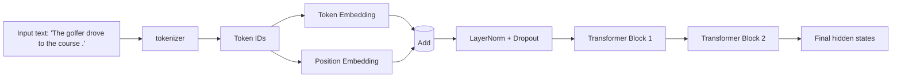
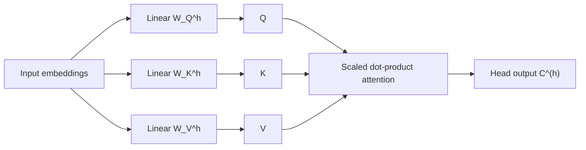

# Generative AI - Week 3: Transformer Architecture

## Overview

- **Topic of the unit:** Transformer Architecture – internals of encoder & decoder
- **Lecturer:** Mitra Purandare
- **Learning goals:**
  - Understand the **data flow** through a transformer encoder and decoder.
  - Know what **embeddings**, **positional embeddings**, **multi-head attention**, **feed-forward layers**, **layer normalization**, **dropout**, and **skip connections** do.
  - Be able to write down and interpret the **scaled dot-product attention** formula.
  - Understand the difference between **batch normalization** and **layer normalization**, and why transformers use layer norm.
  - Understand **masked self-attention** and **cross-attention** in the decoder for seq2seq tasks.

## 1. Introduction / Context

Transformers are the backbone of modern generative models (LLMs, translation systems, etc.). Unlike RNNs, they process **all tokens in a sequence at once**, using **self-attention** to decide which tokens should attend to which others.

The example sentence used throughout the notes is:

> “The golfer drove to the course.”

Page 2 shows how this sentence is tokenized, converted to embeddings, enriched with positional information, passed through several **transformer blocks**, and finally through a linear layer and softmax to produce output probabilities.

## 2. Key Terms and Definitions

| Term                                | Definition                                                                                                                                       |
| ----------------------------------- | ------------------------------------------------------------------------------------------------------------------------------------------------ |
| **Embedding**                       | A dense vector representation of tokens; maps token IDs to vectors of size `emb_dim`.                                                            |
| **Positional embedding / encoding** | A vector that represents the **position** of a token in the sequence; added to the token embedding to encode order.                              |
| **Self-attention**                  | Mechanism where each token (as a **query**) looks at all tokens (as **keys** and **values**) in the same sequence to build a **context vector**. |
| **Query (Q)**                       | Vector representing the “question” a token is asking about its context.                                                                          |
| **Key (K)**                         | Vector representing how relevant a token is to any query.                                                                                        |
| **Value (V)**                       | Vector containing the actual information that gets aggregated (context).                                                                         |
| **Scaled dot-product attention**    | Computes attention scores by dot products of queries and keys, scales them, applies softmax, and weighs values.                                  |
| **Multi-head attention**            | Several attention heads in parallel, each with its own Q, K, V projections; their outputs are concatenated and linearly transformed.             |
| **Encoder**                         | Stack of transformer blocks that take the **source sentence** and produce contextualized embeddings.                                             |
| **Decoder**                         | Stack of transformer blocks that generate the **target sentence**, using masked self-attention and cross-attention to encoder outputs.           |
| **Masked (causal) attention**       | Self-attention in which tokens are prevented from attending to **future positions** in the sequence.                                             |
| **Cross-attention**                 | Attention where queries come from the decoder, but keys and values come from the **encoder outputs**.                                            |
| **Batch normalization**             | Normalizes each **feature** across the batch dimension.                                                                                          |
| **Layer normalization**             | Normalizes each **token vector** across its feature dimensions; independent of batch size.                                                       |
| **bmm**                             | Batched matrix multiplication: performs matrix multiplies for a whole batch in one operation.                                                    |
| **Dropout**                         | Regularization technique that randomly sets some activations to 0 during training to avoid overfitting.                                          |
| **Skip / residual connection**      | Adds the input of a block to its output, creating a shortcut path for gradients and information.                                                 |

## 3. Main Contents

### 3.1 High-level Transformer Encoder

According to the large diagram on **page 2**, the encoder pipeline looks like this:

1. **Tokenization**
   The sentence is converted to token IDs, e.g.
   “The golfer drove to the course .” → `[4, 5, 6, 10, 20, 39, 19]`.

2. **Positions**
   A position index is assigned to each token:
   `[0, 1, 2, 3, 4, 5, 6]`.

3. **Token Embedding + Positional Embedding**
   Each token ID → token embedding vector in $\mathbb{R}^{\text{emb\ dim}}$.
   Each position index → position embedding vector in $\mathbb{R}^{\text{emb\ dim}}$.
   Final input embedding for each position:
   $$\text{input\ vec} = \text{token\ emb} + \text{pos\ emb}$$

4. **Layer Normalization + Dropout**
   Applied to stabilize training and reduce overfitting.

5. **Stack of Transformer Blocks**
   Each block contains:
   - LayerNorm
   - Multi-head self-attention (+ residual)
   - LayerNorm
   - Position-wise feed-forward network (+ residual)

6. **Dropout + Output**
   After $N$ blocks, outputs are passed to a final linear layer and softmax for prediction.

**Visualisation:**

### 3.2 Scaled Dot-Product Attention (Single Head)

Page 3 zooms into a **single attention head**.

1. **Linear projections** (per token):
   - $Q = X W_Q$
   - $K = X W_K$
   - $V = X W_V$

   where $X$ is the matrix of input embeddings from the positional embedding block, and $W_Q$, $W_K$, $W_V$ are learned weight matrices.

2. **One query $q$**
   For a single query vector $q$ and all keys $K$, attention scores are:
   $$\text{attention}_1(q, K) = \text{softmax}\left(\frac{q K^\top}{\sqrt{\text{key\ dim}}}\right)$$

   This produces a $1 \times \text{seq\ len}$ vector of weights.
   The higher $\text{attention}_1(q, k)$, the more a key $k$ **resonates** with query $q$ (for example, “The” attending to “golfer”).

3. **Contextualization**
   The final context vector for query $q$ is a weighted sum over values:
   $$\text{context}(q) = \text{attention}_1(q, K) , V$$

   Intuitively, this is a **blended opinion** from all tokens in the sentence.

4. **All queries at once** (Step 4 on page 4)
   Using the full query matrix $Q$:
   $$\text{attention}*1(Q, K) = \text{softmax}\left(\frac{Q K^\top}{\sqrt{\text{hid\ size}}}\right)$$
   $$\text{attention}*\text{final}(Q, K, V) = \text{attention}_1(Q, K) , V$$

   Here, $\text{attention}_1(Q, K)$ is a square matrix of size $(\text{seq\ len}, \text{seq\ len})$; each row corresponds to how one token attends to all tokens.

### 3.3 Multi-Head Attention

The attention mechanism above is **one head**. Transformers use **multiple heads**:

- Each head $h$ has its own $(W_Q^{(h)}, W_K^{(h)}, W_V^{(h)})$.
- Each head produces its own context matrix $C^{(h)}$.
- All heads are concatenated along the feature dimension and passed through a final linear layer.

There is a constraint between number of heads and value dimension:

$$
\text{val\ dim} = \frac{\text{emb\ dim}}{\text{num\ heads}}
$$

Having several heads allows the model to focus on **different aspects** simultaneously (e.g. subject–verb relations vs. adjective–noun connections).

**Visualisation:**

(Repeated in parallel for each head, then concatenated.)

### 3.4 Positional Embeddings

On page 5, the notes highlight that, unlike RNNs, transformers see the **whole sentence at once** and the multi-head attention itself is **position-agnostic**.

Example:

- “The lion looked at the hunter and …”
- “The hunter looked at the lion and …”

To know **who looked at whom**, the model must know token **order**.

Solution: **positional encodings/embeddings**:

- Token embeddings: created by `nn.Embedding` from token IDs.
- Positional embeddings: created by `nn.Embedding` from position indices (or via sinusoidal formulas as in the original paper).
- Final input to transformer:
  $$\text{input\ embedding} = \text{token\ emb} + \text{position\ emb}$$

This combined vector captures both **meaning** and **position**.

### 3.5 Normalization: Batch vs Layer Norm

Pages 5–8 provide a detailed comparison with concrete numeric examples.

#### 3.5.1 Batch Normalization

- Normalizes each **feature dimension** across the **batch**.

- Imagine a 3D tensor (batch, seq*len, emb_dim).
  For batch norm, for each feature index $j$ (across all tokens and examples in the batch), compute:
  $$\mu*\text{batch}^{(j)} = \text{mean of feature } j \text{ across batch}$$
  $$\sigma*\text{batch}^{(j)} = \text{std of feature } j \text{ across batch}$$
  Then:
  $$\text{Norm}*\text{batch}(x^{(j)}) = \gamma^{(j)} \cdot \frac{x^{(j)} - \mu*\text{batch}^{(j)}}{\sigma*\text{batch}^{(j)} + \epsilon} + \beta^{(j)}$$

- Works well for vision models with large, consistent batch sizes, but **depends on batch statistics**.

#### 3.5.2 Layer Normalization

- Normalizes **each token vector** across its **features** (independent of batch):

  $$
  \mu_\text{layer} = \frac{1}{d}\sum_{j=1}^d x_j, \quad
  \sigma_\text{layer}^2 = \frac{1}{d}\sum_{j=1}^d (x_j - \mu_\text{layer})^2
  $$

  $$
  \text{Norm}*\text{layer}(x) = \gamma \cdot \frac{x - \mu*\text{layer}}{\sigma_\text{layer} + \epsilon} + \beta
  $$

- Appropriate for sequence models:
  - Works with **variable-length sequences** and **small batch sizes**.
  - Does not rely on batch statistics.

#### 3.5.3 Why normalize at all?

- Different feature scales can slow down gradient descent.
- Very large activations can cause **exploding gradients**.
- Normalization keeps activations in a stable range and speeds up training.

#### 3.5.4 Normalization vs Standardization

The notes also mention:

- **Min-max normalization**:
  $$x_\text{norm} = \frac{x - x_\text{min}}{x_\text{max} - x_\text{min}}$$

- **Standardization / z-score**:
  $$x_\text{std} = \frac{x - \mu}{\sigma + \epsilon}$$

In practice, the terms _normalization_ and _standardization_ are sometimes used interchangeably (e.g. in Keras).

### 3.6 Feed-Forward Layer, bmm, Dropout, Skip Connections

Page 9 briefly describes additional components of the transformer block.

1. **Feed-forward layer (FFN)**
   - Applied **independently to each token** (position-wise).
   - Typically two linear layers with a nonlinearity:
     $$\text{FFN}(x) = W_2 , \sigma(W_1 x + b_1) + b_2$$
   - Learns higher-level features after self-attention.

2. **bmm (batched matrix multiplication)**
   - Simply performs many matrix multiplications at once for different batch elements, e.g. when computing $QK^\top$ and attention$ \cdot V$ for all sentences.

3. **Dropout**
   - Randomly sets some activations to 0 during training.
   - Introduced by Hinton et al. (2012) and Srivastava et al. (2014) to prevent **co-adaptation** of feature detectors and reduce overfitting.

4. **Skip / residual connection**
   - The input to a sub-layer is added to its output:
     $$\text{out} = \text{subLayer}(x) + x$$
   - Provides a “gradient highway” and helps combat vanishing gradients (similar spirit to residual connections and LSTMs).

5. **Hyperparameters (encoder)**
   Example list from the notes:
   - `vocab_size`
   - `seq_length`
   - `embed_dim`
   - `num_heads`
   - `head_dim = embed_dim // num_heads`
   - `ff_dim = 4 * embed_dim`
   - `num_encoder_layers`
   - `learning_rate`
   - `batch_size`
   - `dropout_prob`

### 3.7 Transformer Decoder

The **decoder** shares much of the structure of the encoder but with two important twists (pages 10–11).

#### 3.7.1 Masked Multi-Head Attention (Causal Masking)

Task: given previous tokens, predict the **next** token.

Problem: during training, the full target sentence is known, so without constraints the model could “cheat” and look at **future words** via attention.

Solution: apply a **causal mask** to the attention matrix:

- For position $i$, attention scores to positions $j > i$ are **masked** (set to $-\infty$ before softmax), so the model cannot access future tokens.
- Only past and current tokens are visible.

This mask appears visually as a **triangular matrix** (upper triangle masked) in the attention heatmap on page 10.

Causal masking is only needed in the **decoder**, where we generate tokens sequentially.

#### 3.7.2 Cross-Attention

For a seq2seq task (e.g. German → English):

- The encoder has already produced contextualized embeddings for the source sentence (“Der Golfer fuhr zum Golfplatz.”).
- In the decoder, after masked self-attention over the generated target tokens:
  - **Queries** $Q$: come from the decoder states.
  - **Keys** $K$ and **Values** $V$: are the encoder outputs (contextualized embeddings).

This is **multi-head cross-attention**: the decoder “looks at” relevant parts of the source sentence while generating each target token. The block diagram on page 11 shows this connection clearly.

The decoder then passes through:

- Another LayerNorm
- Feed-forward network
- Final LayerNorm
- Linear + softmax over the **target vocabulary** to produce output probabilities.

#### 3.7.3 Decoder Hyperparameters

Similar to encoder, but note:

- `vocab_size`: size of **target** vocab (German or English, depending on direction).
- `num_hidden_transformer_layers`: number of decoder blocks.
- `dropout_prob` often non-zero (e.g. $0.2$ in the notes).

## 4. Relationships and Interpretation

- **Embeddings + positional encodings** provide the **input representation**: meaning + order.
- **Self-attention** lets each token build a **context-aware** representation, weighted by relevance to other tokens.
- **Multi-head attention** means the model can attend to several types of relationships simultaneously.
- **Layer norm + residual connections** stabilize training and enable **deep stacks** of transformer blocks.
- **Masked self-attention** in the decoder enforces **causality**, crucial for generation.
- **Cross-attention** bridges **encoder** (source sentence) and **decoder** (target sentence) in seq2seq tasks.
- **Dropout** and **normalization** fight overfitting and exploding gradients, improving generalization.

## 5. Examples and Applications

From the diagrams:

- Source sentence: “Der Golfer fuhr zum Golfplatz.”
- Target sentence: “The golfer drove to the course.”

The encoder processes the German sentence; the decoder uses masked self-attention plus cross-attention to these encoder outputs to generate the English translation token by token.

More generally, this architecture underlies:

- Machine translation
- Text generation (LLMs)
- Summarization, question answering, code generation, etc.

## 6. Summary / Takeaways

- A transformer consists of **stacked blocks** with:
  - Multi-head (self or cross) attention
  - Position-wise feed-forward networks
  - LayerNorm + residual connections

- Attention is computed via **scaled dot-product**:
  $$\text{Attention}(Q, K, V) = \text{softmax}\left(\frac{Q K^\top}{\sqrt{d_k}}\right) V$$

- **Positional embeddings** are essential because attention alone is permutation-invariant.

- **Layer normalization**, not batch norm, is used in transformers because it’s **independent of batch size** and fits variable-length sequences.

- The **decoder** adds:
  - **Masked** self-attention to prevent peeking at future tokens.
  - **Cross-attention** to encoder outputs for seq2seq tasks.

## 7. Study Tips

- For each tensor (Q, K, V, attention matrix, etc.), write down its **shape**: $(\text{batch}, \text{seq\ len}, \text{dim})$. This often clarifies what bmm is doing.
- Re-derive the attention formula from “one query” to “all queries at once”.
- Draw the **causal mask** triangle and practice masking an attention matrix.
- Compare batch norm vs layer norm on a tiny numeric example like the one in the notes.
- Memorize the high-level data flow:
  **tokens → embeddings + positions → (encoder blocks) → encoder outputs → (decoder with masked + cross-attention) → softmax.**

## 8. Further Topics / Extensions

From here, natural follow-ups include:

- Different types of positional encodings (e.g., relative, rotary).
- Variants like pre-norm vs post-norm transformers.
- Scaling laws: larger `emb_dim`, more heads, deeper stacks.
- How these building blocks are used in GPT-style decoder-only models vs full encoder–decoder models.

## 9. References & Literature (IEEE Style)

[1] A. Vaswani _et al._, “Attention Is All You Need,” in _Proc. Advances in Neural Information Processing Systems (NeurIPS)_, 2017.

[2] J. L. Ba, J. R. Kiros, and G. E. Hinton, “Layer Normalization,” arXiv:1607.06450, 2016.

[3] G. E. Hinton _et al._, “Improving Neural Networks by Preventing Co-Adaptation of Feature Detectors,” arXiv:1207.0580, 2012.

[4] N. Srivastava _et al._, “Dropout: A Simple Way to Prevent Neural Networks from Overfitting,” _J. Mach. Learn. Res._, vol. 15, pp. 1929–1958, 2014.

[5] M. Purandare, _Transformer Architecture – A Visual Guide_, Lecture Notes, Generative AI, OST – Eastern Switzerland University of Applied Sciences, Fall 2024.
