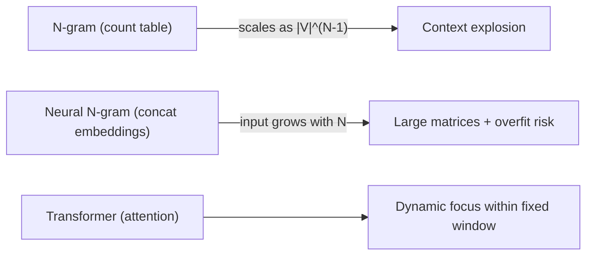
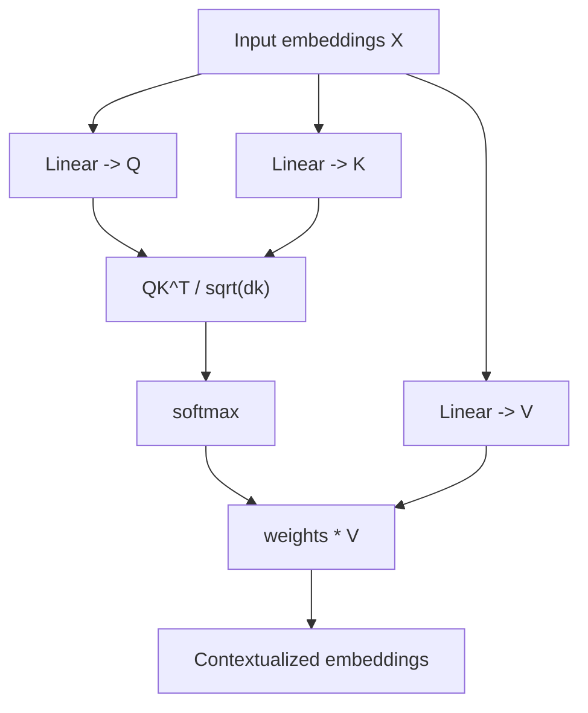

# Generative AI Week 3: From N-grams to Transformers

## Overview

- **Topic of the unit:** Why fixed-window N-grams don’t scale, and how **Transformers** solve sequence modeling with **positional embeddings** + **self-attention** (incl. multi-heads, causal masking), plus the remaining transformer-block ingredients (FFN, LayerNorm, Dropout, skip connections) and architecture variants (encoder-only / decoder-only / encoder-decoder).
- **Instructor:** Mitra Purandare
- **Learning goals (explicit):** positional encoding, self-attention, attention heads, feed-forward layer, dropout, layer normalization, cross attention, causal masking

## 1. Introduction / Context

The course’s running example remains **generative modeling**: learn a distribution from a Swiss names dataset, then **generate new names autoregressively** (token-by-token).

Week 3 answers the question:

> If N-grams (even neural N-grams) struggle with long context, how do Transformers represent and use long-range context efficiently?

## 2. Central Terms and Definitions

| Term                                    | Definition (Week 3 meaning)                                                                                                              |
| --------------------------------------- | ---------------------------------------------------------------------------------------------------------------------------------------- |
| **Tokenization**                        | Splitting text into tokens (here: characters for names; later: words/subwords for sentences).                                            |
| **Context window (N-gram)**             | For an N-gram, the context is the previous **N−1** tokens used to predict the next token.                                                |
| **Embedding**                           | A learned vector representation of tokens (and positions) using an embedding lookup table (`nn.Embedding`).                              |
| **Self-attention**                      | Mechanism that computes, for each token, how much to “attend to” other tokens in the context using **Q, K, V** and a softmax weighting.  |
| **Q / K / V**                           | Query/Key/Value linear projections of embeddings used to compute attention weights and weighted sums.                                    |
| **Multi-head attention**                | Multiple attention heads in parallel; their outputs are concatenated to capture different relations (syntax/semantics/long-range, etc.). |
| **Causal masking**                      | Masking future tokens in decoder self-attention so the model can’t “cheat” during next-token prediction.                                 |
| **FFN (Feed-Forward Network)**          | Position-wise MLP applied independently to each token after attention, typically 2 linear layers + nonlinearity.                         |
| **Layer Normalization**                 | Normalizes each token’s features (per token), independent of batch size; preferred for sequence models.                                  |
| **Dropout**                             | Regularization: randomly zero out activations during training to reduce overfitting.                                                     |
| **Skip/Residual connection**            | Add input (x) to layer output to stabilize training and help gradient flow.                                                              |
| **Encoder / Decoder / Encoder-Decoder** | Transformer variants used for understanding-only tasks, generation, or seq2seq translation (respectively).                               |

## 3. Main Content

### 3.1 Recap: N-grams, tokenization, and embeddings

**Tokenization for Swiss names:** split each name into characters; the set of all characters forms the vocabulary/dictionary.

**Context idea (example trigram):** previous two characters predict the next; e.g. context “it” → predict “r”.

**Embedding vs one-hot:**

- One-hot is possible but sparse.
- An **embedding layer is a lookup table** (`nn.Embedding`) mapping token IDs to dense vectors.

**Neural N-grams:** last N−1 tokens → embeddings → concatenation → MLP → softmax over vocab. Benefits: learned embeddings + parameter sharing/generalization beyond seen N-grams.

### 3.2 Why not increase N?

Week 3 gives three main reasons:

1. **Combinatorial explosion (count-based N-grams):** number of contexts grows like ($|V|^{N-1}$). Example shown: ($|V|=30$), ($N=6\Rightarrow 30^5=24,300,000$); ($N=7\Rightarrow 30^6=729,000,000$).

2. **Neural N-grams still grow costly:** concatenating more embeddings increases input size linearly in N, which makes weight matrices larger and can increase compute/memory.

3. **Sample complexity + fixed-window inflexibility:** more contexts require far more data; fixed N treats all positions equally even though only a few past tokens may matter.

**Takeaway slide:** fixed-length context is inevitable, but **attention** makes a fixed context _expressive_ by focusing on the relevant tokens.

### 3.3 Solution: Transformer (high-level)

Transformers address the above via:

- **Dynamic selection:** attention weights over past tokens
- **Parameter sharing:** shared Q/K/V projections + multi-head structure
- **Parallelism:** process the whole context at once (not step-by-step recurrence)

**Conceptual comparison**



### 3.4 Positional Embeddings (why they’re needed)

Transformers process tokens in parallel; without extra information, order is ambiguous (“cat sat on mat” vs “mat sat on cat”).

**Two approaches shown:**

1. **Learned positional embeddings:** an embedding vector per position, added to token embeddings.
2. **Sinusoidal positional embeddings:** fixed sine/cosine functions across dimensions/frequencies, giving each position a unique “fingerprint” and enabling extrapolation to longer sequences.

**Sinusoidal definition (as shown):**

$$
PE(pos,2i)=\sin\Big(\frac{pos}{10000^{2i/d}}\Big),\quad
PE(pos,2i+1)=\cos\Big(\frac{pos}{10000^{2i/d}}\Big)
$$

**FYI note in slides:** RoPE is mentioned as a modern alternative emphasizing relative distances (common in modern LLMs).

### 3.5 Self-Attention (Q, K, V) — what happens inside

The “visual guide” and the Week 3 slides break attention into steps:

1. From token+position embeddings, compute:
   $$
   Q = XW_Q,\quad K = XW_K,\quad V = XW_V
   $$
2. Compute attention weights using scaled dot-products:
   $$
   \text{Attn}(Q,K)=\text{softmax}\Big(\frac{QK^\top}{\sqrt{d_k}}\Big)
   $$
3. Contextualize by weighted sum of values:
   $$
   \text{Context}(X)=\text{Attn}(Q,K),V
   $$

**Interpretation used in slides:** higher attention score means a key “resonates” more with the query; output is a “blended” representation of values.

**Self-attention block (single head)**



### 3.6 Causal Masking (decoder only)

For next-token prediction, letting a token attend to future tokens would leak information (cheating). So the decoder uses a **causal mask** that blocks attention to positions (> t).

**Mask intuition (lower-triangular allowed area):**

```text
Allowed attention (✓) vs masked (×) for position t

t=0: ✓ × × ×
t=1: ✓ ✓ × ×
t=2: ✓ ✓ ✓ ×
t=3: ✓ ✓ ✓ ✓
```

### 3.7 Multi-head Attention

Instead of one attention pattern, transformers use several heads; each head can learn a different relationship (syntax, semantics, long-range dependencies, etc.). Outputs are concatenated (and typically projected).

**Heads constraint (shown):** value/head dimensions relate to embedding dim (e.g., (val_dim = emb_dim / num_heads) in the visual guide).

### 3.8 Transformer Block: FFN + LayerNorm + Dropout + Residuals

**Block structure (as shown):** LayerNorm → Multihead Attention (+ residual) → LayerNorm → FFN (+ residual), with dropout used as regularization.

**FFN formula (slide):**

$$
FFN(x)=W_2(\text{ReLU}(W_1x+b_1))+b_2
$$

applied **independently per token** (“position-wise”).

**LayerNorm vs BatchNorm:** LayerNorm normalizes each token across features and is independent of batch size; slides emphasize this is better suited for sequences (variable lengths, small batches).

**Dropout (slide explanation):** randomly turn off activations during training; encourages robust redundant representations and reduces overfitting.

**Skip connection:** ($\text{Output} = \text{Layer}(x) + x $); stabilizes training and helps gradients flow (avoids vanishing gradients).

### 3.9 Encoder, Decoder, Encoder-Decoder (and what they’re for)

Slides classify three major transformer families:

- **Encoder-only** (e.g., BERT, RoBERTa, DistilBERT): no causal masking; attends to entire input to build representations (classification, NER, etc.).
- **Decoder-only** (e.g., GPT): autoregressive generation; uses **causal masking**.
- **Encoder–Decoder** (e.g., T5, BART): seq2seq tasks like translation; decoder additionally uses **cross-attention** to encoder outputs.

**Cross-attention (decoder side):** keys/values come from encoder contextualized outputs, not from the decoder tokens themselves.

### 3.10 Training viewpoint: “Simplified GPT”

The slides show a simplified decoder-style pipeline:

- text + positional embedding → transformer blocks → dense → next-token probabilities (softmax), trained with cross-entropy, updated via optimizer/backprop.

They also list typical **hyperparameters** (example set): vocab size, seq length (for masks), embed dim, num heads, head dim, FFN dim (often 4×embed), number of layers, learning rate, batch size, dropout rate.

## 4. Connections and Interpretation

- **Core task stays the same** across N-grams → neural N-grams → transformers: estimate conditional distributions
  $$
  p(x_t \mid x_{t-k},\dots,x_{t-1})
  $$
  but the _representation of context_ changes from fixed tables → concatenated embeddings → **attention-weighted context**.
- Transformers keep a **fixed context window**, but attention makes it adaptive: the model learns _which_ tokens matter most for predicting the next token.

## 5. Examples and Applications (from slides)

- **BERT sneak peek** on Hugging Face (conceptual exposure).
- **Exercise:** implement your own transformer building blocks (positional encoding, attention, masking, etc.).
- **Translation example** (encoder-decoder motivation + cross-attention).

## 6. Summary / Takeaways

- Increasing N in N-grams is a dead end due to **context explosion**, **data hunger**, and **fixed-window inefficiency**.
- Transformers replace “use all past tokens equally” with **self-attention**: learn relevance weights over tokens.
- **Order must be injected** via positional embeddings (learned or sinusoidal; RoPE mentioned as modern).
- Decoder generation requires **causal masking**; translation uses **cross-attention**.
- Transformer blocks are more than attention: **FFN + LayerNorm + Dropout + residuals** are essential for stable training and expressivity.

## 7. Learning Hints

Be ready to explain/derive (quickly, from memory):

- Why ($|V|^{N-1}$) explodes and what “sparsity” implies for counts.
- The attention equation and what Q/K/V _mean_ conceptually.
- Why positional embeddings are necessary and the intuition behind sine/cosine frequencies.
- When and why causal masking is required (decoder-only).
- The role of FFN, LayerNorm, Dropout, and residual connections in the transformer block.

## 8. Deepening / Further Concepts

- Attention complexity vs context length (compute/memory tradeoffs)
- Relative positional methods (e.g., RoPE) and long-context behavior
- Model families: what you gain/lose with encoder-only vs decoder-only vs encoder-decoder

## 9. Sources & Literature (IEEE)

[1] A. Vaswani _et al_., “Attention Is All You Need,” in _Proc. NeurIPS_, 2017.

[2] J. Alammar, “The Illustrated Transformer,” 2018. (Conceptual visual reference aligned with slides’ transformer diagrams.)

[3] A. Radford _et al_., “Language Models are Unsupervised Multitask Learners,” OpenAI, 2019.

[4] J. Devlin _et al_., “BERT: Pre-training of Deep Bidirectional Transformers for Language Understanding,” in _Proc. NAACL-HLT_, 2019.

[5] C. Raffel _et al_., “Exploring the Limits of Transfer Learning with a Unified Text-to-Text Transformer,” _JMLR_, 2020.
