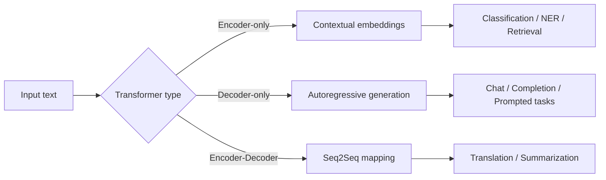
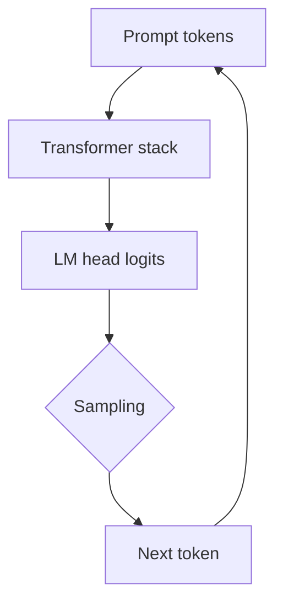
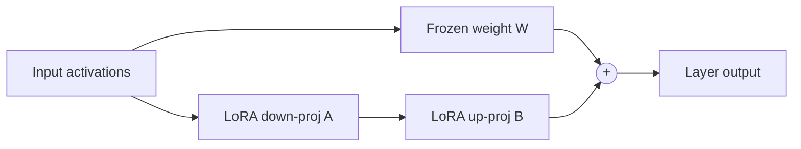

# Generative AI Week 4: From Transformers to LLMs

## Overview

- **Topic of the unit**: Transformer “flavors” (encoder/decoder/encoder-decoder), tokenization, generation & sampling, transfer learning and fine-tuning, and how scaled transformers become LLMs.
- **Instructor**: Mitra Purandare
- **Learning goals**:
  - Use transformers in different application scenarios
  - Revisit and learn sampling strategies for generation
  - Understand tokenizers (word/character/subword) and batching (padding, truncation, attention masks)
  - Understand how an LLM emerges from a transformer via pretraining + post-training (SFT/RLHF, PEFT)

## 1. Introduction / Context

Modern NLP is built on the Transformer architecture, but what truly “changed the game” is **scaling**: bigger models trained on massive corpora become **foundation models** that can be adapted to many downstream tasks (rather than training from scratch each time).

This lecture connects:

- **Architecture choices** (encoder vs decoder vs encoder-decoder),
- **How text becomes tokens** (tokenization + batching constraints),
- **How decoders generate text** (autoregressive prediction + sampling),
- **How we reuse pretrained models** (transfer learning + fine-tuning),
- **How we turn a base language model into an assistant** (post-training alignment).

## 2. Key Concepts and Definitions

| Term                                 | Definition                                                                                                   | Example                                                              |
| ------------------------------------ | ------------------------------------------------------------------------------------------------------------ | -------------------------------------------------------------------- |
| Tokenization                         | Splitting text into tokens and mapping tokens ↔ integer IDs (numericalization / de-tokenization).            | `"tokenization"` → `["token", "ization"]` with subword tokenization. |
| Word tokenization                    | Treat words as tokens; limits vocabulary; unknown words become `<unk>`.                                      | Rare word not in top 100k → `<unk>`.                                 |
| Character tokenization               | Each character is a token; simple but expensive and ignores word structure.                                  | `"cat"` → `["c","a","t"]`.                                           |
| Subword tokenization (WordPiece/BPE) | Compromise: learn frequent subword units from data via merge rules.                                          | Start from chars, merge frequent pairs until vocab size reached.     |
| Decoder-only Transformer             | Autoregressive model trained for next-token prediction using causal masking.                                 | GPT-style models; generate one token at a time.                      |
| Encoder-only Transformer             | Produces contextualized embeddings; trained with MLM/NSP; suited for classification/NER.                     | BERT embeddings + classification head.                               |
| Encoder-decoder (Seq2Seq)            | Maps an input sequence to an output sequence; used in translation/summarization.                             | Encoder reads source; decoder generates target with cross-attention. |
| Causal masking                       | Prevents attention to future tokens in a decoder (no “cheating”).                                            | Token _t_ can attend only to tokens `< t`.                           |
| attention_mask (padding mask)        | Marks real tokens vs padding so the model ignores `[PAD]` during attention.                                  | `1=real`, `0=padding` (not the same as causal mask).                 |
| Transfer learning                    | Reuse a pretrained “body” and add/swap a task-specific “head”.                                               | Frozen encoder + linear classifier for emotions.                     |
| Fine-tuning                          | Update parameters using a task dataset (full or parameter-efficient).                                        | Full fine-tuning vs LoRA adapters.                                   |
| SFT (Supervised Fine-Tuning)         | Post-training on instruction → response pairs to make the model follow instructions.                         | Question–answer datasets like Alpaca-style.                          |
| RLHF / Preference tuning             | Train towards preferred responses using ranked comparisons (human preference).                               | Pick more helpful/safer answer, not just “plausible”.                |
| PEFT                                 | Fine-tune efficiently by updating only small parameter subsets (Adapters, LoRA, Prefix/Prompt tuning, etc.). | LoRA injects low-rank matrices while freezing base weights.          |

## 3. Main Content

### 3.1 Transformer “Flavors” and When to Use Them

The lecture frames transformers as **three main families** (with “fuzzy” boundaries in practice):

- **Decoder-only (Causal LM / autoregressive)**
  - Strength: generation (chat, writing, code, completion).
  - Core idea: predict next token repeatedly with **causal masking**.

- **Encoder-only (Embedding models)**
  - Strength: understanding tasks that need representations (classification, NER, retrieval embeddings).
  - Core SSL objective: **Masked Language Modeling (MLM)** and sometimes NSP.

- **Encoder-decoder (Seq2Seq)**
  - Strength: explicit sequence-to-sequence mappings (translation, summarization).
  - Decoder attends to encoder outputs via **cross-attention**.

Even though these categories exist, the slides emphasize it’s **not strictly separated**: decoder-only models can be prompted for translation, and encoder models can be used in summarization pipelines.

**Mermaid: model “flavors” at a glance**

### 3.2 Tokenization and Batch Processing

Transformers do not read raw text; they read **token IDs**. Tokenization includes:

1. **Split** text into tokens,
2. **Map** tokens → integer IDs,
3. Preserve some structure while keeping vocabulary manageable.

#### Word vs Character vs Subword

- **Word-level** is intuitive but forces a fixed vocabulary and produces `<unk>` for unseen words.
- **Character-level** avoids `<unk>` but loses word structure and is computationally expensive because sequences become long.
- **Subword** (WordPiece/BPE-like) is the practical standard:
  - Start from characters
  - Merge frequent adjacent pairs
  - Continue until vocab size reached or merges exhausted

#### Why padding and attention masks matter in batches

When processing **multiple sentences at once**, models require equal sequence lengths within a batch. Therefore:

- `padding=True`: add `[PAD]` tokens to shorter sequences up to the longest sequence in the batch.
- `attention_mask`: tells the model which tokens are real vs padding (`1` real, `0` padding).
- `truncation=True`: cut sequences that exceed max model length.

**Important distinction:** `attention_mask` (padding mask) is _not_ the same as causal masking used in decoders.

### 3.3 Decoder-only Generation: Autoregression, LM Head, and K-V Cache

A decoder-only transformer generates **one token at a time**:

- Compute hidden states for the prompt
- Use the **last position’s hidden vector** as input to the **LM head** to get logits for the next token
- Choose the next token (sampling strategy)
- Append it and repeat

#### Training vs inference (generation)

- **Training (teacher forcing):** loss is computed for _all_ next-token predictions in parallel across the sequence.
- **Inference:** we only need the next token, so we repeatedly use the last hidden state to predict one token at a time.

**Autoregressive loop (conceptual)**

#### K-V Cache (speeding up generation)

During generation, attention repeatedly needs Keys/Values from previous tokens. A **K-V cache** stores prior K/V tensors so the model avoids recomputing them each step, making decoding much faster.

### 3.4 Encoder-only Models: MLM, BERT, DistilBERT, and Special Tokens

Encoder-only models turn text into **contextualized embeddings** useful for understanding tasks.

#### BERT and MLM

BERT is pretrained with **Masked Language Modeling (MLM)**: randomly mask tokens and predict them from both left and right context.
Example:

- “The lion looked at the `[MASK]` and fled.”

#### DistilBERT and knowledge distillation

DistilBERT compresses BERT via **knowledge distillation**:

- student model learns to match the teacher’s output distribution (“soft targets”), retaining most language understanding while being smaller/faster.

#### Special tokens (common in BERT-like tokenizers)

The slides list typical special tokens and IDs: `[PAD]`, `[UNK]`, `[CLS]`, `[SEP]`, `[MASK]`.

- `[CLS]` often provides a pooled representation for classification.
- `[PAD]` is ignored using `attention_mask`.

### 3.5 Encoder-Decoder Models: Translation Training Dynamics

Encoder-decoder models are highlighted for **translation**:

- Training data: paired (source, target) sequences
- Decoder generates target autoregressively (often shown with argmax during training examples)
- Loss: cross entropy
- Backprop flows through decoder and encoder

Key mechanism: decoder uses:

- masked self-attention (no future tokens),
- **cross-attention** over encoder outputs (K,V from encoder).

### 3.6 Using Pretrained Models: Classification and Transfer Learning

Instead of retraining from scratch:

- Keep a pretrained **body** (transformer)
- Add a task-specific **head** (e.g., linear classifier)

Two common strategies:

1. **Freeze the body**: train only the head (fast, less data, less risk of catastrophic forgetting).
2. **Fine-tune**: update (some or all) transformer parameters for best task performance.

The slides illustrate classification with an encoder model and show hidden states (especially `[CLS]`) used as features for a classifier head.

### 3.7 Sampling Strategies for Generation

Sampling controls the trade-off between **quality**, **diversity**, and **consistency**. The lecture covers:

#### Greedy sampling

Always choose the most probable token:

$$
y_t = \arg\max_i ; p(i \mid y_{<t}, x)
$$

- Deterministic, but can be repetitive or get stuck in bland outputs.

#### Random sampling

Sample from the full distribution over the vocabulary.

- More diverse, but can choose low-probability “weird” tokens.

#### Temperature scaling

Rescale logits (z_i) before softmax:

$$
p(i) = \frac{e^{z_i/T}}{\sum_j e^{z_j/T}}
$$

- ($T \ll 1$): sharper distribution (more conservative, close to greedy)
- ($T \gg 1$): flatter distribution (more diverse, higher risk)

#### Beam search

Keeps the top (B) partial sequences (“beams”) at each step and expands them, exploring multiple high-probability paths.

- Useful when you want high-likelihood sequences (e.g., translation), but may reduce diversity.

#### Top-k sampling

Restrict sampling to the **k most probable** tokens:

- Cuts off the long tail of unlikely tokens.

#### Nucleus sampling (top-p)

Choose the smallest token set whose cumulative probability ≥ (p) (e.g., 0.95), and sample only from that dynamic set.

- Often more adaptive than fixed top-k.

### 3.8 From Transformers to LLMs: Pretraining and Scale

The “transition to generative LLMs” is framed as:

1. **Pretraining**: learn general language/statistical structure from huge corpora → base model completes text.
2. **Post-training**: align behavior with human goals (instruction following, helpfulness, safety).

The slides mention example dataset scales (illustrative): C4, Dolma, FineWeb, and token counts used in Llama training.
They also highlight that training SOTA models requires massive compute (example slide on “Training a SOTA model”).

### 3.9 Post-training: Making an Assistant (SFT, PEFT, Preference Tuning / RLHF)

#### Why post-training is needed

A base language model is good at predicting plausible continuations but not necessarily at:

- Following instructions reliably,
- Being safe/appropriate,
- Maintaining helpful dialogue behavior.

#### Supervised Fine-Tuning (SFT)

- Train on instruction → response pairs.
- Key point from the slides: surprisingly **little** high-quality instruction data can go far (“less is more” / LIMA idea).

#### Parameter-Efficient Fine-Tuning (PEFT)

Full fine-tuning updates all weights and is costly. PEFT updates a small subset:

- Adapters
- LoRA / QLoRA
- Prefix / Prompt / P-tuning, etc.

**LoRA core idea (math)**
Freeze the original weight matrix (W) and learn a low-rank update:

$$
W_{\text{adapted}} = W + \alpha , B A
$$

where ($A \in \mathbb{R}^{r \times d}$), ($B \in \mathbb{R}^{d \times r}$), and ($r \ll d$).

**Mermaid: where LoRA fits**

#### Preference tuning / RLHF

Instead of “cloning” one answer (SFT), RLHF-style preference learning aims to **maximize human preference**:

- Generate multiple candidate answers
- Humans/experts rank them
- Train the model toward preferred outputs

The slides contrast:

- **SFT**: behavior cloning; can encourage hallucination if the reference answer is wrong/unknown.
- **RLHF**: optimize preferences; more about “what users want” than copying a single target.

## 4. Relationships and Interpretation

A helpful way to connect the entire lecture:

- **Tokenization + batching** determine what the model _can_ see and how efficiently it runs.
- **Architecture flavor** determines whether the model is naturally suited for:
  - Representation learning (encoder),
  - Generation (decoder),
  - Mapping (encoder-decoder).

- **Sampling** determines how the same decoder model behaves at inference (deterministic vs creative).
- **Transfer learning** makes pretrained models reusable; you mostly train “heads” or fine-tune selectively.
- **LLMs** are not a new architecture class; they are (mostly) transformers + **scale** + **post-training alignment**.

## 5. Examples and Applications

- **Text classification (encoder-only)**: sentiment/emotion classification using `[CLS]` embedding + linear head; optionally freeze encoder for efficiency.
- **Generative tasks (decoder-only)**: prompt → autoregressive continuation; quality/diversity controlled by temperature/top-k/top-p/beam search.
- **Translation (encoder-decoder)**: paired source/target training; decoder cross-attends to encoder outputs.
- **Efficient adaptation (PEFT)**: adapt an LLM to a domain with LoRA/QLoRA rather than updating all weights.

## 6. Summary / Takeaways

- Transformers come in **encoder-only**, **decoder-only**, and **encoder-decoder** variants, each aligned with different tasks (but with overlap).
- **Tokenization** (especially subword methods) is essential to make text manageable and generalizable.
- Decoder generation is **autoregressive**; training predicts all next tokens in parallel, inference predicts one token at a time—often accelerated by **K-V cache**.
- **Sampling strategies** (temperature, beam search, top-k, top-p) shape the output trade-offs.
- LLMs are transformers that become general-purpose through **scaling + transfer learning**, then become assistants through **post-training** (SFT, PEFT, RLHF).

## 7. Study Tips

- Re-implement the generation loop conceptually: prompt → logits → sampling → append token → repeat.
- Practice identifying which mask is used when:
  - `attention_mask` for padding vs **causal mask** for decoders.

- For sampling: test the same prompt under greedy, temperature changes, top-k, and top-p; observe repetition vs creativity.
- For transfer learning: compare “freeze encoder + train head” vs “full fine-tune” in terms of performance and compute cost.

## 8. Deepening / Further Concepts

- Retrieval-augmented generation (RAG): pairing **encoder embeddings** with a **decoder generator** (not covered explicitly, but naturally follows the “embedding model + generation model” split).
- Quantization-aware adaptation: QLoRA-style workflows (compress base weights + LoRA updates).
- Alignment beyond RLHF: preference optimization variants (e.g., direct preference optimization) as conceptual successors to the preference-ranking pipeline shown. (Conceptual extension of the slide idea.)

## 9. Sources & Literature (IEEE)

[1] J. Devlin, M.-W. Chang, K. Lee, and K. Toutanova, “BERT: Pre-training of Deep Bidirectional Transformers for Language Understanding,” 2018.

[2] V. Sanh, L. Debut, J. Chaumond, and T. Wolf, “DistilBERT, a distilled version of BERT: smaller, faster, cheaper and lighter,” 2019.

[3] OpenAI, “InstructGPT,” 2022.

[4] E. J. Hu et al., “LoRA: Low-Rank Adaptation of Large Language Models,” 2021.

[5] T. Dettmers et al., “QLoRA: Efficient Finetuning of Quantized LLMs,” 2023.

[6] Hugging Face, “Transformers documentation (BERT, tokenization, generation),” online documentation.
