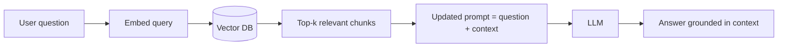

# Generative AI Week 5: Transition to LLMs & Retrieval-Augmented Generation (RAG)

## Overview

- Topic of the unit: How a transformer becomes an LLM (pre-training → post-training), alignment methods (SFT, PEFT, preference tuning/RLHF), and how RAG adds external knowledge via retrieval + grounded generation + reranking.
- Instructor: Mitra Purandare
- Learning goals:
  - Explain the lifecycle from **base model** (pretrained LM) to **assistant** (aligned model)
  - Distinguish **SFT**, **PEFT (Adapters/LoRA/QLoRA)**, and **preference tuning (RLHF/DPO/PPO)**
  - Understand why prompting alone is insufficient and how to add **context/memory**
  - Build intuition for **RAG pipelines**: embeddings, vector search, chunking, evaluation (precision/recall), and **reranking**
  - Recognize common RAG limitations (domain shift, context window limits, “lost in the middle”) and mitigations

---

## 1. Introduction / Context

Week 5 connects two practical problems in modern GenAI systems:

1. **How a transformer becomes an LLM assistant**
   A pretrained model learns to _complete text_ (next-token prediction), but it is not inherently trained to follow instructions, be helpful, or obey safety constraints. That behavior is added in **post-training** through alignment methods (SFT, preference tuning/RLHF, etc.).

2. **How to make an LLM useful for your private/domain knowledge**
   Even aligned LLMs do not know everything, and crucially they may not know _your_ documents (company policies, proprietary PDFs, specialized domain text). **RAG** addresses this by retrieving relevant pieces of external text and injecting them into the prompt for grounded answering.

---

## 2. Key Concepts and Definitions

| Term                             | Definition                                                                                               | Example                                                                                               |
| -------------------------------- | -------------------------------------------------------------------------------------------------------- | ----------------------------------------------------------------------------------------------------- |
| Base model                       | Pretrained LM that learns language by next-token prediction; not instruction-following by default.       | Model completes “The capital of France is …” but may not reliably _answer_ questions as an assistant. |
| Post-training / alignment        | Methods to make a base model behave like an assistant (instruction following, moderation/safety).        | Add instruction-following behavior and safer outputs via SFT + preference tuning.                     |
| Prompt components                | Structured pieces of a prompt (persona, instruction, context, format, audience, tone, data).             | Persona + instruction + formatting constraints + the user’s text to summarize.                        |
| Few-shot / in-context learning   | Provide examples in the prompt to guide behavior without changing weights.                               | Add 2–3 QA examples to steer response style.                                                          |
| Chain-of-thought (CoT) prompting | Prompting technique encouraging step-by-step reasoning.                                                  | “Let’s think step by step…” to solve a complex problem.                                               |
| SFT (Supervised Fine-Tuning)     | Fine-tune on instruction → response pairs to teach desired behaviors.                                    | Train on Q/A where output is the desired assistant response.                                          |
| FFT (Full fine-tuning)           | Update _all_ parameters during SFT; expensive in compute/storage.                                        | Fine-tune the full model for a domain-specific assistant.                                             |
| PEFT                             | Parameter-efficient fine-tuning: update a small subset of parameters.                                    | LoRA injects low-rank updates while base weights stay frozen.                                         |
| Adapters                         | Small modules inserted into a transformer; trained for specific tasks/domains.                           | Adapter 1 for medical classification, Adapter 2 for NER.                                              |
| LoRA                             | Low-rank matrices learn an update ($\Delta W$) while (W) remains frozen.                                 | ($W\_{\text{LoRA}} = W + \alpha BA$).                                                                 |
| QLoRA                            | Quantize base weights (e.g., 4-bit) and then apply LoRA to reduce memory.                                | “Reduce memory requirements of original weights before LoRA.”                                         |
| Preference tuning / RLHF         | Align model outputs with human preferences using rankings and reward signals.                            | Train a reward model, then optimize the assistant to score higher.                                    |
| PPO / DPO                        | PPO: RL method to optimize policy without drifting too much; DPO: simpler alternative avoiding RL loop.  | PPO mentioned as common; DPO as an alternative approach.                                              |
| RAG                              | Retrieval-Augmented Generation: retrieve relevant text snippets and generate an answer grounded in them. | Query → retrieve chunks → add to prompt → LLM answers using context.                                  |
| Vector search / dense retrieval  | Retrieve documents by embedding similarity (e.g., cosine similarity).                                    | Use FAISS/Pinecone/pgvector instead of brute-force similarity.                                        |
| Chunking                         | Splitting long documents into smaller pieces to embed/retrieve within context limits.                    | Paragraph chunks with overlap windows.                                                                |
| Reranking                        | Second-stage model reorders retrieved results to select the best few for the LLM.                        | Cross-encoder scores each (query, document) pair and reorders them.                                   |
| Precision@K                      | Fraction of top-K retrieved items that are relevant.                                                     | 1 relevant in top-2 → 0.5.                                                                            |
| Recall@K                         | Fraction of all relevant items that appear in top-K results.                                             | Retrieve more docs to increase recall, then rerank.                                                   |

## 3. Main Content

### 3.1 From Transformer to LLM: Pre-training

**Pre-training** creates a language model by learning next-token prediction on huge corpora; the model becomes good at reproducing language and completing prompts, but it is not trained to be an assistant.

The slides list example dataset scales (order-of-magnitude perspective): C4 (~150B tokens), Dolma (~3T), FineWeb (~15T), and examples of Llama training token counts (Llama 2 ~2T; Llama 3 ~15T).

A key implication: **most knowledge is learned during pre-training**, while alignment data can be much smaller.

### 3.2 Post-training: Turning a Base Model into an Assistant

“Language modeling != assisting users.” Assistants must:

- Follow instructions reliably
- Moderate / avoid policy-violating content
- Produce helpful, user-centered outputs

But “desired behavior” data is scarce and expensive compared to web-scale pretraining data.

#### 3.2.1 Supervised Fine-Tuning (SFT)

SFT adapts the base model using instruction–response pairs. In full fine-tuning (FFT), all parameters are updated (accurate but costly).

A notable point in the slides: surprisingly little data may be needed to teach instruction-following formats (the “less is more” alignment idea).

### 3.3 PEFT: Efficient Fine-Tuning at Lower Cost

Because FFT is costly (compute + storage), PEFT methods update only small components. The slides highlight: **Adapters, LoRA, QLoRA, Prefix tuning, P-tuning, Prompt tuning**.

#### LoRA (core formula)

LoRA learns a low-rank update while freezing (W):

$$
W_{\text{adapted}} = W + \alpha BA
$$

where ($A$) is a down-projection, ($B$) an up-projection, and rank ($r \ll d$).

**Why it works (intuition):** many tasks have low “intrinsic dimension,” so you don’t need to update all parameters to get most performance.

#### QLoRA

QLoRA reduces memory by quantizing base weights (e.g., lower-bit precision) before applying LoRA-style adaptation.

### 3.4 Preference Tuning / RLHF: Aligning to Human Preferences

Preference tuning answers: “Which response is better?” rather than only “match this target answer.”

Typical pipeline shown in the slides:

1. Collect preference comparisons
2. Train a reward model
3. Fine-tune the assistant to maximize reward (often PPO), or use alternatives like DPO

The slides also mention multiple reward models (e.g., separate helpfulness vs safety reward models in Llama 2).

### 3.5 Prompting: Powerful, but Not Sufficient Alone

Prompting provides context and can significantly improve outputs, but relying on prompting as the only tool is limiting—especially when the model lacks access to private/domain data.

Prompt structure example (persona, instruction, context, format, audience, tone, data) illustrates how prompts can be engineered systematically rather than ad-hoc.

**Simple “beyond prompting” upgrades mentioned:**

- Give the assistant “memory” passed via prompts
- Summarize conversation state and feed it back as context

### 3.6 RAG: Retrieval + Grounded Generation (+ Reranking)

RAG is introduced as a response to LLM limitations: not knowing everything, missing proprietary/domain knowledge, and context window limits.

#### 3.6.1 The RAG pipeline

From the diagram (Week 5 RAG slides), the system does:

1. **Retrieval**: embed the query and search a vector DB for similar chunks
2. **Grounded generation**: add retrieved context to the prompt and generate an answer

#### 3.6.2 Vector search and similarity

Dense retrieval compares embeddings, commonly using cosine similarity (noted as a typical similarity search approach; brute force becomes a bottleneck at scale).

**Why vector databases:** systems like FAISS/Annoy and hosted vector DBs (e.g., Pinecone, Weaviate, Chroma) speed up approximate nearest neighbor search so retrieval happens in milliseconds, sometimes with GPU/cluster scaling.

#### 3.6.3 Retrieval evaluation

Slides define common metrics:

- **Precision**:
  $$
  \text{Precision}=\frac{TP}{TP+FP}
  $$
- **Precision@K**:
  $$
  \text{Precision@K}=\frac{\text{num relevant in top K}}{K}
  $$
- **Recall**:
  $$
  \text{Recall}=\frac{TP}{TP+FN}
  $$
- **Recall@K**: how many relevant docs are retrieved within the top K.

#### 3.6.4 Chunking strategies (because context is limited)

Because LLMs have context-size limits, you can’t feed entire long documents. The slides discuss chunking options:

- One vector per document (simple but compresses too much)
- Truncation (can drop key info)
- Many vectors per document via chunks (lines, paragraphs)
- Overlapping windows to reduce boundary misses

#### 3.6.5 Retrieval shortcomings and “Lost in the Middle”

Key limitations highlighted:

- Choosing top-K threshold is tricky
- Exact phrase matches may fail with pure dense retrieval → **hybrid search** (semantic + keyword) recommended
- Domain shift hurts retrieval if trained on Wikipedia/web but deployed on specialized domains (e.g., legal)
- Answers spanning multiple chunks are hard
- Long-context behavior can degrade: “Lost in the Middle” suggests models may not robustly use relevant info if it appears in the middle of a long input context

#### 3.6.6 Reranking: balancing retrieval recall and LLM usability

Reranking solves a tension:

- To maximize retrieval recall, retrieve many docs
- To maximize the LLM’s ability to use context, send fewer, more relevant docs

A reranker (often a cross-encoder) scores each (query, doc) pair and reorders results; then you pass only the top few into the generation prompt.

## 4. Relationships and Interpretation

Week 5’s core story is a full system view:

- **Pre-training** gives broad language competence and knowledge.
- **Post-training** changes the model’s _behavior_ to become an assistant:
  - SFT teaches instruction following
  - PEFT makes adaptation practical
  - Preference tuning/RLHF aligns outputs with human judgments (helpful + safe)

- **Prompting** shapes behavior at inference time, but can’t add missing private knowledge reliably.
- **RAG** supplies missing knowledge at runtime via retrieval, but introduces its own design/evaluation challenges (chunking, vector search, recall/precision tradeoffs, and reranking).
- **Reranking** is the bridge that makes “retrieve a lot” compatible with “feed a little” to the LLM, especially under long-context weaknesses.

## 5. Examples and Applications

- **Company policy assistant (private PDFs):**
  - Store document chunks in a vector DB (FAISS/pgvector/Pinecone)
  - RAG retrieves policy sections relevant to a question
  - Rerank to pass only the best 3–5 chunks into the prompt

- **Domain specialist assistant (e.g., oncology updates):**
  - Prompt persona + format constraints
  - RAG adds latest internal notes/guidelines not in pretraining

- **Efficient customization without huge GPU cost:**
  - Use LoRA/QLoRA instead of full fine-tuning to specialize style or domain language while keeping the base model frozen

- **Search system improvements:**
  - Hybrid search for exact phrases + semantics
  - Retrieve broadly to boost recall, then rerank tightly to reduce context overload

## 6. Summary / Takeaways

- A **base model** is a next-token predictor; an **assistant** requires **post-training** (SFT, preference tuning/RLHF) to follow instructions and behave safely.
- **PEFT** (Adapters/LoRA/QLoRA) enables practical fine-tuning by updating only small parameter subsets, dramatically reducing cost.
- **Prompting** is valuable but insufficient when the model lacks access to proprietary or domain-specific documents.
- **RAG** addresses missing knowledge by retrieving relevant chunks and generating grounded answers, but requires careful chunking, evaluation, and dealing with long-context weaknesses.
- **Reranking** helps select the most relevant context to feed the LLM, improving answer quality under context limits and “lost in the middle” effects.

## 7. Study Tips

- Be able to explain, in one minute, the difference between:
  - Pre-training vs post-training
  - SFT vs preference tuning (what supervision signal is used?)
  - FFT vs PEFT (what parameters change?)
  - Dense retrieval vs reranking (bi-encoder vs cross-encoder intuition)

- Practice computing:
  - Precision@K and Recall@K on small toy retrieval results

- For RAG design, always ask:
  - What is the chunking strategy?
  - How large is K before reranking?
  - How many chunks do we finally feed to the LLM (context budget)?
  - Do we need hybrid search (keyword + semantic)?

## 8. Deepening / Further Concepts

- **Two-stage retrieval** architectures: first-stage dense/hybrid retrieval + second-stage reranker (cross-encoder) as a standard pattern for high-quality search/RAG.
- **Context placement strategies**: if “lost in the middle” applies, experiment with placing the most relevant chunks early, compressing context, or using structured citations/sections to help the model focus.
- **Multi-objective alignment**: multiple reward models (helpfulness + safety) suggests assistant behavior is a trade-off optimized with multiple signals.

## 9. Sources & Literature (IEEE)

[1] M. Purandare, “Week 5: Transition to LLMs,” lecture slides, OST Generative AI, 14.10.2025.

[2] M. Purandare, “Week 5: Retrieval Augmented Generation (RAG),” lecture slides, OST Generative AI, 14.10.2025.

[3] J. Alammar and M. Grootendorst, _Hands-On Large Language Models_, referenced in slides (alignment, RAG, LoRA/RLHF figures).

[4] L. Ouyang et al., “Training language models to follow instructions with human feedback,” _arXiv:2203.02155_, 2022 (InstructGPT, referenced in slides).

[5] E. J. Hu et al., “LoRA: Low-Rank Adaptation of Large Language Models,” 2021 (concept and equation referenced in slides).

[6] N. F. Liu et al., “Lost in the Middle: How Language Models Use Long Contexts,” 2023 (referenced in slides as long-context limitation).
