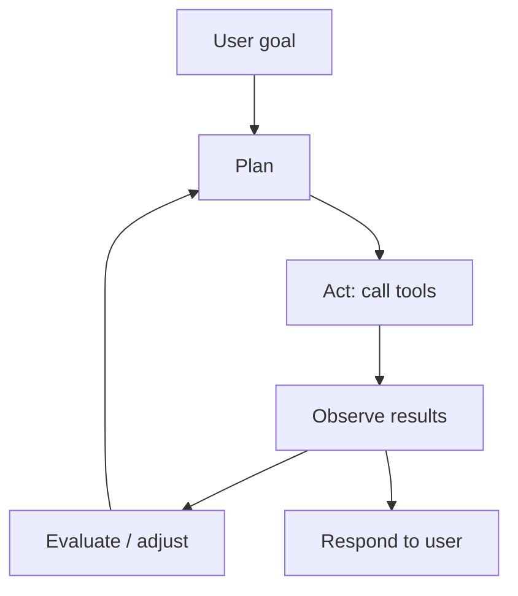
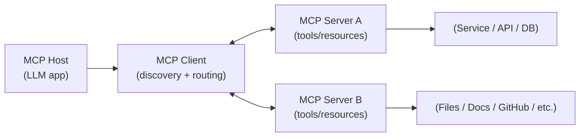

# Generative AI Week 6: AI Agents and MCP

## Overview

- Topic of the unit: From LLMs to **AI Agents** (agentic behavior), **tool/function calling**, and the **Model Context Protocol (MCP)** for standardized tool integration.
- Instructor: Mitra Purandare
- Learning goals:
  - Understand **agentic behavior** and what makes an LLM-based system an “agent”
  - Understand **function calling / tool usage** and why tools matter
  - Understand **MCP**: tools, servers, and standardized integration flow

## 1. Introduction / Context

The lecture starts from a practical observation: **LLMs are stateless**. To hold a meaningful long conversation or build a personalized assistant, you must store history externally and feed it back as context—but that becomes expensive (token cost) and can degrade response quality as context grows.

Week 6 connects three ideas into one “systems” view:

1. **Memory/personalization optimization**: summarize history and extract only stable user traits (“likes/dislikes”).
2. **RAG as optimization**: retrieve only the _relevant_ traits for the current query (and optionally rerank).
3. **Agents**: once LLMs can _choose_ and _use_ tools (with memory + planning), they can interact with an environment—not just chat.

## 2. Key Concepts and Definitions

| Term                         | Definition                                                                                          | Example                                                                             |
| ---------------------------- | --------------------------------------------------------------------------------------------------- | ----------------------------------------------------------------------------------- |
| Agent (classical AI)         | A system that perceives an environment and acts on it (sensors/effectors).                          | Robot perceives obstacles → navigates around them.                                  |
| Agent (LLM-based)            | A system where LLMs dynamically direct their own process and tool usage to accomplish tasks.        | LLM decides to search, calculate, and write a report via tools.                     |
| Tool                         | A callable function/API that extends an LLM beyond text generation and enables actions.             | Calculator tool, database query tool, calendar API.                                 |
| Function calling             | Structured selection of a tool + arguments by the model (or system) rather than free-text “intent”. | Model outputs: `{"tool":"add","args":{"a":2,"b":3}}`.                               |
| Memory                       | External storage of conversation state, user preferences, or intermediate results.                  | Save “likes spicy Indian food” and reuse later.                                     |
| Planning                     | Decomposing a goal into steps and deciding tool order (plan → act → evaluate).                      | “Find flights → compare prices → book cheapest”.                                    |
| RAG (in this context)        | Retrieve only relevant context (e.g., personality traits) instead of passing everything.            | Query “I’m hungry” → retrieve only food preferences.                                |
| Reranking                    | Reorder top-k retrieved items with a reranker to choose best context/tools.                         | Rerank retrieved traits/docs before sending to LLM.                                 |
| MxN integration problem      | With M models and N tools, naive integration requires M×N connections/updates.                      | Add one tool → update every model integration.                                      |
| MCP (Model Context Protocol) | Open standard that turns M×N into M+N by standardizing tool access via client/server.               | Each app implements MCP client once; each tool provider implements MCP server once. |
| MCP Host                     | The LLM application that manages connections to MCP servers (e.g., IDE assistant).                  | Cursor / chat assistant acting as host.                                             |
| MCP Client                   | Lives inside the host; manages connections, tool discovery, and request forwarding.                 | Client enumerates available tools from servers.                                     |
| MCP Server                   | Lightweight program exposing tools/APIs via MCP; can be local or remote.                            | Server wrapping arXiv endpoints or GitHub actions.                                  |
| MCP Resources                | Data/services exposed through MCP (files, DB schemas, docs, etc.).                                  | PDFs, database schema, code documentation.                                          |
| ToolRAG                      | Selecting tools via retrieval is hard; treat “which tools are needed?” as classification.           | Query “create calendar invite” still needs `get_email_address`.                     |

## 3. Main Content

### 3.1 Recap: Personalization and Context Optimization

Key constraint: **LLMs are stateless**, so conversation history must be stored externally and passed back each time. Over long periods this becomes costly and can reduce quality.

**Optimization 1 (summarize/extract):**

- Summarize history, or
- Use a “personality extractor” (another LLM) to extract durable traits (likes/dislikes).
- Feed only these traits instead of the full conversation.

**Optimization 2 (RAG over traits):**

- Don’t send all traits every time.
- Retrieve only traits relevant to the current user query (example: “I am hungry” → food preferences).

**Optimization 3 (reranking):**

- Rerank the retriever’s top-k results to choose the best subset.

### 3.2 From LLMs to Agents: What Changes?

An LLM alone is “a function that maps strings to strings.” That’s powerful for chat, but it cannot directly interact with the world (no browsing, no calendar actions, no calculator) unless we provide **tools**.

The slide diagram (page 14) frames an agent as an LLM-centered system with three pillars: **Memory**, **Tools**, and **Planning**, interacting with a user and an environment.

**Core idea (as stated):**

> Agents = systems that leverage a language model to determine which actions they should take and in what order.

**Mermaid: agent loop (plan → act → evaluate)**

### 3.3 Tools and Function Calling: Why Naive Tooling Doesn’t Scale

The lecture shows a simple tool setup: define functions (`add`, `multiply`, `divide`) and register them in a dictionary for calling.

**Limitations of naive “LLM chooses tool via text”:**

- You must manually parse tool name and arguments from the LLM output.
- Reasoning is embedded inside one LLM call (hard to debug/structure).
- Adding tools and multi-step chaining becomes brittle.
- Every new tool requires:
  - prompt updates,
  - parsing logic updates,
  - tool registry updates.

This leads to the **MxN problem**: with **M models** and **N tools**, integration explodes because each model-tool pair needs support.

### 3.4 Enter MCP: Standardizing Tool Connections (MxN → M+N)

**Model Context Protocol (MCP)** is introduced as the fix: a standard interface where:

- each AI application implements the **client side** once, and
- each tool/data source implements the **server side** once.

Conceptually:

$$
\text{Naive integrations} \approx M \times N
\quad\longrightarrow\quad
\text{MCP integrations} \approx M + N
$$

(“M+N problem” framing from the slides.)

The diagram around page 23 shows MCP as a hub connecting:

- chat interfaces / IDEs / AI apps (left side)
  to
- data systems, dev tools, productivity tools (right side),
  with bidirectional data flow.

### 3.5 MCP Core Components

The slides define:

- **MCP Host**: the LLM application (e.g., chat assistant, IDE extension) that manages tool connections.
- **MCP Client**: inside the host; handles connection management, discovery of tool capabilities, forwarding requests.
- **MCP Server**: exposes tools/APIs via MCP; can connect to a specific service (local or remote).
- **Resources**: the actual tools/data/services (files, DBs, schemas, docs, etc.).

**Mermaid: component overview**

### 3.6 MCP Flow: How a Tool Call Happens

The “MCP Flow” slides (pages ~28–30) illustrate a typical cycle (example: summarize latest GitHub commits):

1. User sends prompt to the host.
2. Host/client lists available tools from MCP servers.
3. Tools are provided to the LLM.
4. LLM selects a tool (e.g., `list_commits`).
5. Client communicates tool call to server.
6. Server calls the external service (e.g., GitHub) and returns results.
7. Host sends prompt + tool output back to LLM.
8. LLM produces final answer to user.

This is a structured approach to tool use, instead of relying on brittle prompt-only parsing.

### 3.7 Transport and Server Capabilities

The lecture notes transports, with the **Streamable HTTP transport** as default for remote servers (with optional SSE streaming). It contrasts gRPC / HTTP(S) / stdio with pros/cons and typical use cases.

MCP servers expose three capability types:

- **Tools** (actions): callable functions selectable by the LLM
- **Resources** (data): text/blobs (PDFs), DB schemas, code docs, etc.
- **Prompts**: reusable prompt templates/structures supplied by the server

---

### 3.8 Practical Exercise Architecture

One slide outlines an exercise stack: LLM/client → (optional MCP orchestrator) → FastMCP Server exposing tools like `add_movie()`, `list_movies()`, `mark_watched()` → SQLite DB → result.

This shows agents as **systems**: tool definitions + runtime environment + persistence.

### 3.9 Small Models and Tool Selection: TinyAgent & ToolRAG

The lecture raises a research/engineering question: can a **small language model (SLM)** emulate function-calling behavior of larger models? (Slides mention “TinyAgent”.)

It also introduces **ToolRAG**: selecting the right tools via plain semantic retrieval can fail because the tool name/description embedding might not be similar to the user query. Example: “create a calendar invite” still needs a `get_email_address` tool even though it’s not semantically close to “calendar invite.”

Proposed fix: treat tool selection as **classification** (“which tools are needed?”) rather than naive retrieval.

## 4. Relationships and Interpretation

This week ties together:

- **Memory**: LLMs don’t remember; systems must store and compress relevant state.
- **RAG + reranking**: applies not only to documents, but also to _personalization traits_ (retrieve only what matters now).
- **Tools**: convert LLMs from “talking” systems into “acting” systems.
- **MCP**: an engineering standard to avoid brittle, duplicated tool integrations and reduce maintenance (especially when APIs change).
- **Tool selection**: retrieval alone may be insufficient; **classification/reranking** can be crucial in tool-rich environments.

All of this is the practical foundation for **agentic systems**: plan, call tools, observe, iterate.

## 5. Examples and Applications

- **Personalized food recommendation**: user says “I’m hungry” → retrieve only relevant traits (likes spicy Indian food, dislikes sushi) → generate suggestion.
- **IDE coding agent**: host is an IDE extension; tools are Git operations, linting, build/test runs; MCP standardizes tool exposure and discovery.
- **Movie tracker agent (exercise)**: tools manipulate a SQLite DB; the LLM decides whether to add/list/update watched status.
- **Calendar assistant**: tool selection challenge demonstrates why “ToolRAG” needs more than similarity search (may need classification).

## 6. Summary / Takeaways

- **LLMs are stateless** → memory must be external; long histories are costly and can hurt quality, so summarize/extract and retrieve only what’s needed.
- **Agents** are LLM-centered systems that combine **planning + tools + memory** to interact with an environment (not just chat).
- Naive tool integration doesn’t scale (manual parsing, brittle prompts) and leads to the **MxN problem**.
- **MCP** standardizes tool connections so apps implement clients once and tool providers implement servers once (**M+N**).
- Tool selection can fail with simple retrieval; **reranking** and **classification** (ToolRAG framing) help choose the right tools.

## 7. Study Tips

- Be able to explain the “agent diagram” (page 14): what roles **Memory**, **Tools**, and **Planning** play.
- Memorize the MCP roles and map them to real products:
  - Host (app), Client (connector), Server (tool provider), Resources (tools/data).

- Practice designing a small agent:
  - Define tools → define memory store → define a plan/act/evaluate loop → decide where reranking/classification is needed.

- For ToolRAG: think of counterexamples where semantic similarity fails, and propose a classifier feature set (tool names, descriptions, examples, schemas).

## 8. Deepening / Further Concepts

- **Tool selection as learning problem**: treat “choose tools” like multilabel classification (tools as labels), then combine with retrieval/reranking for scalability.
- **Multi-agent systems**: the lecture references broader definitions (goal-directedness, autonomy, coordination); MCP can be seen as infrastructure enabling many agents/apps to share tool ecosystems.
- **SLM agents**: explore whether smaller models can handle structured tool calling if the protocol and scaffolding are strong (TinyAgent question).

## 9. Sources & Literature (IEEE)

[1] M. Purandare, “Week 8: AI Agents and MCP,” lecture slides, Generative AI, OST – Ostschweizer Fachhochschule, 21.10.2025.

[2] S. Russell and P. Norvig, _Artificial Intelligence: A Modern Approach_, agent definition referenced in slides.

[3] R. S. Sutton and A. G. Barto, _Reinforcement Learning: An Introduction_, agent-environment loop referenced in slides.

[4] Anthropic, “Model Context Protocol (MCP),” open standard referenced in slides (protocol + ecosystem links).

[5] M. Grootendorst and J. Alammar, _An Illustrated Guide to AI Agents_, figures and explanations referenced in slides (MCP diagrams, agent/tool framing).
