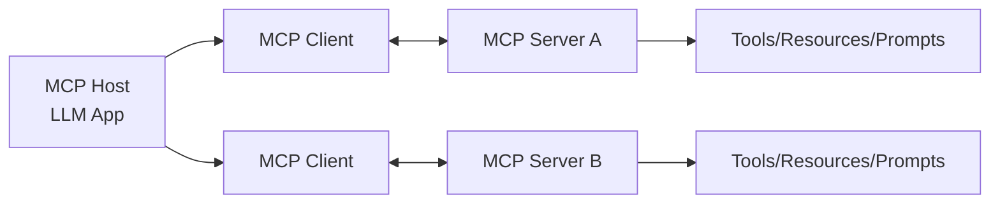
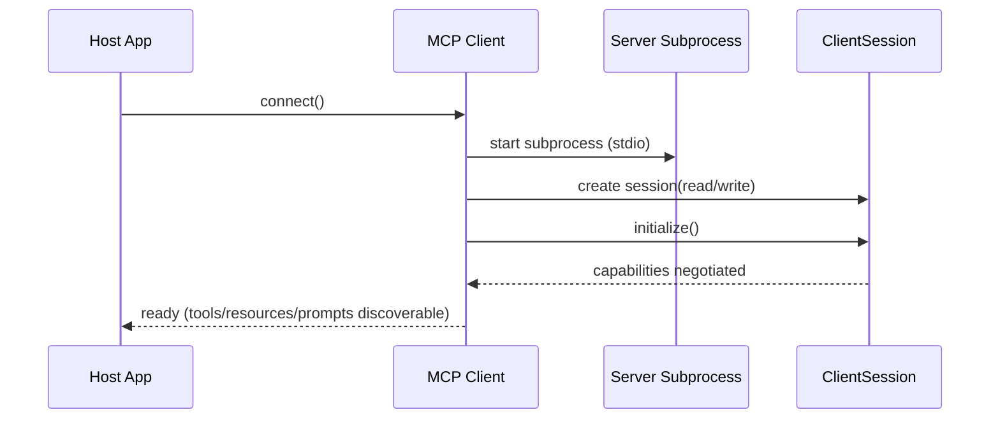

# Generative AI Week 9: Advanced MCP

## Overview

- Topic of the unit: Advanced concepts of the **Model Context Protocol (MCP)**—architecture, protocol layers (data vs transport), server primitives (tools/resources/prompts), **FastMCP** implementation details, and advanced **client callbacks** (sampling, elicitation, logging), plus multi-model and multi-server setups.
- Instructor: Mitra Purandare
- Learning goals:
  - Explain MCP’s core components (Host, Client, Server, Resources) and how they connect
  - Distinguish MCP’s **data layer** vs **transport layer** responsibilities
  - Implement MCP servers using **FastMCP**: define **tools**, **resources**, and **prompts**
  - Understand MCP client session management (stdio subprocess, JSON-RPC, async patterns)
  - Use advanced client primitives/callbacks: **sampling**, **elicitation**, **logging**
  - Design for multiple models and multiple servers (session groups)

## 1. Introduction / Context

This week deepens MCP beyond “connect a tool server to an LLM app” into **how MCP actually works** at protocol and SDK level. The slides emphasize MCP as:

- an **open protocol** for consistent access to tools and data sources,
- a system with two explicit layers (protocol + transport),
- and a framework (FastMCP) that makes implementing MCP servers easy by registering tools/resources/prompts automatically.

## 2. Key Concepts and Definitions

| Term                           | Definition                                                                                        | Example                                                       |
| ------------------------------ | ------------------------------------------------------------------------------------------------- | ------------------------------------------------------------- |
| MCP Host                       | The AI application coordinating one or more MCP clients and deciding how to use tools/resources.  | “Cursor” as a host that manages MCP connections.              |
| MCP Client                     | Component maintaining a connection to an MCP server and fetching tools/context for the host.      | A client connecting via stdio to a local calculator server.   |
| MCP Server                     | Program that provides context and capabilities to clients via MCP (JSON-RPC).                     | A server exposing calculator tools and math constants.        |
| Tools                          | Executable functions servers expose for actions (API calls, DB queries, file ops).                | `add(a,b)` returning `"a + b = result"`.                      |
| Resources                      | Data sources exposed by a server for contextual information.                                      | `resource://math-constants` returning π, e, τ, …              |
| Prompts                        | Reusable templates stored on the server to guide interactions/tool use.                           | “Use any tools to calculate operation X in calculator voice.” |
| Data layer                     | JSON-RPC protocol semantics: lifecycle mgmt, primitives (tools/resources/prompts), notifications. | Capability negotiation + progress notifications.              |
| Transport layer                | Connection mechanisms + auth: how messages physically move (stdio, HTTP).                         | Stdio for local; Streamable HTTP with SSE for remote.         |
| Stdio transport                | Local process communication via stdin/stdout (no network overhead).                               | Launch server subprocess and exchange JSON-RPC over stdio.    |
| Streamable HTTP transport      | Remote communication via HTTP POST (+ optional SSE streaming); supports auth headers/tokens.      | Bearer tokens/API keys; OAuth recommended for tokens.         |
| Sampling (client primitive)    | Server requests LLM completions from the client/host (model-independent server).                  | Server asks host to “complete” without shipping an LLM SDK.   |
| Elicitation (client primitive) | Server requests extra user input/confirmation via the client/host.                                | “Are you sure you want to delete this file?”                  |
| Logging (client primitive)     | Server sends logs to client for debugging/monitoring.                                             | `ctx.info(...)` streamed back to host UI.                     |

## 3. Main Content

### 3.1 MCP Core Components and Responsibilities

The slides restate MCP’s four key pieces (pages 2–4):

- **Server**: provides context/tools/capabilities to LLMs (via clients).
- **Host**: the LLM application managing connections (may host many clients).
- **Client**: maintains **one-to-one connections** with servers.
- **Resources**: tools/data/services provided locally or remotely.

**Mermaid: conceptual architecture**

### 3.2 MCP Layers: Data Layer vs Transport Layer

A central “advanced” point: MCP cleanly separates **what** is communicated from **how** it is transported.

#### Data layer (protocol semantics)

The data layer defines the JSON-RPC protocol for:

- **Lifecycle management**: initialization, capability negotiation, termination
- **Core primitives**: tools, resources, prompts, notifications
- **Client features**: servers can request sampling, elicitation, logging
- **Utility features**: notifications/progress for long-running ops

#### Transport layer (communication + auth)

The transport layer defines message framing, connection establishment, and authentication. Two transports are highlighted:

- **Stdio transport**: best for local processes (no network overhead).
- **Streamable HTTP transport**: HTTP POST with optional SSE streaming; supports auth headers/tokens; OAuth recommended for acquiring tokens.

### 3.3 MCP Server Primitives: Tools, Prompts, Resources

MCP servers can expose three core primitives (page 8):

1. **Tools**: callable actions (file ops, APIs, DB queries).
2. **Resources**: contextual data (files, DB records, API responses).
3. **Prompts**: reusable templates (system prompts, few-shot examples).

This is the key “server design” decision: which capabilities should be modeled as an **action** vs **context** vs **instruction template**.

### 3.4 FastMCP: Building MCP Servers in Python

The slides introduce **FastMCP** as a Python framework that simplifies MCP server creation (page 9).

Key behaviors:

- Create server: `mcp = FastMCP("Calculator")`
- Automatically register decorated functions:
  - `@mcp.tool()`
  - `@mcp.resource()`
  - `@mcp.prompt()`

- Handle parsing/serialization + async communication
- Manage sessions per client connection

#### Tools (example: `add`)

The tool example is async and typed (page 10):

- FastMCP validates and converts JSON inputs into Python types.
- The `ctx` object represents the session and supports logging (`ctx.info`, `ctx.warning`, `ctx.error`).

Conceptually:

- Tools are “APIs the model can call”
- Context (`ctx`) is “the server’s handle to the active session”

#### Prompts (dynamic prompts with arguments)

The prompt example (pages 11–12) shows prompts as server-managed templates with:

- unique identifier (name),
- optional description,
- optional arguments (name/description/required),
- runtime injection by the client/host (“dynamic prompts”).

Why prompts matter (page 12):

- Reusability/consistency across clients
- Centralized control of instructions
- Dynamic instructions via arguments
- Better guidance before tool calls / generation

#### Resources (example: math constants)

The resource example (page 13) exposes `resource://math-constants` returning formatted constants (π, e, τ, φ, √2, …). Resources are the “context surface” the host/LLM can read.

### 3.5 MCP Client Internals: Sessions, Subprocesses, and Async Patterns

The slides walk through a typical stdio-based client setup (pages 4, 14–16):

- Start the MCP server as a subprocess (example uses `uv` as a runner).
- Establish stdio streams (`read`, `write`) to exchange JSON-RPC.
- Create a `ClientSession` as an async context manager.
- Call `initialize()` to negotiate capabilities and begin the session.

A key engineering detail is the use of `AsyncExitStack` to ensure proper cleanup of nested async context managers (page 15).

**Mermaid: stdio client connection lifecycle**

### 3.6 Advanced Client Primitives: Callbacks (Sampling, Elicitation, Logging)

MCP also defines primitives that **clients can expose** (page 17), enabling richer server-driven interactions:

- **Sampling callback**: server requests completions from host LLM (model-independent server; no LLM SDK in server).
- **Elicitation callback**: server requests more info/confirmation from the user.
- **Logging callback**: server sends logs for debugging/monitoring.

The slides show these callbacks wired into `ClientSession(...)` (page 18), e.g.:

- `logging_callback`
- `sampling_callback`
- `list_roots_callback`
- `elicitation_callback`

**Interpretation:** MCP is not “only the model calls tools.” It also supports controlled **server → client** requests (ask the host to sample, ask the user, stream logs), which is essential for interactive workflows and safe operations.

### 3.7 Multiple Models and Multiple Servers

Two final scalability ideas:

- **Multiple models**: MCP lets the host choose which model to use; you aren’t tied to one provider/model even if examples show one.
- **Multiple servers**: the Python SDK includes `ClientSessionGroup` to manage multiple server sessions concurrently (page 20).

This aligns with the bigger MCP promise: ecosystems where many tools exist as servers, and hosts can flexibly route tasks and tool calls.

## 4. Relationships and Interpretation

Week 9 reframes MCP as a full protocol stack:

- **Server side** organizes capabilities into:
  - Tools (do),
  - Resources (read),
  - Prompts (guide).

- **Client side** is not passive; it can provide:
  - sampling (LLM access),
  - elicitation (user interaction),
  - logging (observability).

- The **data/transport split** is what makes MCP portable across local (stdio) and remote (HTTP) deployment.
- “Multiple models / multiple servers” turns MCP into infrastructure for tool ecosystems: hosts orchestrate, servers specialize, and protocols keep everything interoperable.

## 5. Examples and Applications

- **Local developer assistant (stdio transport):** host launches a local MCP server subprocess and calls tools with near-zero overhead.
- **Remote enterprise tools (Streamable HTTP):** host connects to remote MCP servers over HTTP with standard auth; SSE can stream long-running progress.
- **“Safe action” workflows via elicitation:** before irreversible actions, the server asks the client to confirm with the user (elicitation).
- **Model-agnostic tool servers:** servers request sampling from the host rather than embedding a specific LLM SDK (portable across models).
- **Tool suite orchestration:** multiple MCP servers (e.g., GitHub, Jira, DB) managed concurrently via `ClientSessionGroup`.

## 6. Summary / Takeaways

- MCP consists of a **data layer** (JSON-RPC protocol + primitives + lifecycle + notifications) and a **transport layer** (stdio or streamable HTTP + auth).
- MCP servers expose three primitives: **tools**, **resources**, and **prompts**; FastMCP makes implementing these simple via decorators.
- MCP clients manage connections/sessions and can also expose callbacks for **sampling**, **elicitation**, and **logging**, enabling richer, interactive tool workflows.
- MCP is designed for scale: hosts can choose among **multiple models**, and clients can manage **multiple servers** concurrently.

## 7. Study Tips

- Be able to explain the separation:
  - “Data layer = semantics” vs “Transport layer = pipes + auth.”

- Memorize the three server primitives and map real capabilities to them:
  - Is it an action (tool), context (resource), or guidance template (prompt)?

- For implementation literacy:
  - Understand why stdio transport uses subprocess + streams,
  - Why async + `AsyncExitStack` is used for safe cleanup.

- Practice designing an MCP server:
  - 2 tools, 1 resource, 1 dynamic prompt, plus logging calls (`ctx.info`) and an elicitation step for confirmation.

## 8. Deepening / Further Concepts

- **Observability by design:** logging callbacks + progress notifications enable “tool transparency” in complex agentic systems.
- **Human-in-the-loop safety:** elicitation can enforce approvals for high-impact actions (a practical guardrail pattern).
- **Composable ecosystems:** multi-server orchestration is the backbone for agent systems that need many specialized capabilities, while keeping tool providers model-agnostic via sampling.

## 9. Sources & Literature (IEEE)

[1] M. Purandare, “Week 9: Advanced MCP,” lecture slides, Generative AI, OST – Ostschweizer Fachhochschule, 11.11.2025.

[2] Maarten Grootendorst and Jay Alammar, _An Illustrated Guide to AI Agents_, referenced in slides (MCP components/figures).

[3] Model Context Protocol, “MCP SDK Documentation,” referenced in slides.
