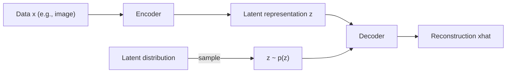

# Generative AI Week 10: Autoencoders and Variational Autoencoders (VAE)

## Overview

- Topic of the unit: **Latent space** and generative modeling with **Autoencoders (AE)** and **Variational Autoencoders (VAE)**; why VAEs fix sampling issues of vanilla AEs; reconstruction vs KL regularization; reparameterization trick; latent space arithmetic.
- Instructor: Mitra Purandare
- Learning goals:
  - Explain what a **latent space** is and why it matters for generation
  - Describe AE encoder/decoder training and the “reconstruction” objective
  - Understand why naive AE latent spaces are hard to sample from
  - Explain how VAEs model latent variables as **distributions** and why that helps
  - Derive the **reparameterization trick** and the **VAE loss** (reconstruction + KL)
  - Use latent space operations (vector arithmetic, interpolation/morphing)

## 1. Introduction / Context

The lecture starts with the key idea behind many generative models: real data (images, text, etc.) lives in a high-dimensional space, but can often be described by a smaller set of **abstract features** (e.g., shape parameters of an ellipse). This compressed representation is the **latent space**.

Autoencoders learn such a compressed representation by training a network to **reconstruct its input**. At first glance, “training a model to copy input to output” sounds pointless (“Stupid Idea!”), but the _magic_ is that the **bottleneck** forces the model to learn structured features—so you can generate new samples by decoding points from the latent space.

## 2. Key Concepts and Definitions

| Term                          | Definition                                                                                                   | Example                                                             |
| ----------------------------- | ------------------------------------------------------------------------------------------------------------ | ------------------------------------------------------------------- |
| Latent space                  | Hidden, lower-dimensional representation capturing abstract features of data.                                | Ellipse described by parameters ((a,b)) instead of pixels (page 3). |
| Autoencoder (AE)              | Neural network trained to encode input into a bottleneck vector and decode it back to reconstruct the input. | MNIST digit → latent vector → reconstructed digit.                  |
| Encoder                       | Network part mapping input (x) → latent code (z).                                                            | CNN layers reduce spatial size (stride=2).                          |
| Decoder                       | Network part mapping (z) → reconstructed output ($\hat{x}$).                                                 | Uses transposed convolutions to upsample (pages 11–12).             |
| Reconstruction loss           | Loss measuring how close ($\hat{x}$) is to (x).                                                              | RMSE or binary cross entropy (page 19).                             |
| Variational Autoencoder (VAE) | AE variant where encoder outputs a _distribution_ over (z) (mean + variance), enabling principled sampling.  | Each image maps to a Gaussian in latent space (page 20).            |
| Reparameterization trick      | Make sampling differentiable by writing ($z=\mu+\sigma\epsilon$), ($\epsilon\sim\mathcal N(0,1)$).           | Lets gradients flow through sampling (page 30).                     |
| KL divergence                 | Regularizer that pushes learned latent distributions toward a standard normal prior.                         | Penalize deviation from ($\mathcal N(0,1)$) (pages 37–38).          |
| Latent arithmetic             | Manipulate latent vectors to change attributes and decode results.                                           | “Smile vector” added to a face encoding (pages 39–40).              |

## 3. Main Content

### 3.1 Latent Space and Probabilistic Generative Modeling

A latent space is a compressed feature space where each datapoint is represented by abstract variables instead of raw pixels. The generative recipe is:

1. **Encode** real data into latent features.
2. Model or assume a **probability distribution** in latent space.
3. **Sample** latent vectors from that distribution.
4. **Decode** samples back to data space (images, etc.).

The slides explicitly frame this as “Probabilistic generative deep modeling” (page 4): sample abstract features, then decode.

**Mermaid: core encode–sample–decode loop**

### 3.2 Autoencoders: Why Reconstruction Isn’t “Stupid”

A vanilla AE is trained to output ($\hat{x}\approx x$). The goal is _not_ copying per se, but forcing information through a **bottleneck** so the model learns compact features.

A classic teaching dataset mentioned is **MNIST** (60k train, 10k test, 28×28 grayscale digits).

#### Convolution and transposed convolution in AEs

For images, encoders often use **convolutions** with stride (e.g., stride=2 halves spatial resolution) to compress. The decoder often uses **transposed convolution** (“deconvolution”) to upsample back to the original size (pages 9–12).

The slides also mention activation choices like **ReLU vs LeakyReLU** (page 16), typically relevant to stable gradient flow in deep nets.

### 3.3 Problems with Vanilla Autoencoders for Generation

Even if reconstructions are good, a standard AE is _not automatically a good generative model_.

The slides list several latent-space issues (page 17):

- Points for some classes cluster in small regions (uneven coverage).
- The latent distribution is unknown and can be **skewed** (not centered/symmetric).
- There are **gaps** (regions with no training encodings).
- The space is not forced to be **continuous**, so nearby points may decode poorly.
- As dimensionality grows, “empty space” becomes more severe.

**Key takeaway:** sampling “random points” in AE latent space is unreliable because you don’t know which regions decode to realistic data.

### 3.4 Variational Autoencoders: Distributions in Latent Space

VAEs solve the sampling problem by making the encoder output a **distribution**, not a single point. Each input maps to a multivariate Gaussian around a location in latent space (page 20).

#### Normal distribution recap (why Gaussians?)

The slides review properties of the normal distribution (pages 21–26): symmetry, parameters ($\mu$) and ($\sigma^2$), the 68–95–99.7 rule, and standardization via:

$$
z = \frac{x-\mu}{\sigma}
$$

This builds intuition for using a **standard normal prior** ($\mathcal N(0,1)$) in VAEs.

#### Encoder outputs mean and variance

For a (d)-dimensional latent space, the encoder produces:

- a **mean vector** (z\_{\text{mean}}=\mu\in\mathbb R^d)
- a **variance vector** (often represented as log-variance) ($z\_{\log_var}=\log\sigma^2\in\mathbb R^d$)

Using log-variance is convenient because variance must be positive, but ($\log\sigma^2$) can be any real number, which is easier for neural nets to output (page 29).

### 3.5 The Reparameterization Trick

Naively sampling ($z\sim\mathcal N(\mu,\sigma^2)$) breaks backpropagation (sampling is not differentiable in the usual sense). The fix is to rewrite sampling as:

$$
z = \mu + \sigma \epsilon,\quad \epsilon \sim \mathcal N(0,1)
$$

Now ($\epsilon$) is random, but ($\mu$) and ($\sigma$) are differentiable outputs of the encoder—so gradients can flow.

### 3.6 VAE Loss: Reconstruction + KL Divergence

VAEs optimize two objectives (pages 37–38):

1. **Reconstruction loss** (make ($\hat{x}$) close to (x))
2. **KL divergence loss** (make the latent distribution close to standard normal)

Conceptually:

$$
\mathcal L_{\text{VAE}} = \mathcal L_{\text{recon}} + \beta, D_{KL}\left(q_\phi(z|x);|; \mathcal N(0,1)\right)
$$

The slides give a common KL expression (page 38) for diagonal Gaussian latents:

$$
\text{kl}_{loss}=-\frac{1}{2}\sum_{i=1}^d \left(1 + z_{\log var,i} - z_{\text{mean},i}^2 - e^{z_{\log var,i}}\right)
$$

and note it is minimized when ($z*{\text{mean}}=0$) and ($z*{\log var}=0$) (i.e., ($\sigma^2=1)$) across dimensions.

**Why this helps:** it encourages a well-behaved latent space with fewer big gaps and more symmetric usage, making random sampling produce valid outputs more often.

### 3.7 Nice Properties: Sampling and Smooth Manipulation

Because each input corresponds to a latent **distribution**, decoding works by sampling latent attributes and decoding (pages 33–35). The slides illustrate that you expect accurate reconstruction for samples from those distributions.

#### Latent space arithmetic

The lecture shows attribute editing via vector directions in latent space (pages 39–40):

- Compute an attribute direction (e.g., “smile vector”) as:
  - average latent embedding of smiling faces minus average latent embedding of non-smiling faces

- Then modify an encoding:
  $$
  z_{\text{new}} = z_{\text{original}} + \alpha , z_{\text{diff}}
  $$
  Decode ($z\_{\text{new}}$) to get a “more smiley” face.

#### Morphing / interpolation

To morph from face A to face B, linearly interpolate in latent space (page 41):

$$
z_{\text{new}} = z_A(1-\alpha) + z_B\alpha
$$

Decoding intermediate points yields a gradual transition.

## 4. Relationships and Interpretation

- AEs learn a latent code good for **reconstruction**, but not necessarily good for **generation** because the latent space can be irregular and non-continuous.
- VAEs add a probabilistic structure:
  - encoder produces ($(\mu,\sigma)$) rather than a single point,
  - KL regularization pushes distributions toward ($\mathcal N(0,1)$),
  - enabling stable sampling and smoother latent geometry.

- The reparameterization trick is the key engineering step that makes VAEs trainable end-to-end.

## 5. Examples and Applications

- **MNIST generation:** encode digits, sample from latent space, decode to create new digit-like images.
- **Face attribute editing:** add a “smile direction” to make a face look happier (latent arithmetic).
- **Image morphing:** interpolate between two latent codes to generate smooth transitions.

## 6. Summary / Takeaways

- **Latent space** is a compressed feature space enabling generation by sampling and decoding.
- **Autoencoders** reconstruct inputs, but their latent spaces can be hard to sample from due to gaps and unknown distributions.
- **VAEs** represent each input as a Gaussian distribution in latent space and regularize toward ($\mathcal N(0,1)$) using **KL divergence**, making sampling reliable.
- The **reparameterization trick** ($(z=\mu+\sigma\epsilon)$) enables backprop through sampling.
- VAEs support smooth latent manipulations: **attribute vectors** and **interpolation**.

## 7. Study Tips

- Practice explaining the difference between:
  - AE latent point ($z$) vs VAE latent distribution ($q(z|x)$).

- Memorize the reparameterization trick and why it’s needed.
- Be able to write the VAE loss as “reconstruction + KL” and interpret what KL enforces.
- For intuition: sketch why gaps in AE latent space break random sampling (page 17).

## 8. Deepening / Further Concepts

- **β-VAE**: introduce a weight ($\beta$) on KL to trade off reconstruction quality vs disentanglement (natural extension of “recon + KL”).
- **Latent disentanglement**: when dimensions correspond to meaningful independent factors (smile, glasses, etc.), latent arithmetic becomes more reliable.
- **Connection to diffusion models**: later generative models also rely on structured latent distributions, but use iterative denoising instead of direct decoding.

## 9. Sources & Literature (IEEE)

[1] M. Purandare, “AutoEncoder and Variational AE,” Week 10 lecture slides, Generative AI, OST – Ostschweizer Fachhochschule, 18.11.2025.

[2] D. P. Kingma and M. Welling, “Auto-Encoding Variational Bayes,” 2013.
