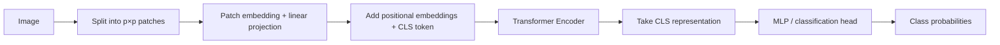

# Generative AI Week 11: Vision Transformers and Image-to-HTML Generation

## Overview

- Topic of the unit: **Vision Transformers (ViT)** as patch-based transformer encoders for images, plus a practical application: **translating UI screenshots into HTML** using a **ViT encoder + seq2seq decoder**.
- Instructor: Mitra Purandare (Vision Transformers) & Abinas Kuganathan (Guest lecture: Image→HTML)
- Learning goals:
  - Explain how **ViT** turns an image into a **token sequence of patches** and processes it with a transformer encoder
  - Understand **CLS token**, **positional embeddings**, and patch **linear projection**
  - Compare **ViT vs CNN** (inductive biases, data needs, latency/compute tradeoffs)
  - Describe “Image to HTML” as a **translation** problem using **encoder–decoder (seq2seq)** models
  - Understand **Design2Code** evaluation metrics and why OCR/text layout matter
  - Interpret experimental results and limitations of a compact (<500M params) approach

## 1. Introduction / Context

Week 11 connects _vision architecture fundamentals_ with a concrete “vision-to-code” task.

1. **Vision Transformers** adapt the NLP transformer idea to images by avoiding pixel-level attention (too expensive) and instead treating **image patches as tokens** (“an image is worth 16×16 words”).
2. **Image→HTML** treats a UI screenshot as the “source language” and HTML as the “target language”, i.e., a **translation task** that benefits from an **encoder–decoder** pipeline: vision encoder → text/code decoder.

## 2. Key Concepts and Definitions

| Term                     | Definition                                                                                                                    | Example                                                                      |
| ------------------------ | ----------------------------------------------------------------------------------------------------------------------------- | ---------------------------------------------------------------------------- |
| Vision Transformer (ViT) | Transformer applied to images by splitting the image into patches (“tokens”) and feeding them to an encoder-only transformer. | 224×224 image → 16×16 patches → 14×14=196 tokens (+ CLS).                    |
| Patch embedding          | Convert each image patch into a vector (often via flatten + linear projection, or a conv projection).                         | Flatten patch of size ($p \times p \times C$) and project to ($d\_{model}$). |
| Positional embedding     | Learnable (or fixed) embeddings added to tokens so the transformer knows order/spatial location.                              | Add ($E\_{pos}$) to patch embeddings and a special class token.              |
| CLS token                | Special token prepended to token sequence; final CLS embedding used for classification.                                       | ViT classification head reads CLS and outputs ImageNet-1k logits.            |
| CNN inductive biases     | CNNs assume locality + (approx.) translation invariance, often helping with smaller datasets.                                 | Convolutions leverage nearby pixels; ViT needs more data to compensate.      |
| Mean attention distance  | Measure of how far (spatially) attention looks on average per layer/head.                                                     | Weighted distance: ($\sum_k a_k \cdot d_k$) averaged across queries/images.  |
| Seq2Seq model            | Encoder–decoder architecture commonly used for translation tasks.                                                             | Vision encoder + text decoder to generate HTML tokens.                       |
| Image-to-HTML            | Translation task: map a screenshot (layout + text) to structured HTML.                                                        | UI blocks (“header/nav/content/footer”) → HTML tags/layout.                  |
| Design2Code benchmark    | Evaluation suite for screenshot→code quality using multiple scores.                                                           | Block-match, text, position, color, and CLIP-based similarity.               |
| CLIP score               | Similarity of image embeddings (cosine similarity) used as a perceptual proxy.                                                | Compare CLIP image embeddings between original and rendered output.          |

## 3. Main Content

### 3.1 Vision Transformers: Core Idea and Architecture

**Why patches?** Naively applying self-attention to pixels is quadratic in the number of pixels. ViT avoids that by splitting an image into patches and treating each patch like a “word token.”

**Patch sequence length:** for image ($X \in \mathbb{R}^{H \times W \times C}$) and patch size ($p$),

$$
N = \frac{H \cdot W}{p^2}
$$

is the number of patches (effective sequence length).

**Embedding step (original ViT concept):**

- Flatten each patch to a vector of size ($p^2 C$)
- Linearly project into model dimension ($d\_{model}$)

**High-level pipeline (ViT classification):**

### 3.2 ViT vs CNN: What You Gain, What You Lose

The slides emphasize these differences:

- **CNN locality bias:** nearby pixels are assumed related; this can help generalization with limited labeled data.
- **ViT global receptive field:** no built-in locality assumption; attention can be global early, which helps capture long-range relationships.
- **Translation invariance:** CNNs encode this bias strongly; ViTs need **large datasets** to compensate.
- **When to use which:**
  - limited data / limited compute / real-time constraints → often **CNN**
  - need global spatial relationships / strong transfer learning with pretrained ViTs → **ViT**

### 3.3 Practical ViT Use with Hugging Face

The slides show typical Hugging Face usage:

- Load pretrained model: `google/vit-base-patch16-224`
- Use an image processor/feature extractor to resize to 224×224 and normalize using ImageNet statistics (handled automatically).
- Output embeddings shape example: `[1, 197, 768]` = 196 patches + CLS token.

### 3.4 Multimodal Extension: CLIP and Contrastive Learning

The ViT lecture connects to multimodality via **CLIP**:

- separate image encoder and text encoder map inputs into a **shared embedding space**
- training uses **contrastive learning** to match correct image–text pairs and push apart mismatches.

It also mentions **SigLIP**, which replaces softmax-over-batch contrastive loss with a sigmoid/binary classification per pair.

### 3.5 Image to HTML: Problem Framing as Translation

The guest lecture frames **Image→HTML** as a translation task: screenshot → structured HTML output.
Motivation: rapid prototyping and bridging the gap between static designs and real browser UX.

**Research question:** which architectures combine a **ViT encoder** with a **seq2seq decoder** to generate HTML from images?
**Hypothesis:** a ViT + encoder–decoder approach can reach competitive performance while staying **< 500M parameters**.

**Dataset:** HuggingFaceM4/WebSight with **1.92M image–HTML pairs** (synthetic).

### 3.6 Evaluation: Design2Code Benchmark Metrics

The lecture evaluates models using multiple complementary scores:

- **Block-Match Score**: detect blocks and compare layout/blocks (includes text-color adjustments for text detection)
- **Text Score**: character-level Sørensen–Dice similarity
- **Position Score**: Chebyshev distance of matched pairs
- **Color Score**: CIEDE2000 color difference (Luo et al., 2001)
- **CLIP Score**: cosine similarity of CLIP image embeddings

This reflects the challenge: you must get **structure, text, position, and styling** reasonably right—not just “rough semantics.”

### 3.7 Experimental Findings (Architecture Iterations)

Across experiments, the slides show incremental architectural changes improving scores (examples include adding a linear projection layer, changing ViT, switching decoder to CodeT5/T5 stacks, increasing input resolution/strategy, merging quadrants, replacing the vision transformer, learned merging, and learned positional embeddings).

**Notable result snapshots:**

- Mid-stage improvements show rising Block/Text/Position/Color/CLIP scores across experiments (e.g., Experiment 2 → 3 → 4 improves all metrics).
- **Holdout set evaluation** shows very high scores for top models (e.g., Experiment 11.1 strong across all categories).
- **Out-of-sample** comparisons show that large VLMs (7B–8B class) achieve stronger scores than the compact model, but the compact model remains competitive for its size.

**Model size (Experiment 11):** total about **235M parameters**, with a breakdown including a SigLIP vision model (~93.5M) and a T5Stack decoder (~137M).

### 3.8 Limitations and Future Work

The guest lecture explicitly lists limitations:

- limited generalization to out-of-distribution data (must learn OCR from scratch)
- single file output
- no JavaScript

Future directions include: more diverse training data, OCR pretraining, exploring other domains (e.g., image→SVG), and including JS/CSS.

## 4. Relationships and Interpretation

- **ViT provides the vision “language”:** patches become tokens, enabling transformer-style global reasoning over an image.
- **Image→HTML needs both vision and structured generation:** the screenshot encoder must capture layout + text cues; the decoder must produce syntactically valid and visually faithful HTML.
- **Why evaluation is multi-metric:** generating “some HTML” is easy; matching _rendered appearance_ requires accurate block structure, text, alignment, and colors—hence block/text/position/color/CLIP scores.
- **Size vs generalization tradeoff:** compact architectures can do well on in-distribution/holdout sets, but out-of-distribution robustness remains harder—especially when OCR-like behavior must be learned implicitly.

## 5. Examples and Applications

- **Image classification:** ViT pretrained on ImageNet-1k (1000 classes) with a CLS-based classification head.
- **Zero-shot image labeling (CLIP idea):** convert labels to text prompts (e.g., “a photo of a <label>”) and pick the label with maximum similarity.
- **Design-to-code prototyping:** screenshot → HTML for rapid UI prototyping and iteration, especially when starting from visuals rather than Figma artifacts.

## 6. Summary / Takeaways

- **ViT** treats images as sequences of **patch tokens**, enabling transformer encoders to model global relationships efficiently.
- **ViT vs CNN:** ViTs scale well and capture long-range dependencies, but CNNs often win with limited data/compute and latency constraints due to strong inductive biases.
- **Image→HTML** is naturally a **seq2seq translation** problem: vision encoder + text decoder.
- **Design2Code evaluation** shows that visual fidelity is multi-dimensional (layout, text, position, color, perceptual similarity).
- A compact (<500M, ~235M) architecture can perform strongly on holdout data but still struggles with **out-of-distribution** generalization and OCR-like requirements.

## 7. Study Tips

- Be able to derive patch count ($N=\frac{HW}{p^2}$) and explain why attention over pixels is too expensive.
- Memorize the ViT input recipe: **patching → projection → positional embeddings + CLS → encoder → head**.
- For Image→HTML, practice explaining why this is translation (not classification) and why evaluation needs more than one metric.
- When comparing models, always distinguish **holdout/in-distribution** vs **out-of-sample** performance.

## 8. Deepening / Further Concepts

- **Hybrid ViT models** (CNN + ViT) attempt to blend CNN inductive biases with transformer global reasoning.
- **Tooling for OCR + layout:** Image→HTML highlights that “reading text” and “understanding layout” are separate challenges; pretraining on OCR or adding explicit OCR modules could improve generalization.
- **Beyond HTML:** the same vision→structured-code pattern could target SVG or component trees (React), especially if the dataset covers richer UI diversity.

## 9. Sources & Literature (IEEE)

[1] M. Purandare, “Week 11: Vision Transformers,” lecture slides, Generative AI, OST – Ostschweizer Fachhochschule, 14.11.2025.

[2] A. Kuganathan, “Image to HTML: Generating HTML from Images with Language Models,” guest lecture slides, Generative AI, OST – Ostschweizer Fachhochschule, 25.11.2025.

[3] A. Dosovitskiy et al., “An Image is Worth 16×16 Words: Transformers for Image Recognition at Scale,” 2020.

[4] A. Radford et al., “Learning Transferable Visual Models From Natural Language Supervision (CLIP),” 2021.

[5] G. Luo et al., “The CIEDE2000 Color-Difference Formula,” 2001.
