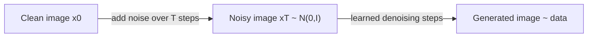

# Generative AI Week 12: Diffusion Models

## Overview

- Topic of the unit: **Diffusion models** for generative image synthesis (DDPM-style): forward noising process + learned reverse denoising process; diffusion schedules; training by **noise prediction**; U-Net as denoiser; text-to-image (GLIDE, DALL·E 2, Stable Diffusion, Imagen); **latent diffusion**.
- Instructor: Mitra Purandare
- Learning goals:
  - Explain the **high-level idea** of diffusion (learn to denoise images at different noise levels)
  - Distinguish the **forward diffusion process** (q) from the learned **reverse process** (p\_\theta)
  - Understand why diffusion is iterative and how that differs from VAEs/GANs
  - Derive the “jump to time (t)” formula using (\alpha_t) / (\bar\alpha_t) and noise schedules
  - Understand the **training objective** (predict noise (\epsilon) with MSE)
  - Understand why **U-Net + skip connections** are used
  - Understand **latent diffusion** and why Stable Diffusion is fast enough in practice

## 1. Introduction / Context

The lecture positions diffusion models historically: after GANs (2014+) dominated image generation for years, diffusion models (late 2020, DDPM) began producing higher-quality images, and by late 2021–2022 text-to-image systems like GLIDE, DALL·E 2 and Stable Diffusion popularized “type a prompt → get an image.” (p.2)

Core intuition (p.3): train a neural network to **remove noise** from images that have been corrupted with different noise levels. At inference you start from pure noise and iteratively denoise until an image from the training distribution emerges. (p.3)

## 2. Key Concepts and Definitions

| Term                          | Definition                                                                                                              | Example                                                                                   |
| ----------------------------- | ----------------------------------------------------------------------------------------------------------------------- | ----------------------------------------------------------------------------------------- | -------------------------------- | ------------------ |
| Diffusion model               | Generative model that learns to reverse a gradual noising process by iterative denoising.                               | Start from Gaussian noise and denoise step-by-step to form an image.                      |
| Forward diffusion (q)         | Fixed process that gradually adds Gaussian noise over (T) steps until data becomes (approx.) standard normal.           | ($q(x*t\mid x*{t-1}) = \mathcal N(\cdot)$) with variance ($\beta_t)$. (p.6, p.15)         |
| Reverse diffusion (p\_\theta) | Learned denoising process (neural network parameters (\theta)) that approximates the reverse conditional distributions. | Learn ($p*\theta(x*{t-1}\mid x_t)$). (p.6, p.21)                                          |
| (\beta_t) schedule            | Noise variance per timestep; defines how quickly signal is destroyed.                                                   | Linear schedule from 0.0001 → 0.02 (example). (p.18)                                      |
| (\alpha_t), (\bar\alpha_t)    | ($\alpha*t=1-\beta_t); (\bar\alpha_t=\prod*{i=1}^t \alpha_i$); used to sample (x_t) directly from (x_0).                | “Jump” directly to noise level (t) instead of iterating forward. (p.16)                   |
| Noise prediction              | Training objective: network predicts the noise ($\epsilon$) added to an image at time (t).                              | Minimize ($                                                                               | \epsilon\_\theta(x_t,t)-\epsilon | ^2$). (p.22, p.25) |
| U-Net denoiser                | Encoder–decoder CNN with skip connections, well-suited for pixel-level prediction.                                      | Downsample → bottleneck → upsample, with skip connections. (p.27–30)                      |
| Latent diffusion              | Run diffusion in a learned latent space (from an autoencoder) instead of pixel space for efficiency.                    | Stable Diffusion: AE encodes to latent → diffusion in latent → decode to image. (p.36–37) |

## 3. Main Content

### 3.1 High-Level Idea: Iterative Refinement Beats “One Shot”

The slides contrast diffusion with VAEs/GANs: VAEs/GANs generate an output in a **single forward pass**, so mistakes can’t be corrected. Diffusion models generate by **many small steps**, so they can iteratively refine and fix errors. (p.4)

### 3.2 Two Processes: Forward Noising and Reverse Denoising

Diffusion is described as two processes (p.6):

1. **Forward diffusion** (q): add Gaussian noise gradually until the image becomes indistinguishable from standard Gaussian noise.
2. **Reverse diffusion** ($p\_\theta$): learn to denoise from pure noise back to an image.

(p.6)

### 3.3 Forward Diffusion Details and Why Scaling Works

Preprocessing: images are normalized to **zero mean and unit variance** (p.8), so the diffusion process can be designed so that every ($x_t$) stays approximately standard normal (p.12, p.15).

A forward step is defined as adding Gaussian noise with variance ($\beta*t$) (p.11):

$$
x_t = \sqrt{1-\beta_t},x*{t-1} + \sqrt{\beta_t},\epsilon,\quad \epsilon\sim\mathcal N(0,I)
$$

(The slides discuss why scaling is needed: to keep variance controlled.) (p.11–12)

They then show the variance math to argue ($x_t$) remains zero-mean, unit-variance if ($x_0$) is normalized and ($\epsilon$) is Gaussian (p.12–15).

### 3.4 “Jump to Any t”: Closed Form Sampling of ($x_t$)

Instead of applying (q) step-by-step, you can sample ($x_t$) directly from ($x_0$) using the fact that sums of Gaussians are Gaussian (p.16):

Define:

$$
\alpha_t = 1-\beta_t,\qquad \bar\alpha_t = \prod_{i=1}^t \alpha_i
$$

Then:

$$
x_t = \sqrt{\bar\alpha_t},x_0 + \sqrt{1-\bar\alpha_t},\epsilon
$$

This is crucial for training efficiency: you can pick a random (t) and generate a corresponding noisy input in one shot. (p.16, p.22, p.25)

### 3.5 Diffusion Schedules: Linear vs Cosine

Noise parameters are not constant—($\beta_t$) (or ($\alpha_t)$) follows a schedule (p.18). Linear example: ($\beta_t$) increases from 0.0001 to 0.02, meaning early steps add little noise, later steps add more when the image is already very noisy. (p.18)

The slides compare **linear** and **cosine** schedules (p.19–20). The cosine schedule increases noise more gradually, which the slides state can improve training efficiency and generation quality. (p.19–20)

### 3.6 Reverse Diffusion: Learn the Intractable Conditional

We’d like the reverse conditional ($p(x*{t-1}\mid x_t)$), but it is intractable because it depends on the unknown distribution of all images (p.21). So a neural network is used to approximate the reverse process ($p*\theta(x\_{t-1}\mid x_t)$). (p.21)

A common training approach (p.22) is:

- sample a clean image ($x_0$)
- sample ($t\sim\text{Uniform}{1,\dots,T}$)
- generate ($x_t$) by adding noise at level (t)
- give ($(x_t, t)$) to the network
- network predicts the noise ($\epsilon$)
- optimize mean squared error between predicted and true noise (p.22, p.25)

### 3.7 Why U-Net Is the Standard Denoiser

The slides argue AEs/VAEs are not ideal for this pixel-precise noise prediction because they reconstruct from a low-dimensional bottleneck (p.26). Instead, diffusion commonly uses a **U-Net** (p.27–30):

- Downsampling blocks reduce spatial resolution (capture context)
- Upsampling blocks restore resolution (predict per-pixel outputs)
- **Skip connections** pass high-resolution details directly across the network, supporting sharper reconstructions and better gradient flow (p.28–30).

They also mention sinusoidal embeddings for turning a scalar (time/noise level) into a higher-dimensional vector—similar to transformer positional encodings (p.31).

### 3.8 Generation: Start from Noise and Denoise Iteratively

For sampling/generation (p.32):

- start from random noise
- repeatedly apply the model to undo noise
- model predicts the total noise and you step from ($x*t$) to ($x*{t-1}$) over many iterations

This “many-step” sampling is the cost you pay for quality, and it explains why engineering improvements (fewer steps, better schedulers) matter.

### 3.9 Text-to-Image and Latent Diffusion

The final slides connect diffusion to popular systems:

- **Stable Diffusion** (released Aug 2022) uses **latent diffusion** (p.35–37): diffusion happens in a latent representation produced by an autoencoder, which speeds up training/inference because the denoising U-Net operates on a smaller latent grid instead of full-resolution pixels. Text conditioning can be added via a text encoder (the slides mention CLIP/OpenCLIP). (p.35–37)

- **Latent Diffusion Models** idea (p.36): wrap diffusion inside an autoencoder: encode image → diffuse in latent space → decode back.

- **Imagen** (p.38): frozen text encoder (T5-XXL) provides text embeddings; a diffusion model generates a small image (e.g., 64×64) and separate diffusion upsamplers produce higher resolutions up to 1024×1024. (p.38)

## 4. Relationships and Interpretation

- Forward diffusion (q) is **fixed** and mathematically controlled by schedules; reverse diffusion ($p\_\theta$) is **learned**.
- Training works because you can sample ($x_t$) directly from ($x_0$) using ($\bar\alpha_t$), then train the model to predict ($\epsilon$).
- U-Net + skip connections align perfectly with “predict structured noise at multiple scales.”
- Latent diffusion merges Week 10’s **autoencoder latent space** idea with diffusion: do the expensive image compression once, then run diffusion where it’s cheaper.

## 5. Examples and Applications

- **Unconditional generation:** sample ($x_T \sim \mathcal N(0,I)$) and denoise to generate an image similar to the training set. (p.3, p.32)
- **Text-guided generation:** condition the denoiser on text embeddings (GLIDE/DALL·E 2/Stable Diffusion/Imagen ideas). (p.2, p.37–38)
- **Efficient high-resolution synthesis:** latent diffusion (Stable Diffusion) and multi-stage diffusion upsampling (Imagen). (p.36–38)

## 6. Summary / Takeaways

- Diffusion models learn to **denoise** images corrupted by Gaussian noise; generation starts from noise and iteratively refines. (p.3–4)
- There are two processes: fixed forward noising (q) and learned reverse denoising ($p\_\theta$). (p.6)
- Forward steps use a ($\beta_t$) schedule; cosine schedules add noise more gradually and can improve quality. (p.18–20)
- Training typically predicts the added noise ($\epsilon$) at a random timestep using MSE. (p.22, p.25)
- U-Nets (with skip connections) are standard denoisers for pixel-accurate prediction. (p.27–30)
- Stable Diffusion uses **latent diffusion** (diffuse in latent space via an autoencoder) for speed and scalability. (p.36–37)

## 7. Study Tips

- Be able to explain (and sketch) the two processes and why diffusion is iterative.
- Memorize the “jump to time (t)” formula:
  $$
  x_t = \sqrt{\bar\alpha_t}x_0 + \sqrt{1-\bar\alpha_t}\epsilon
  $$
  and what ($\bar\alpha_t$) means. (p.16)
- Know the difference between ($\beta_t$) schedule and ($\alpha_t$)/($\bar\alpha_t$) derived terms. (p.16–20)
- Be able to justify why U-Net is used (multi-scale + skip connections + stable gradients). (p.27–30)

## 8. Deepening / Further Concepts

- **Learning variance in reverse process:** the slides note DDPM often keeps variance fixed, while improved models learn it too (p.23).
- **Accelerating sampling:** fewer steps, better schedulers, or distilled samplers are natural next topics given the many-step generation cost (linked to p.32’s iterative nature).
- **Conditioning mechanisms:** text conditioning via embeddings (CLIP/T5) and multi-stage diffusion (Imagen) show how diffusion becomes controllable. (p.37–38)

## 9. Sources & Literature (IEEE)

[1] M. Purandare, “Diffusion,” Week 12 lecture slides, Generative AI, OST – Ostschweizer Fachhochschule, 27.11.2025.

[2] J. Ho, A. Jain, and P. Abbeel, “Denoising Diffusion Probabilistic Models,” 2020.

[3] R. Rombach et al., “High-Resolution Image Synthesis with Latent Diffusion Models,” 2022.
