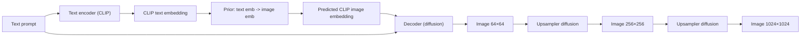
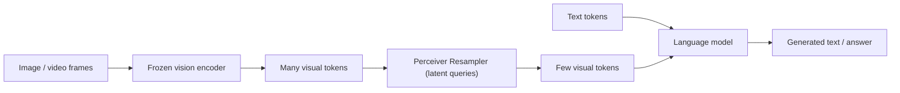

# Week 13: Multi-Modality

## Overview

- Topic of the unit: Multimodal generative modeling—how models **convert between modalities** (text ↔ image, text+image ↔ text), with a focus on **DALL·E 2** (text-to-image via CLIP + diffusion) and **Flamingo** (vision-language model for interleaved text and visual inputs).
- Instructor: Mitra Purandare
- Learning goals:
  - Explain what **multimodal learning** is and why it needs a **shared representation** across domains
  - Understand DALL·E 2’s 3-part architecture: **text encoder → prior → decoder (+ upsamplers)**
  - Distinguish **autoregressive prior** vs **diffusion prior** in DALL·E 2 and why diffusion performs well
  - Understand key limitations: **attribute binding** and weak **text rendering** in generated images
  - Understand Flamingo’s components (frozen vision encoder, **Perceiver Resampler**, language model) and why resampling is needed

## 1. Introduction / Context

Multimodal learning trains generative models to **convert between two or more data types** (modalities), such as text and images. A central challenge is learning a **bridge**: a shared representation that makes it possible to move from one modality to another reliably.

The lecture first briefly recaps diffusion (DDPM) ideas (forward noising + reverse denoising) as background, then focuses on multimodality via:

- **DALL·E 2**: text-to-image through CLIP embeddings and diffusion, including upsampling stages.
- **Flamingo**: a vision-language model that handles **interleaved** text + images (and even video).

## 2. Key Concepts and Definitions

| Term                  | Definition                                                                                                          | Example                                                                                |
| --------------------- | ------------------------------------------------------------------------------------------------------------------- | -------------------------------------------------------------------------------------- |
| Multimodal learning   | Training models to convert between different data types and learn a shared representation across domains.           | Text prompt → image; image+question → answer.                                          |
| Shared representation | A common embedding space where different modalities can be compared/converted.                                      | CLIP text embedding aligned with CLIP image embedding.                                 |
| CLIP                  | Contrastive Language–Image Pretraining model providing aligned text and image embeddings.                           | Use CLIP text encoder to embed a prompt.                                               |
| DALL·E 2              | Text-to-image system using (1) text encoder, (2) prior, (3) decoder (+ upsamplers).                                 | Text → CLIP text embedding → predicted CLIP image embedding → diffusion decoder image. |
| Prior (DALL·E 2)      | Model converting CLIP **text embeddings** into CLIP **image embeddings**; can be autoregressive or diffusion-based. | Diffusion prior gradually denoises to an image embedding conditioned on text.          |
| Autoregressive prior  | Generates output sequentially (token by token / element by element) conditioned on previous outputs.                | Transformer encoder-decoder predicting CLIP image embedding elements.                  |
| Diffusion prior       | Uses a diffusion process in embedding space: noise → denoise conditioned on text.                                   | Predict denoised image embedding at previous timestep; MSE across steps.               |
| Decoder (DALL·E 2)    | Diffusion model generating an image conditioned on text + predicted image embedding.                                | U-Net denoiser conditioned on Transformer text encoding and image embedding.           |
| Upsampler             | Additional diffusion models increasing resolution (64→256→1024).                                                    | Two diffusion upsamplers for high-res generation.                                      |
| Attribute binding     | Ability to correctly bind attributes to objects and relations in a prompt.                                          | “Red cube on top of blue cube” vs swapped relation must differ.                        |
| Flamingo              | Vision-language model that processes interleaved text and visual inputs (images/videos).                            | Prompt includes images between text segments; model answers questions.                 |
| Perceiver Resampler   | Module compressing many visual tokens into a smaller fixed-size set using cross-attention-like computation.         | Latent queries attend over all image tokens to produce fewer embeddings.               |

## 3. Main Content

### 3.1 Recap: Diffusion Models as a Building Block (DDPM → Latent Diffusion)

The slides begin with diffusion recap: a **forward diffusion** process adds noise, and a **reverse denoising** process learns to generate by denoising (U-Net as trainable denoiser).

Key diffusion “jump” form (as shown in the diffusion kernel slide):

$$
q(x_t\mid x_0)=\mathcal{N}\left(x_t;\sqrt{\bar{\alpha}_t},x_0,\left(1-\bar{\alpha}_t\right)I\right),
\quad
x_t=\sqrt{\bar{\alpha}_t},x_0+\sqrt{1-\bar{\alpha}_t},\epsilon,\ \epsilon\sim\mathcal{N}(0,I)
$$

where ($\bar{\alpha}_t=\prod_{i=1}^t (1-\beta_i)$).

The slides also highlight **Latent Diffusion Models**: wrap diffusion inside an autoencoder so diffusion happens in a **latent space representation** rather than directly on pixels (faster and more scalable).

### 3.2 What “Multi-Modality” Means Here

Multimodal learning (in this lecture’s framing) is about:

- learning mappings between modalities (e.g., text→image),
- and learning a shared representation that enables conversion.

Text-to-image generation is emphasized as producing state-of-the-art images from a text prompt, with DALL·E 2 as the example system.

### 3.3 DALL·E 2 Architecture: Text Encoder → Prior → Decoder

DALL·E 2 is described as having three parts:

1. **Text encoder**
2. **Prior** (text embedding → image embedding)
3. **Decoder** (generate image conditioned on text + image embedding)

**Mermaid: DALL·E 2 high-level flow**

#### 3.3.1 The Text Encoder (CLIP)

The text encoder converts discrete text into a continuous vector so it can be manipulated downstream. The slides state DALL·E 2 uses **CLIP** as the text encoder.

#### 3.3.2 The Prior: Two Options (Autoregressive vs Diffusion)

The prior converts CLIP text embeddings into CLIP image embeddings with two options:

- **Autoregressive prior**
- **Diffusion prior** (reported to outperform the autoregressive model and be computationally efficient)

**Autoregressive prior (Transformer encoder–decoder):**

- trained to reproduce the CLIP image embedding given the CLIP text embedding
- generates output “one element at a time” with teacher forcing comparisons

**Diffusion prior:**

- uses a decoder-only transformer trained with a diffusion process in embedding space
- image embedding is noised toward random noise
- trained to predict the denoised embedding at the previous timestep
- loss is average MSE across denoising steps
- generation: sample random vector, prepend relevant text embedding, run denoising steps to obtain predicted CLIP image embedding

A typical diffusion-style training objective here is conceptually:

$$
\mathcal{L}=\mathbb{E}_{t,\epsilon}\left[\left|\epsilon_\theta(\text{noised}_{emb}, t, \text{text}_{emb})-\epsilon\right|\_2^2\right]
$$

(consistent with “MSE across denoising steps” described in the slides).

#### 3.3.3 The Decoder + Upsampling

The decoder generates the final image conditioned on:

- the text prompt
- the predicted image embedding from the prior

It is trained as a diffusion model with:

- **U-Net** architecture for the denoiser
- **Transformer** architecture for the text encoder (conditioning)

The output is initially a **64×64** image, then two diffusion upsamplers upscale:

- 64×64 → 256×256
- 256×256 → 1024×1024

#### 3.3.4 Image Variations

To create image variations, you need an image embedding for the decoder. The slides describe obtaining this from the original **CLIP image encoder**, which converts an image into its CLIP image embedding.

### 3.4 Limitations Highlighted for DALL·E 2

Two important limitations are emphasized:

1. **Attribute binding**: the model may struggle to correctly represent relations between objects and their attributes (“red cube on top of blue cube” vs the reverse).
2. **Text rendering**: DALL·E 2 is not able to accurately reproduce text, explained as likely due to CLIP embeddings capturing higher-level semantics rather than exact spellings.

### 3.5 Flamingo: Interleaved Vision + Language

The slides present **Flamingo (80B)** as an example of a vision-language model.

#### 3.5.1 Core components

Flamingo’s components:

- **Vision encoder (frozen)**
- **Perceiver Resampler**
- **Language model**

It can accept **interleaved** sequences of text and visual data. Visual data includes images and also videos.

For video, the slides describe: sample at **1 frame per second**, encode each frame independently, then add learned temporal encodings before flattening and concatenating.

#### 3.5.2 Why the Perceiver Resampler exists

Problem: an image produces many spatial tokens (example in slides: (14\times14\times1024)), which would be too expensive to feed directly into a language model.

Solution: the **Perceiver Resampler** reduces the number of visual tokens while preserving information by learning a small set of latent queries that attend over all image tokens. It is described as mathematically similar to cross-attention:

$$
Z = \text{softmax}\left(QK^\top\right)V
$$

where (Q) are latent queries (few), and (K,V) are image tokens (many). The result is a fixed-size set of visual embeddings.

**Mermaid: Flamingo token flow**

### 3.6 Vision-Language Models (VLMs): Practice Link

The slides end with an exercise link about Vision Language Models (VLMs), pointing to a Hugging Face blog resource.

## 4. Relationships and Interpretation

- Diffusion is not just for pixels: DALL·E 2 applies **diffusion in embedding space** (diffusion prior) and **diffusion in image space** (decoder + upsamplers).
- CLIP provides the “bridge” representation (aligned text and image embeddings), which makes text-to-image generation a two-stage process: text embedding → predicted image embedding → image generation.
- Flamingo highlights a different multimodal challenge: **mixing** visual tokens into language modeling without exploding compute; the Perceiver Resampler is essentially a learned compression layer.

## 5. Examples and Applications

- **Text-to-image generation:** produce images from prompts using DALL·E 2’s pipeline (text encoding → embedding prior → diffusion decoder + upsamplers).
- **Image variations:** encode an existing image with CLIP image encoder, then generate variations by feeding its embedding into the decoder.
- **Multimodal Q&A / assistant behavior:** Flamingo-style interleaved inputs enable answering questions about screenshots or sequences of images, and extending to video by frame sampling.

## 6. Summary / Takeaways

- Multimodal learning requires learning a **shared representation** to bridge modalities (text ↔ image).
- **DALL·E 2** consists of: CLIP text encoder → **prior** (text emb → image emb; diffusion prior performs well) → **diffusion decoder** + diffusion **upsamplers**.
- DALL·E 2 limitations include **attribute binding** errors and weak **text rendering**, likely due to embedding-level representations.
- **Flamingo** combines a frozen vision encoder with a **Perceiver Resampler** to compress visual tokens, enabling efficient conditioning of a language model on images/videos in interleaved sequences.

## 7. Study Tips

- Be able to draw DALL·E 2’s 3 blocks and explain what each block outputs (text embedding → image embedding → image).
- Compare priors:
  - Autoregressive prior = sequential generation of embedding elements
  - Diffusion prior = iterative denoising conditioned on text, trained with MSE across steps

- For Flamingo, remember the motivation for the Perceiver Resampler: **too many visual tokens** to feed into the LM directly.
- When you see failures (wrong colors/relations, gibberish text), map them to the limitations: attribute binding vs spelling-level fidelity.

## 8. Deepening / Further Concepts

- **Grounded text rendering**: DALL·E 2’s difficulty with text suggests that semantic embeddings alone may be insufficient; explicit OCR-like supervision or pixel-level text priors can help (conceptual extension of the slide’s explanation).
- **Token budget engineering** in VLMs: Perceiver-style resampling is one strategy; others include patch pooling, learned token merging, or sparse attention—same underlying goal: reduce compute while preserving information.
- **Embedding-space generation**: diffusion priors show that generative modeling can operate effectively in intermediate latent spaces, not only in pixel space.

## 9. Sources & Literature (IEEE)

[1] M. Purandare, “Week 13: Multi-Modality,” lecture slides, Generative AI, OST – Ostschweizer Fachhochschule, 09.12.2025.

[2] A. Radford et al., “Learning Transferable Visual Models From Natural Language Supervision,” _ICML_, 2021 (CLIP).

[3] A. Ramesh et al., “Hierarchical Text-Conditional Image Generation with CLIP Latents,” 2022 (DALL·E 2 concept).

[4] J. Alayrac et al., “Flamingo: a Visual Language Model for Few-Shot Learning,” 2022 (Flamingo concept).
